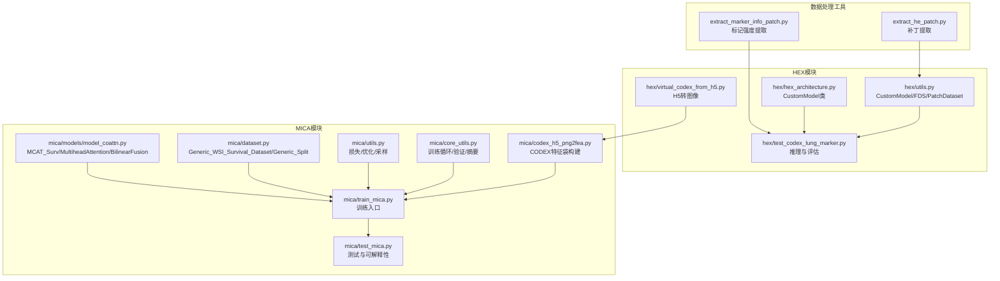
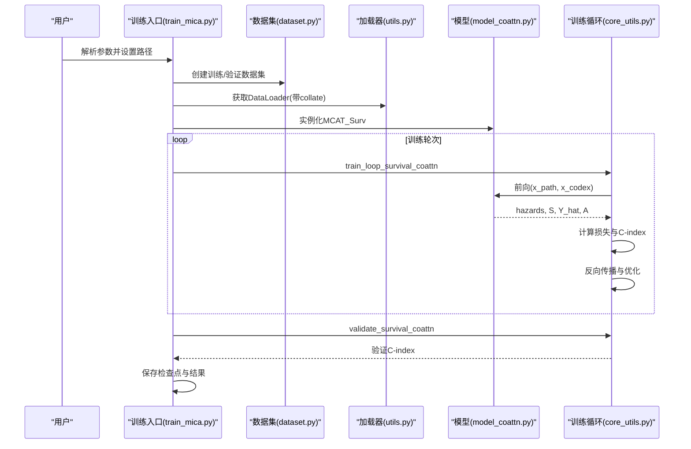
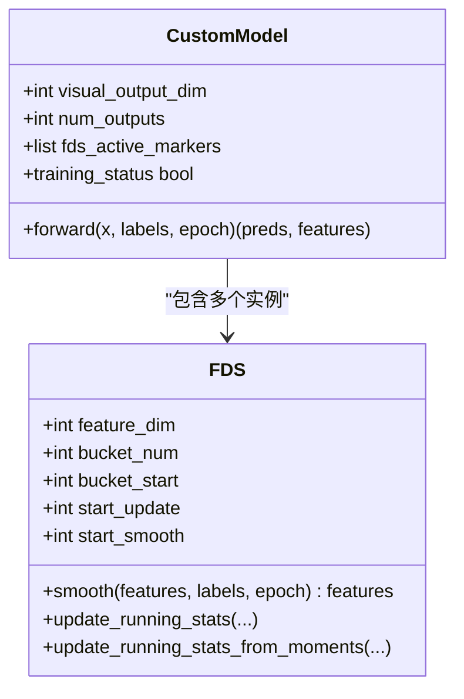
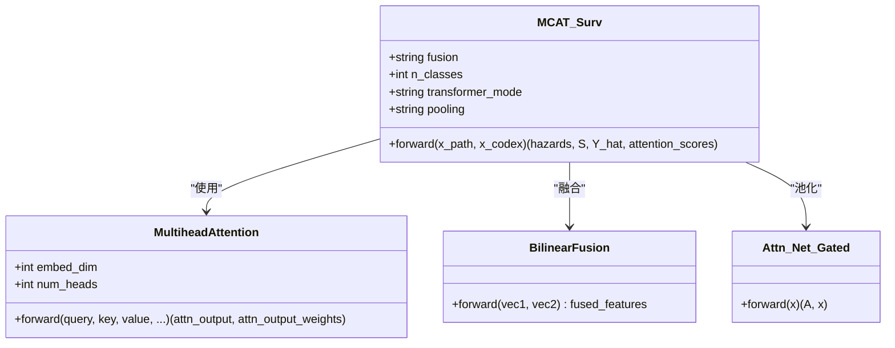
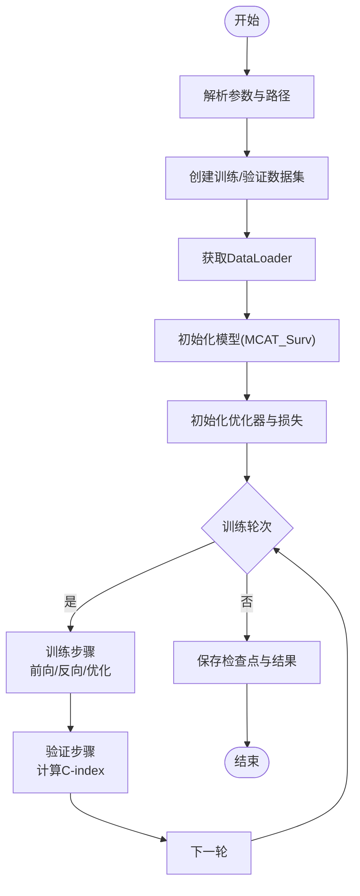
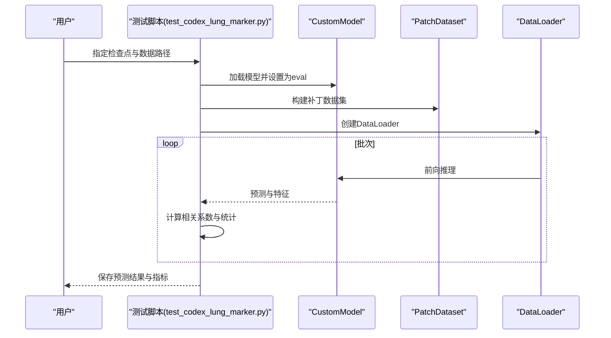
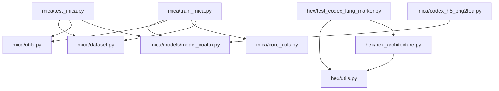

# API参考文档

<cite>
**本文档中引用的文件**
- [README.md](file://README.md)
- [pyproject.toml](file://pyproject.toml)
- [hex/hex_architecture.py](file://hex/hex_architecture.py)
- [hex/utils.py](file://hex/utils.py)
- [hex/test_codex_lung_marker.py](file://hex/test_codex_lung_marker.py)
- [hex/virtual_codex_from_h5.py](file://hex/virtual_codex_from_h5.py)
- [mica/models/model_coattn.py](file://mica/models/model_coattn.py)
- [mica/dataset.py](file://mica/dataset.py)
- [mica/train_mica.py](file://mica/train_mica.py)
- [mica/test_mica.py](file://mica/test_mica.py)
- [mica/utils.py](file://mica/utils.py)
- [mica/core_utils.py](file://mica/core_utils.py)
- [mica/codex_h5_png2fea.py](file://mica/codex_h5_png2fea.py)
- [extract_he_patch.py](file://extract_he_patch.py)
- [extract_marker_info_patch.py](file://extract_marker_info_patch.py)
</cite>

## 目录
1. [简介](#简介)
2. [项目结构](#项目结构)
3. [核心组件](#核心组件)
4. [架构总览](#架构总览)
5. [详细组件分析](#详细组件分析)
6. [依赖分析](#依赖分析)
7. [性能考虑](#性能考虑)
8. [故障排除指南](#故障排除指南)
9. [结论](#结论)
10. [附录](#附录)

## 简介
本项目提供从H&E图像生成虚拟空间蛋白表达（HEX）以及多模态整合（MICA）的完整工作流。HEX模块负责基于视觉编码器与回归头预测40种生物标志物表达；MICA模块通过注意力引导的多头注意力（Co-Attention）融合组织学（WSI bag）与虚拟蛋白组（CODEX）特征进行生存分析建模。文档涵盖两套模块的API规范、数据处理工具、训练与测试流程、使用示例与最佳实践，并提供版本兼容性与迁移建议。

## 项目结构
项目采用按功能域划分的目录结构：HEX模块专注于单样本/补丁级的生物标志物预测；MICA模块专注于生存分析的多模态建模与训练评估；工具脚本提供数据预处理与特征提取。

**图表来源**
- [hex/hex_architecture.py:9-37](file://hex/hex_architecture.py#L9-L37)
- [hex/utils.py:32-81](file://hex/utils.py#L32-L81)
- [hex/test_codex_lung_marker.py:62-134](file://hex/test_codex_lung_marker.py#L62-L134)
- [hex/virtual_codex_from_h5.py:10-68](file://hex/virtual_codex_from_h5.py#L10-L68)
- [mica/models/model_coattn.py:12-124](file://mica/models/model_coattn.py#L12-L124)
- [mica/dataset.py:17-250](file://mica/dataset.py#L17-L250)
- [mica/train_mica.py:28-238](file://mica/train_mica.py#L28-L238)
- [mica/test_mica.py:79-324](file://mica/test_mica.py#L79-L324)
- [mica/core_utils.py:15-230](file://mica/core_utils.py#L15-L230)
- [mica/utils.py:26-273](file://mica/utils.py#L26-L273)
- [mica/codex_h5_png2fea.py:1-173](file://mica/codex_h5_png2fea.py#L1-L173)
- [extract_he_patch.py:9-78](file://extract_he_patch.py#L9-L78)
- [extract_marker_info_patch.py:12-74](file://extract_marker_info_patch.py#L12-L74)

**章节来源**
- [README.md:1-57](file://README.md#L1-L57)
- [pyproject.toml:1-48](file://pyproject.toml#L1-L48)

## 核心组件

### HEX模块API规范

#### CustomModel类（视觉回归模型）
- 类型：继承自torch.nn.Module
- 构造函数参数
  - visual_output_dim: int，视觉编码器输出维度（如1024）
  - num_outputs: int，回归输出数量（如40表示40个生物标志物）
  - fds_active_markers: 可选列表或None，启用特征分布平滑的输出通道索引
- 方法
  - forward(x, labels, epoch) -> (preds, features)
    - 输入：x为图像张量；labels为目标标签；epoch当前训练轮次
    - 输出：preds为回归预测（形状[batch, num_outputs]），features为中间特征（形状[batch, 128]）
    - 行为：调用视觉编码器提取特征，经过两层回归头得到features，再线性映射到preds；在指定epoch后对特定输出通道应用FDS平滑
- 异常处理
  - 训练状态切换：training_status控制是否启用FDS平滑
  - FDS平滑仅对fds_active_markers指定的通道生效

**章节来源**
- [hex/hex_architecture.py:9-37](file://hex/hex_architecture.py#L9-L37)
- [hex/utils.py:32-81](file://hex/utils.py#L32-L81)

#### PatchDataset类（补丁数据集）
- 类型：继承自torch.utils.data.Dataset
- 构造函数参数
  - csv: 包含列images与label列的数据框
  - label_columns: list[str]，目标列名列表（如mean_intensity_channel1..40）
  - transform: 可选，图像变换
- 方法
  - __len__() -> int
  - __getitem__(idx) -> (image, label, image_path)
- 使用场景
  - 与torchvision.transforms配合，用于HEX模型的补丁级回归训练/推理

**章节来源**
- [hex/utils.py:82-98](file://hex/utils.py#L82-L98)

#### FDS类（特征分布平滑）
- 功能：对特征统计进行桶化与平滑，提升回归稳定性
- 关键属性
  - feature_dim: 特征维度
  - bucket_num/bucket_start: 桶数量与起始
  - start_update/start_smooth: 更新与平滑开始的epoch
  - kernel_window: 平滑核（高斯/三角/拉普拉斯）
- 方法
  - update_running_stats(features, labels, epoch)
  - update_running_stats_from_moments(count, sum_feat, sumsq_feat, epoch)
  - smooth(features, labels, epoch) -> features
- 注意
  - 仅在epoch >= start_smooth时生效
  - 支持按桶校准均值与方差

**章节来源**
- [hex/utils.py:116-327](file://hex/utils.py#L116-L327)

#### 工具函数
- seed_torch(seed=7)
  - 设置随机种子以保证可复现性
- calibrate_mean_var(matrix, m1, v1, m2, v2, clip_min=0.1, clip_max=10.0) -> matrix
  - 对特征进行均值/方差校准
- print_network(net)
  - 打印网络参数规模与可训练参数信息

**章节来源**
- [hex/utils.py:20-30](file://hex/utils.py#L20-L30)
- [hex/utils.py:99-115](file://hex/utils.py#L99-L115)
- [hex/utils.py:328-342](file://hex/utils.py#L328-L342)

### MICA模块API规范

#### MCAT_Surv类（多模态生存分析模型）
- 构造函数参数
  - fusion: 'concat' 或 'bilinear'，多模态融合方式
  - n_classes: int，离散时间分箱数（默认4）
  - model_size_wsi: 'small' 或 'big'，WSI编码器尺寸
  - dropout: float，Dropout概率
  - transformer_mode: 'separate' 或 'shared'，Transformer权重共享策略
  - pooling: 'gap' 或 'attn'，池化方式
- 前向函数
  - forward(x_path, x_codex) -> (hazards, S, Y_hat, attention_scores)
  - 输入：x_path为WSI bag特征；x_codex为CODEX特征
  - 输出：
    - hazards: 风险率（离散）
    - S: 生存函数
    - Y_hat: 分类预测
    - attention_scores: 字典，包含'coattn'、'path'、'omic'注意力权重
- 注意力与融合
  - MultiheadAttention实现跨模态注意力
  - Attn_Net_Gated用于注意力门控池化
  - BilinearFusion支持双线性融合

**章节来源**
- [mica/models/model_coattn.py:12-124](file://mica/models/model_coattn.py#L12-L124)
- [mica/models/model_coattn.py:459-615](file://mica/models/model_coattn.py#L459-L615)
- [mica/models/model_coattn.py:616-681](file://mica/models/model_coattn.py#L616-L681)
- [mica/models/model_coattn.py:683-714](file://mica/models/model_coattn.py#L683-L714)

#### MultiheadAttention类（多头注意力）
- 构造函数参数
  - embed_dim: 嵌入维度
  - num_heads: 头数
  - dropout: Dropout概率
  - bias: 是否使用偏置
  - add_bias_kv/add_zero_attn: 偏置与零头添加选项
  - kdim/vdim: 键/值维度（默认None）
- 前向函数
  - forward(query, key, value, key_padding_mask=None, need_weights=True, need_raw=True, attn_mask=None) -> (attn_output, attn_output_weights)
- 内部实现
  - 支持分离/合并投影权重
  - 支持静态键/值与掩码

**章节来源**
- [mica/models/model_coattn.py:459-615](file://mica/models/model_coattn.py#L459-L615)

#### BilinearFusion类（双线性融合）
- 参数
  - skip/use_bilinear/gate1/gate2: 融合配置
  - dim1/dim2/scale_dim1/scale_dim2/mmhid: 维度缩放与融合维度
  - dropout_rate: Dropout
- 前向函数
  - forward(vec1, vec2) -> 融合后的特征

**章节来源**
- [mica/models/model_coattn.py:616-681](file://mica/models/model_coattn.py#L616-L681)

#### Attn_Net_Gated类（注意力门控池化）
- 参数
  - L: 输入特征维度
  - D: 隐层维度
  - dropout: 是否使用Dropout
  - n_classes: 类别数
- 前向函数
  - forward(x) -> (A, x)，其中A为注意力权重

**章节来源**
- [mica/models/model_coattn.py:683-714](file://mica/models/model_coattn.py#L683-L714)

#### 数据集与加载器
- Generic_WSI_Survival_Dataset
  - 初始化参数：csv_path、mode、seed、print_info、n_bins、ignore、patient_strat、label_col、filter_dict、eps
  - 方法：__len__、summarize、get_split_from_df、return_splits、get_list、getlabel、__getitem__
- Generic_MIL_Survival_Dataset
  - 继承自Generic_WSI_Survival_Dataset
  - __getitem__(idx) -> (path_features, codex_features, label, event_time, c)
  - 限制：mode必须为'coattn'
- Generic_Split
  - 从H5读取CODEX特征，构造分割数据集
  - __len__()返回样本数

**章节来源**
- [mica/dataset.py:17-250](file://mica/dataset.py#L17-L250)

#### 训练与评估API
- train(datasets, cur, args) -> (results_val_dict, val_cindex_all)
  - 单折训练主函数：初始化损失、模型、优化器、数据加载器，执行训练循环与验证，保存检查点
- train_loop_survival_coattn(...)
  - 训练循环：前向、反向、梯度累积、日志记录
- validate_survival_coattn(...)
  - 验证循环：计算C-index
- summary_survival_coattn(model, loader, n_classes)
  - 测试/汇总：返回患者级结果与C-index

**章节来源**
- [mica/core_utils.py:15-230](file://mica/core_utils.py#L15-L230)

#### 工具函数与损失
- get_split_loader(split_dataset, training=False, weighted=False, mode='coattn', batch_size=1)
  - 返回DataLoader，支持加权采样与顺序采样
- get_optim(model, args)
  - 选择Adam或SGD优化器
- nll_loss(hazards, S, Y, c, alpha=0.4, eps=1e-7)
  - 离散生存负似然损失
- NLLSurvLoss(alpha=0.15)
  - 损失封装
- get_custom_exp_code(args)
  - 生成实验代码
- save_pkl(filename, save_object)
  - 保存pickle对象

**章节来源**
- [mica/utils.py:53-77](file://mica/utils.py#L53-L77)
- [mica/utils.py:79-88](file://mica/utils.py#L79-L88)
- [mica/utils.py:173-191](file://mica/utils.py#L173-L191)
- [mica/utils.py:207-216](file://mica/utils.py#L207-L216)
- [mica/utils.py:219-267](file://mica/utils.py#L219-L267)
- [mica/utils.py:269-273](file://mica/utils.py#L269-L273)

### 数据处理API

#### 补丁提取工具
- extract_he_patch.py
  - process_slide(file, label_dir, he_dir, output_dir, patch_size)
    - 读取CSV标注，从SVS切片中提取固定大小补丁，保存为PNG
  - main()
    - 并行处理多个slide，支持多进程与进度条

**章节来源**
- [extract_he_patch.py:9-78](file://extract_he_patch.py#L9-L78)

#### 标记强度提取工具
- extract_marker_info_patch.py
  - 主流程：遍历HE列表，读取对应CODEX OME金字塔，读取H5中的坐标与patch级别/尺寸，计算每个patch各通道平均强度
  - 多进程并行处理每个patch，写入CSV

**章节来源**
- [extract_marker_info_patch.py:12-74](file://extract_marker_info_patch.py#L12-L74)

#### H5到虚拟CODEX图像
- hex/virtual_codex_from_h5.py
  - check_mag(wsi)：根据MPP推断放大倍数
  - 主循环：读取每个slide的H5预测与坐标，按缩放因子映射到WSI坐标，生成二维CODEX图像并保存为npy

**章节来源**
- [hex/virtual_codex_from_h5.py:10-68](file://hex/virtual_codex_from_h5.py#L10-L68)

#### CODEX特征袋构建
- mica/codex_h5_png2fea.py
  - 将H5中的CODEX预测映射回WSI坐标，生成npy图像
  - ImageChannelDataset：将每张npy的每个通道作为独立样本，转为RGB张量
  - 使用DINOv2提取通道级特征，保存为H5

**章节来源**
- [mica/codex_h5_png2fea.py:19-173](file://mica/codex_h5_png2fea.py#L19-L173)

## 架构总览

**图表来源**
- [mica/train_mica.py:28-238](file://mica/train_mica.py#L28-L238)
- [mica/dataset.py:17-250](file://mica/dataset.py#L17-L250)
- [mica/utils.py:53-77](file://mica/utils.py#L53-L77)
- [mica/models/model_coattn.py:12-124](file://mica/models/model_coattn.py#L12-L124)
- [mica/core_utils.py:85-194](file://mica/core_utils.py#L85-L194)

## 详细组件分析

### HEX模块：CustomModel类

**图表来源**
- [hex/hex_architecture.py:9-37](file://hex/hex_architecture.py#L9-L37)
- [hex/utils.py:116-327](file://hex/utils.py#L116-L327)

**章节来源**
- [hex/hex_architecture.py:9-37](file://hex/hex_architecture.py#L9-L37)
- [hex/utils.py:32-81](file://hex/utils.py#L32-L81)
- [hex/utils.py:116-327](file://hex/utils.py#L116-L327)

### MICA模块：MCAT_Surv类

**图表来源**
- [mica/models/model_coattn.py:12-124](file://mica/models/model_coattn.py#L12-L124)
- [mica/models/model_coattn.py:459-615](file://mica/models/model_coattn.py#L459-L615)
- [mica/models/model_coattn.py:616-681](file://mica/models/model_coattn.py#L616-L681)
- [mica/models/model_coattn.py:683-714](file://mica/models/model_coattn.py#L683-L714)

**章节来源**
- [mica/models/model_coattn.py:12-124](file://mica/models/model_coattn.py#L12-L124)
- [mica/models/model_coattn.py:459-615](file://mica/models/model_coattn.py#L459-L615)
- [mica/models/model_coattn.py:616-681](file://mica/models/model_coattn.py#L616-L681)
- [mica/models/model_coattn.py:683-714](file://mica/models/model_coattn.py#L683-L714)

### 训练流程（MICA）

**图表来源**
- [mica/train_mica.py:28-238](file://mica/train_mica.py#L28-L238)
- [mica/core_utils.py:15-83](file://mica/core_utils.py#L15-L83)

**章节来源**
- [mica/train_mica.py:28-238](file://mica/train_mica.py#L28-L238)
- [mica/core_utils.py:15-83](file://mica/core_utils.py#L15-L83)

### 推理与评估（HEX）

**图表来源**
- [hex/test_codex_lung_marker.py:62-189](file://hex/test_codex_lung_marker.py#L62-L189)
- [hex/utils.py:82-98](file://hex/utils.py#L82-L98)
- [hex/hex_architecture.py:9-37](file://hex/hex_architecture.py#L9-L37)

**章节来源**
- [hex/test_codex_lung_marker.py:62-189](file://hex/test_codex_lung_marker.py#L62-L189)
- [hex/utils.py:82-98](file://hex/utils.py#L82-L98)
- [hex/hex_architecture.py:9-37](file://hex/hex_architecture.py#L9-L37)

## 依赖分析

### Python依赖与版本要求
- Python >= 3.10
- PyTorch 2.4.0+cu118
- 其他关键依赖：accelerate、captum、h5py、imageio、joblib、lifelines、matplotlib、numpy、opencv-python、openslide-python、pandas、pillow、pytorch-lightning、scikit-image、scikit-learn、scikit-survival、scipy、seaborn、tensorboardx、timm、torch-geometric、torchaudio、torchvision、tqdm、transformers、wandb

**章节来源**
- [pyproject.toml:1-48](file://pyproject.toml#L1-L48)
- [README.md:12-24](file://README.md#L12-L24)

### 模块间依赖关系

**图表来源**
- [hex/hex_architecture.py:1-7](file://hex/hex_architecture.py#L1-L7)
- [hex/utils.py:1-18](file://hex/utils.py#L1-L18)
- [hex/test_codex_lung_marker.py:1-16](file://hex/test_codex_lung_marker.py#L1-L16)
- [mica/train_mica.py:16-25](file://mica/train_mica.py#L16-L25)
- [mica/dataset.py:1-16](file://mica/dataset.py#L1-L16)
- [mica/core_utils.py:1-14](file://mica/core_utils.py#L1-L14)
- [mica/utils.py:1-23](file://mica/utils.py#L1-L23)
- [mica/models/model_coattn.py:1-8](file://mica/models/model_coattn.py#L1-L8)

**章节来源**
- [hex/hex_architecture.py:1-7](file://hex/hex_architecture.py#L1-L7)
- [hex/utils.py:1-18](file://hex/utils.py#L1-L18)
- [mica/train_mica.py:16-25](file://mica/train_mica.py#L16-L25)
- [mica/dataset.py:1-16](file://mica/dataset.py#L1-L16)
- [mica/core_utils.py:1-14](file://mica/core_utils.py#L1-L14)
- [mica/utils.py:1-23](file://mica/utils.py#L1-L23)
- [mica/models/model_coattn.py:1-8](file://mica/models/model_coattn.py#L1-L8)

## 性能考虑
- HEX
  - 使用混合精度推理（autocast）与CUDA加速，提高吞吐量
  - PatchDataset结合Resize与标准化，减少预处理开销
  - FDS平滑在指定epoch后启用，避免早期过拟合
- MICA
  - DataLoader使用pin_memory与多进程，提升I/O效率
  - 支持加权采样与梯度累积，平衡类别不平衡与显存约束
  - 注意力与池化操作在GPU上执行，建议合理设置batch_size与num_workers

[本节为通用指导，无需具体文件分析]

## 故障排除指南
- 数据集重叠检查
  - 训练/验证集应确保不共享slide_id与patient_id，否则抛出断言错误
- 模型加载兼容性
  - CustomModel.load_state_dict(strict=False)，缺失/多余键会打印提示
- 分割文件完整性
  - 使用check_splits.py对分割CSV进行完整性校验
- 设备与库版本
  - 确认CUDA与cuDNN版本匹配，PyTorch与Python版本满足要求

**章节来源**
- [mica/train_mica.py:53-64](file://mica/train_mica.py#L53-L64)
- [hex/test_codex_lung_marker.py:62-74](file://hex/test_codex_lung_marker.py#L62-L74)
- [README.md:12-24](file://README.md#L12-L24)

## 结论
本文档系统梳理了HEX与MICA两大模块的API规范、数据处理工具与训练/测试流程。HEX提供基于视觉编码器的回归模型与特征分布平滑机制；MICA提供多模态生存分析模型与完整的训练评估工具链。通过明确的接口定义、参数说明与流程图示，开发者可快速集成与扩展相关功能。

[本节为总结性内容，无需具体文件分析]

## 附录

### 使用示例与最佳实践
- HEX推理
  - 准备补丁数据集与标准化变换，加载训练好的checkpoint，使用DataLoader批量推理，计算每个生物标志物的皮尔逊相关系数
- MICA训练
  - 准备WSI特征与CODEX特征H5，设置实验参数，启动多折交叉验证，记录TensorBoard日志，保存检查点与结果
- 数据预处理
  - 使用extract_he_patch.py从SVS切片提取补丁，使用extract_marker_info_patch.py计算标记强度，使用codex_h5_png2fea.py构建CODEX特征袋

**章节来源**
- [hex/test_codex_lung_marker.py:75-189](file://hex/test_codex_lung_marker.py#L75-L189)
- [mica/train_mica.py:194-238](file://mica/train_mica.py#L194-L238)
- [extract_he_patch.py:46-78](file://extract_he_patch.py#L46-L78)
- [extract_marker_info_patch.py:21-74](file://extract_marker_info_patch.py#L21-L74)
- [mica/codex_h5_png2fea.py:42-173](file://mica/codex_h5_png2fea.py#L42-L173)

### 版本兼容性与迁移指南
- 运行环境
  - Python 3.10.x，PyTorch 2.4.0+cu118，CUDA 11.8，cuDNN 9.1
- 迁移建议
  - 若更换视觉编码器或回归头，请同步调整CustomModel的输入/输出维度
  - 若调整MICA的融合方式或池化策略，请确保数据加载器collate_fn与模型前向一致
  - 保持数据预处理与模型输入尺寸一致（如384或224），避免运行时报错

**章节来源**
- [README.md:12-24](file://README.md#L12-L24)
- [hex/hex_architecture.py:9-37](file://hex/hex_architecture.py#L9-L37)
- [mica/models/model_coattn.py:12-124](file://mica/models/model_coattn.py#L12-L124)