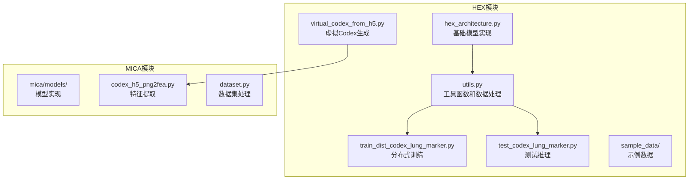
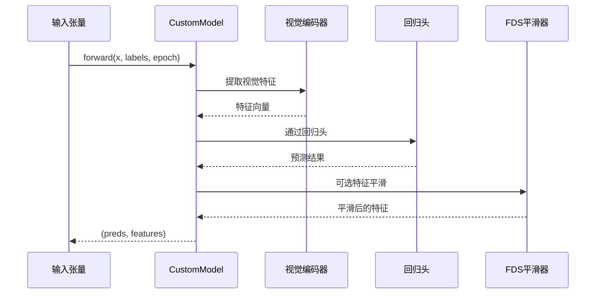
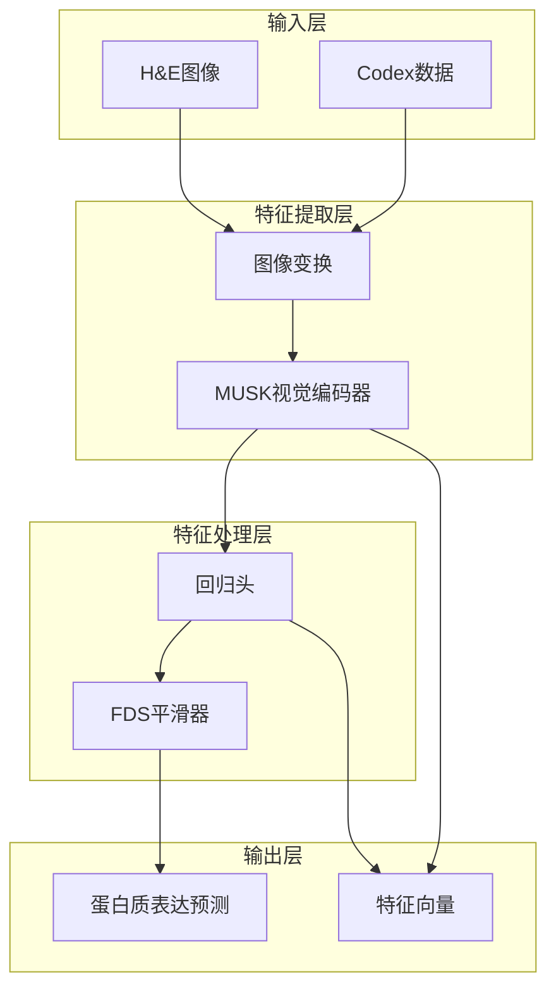
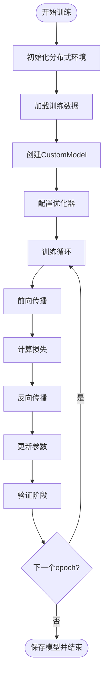
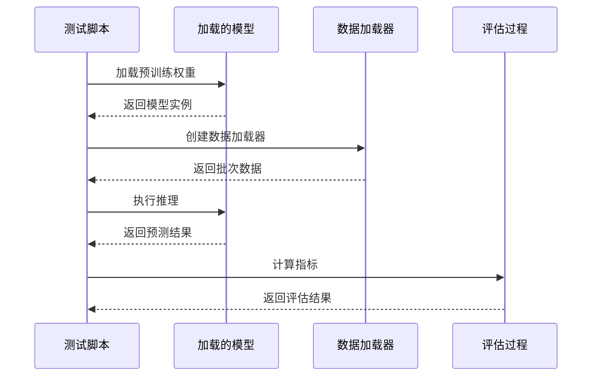
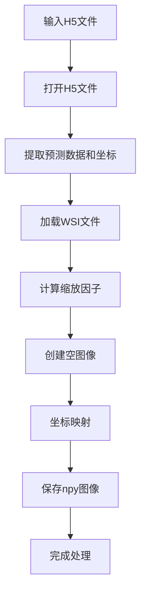
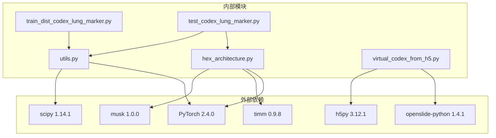

# HEX模块API

<cite>
**本文档引用的文件**
- [hex/hex_architecture.py](file://hex/hex_architecture.py)
- [hex/utils.py](file://hex/utils.py)
- [hex/virtual_codex_from_h5.py](file://hex/virtual_codex_from_h5.py)
- [hex/train_dist_codex_lung_marker.py](file://hex/train_dist_codex_lung_marker.py)
- [hex/test_codex_lung_marker.py](file://hex/test_codex_lung_marker.py)
- [README.md](file://README.md)
- [hex/sample_data/channel_registered/0.csv](file://hex/sample_data/channel_registered/0.csv)
- [hex/sample_data/splits_0.csv](file://hex/sample_data/splits_0.csv)
</cite>

## 目录
1. [简介](#简介)
2. [项目结构](#项目结构)
3. [核心组件](#核心组件)
4. [架构概览](#架构概览)
5. [详细组件分析](#详细组件分析)
6. [依赖关系分析](#依赖关系分析)
7. [性能考虑](#性能考虑)
8. [故障排除指南](#故障排除指南)
9. [结论](#结论)
10. [附录](#附录)

## 简介

HEX（H&E to Protein Expression）是一个AI驱动的虚拟空间蛋白质组学系统，能够从标准的组织病理学幻灯片中计算生成空间蛋白质组学谱。该项目专注于肺癌中的可解释生物标志物发现，通过结合原始H&E图像和AI衍生的虚拟空间蛋白质组学来增强结果预测能力。

该模块提供了完整的API参考，包括：
- CustomModel类的完整接口规范
- 特征提取函数和数据处理工具函数
- 虚拟Codex生成相关API
- 模型训练、推理和结果后处理的完整工作流程

## 项目结构

HEX项目采用模块化设计，主要包含以下核心目录和文件：



**图表来源**
- [hex/hex_architecture.py:1-37](file://hex/hex_architecture.py#L1-L37)
- [hex/utils.py:1-342](file://hex/utils.py#L1-L342)
- [hex/virtual_codex_from_h5.py:1-68](file://hex/virtual_codex_from_h5.py#L1-L68)

**章节来源**
- [README.md:1-57](file://README.md#L1-L57)

## 核心组件

### CustomModel类

CustomModel是HEX系统的核心神经网络架构，基于MUSK视觉编码器构建，专门用于蛋白质表达预测任务。

#### 构造函数参数

| 参数名 | 类型 | 默认值 | 描述 |
|--------|------|--------|------|
| visual_output_dim | int | 必需 | 视觉特征维度（默认1024） |
| num_outputs | int | 必需 | 输出通道数（40个生物标志物） |
| fds_active_markers | list[int] | None | FDS平滑的生物标志物索引列表 |

#### 前向传播方法



**图表来源**
- [hex/utils.py:55-80](file://hex/utils.py#L55-L80)

#### 模型配置选项

| 配置项 | 类型 | 默认值 | 描述 |
|--------|------|--------|------|
| feature_dim | int | 128 | 特征维度 |
| bucket_num | int | 50 | 桶数量 |
| start_update | int | 0 | 开始更新时间步 |
| start_smooth | int | 10 | 开始平滑时间步 |
| kernel | str | 'gaussian' | 平滑核类型 |
| ks | int | 9 | 核大小 |
| sigma | int | 2 | 高斯核标准差 |
| momentum | float | 0.9 | 动量参数 |

**章节来源**
- [hex/utils.py:32-80](file://hex/utils.py#L32-L80)
- [hex/utils.py:116-158](file://hex/utils.py#L116-L158)

### 数据处理组件

#### PatchDataset类

PatchDataset实现了自定义的数据集类，用于处理组织病理学图像和对应的蛋白质表达标签。

| 属性 | 类型 | 描述 |
|------|------|------|
| images | list[str] | 图像路径列表 |
| labels | ndarray | 标签数组 |
| transform | callable | 图像变换函数 |

#### 工具函数

**calibrate_mean_var函数**
- **功能**: 标准化特征以匹配目标分布
- **输入**: 特征矩阵、源均值方差、目标均值方差
- **输出**: 标准化后的特征矩阵

**章节来源**
- [hex/utils.py:82-97](file://hex/utils.py#L82-L97)
- [hex/utils.py:99-114](file://hex/utils.py#L99-L114)

## 架构概览

HEX系统采用分层架构设计，从底层的视觉特征提取到上层的蛋白质表达预测：



**图表来源**
- [hex/hex_architecture.py:9-36](file://hex/hex_architecture.py#L9-L36)
- [hex/utils.py:32-80](file://hex/utils.py#L32-L80)

## 详细组件分析

### 训练流程API

#### 分布式训练接口

训练脚本支持多GPU分布式训练，提供了完整的训练循环管理：



**图表来源**
- [hex/train_dist_codex_lung_marker.py:245-396](file://hex/train_dist_codex_lung_marker.py#L245-L396)

#### 训练配置参数

| 参数 | 类型 | 默认值 | 描述 |
|------|------|--------|------|
| num_epochs | int | 120 | 训练轮数 |
| batch_size | int | 48 | 批次大小 |
| learning_rate | float | 1e-5 | 学习率 |
| num_outputs | int | 40 | 生物标志物数量 |
| FDS_ACTIVE_MARKERS | list | range(40) | 激活的FDS生物标志物 |

**章节来源**
- [hex/train_dist_codex_lung_marker.py:179-228](file://hex/train_dist_codex_lung_marker.py#L179-L228)

### 推理流程API

#### 测试推理接口

推理脚本提供了完整的模型评估流程：



**图表来源**
- [hex/test_codex_lung_marker.py:62-133](file://hex/test_codex_lung_marker.py#L62-L133)

#### 推理配置参数

| 参数 | 类型 | 默认值 | 描述 |
|------|------|--------|------|
| batch_size | int | 128 | 推理批次大小 |
| num_workers | int | 16 | 数据加载器工作进程数 |
| pin_memory | bool | True | 是否使用固定内存 |

**章节来源**
- [hex/test_codex_lung_marker.py:115-133](file://hex/test_codex_lung_marker.py#L115-L133)

### 虚拟Codex生成API

#### H5文件处理接口

虚拟Codex生成模块提供了从H5文件中提取和重建虚拟蛋白质组学图像的功能：



**图表来源**
- [hex/virtual_codex_from_h5.py:37-67](file://hex/virtual_codex_from_h5.py#L37-L67)

#### 坐标映射函数

**check_mag函数**
- **功能**: 从MPP属性推断显微镜放大倍数
- **输入**: WSI对象
- **输出**: 放大倍数（整数）

**章节来源**
- [hex/virtual_codex_from_h5.py:10-28](file://hex/virtual_codex_from_h5.py#L10-L28)

### 数据处理工具函数

#### 特征标准化函数

**calibrate_mean_var函数**
- **功能**: 将特征从源分布标准化到目标分布
- **输入**: 特征矩阵、源均值方差、目标均值方差
- **输出**: 标准化后的特征矩阵
- **参数**: clip_min=0.1, clip_max=10.0

**章节来源**
- [hex/utils.py:99-114](file://hex/utils.py#L99-L114)

## 依赖关系分析

HEX模块的依赖关系呈现清晰的层次结构：



**图表来源**
- [README.md:15-24](file://README.md#L15-L24)
- [hex/train_dist_codex_lung_marker.py:25](file://hex/train_dist_codex_lung_marker.py#L25)

**章节来源**
- [README.md:15-24](file://README.md#L15-L24)

## 性能考虑

### 训练性能优化

1. **混合精度训练**: 使用`torch.cuda.amp.GradScaler`进行自动混合精度训练
2. **分布式训练**: 支持多GPU并行训练，提高训练效率
3. **内存优化**: 合理设置batch size和num_workers参数
4. **数据预处理**: 使用高效的图像变换和数据加载策略

### 推理性能优化

1. **批量推理**: 使用较大的batch size进行批量预测
2. **GPU加速**: 充分利用CUDA进行张量运算
3. **内存管理**: 合理使用`torch.no_grad()`减少内存占用
4. **数据缓存**: 对于重复使用的数据进行适当的缓存策略

### 内存管理最佳实践

- 在训练过程中定期调用`torch.cuda.empty_cache()`
- 合理设置`pin_memory=True`以提高数据传输效率
- 使用`non_blocking=True`进行异步数据传输

## 故障排除指南

### 常见问题及解决方案

#### 模型加载错误
**症状**: `KeyError: 'missing_keys'` 或 `KeyError: 'unexpected_keys'`
**解决方案**: 
- 检查模型配置是否与预训练权重匹配
- 确认`strict=False`参数的使用
- 验证输入维度的一致性

#### 分布式训练问题
**症状**: 进程间同步失败或梯度不同步
**解决方案**:
- 检查`dist.init_process_group`的正确初始化
- 确认所有进程使用相同的端口和设备
- 验证`find_unused_parameters=True`的设置

#### 内存不足错误
**症状**: `CUDA out of memory`
**解决方案**:
- 减小batch size
- 关闭不必要的数据加载器工作进程
- 使用更小的图像尺寸

#### 数据加载问题
**症状**: 文件路径错误或数据格式不匹配
**解决方案**:
- 验证CSV文件的列名和格式
- 检查图像文件是否存在且可访问
- 确认坐标系统的正确性

**章节来源**
- [hex/test_codex_lung_marker.py:71-73](file://hex/test_codex_lung_marker.py#L71-L73)
- [hex/train_dist_codex_lung_marker.py:75-76](file://hex/train_dist_codex_lung_marker.py#L75-L76)

## 结论

HEX模块提供了一个完整的AI驱动虚拟空间蛋白质组学解决方案，具有以下特点：

1. **模块化设计**: 清晰的组件分离和职责划分
2. **高性能实现**: 支持分布式训练和推理优化
3. **完整的API**: 从数据处理到模型训练的全流程接口
4. **可扩展性**: 易于添加新的生物标志物和改进算法

该模块为肺癌研究提供了强大的工具，能够从标准的组织病理学图像中预测蛋白质表达，支持精确医学和生物标志物发现的应用。

## 附录

### 示例使用模式

#### 基础模型使用
```python
# 创建模型实例
model = CustomModel(visual_output_dim=1024, num_outputs=40)

# 前向传播
predictions, features = model(input_tensor)
```

#### 训练流程示例
```python
# 分布式训练启动
torchrun --nnodes=1 --nproc-per-node=8 ./hex/train_dist_codex_lung_marker.py
```

#### 推理流程示例
```python
# 模型评估
python test_codex_lung_marker.py
```

### 数据格式规范

#### CSV数据格式
- **列名**: `mean_intensity_channel1` 到 `mean_intensity_channel40`
- **数据类型**: 浮点数（0-1范围）
- **样本**: 组织切片的蛋白质表达强度

#### H5文件格式
- **数据键**: `codex_prediction` (N, 40)
- **坐标键**: `coords` (N, 2)
- **属性**: `patch_level`, `patch_size`

**章节来源**
- [hex/sample_data/channel_registered/0.csv:1](file://hex/sample_data/channel_registered/0.csv#L1)
- [hex/sample_data/splits_0.csv:1](file://hex/sample_data/splits_0.csv#L1)