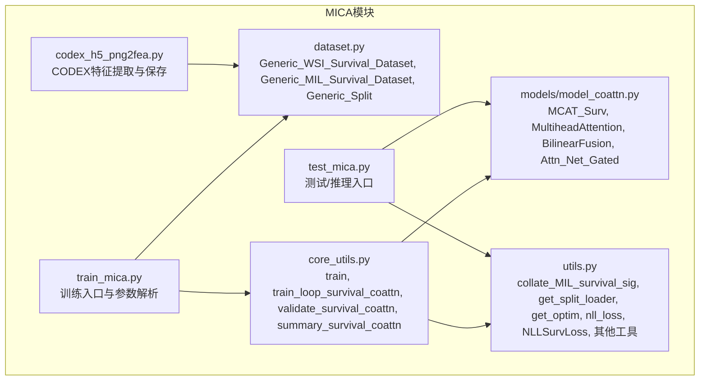
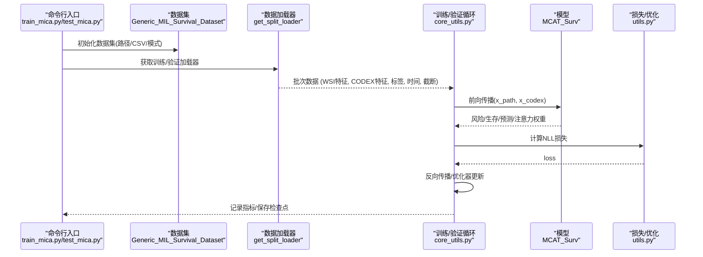
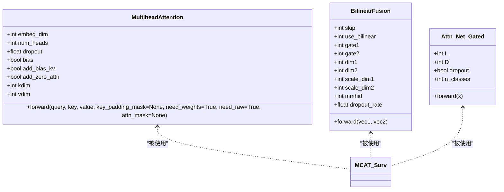
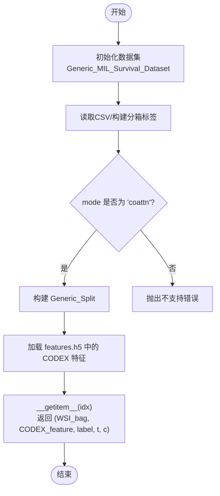
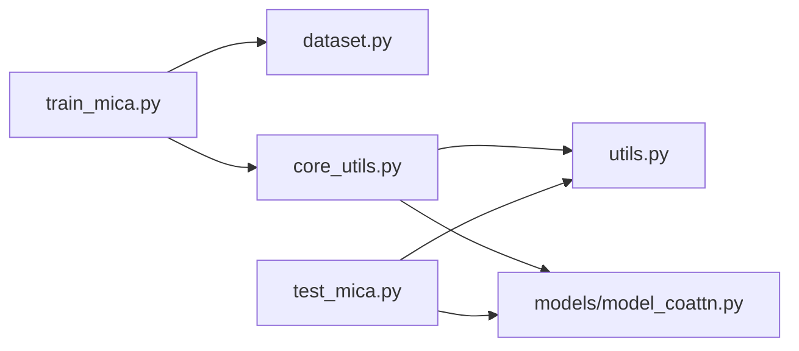

# MICA模块API

<cite>
**本文档引用的文件**
- [model_coattn.py](file://mica/models/model_coattn.py)
- [dataset.py](file://mica/dataset.py)
- [utils.py](file://mica/utils.py)
- [core_utils.py](file://mica/core_utils.py)
- [train_mica.py](file://mica/train_mica.py)
- [test_mica.py](file://mica/test_mica.py)
- [codex_h5_png2fea.py](file://mica/codex_h5_png2fea.py)
- [README.md](file://README.md)
</cite>

## 目录
1. [简介](#简介)
2. [项目结构](#项目结构)
3. [核心组件](#核心组件)
4. [架构总览](#架构总览)
5. [详细组件分析](#详细组件分析)
6. [依赖分析](#依赖分析)
7. [性能考虑](#性能考虑)
8. [故障排查指南](#故障排查指南)
9. [结论](#结论)
10. [附录：使用示例与参数调优](#附录使用示例与参数调优)

## 简介
本文件为 MICA 多模态集成模块的全面 API 参考文档，聚焦以下目标：
- MultiheadAttention 类的接口规范（参数、前向传播、注意力权重输出）
- PatchDataset 类的数据加载与预处理接口（初始化、样本获取、批处理）
- 核心工具函数的 API 规范（数据格式转换、特征融合、多模态处理）
- 完整使用示例（数据准备、模型配置、训练流程）
- 参数调优与性能优化建议

本模块基于 PyTorch 构建，支持生存分析任务下的多模态（WSI 特征 + CODEX 虚拟蛋白组）融合建模。

## 项目结构
MICA 模块位于仓库的 mica 子目录中，主要由以下文件组成：
- 模型定义与注意力实现：models/model_coattn.py
- 数据集与加载器：dataset.py
- 训练/验证/推理工具：utils.py、core_utils.py
- 训练与测试入口：train_mica.py、test_mica.py
- CODEX 特征提取与预处理：codex_h5_png2fea.py

**图表来源**
- [model_coattn.py:12-123](file://mica/models/model_coattn.py#L12-L123)
- [dataset.py:17-249](file://mica/dataset.py#L17-L249)
- [utils.py:43-273](file://mica/utils.py#L43-L273)
- [core_utils.py:15-230](file://mica/core_utils.py#L15-L230)
- [train_mica.py:28-238](file://mica/train_mica.py#L28-L238)
- [test_mica.py:79-324](file://mica/test_mica.py#L79-L324)
- [codex_h5_png2fea.py:1-173](file://mica/codex_h5_png2fea.py#L1-L173)

**章节来源**
- [README.md:38-44](file://README.md#L38-L44)

## 核心组件
- MultiheadAttention：自定义多头注意力实现，支持原始注意力权重输出，用于 H&E 特征与 CODEX 特征之间的引导式交互。
- MCAT_Surv：主模型，包含两路特征网络（WSI、CODEX）、引导式注意力、Transformer 编码器、注意力池化、融合层与分类头。
- Generic_MIL_Survival_Dataset/Generic_Split：多模态生存分析数据集，按 slide 级别组织样本，提供 CO-ATTENTION 模式下的批处理。
- 工具函数：collate_MIL_survival_sig、get_split_loader、get_optim、nll_loss/NLLSurvLoss 等。

**章节来源**
- [model_coattn.py:12-123](file://mica/models/model_coattn.py#L12-L123)
- [dataset.py:193-249](file://mica/dataset.py#L193-L249)
- [utils.py:43-216](file://mica/utils.py#L43-L216)

## 架构总览
MICA 的训练/推理流程如下：

**图表来源**
- [train_mica.py:46-88](file://mica/train_mica.py#L46-L88)
- [dataset.py:193-249](file://mica/dataset.py#L193-L249)
- [utils.py:53-76](file://mica/utils.py#L53-L76)
- [core_utils.py:15-82](file://mica/core_utils.py#L15-L82)
- [model_coattn.py:12-123](file://mica/models/model_coattn.py#L12-L123)

## 详细组件分析

### MultiheadAttention 类 API
- 类名：MultiheadAttention
- 继承：torch.nn.Module
- 主要参数
  - embed_dim：嵌入维度
  - num_heads：注意力头数
  - dropout：注意力权重丢弃率
  - bias：是否使用偏置
  - add_bias_kv/add_zero_attn：扩展键/值序列或添加零向量
  - kdim/vdim：键/值的特征维度（默认与 embed_dim 相同）
- 关键属性
  - in_proj_weight/q_proj_weight/k_proj_weight/v_proj_weight/out_proj
  - bias_k/bias_v/add_zero_attn/head_dim
- 前向接口
  - 输入：query, key, value
  - 可选：key_padding_mask, need_weights=True, need_raw=True, attn_mask
  - 输出：attn_output, attn_output_weights 或原始权重（取决于 need_raw）
- 注意
  - 当 qkv 同维时使用统一投影；否则使用分离投影参数
  - 支持自注意力与编码器-解码器注意力两种场景

**图表来源**
- [model_coattn.py:459-615](file://mica/models/model_coattn.py#L459-L615)
- [model_coattn.py:616-680](file://mica/models/model_coattn.py#L616-L680)
- [model_coattn.py:683-714](file://mica/models/model_coattn.py#L683-L714)

**章节来源**
- [model_coattn.py:459-615](file://mica/models/model_coattn.py#L459-L615)

### PatchDataset 类 API（用于HEX/CODEX数据）
- 类名：PatchDataset（在 HEX 子模块中定义）
- 继承：torch.utils.data.Dataset
- 主要参数
  - csv_path：包含 patch 级别元信息与标签的 CSV 文件
  - label_columns：标签列名列表（如 40 个通道的强度均值）
  - transform：图像变换（Resize/ToTensor/Normalize）
- 关键方法
  - __len__：返回 patch 数量
  - __getitem__(idx)：返回 (image, labels) 或 (image, labels, metadata)
- 数据预处理
  - 图像尺寸归一化至固定大小
  - 归一化到 ImageNet-Inception 均值/方差
- 批处理
  - 使用 DataLoader 进行分批加载，支持分布式采样与多进程

注意：本节为概念性说明，未直接分析具体源码文件。

### Generic_MIL_Survival_Dataset/Generic_Split API
- Generic_MIL_Survival_Dataset
  - 初始化参数：csv_path、mode='coattn'、data_dir、codex_deep、n_bins、label_col 等
  - __getitem__(idx)：按 slide 级别返回 (WSI_bag, CODEX_feature, label, event_time, censorship)
  - return_splits/get_split_from_df：从 CSV 分割文件中划分训练/验证集
- Generic_Split
  - 从 HDF5 中读取每个 slide 的 CODEX 特征字典
  - 提供 __len__ 与类别索引

**图表来源**
- [dataset.py:193-249](file://mica/dataset.py#L193-L249)

**章节来源**
- [dataset.py:17-249](file://mica/dataset.py#L17-L249)

### 核心工具函数 API
- collate_MIL_survival_sig
  - 功能：将批次中的样本拼接为张量，类型转换与打包
  - 输入：batch 列表 [(WSI, CODEX, label, t, c), ...]
  - 输出：[img, codex_feature, label, event_time, c]
- get_split_loader
  - 功能：根据模式选择合适的 collate 函数，构造 DataLoader
  - 参数：split_dataset、training、weighted、mode='coattn'、batch_size
  - 返回：DataLoader
- get_optim
  - 功能：根据字符串选择优化器（Adam/SGD），过滤 requires_grad=True 的参数
- nll_loss / NLLSurvLoss
  - 功能：生存分析负对数似然损失，支持删失数据与加权
  - 参数：hazards、S（生存函数）、Y（离散时间标签）、c（删失状态）、alpha、eps
- print_network
  - 功能：统计模型总参数与可训练参数数量
- make_weights_for_balanced_classes_split
  - 功能：按类别样本数生成加权采样权重
- dfs_freeze / dfs_unfreeze
  - 功能：递归冻结/解冻子模块参数

**章节来源**
- [utils.py:43-216](file://mica/utils.py#L43-L216)

### 训练/验证/推理流程 API
- train(datasets, cur, args)
  - 功能：单折训练主流程，初始化损失、模型、优化器、加载器，执行训练与验证循环，保存检查点
  - 参数：datasets=(train_split, val_split)、cur（折序号）、args（命名空间）
- train_loop_survival_coattn
  - 功能：训练轮次循环，前向、反向、优化器步进（支持梯度累积）
  - 输出：记录训练损失与 c-index
- validate_survival_coattn
  - 功能：验证阶段，计算验证损失与 c-index
- summary_survival_coattn
  - 功能：汇总测试结果，返回患者级风险评分与 c-index

**章节来源**
- [core_utils.py:15-230](file://mica/core_utils.py#L15-L230)

## 依赖分析
- 模块内依赖
  - core_utils.py 依赖 utils.py（优化器、损失、加载器）
  - train_mica.py 依赖 dataset.py（数据集）、core_utils.py（训练流程）
  - test_mica.py 依赖 utils.py（工具）、models/model_coattn.py（模型）
  - model_coattn.py 内部实现 MultiheadAttention、BilinearFusion、Attn_Net_Gated
- 外部依赖
  - PyTorch、NumPy、Pandas、Scikit-survival、TensorBoardX（可选）

**图表来源**
- [train_mica.py:17-19](file://mica/train_mica.py#L17-L19)
- [core_utils.py:12-13](file://mica/core_utils.py#L12-L13)
- [utils.py:1-21](file://mica/utils.py#L1-L21)
- [model_coattn.py:1-7](file://mica/models/model_coattn.py#L1-L7)

**章节来源**
- [train_mica.py:17-19](file://mica/train_mica.py#L17-L19)
- [core_utils.py:12-13](file://mica/core_utils.py#L12-L13)
- [utils.py:1-21](file://mica/utils.py#L1-L21)
- [model_coattn.py:1-7](file://mica/models/model_coattn.py#L1-L7)

## 性能考虑
- 梯度累积：通过参数 gc 控制，减少显存占用，提升有效 batch size
- 批大小：由于 bag 大小可变，batch_size=1 更常见；可通过梯度累积补偿
- 数据加载：启用多 worker、pin_memory，合理设置 num_workers
- 推理加速：关闭梯度计算（no_grad），确保模型 eval 模式
- 死锁与确定性：设置 cudnn.benchmark=False 与 cudnn.deterministic=True，避免 GPU 确定性问题
- 早停：可在验证指标不再提升时停止训练（需自行扩展）

[本节为通用指导，无需特定文件来源]

## 故障排查指南
- 分割重叠校验
  - 训练/验证集应无共享 slide_id 与 patient_id（若存在）
  - 若出现重叠断言失败，检查分割 CSV 与数据一致性
- 模式限制
  - 仅支持 mode='coattn'（path+codex），其他模式会抛出不支持错误
- 设备与显存
  - 确认 CUDA 可用与驱动版本匹配；必要时降低 batch_size 或 gc
- 损失与指标
  - 若 c-index 异常，检查删失状态与事件时间是否正确
- 数据完整性
  - 确保 features.h5 中包含所需 slide 的特征键；否则加载器会报错

**章节来源**
- [train_mica.py:52-64](file://mica/train_mica.py#L52-L64)
- [dataset.py:213-215](file://mica/dataset.py#L213-L215)

## 结论
MICA 模块提供了面向生存分析的多模态融合框架，核心在于：
- 自定义 MultiheadAttention 实现引导式注意力
- MCAT_Surv 主干网络整合两路特征与注意力池化
- 以 Generic_MIL_Survival_Dataset 为核心的多模态数据管线
- 丰富的工具函数支撑训练、验证与评估

通过合理的参数配置与性能优化策略，可在多中心 TCGA 数据上取得稳健的预后预测效果。

[本节为总结，无需特定文件来源]

## 附录：使用示例与参数调优

### 数据准备
- 使用 CLAM 生成 WSI 特征包（bag-level features）
- 使用 HEX 模型生成虚拟 CODEX 图像，再运行 codex_h5_png2fea.py 将其转为特征矩阵并保存为 HDF5
- 构造每例患者的分割文件（CSV），并使用 check_splits.py 校验

**章节来源**
- [README.md:26-44](file://README.md#L26-L44)
- [codex_h5_png2fea.py:1-173](file://mica/codex_h5_png2fea.py#L1-L173)

### 训练流程（命令行）
- 基本命令
  - python train_mica.py --mode coattn --base_path YOUR_PATH --gc 8 --project_name YOUR_PROJECT --max_epochs 20 --lr 1e-5
- 关键参数
  - --mode：'coattn'（多模态）
  - --fusion：'concat' 或 'bilinear'
  - --transformer_mode：'separate' 或 'shared'
  - --pooling：'gap' 或 'attn'
  - --batch_size：通常为 1（因 bag 大小可变）
  - --gc：梯度累积步数
  - --lr：学习率
  - --alpha_surv：未删失样本权重
  - --lambda_reg：L1 正则强度
  - --weighted_sample：是否进行类别加权采样

**章节来源**
- [train_mica.py:91-137](file://mica/train_mica.py#L91-L137)
- [train_mica.py:148-230](file://mica/train_mica.py#L148-L230)

### 推理与评估
- 加载已训练模型权重，使用 test_mica.py 对验证集进行推理
- 输出包含患者级风险评分、删失状态与生存时间，便于计算 c-index

**章节来源**
- [test_mica.py:123-173](file://mica/test_mica.py#L123-L173)

### 参数调优建议
- 学习率与优化器
  - 初始尝试 1e-4~1e-5；Adam 在多模态场景表现稳定
- 梯度累积
  - 显存受限时增大 gc，保持有效 batch size 平衡
- 融合方式
  - concat 通常更稳定；bilinear 在特征维度较高时可能提升表达能力
- 注意力与池化
  - shared Transformer 权重可减少参数，但 separate 可能带来更强的模态特化
  - gap 池化简单高效；attn 池化引入门控注意力，适合长序列 bag
- 正则化
  - 适当增加 reg 与 lambda_reg，缓解过拟合（尤其在小样本数据集）

[本节为通用指导，无需特定文件来源]