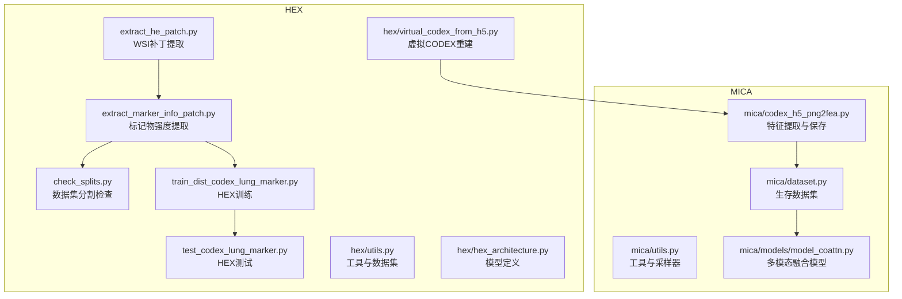
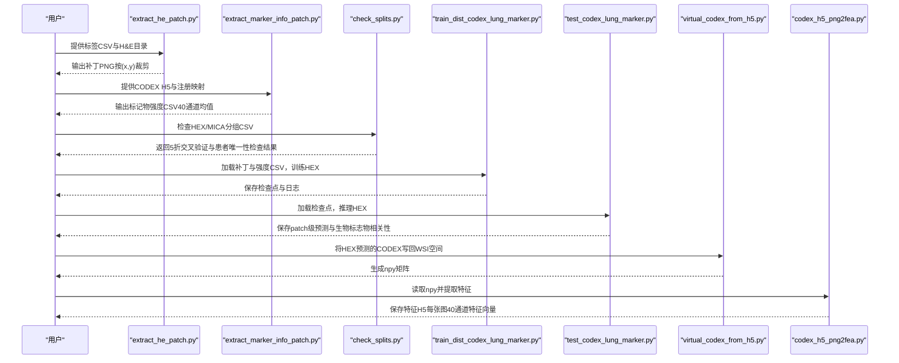
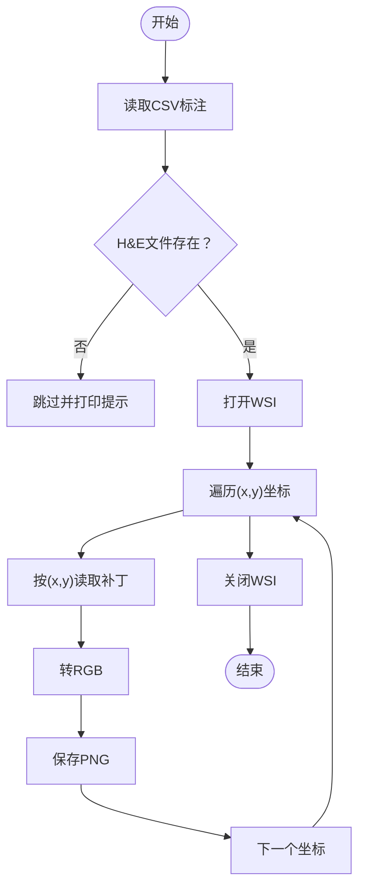
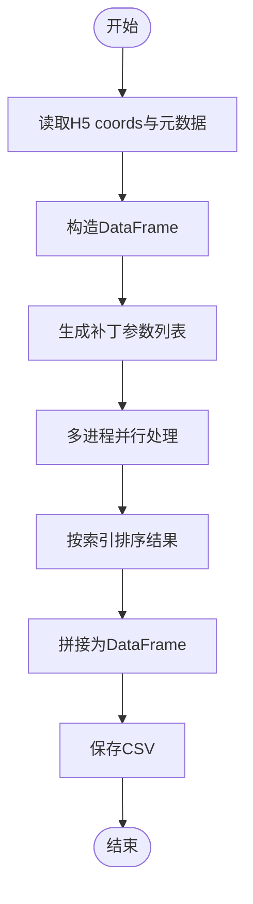
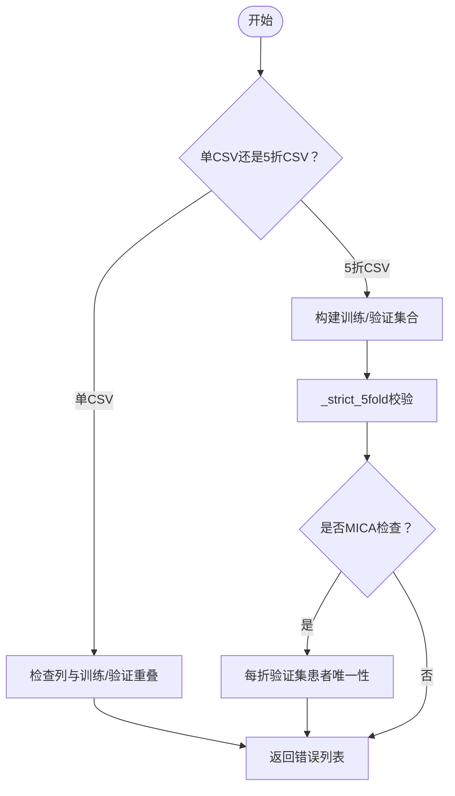
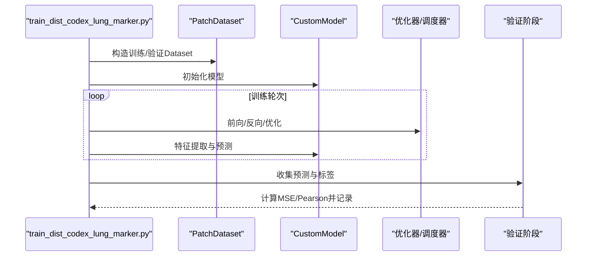
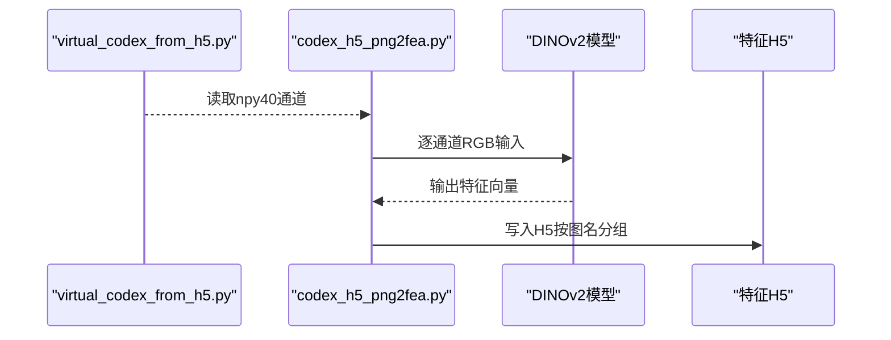
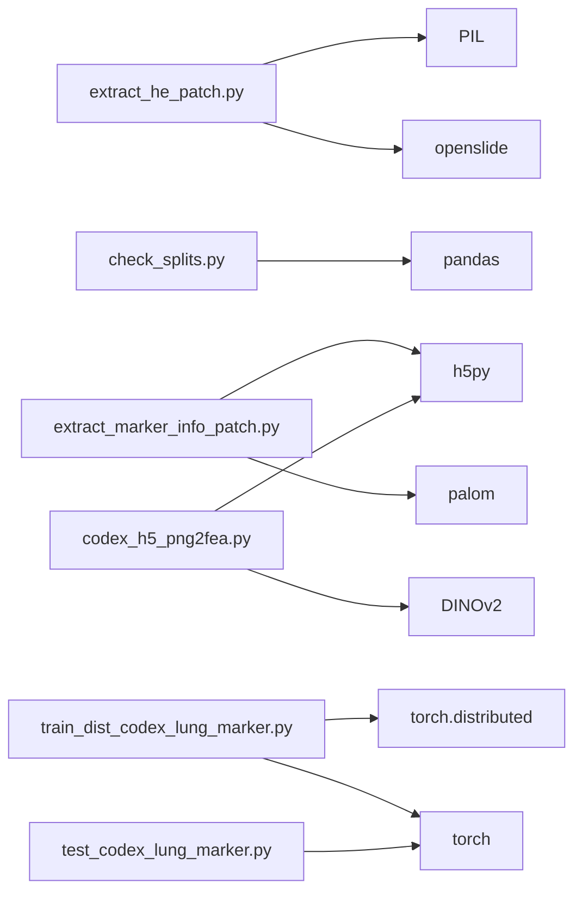

# 数据处理API

<cite>
**本文档引用的文件**
- [README.md](file://README.md)
- [extract_he_patch.py](file://extract_he_patch.py)
- [extract_marker_info_patch.py](file://extract_marker_info_patch.py)
- [check_splits.py](file://check_splits.py)
- [hex/utils.py](file://hex/utils.py)
- [hex/hex_architecture.py](file://hex/hex_architecture.py)
- [hex/test_codex_lung_marker.py](file://hex/test_codex_lung_marker.py)
- [hex/train_dist_codex_lung_marker.py](file://hex/train_dist_codex_lung_marker.py)
- [hex/sample_data/channel_registered/0.csv](file://hex/sample_data/channel_registered/0.csv)
- [hex/sample_data/he_patches/0/0_0.png](file://hex/sample_data/he_patches/0/0_0.png)
- [mica/utils.py](file://mica/utils.py)
- [mica/dataset.py](file://mica/dataset.py)
- [mica/models/model_coattn.py](file://mica/models/model_coattn.py)
- [mica/codex_h5_png2fea.py](file://mica/codex_h5_png2fea.py)
- [hex/virtual_codex_from_h5.py](file://hex/virtual_codex_from_h5.py)
</cite>

## 目录
1. [简介](#简介)
2. [项目结构](#项目结构)
3. [核心组件](#核心组件)
4. [架构总览](#架构总览)
5. [详细组件分析](#详细组件分析)
6. [依赖关系分析](#依赖关系分析)
7. [性能考量](#性能考量)
8. [故障排查指南](#故障排查指南)
9. [结论](#结论)
10. [附录](#附录)

## 简介
本文件面向HEX项目的数据处理与预处理流水线，提供面向API的参考文档，覆盖以下主题：
- WSI文件读取与补丁提取：从WSI中按坐标读取固定尺寸补丁，输出PNG图像。
- 标记物信息提取：基于注册后的CODEX数据，按补丁坐标计算通道均值强度，输出CSV。
- 数据集分割检查：验证HEX与MICA的分组CSV是否满足严格5折交叉验证与患者级约束。
- 预处理流水线最佳实践：包含错误处理、性能优化与批量处理建议。

本指南以仓库中的脚本与模块为依据，给出接口规范、参数说明、数据流与典型用法，并提供可视化图示帮助理解。

## 项目结构
HEX项目围绕“从H&E到虚拟CODEX再到多模态建模”的数据管线组织，主要目录与文件如下：
- hex：HEX模型训练与推理相关脚本与工具
- mica：MICA生存分析模型相关脚本与工具
- 样例数据：hex/sample_data（包含配对的通道注册CSV与H&E补丁）
- 核心脚本：extract_he_patch.py、extract_marker_info_patch.py、check_splits.py、train_dist_codex_lung_marker.py、test_codex_lung_marker.py、virtual_codex_from_h5.py、codex_h5_png2fea.py

**图表来源**
- [extract_he_patch.py:1-78](file://extract_he_patch.py#L1-L78)
- [extract_marker_info_patch.py:1-74](file://extract_marker_info_patch.py#L1-L74)
- [check_splits.py:1-159](file://check_splits.py#L1-L159)
- [hex/train_dist_codex_lung_marker.py:1-400](file://hex/train_dist_codex_lung_marker.py#L1-L400)
- [hex/test_codex_lung_marker.py:1-189](file://hex/test_codex_lung_marker.py#L1-L189)
- [hex/utils.py:1-342](file://hex/utils.py#L1-L342)
- [hex/hex_architecture.py:1-37](file://hex/hex_architecture.py#L1-L37)
- [hex/virtual_codex_from_h5.py:1-68](file://hex/virtual_codex_from_h5.py#L1-L68)
- [mica/codex_h5_png2fea.py:1-173](file://mica/codex_h5_png2fea.py#L1-L173)
- [mica/dataset.py:1-250](file://mica/dataset.py#L1-L250)
- [mica/utils.py:1-273](file://mica/utils.py#L1-L273)
- [mica/models/model_coattn.py:1-714](file://mica/models/model_coattn.py#L1-L714)

**章节来源**
- [README.md:26-44](file://README.md#L26-L44)

## 核心组件
本节概述与数据处理直接相关的API与工具函数，重点说明接口规范、参数与返回行为。

- WSI补丁提取API
  - 函数：process_slide
  - 输入：文件名、标签目录、H&E目录、输出目录、补丁尺寸
  - 处理：读取CSV标注，打开WSI，按(x,y)读取补丁，转RGB并保存PNG
  - 并发：使用进程池并行处理多个样本
  - 输出：每个样本的补丁目录与PNG文件
  - 参考路径：[extract_he_patch.py:9-45](file://extract_he_patch.py#L9-L45)

- 标记物强度提取API
  - 函数：逐补丁处理（内部在脚本内定义）
  - 输入：H5文件（含coords、patch_level、patch_size）、CODEX金字塔读取器
  - 处理：按补丁坐标切片，计算每通道均值强度，聚合为DataFrame
  - 并发：CPU多进程池
  - 输出：CSV文件（包含slide、index、x、y与40个通道的均值强度列）
  - 参考路径：[extract_marker_info_patch.py:43-73](file://extract_marker_info_patch.py#L43-L73)

- 数据集分割检查API
  - 函数：check_hex、check_mica、patient_from_slide、_strict_5fold
  - 输入：HEX样本目录、MICA根目录
  - 处理：校验CSV列、患者ID规范化、5折交叉验证一致性、患者唯一性
  - 输出：错误列表或通过提示
  - 参考路径：[check_splits.py:72-148](file://check_splits.py#L72-L148)

- 数据加载与预处理工具
  - 类：PatchDataset（用于HEX训练/测试）
  - 工具：seed_torch、calibrate_mean_var、FDS（特征分布平滑）
  - 参考路径：[hex/utils.py:82-342](file://hex/utils.py#L82-L342)

**章节来源**
- [extract_he_patch.py:9-78](file://extract_he_patch.py#L9-L78)
- [extract_marker_info_patch.py:1-74](file://extract_marker_info_patch.py#L1-L74)
- [check_splits.py:1-159](file://check_splits.py#L1-L159)
- [hex/utils.py:1-342](file://hex/utils.py#L1-L342)

## 架构总览
下图展示从WSI到标记物强度、再到HEX训练与MICA特征提取的整体流程。

**图表来源**
- [extract_he_patch.py:46-78](file://extract_he_patch.py#L46-L78)
- [extract_marker_info_patch.py:21-73](file://extract_marker_info_patch.py#L21-L73)
- [check_splits.py:72-148](file://check_splits.py#L72-L148)
- [hex/train_dist_codex_lung_marker.py:42-396](file://hex/train_dist_codex_lung_marker.py#L42-L396)
- [hex/test_codex_lung_marker.py:75-188](file://hex/test_codex_lung_marker.py#L75-L188)
- [hex/virtual_codex_from_h5.py:37-68](file://hex/virtual_codex_from_h5.py#L37-L68)
- [mica/codex_h5_png2fea.py:42-173](file://mica/codex_h5_png2fea.py#L42-L173)

## 详细组件分析

### 组件A：WSI补丁提取API
- 接口规范
  - 函数：process_slide(file, label_dir, he_dir, output_dir, patch_size)
  - 参数
    - file：CSV文件名（对应某张WSI）
    - label_dir：包含CSV标注的目录
    - he_dir：包含.svs的H&E目录
    - output_dir：输出补丁目录
    - patch_size：整数，补丁边长（像素）
  - 行为
    - 读取CSV，解析每行的(x,y)与slide_index
    - 打开对应WSI，按level=0读取区域，转RGB并保存PNG
    - 多进程并行处理多个样本
  - 错误处理
    - 若H&E文件不存在则跳过并打印提示
  - 性能要点
    - 使用进程池与tqdm显示进度
    - 建议合理设置进程数与补丁尺寸

**图表来源**
- [extract_he_patch.py:9-45](file://extract_he_patch.py#L9-L45)

**章节来源**
- [extract_he_patch.py:9-78](file://extract_he_patch.py#L9-L78)

### 组件B：标记物强度提取API
- 接口规范
  - 函数：逐补丁处理（内部定义）
  - 输入
    - H5文件：包含coords、patch_level、patch_size属性
    - CODEX金字塔读取器：palom.reader.OmePyramidReader
  - 处理
    - 读取coords，构造DataFrame（slide、index、x、y）
    - 对每个补丁按(x,y,patch_size)切片，计算每通道均值强度
    - 多进程并行处理所有补丁
  - 输出
    - CSV文件：包含slide、index、x、y与40个通道均值强度列

**图表来源**
- [extract_marker_info_patch.py:27-73](file://extract_marker_info_patch.py#L27-L73)

**章节来源**
- [extract_marker_info_patch.py:1-74](file://extract_marker_info_patch.py#L1-L74)

### 组件C：数据集分割检查API
- 接口规范
  - 函数：check_hex(sample_dir)、check_mica(root)
  - 输入
    - check_hex：HEX样本目录（包含1个或5个CSV）
    - check_mica：MICA根目录（每个子目录包含5个splits_*.csv）
  - 行为
    - 规范化患者ID（支持TCGA前缀、下划线、点号分隔）
    - 严格5折交叉验证：确保每折无重叠、并集等于全集、验证集互不重叠
    - MICA额外要求：每折验证集中每患者仅一个slide
  - 输出
    - 错误列表（包含失败项与示例），或通过提示

**图表来源**
- [check_splits.py:72-148](file://check_splits.py#L72-L148)

**章节来源**
- [check_splits.py:1-159](file://check_splits.py#L1-L159)

### 组件D：HEX训练与测试API
- 训练API
  - 函数：主流程（分布式训练入口）
  - 关键步骤
    - 初始化分布式环境，设置随机种子
    - 加载训练/验证CSV，构造PatchDataset与DistributedSampler
    - 定义模型（CustomModel）、损失（AdaptiveLoss）、优化器与学习率调度器
    - 训练循环：自动混合精度、梯度累积、FDS特征分布平滑
    - 验证：收集全局预测与标签，计算MSE与Pearson相关系数
    - 保存检查点与TensorBoard日志
  - 参考路径：[hex/train_dist_codex_lung_marker.py:42-396](file://hex/train_dist_codex_lung_marker.py#L42-L396)

- 测试API
  - 函数：main（推理与评估）
  - 关键步骤
    - 加载模型权重，构造PatchDataset
    - DataLoader批量化推理，自动混合精度
    - 生成patch级预测与标签，计算每生物标志物Pearson相关系数
    - 保存结果CSV与统计摘要
  - 参考路径：[hex/test_codex_lung_marker.py:75-188](file://hex/test_codex_lung_marker.py#L75-L188)

**图表来源**
- [hex/train_dist_codex_lung_marker.py:160-396](file://hex/train_dist_codex_lung_marker.py#L160-L396)
- [hex/hex_architecture.py:9-37](file://hex/hex_architecture.py#L9-L37)
- [hex/utils.py:82-342](file://hex/utils.py#L82-L342)

**章节来源**
- [hex/train_dist_codex_lung_marker.py:1-400](file://hex/train_dist_codex_lung_marker.py#L1-L400)
- [hex/test_codex_lung_marker.py:1-189](file://hex/test_codex_lung_marker.py#L1-L189)
- [hex/hex_architecture.py:1-37](file://hex/hex_architecture.py#L1-L37)
- [hex/utils.py:1-342](file://hex/utils.py#L1-L342)

### 组件E：虚拟CODEX重建与特征提取API
- 虚拟CODEX重建API
  - 函数：逐H5文件处理
  - 输入：WSI路径、CODEX H5（含codex_prediction与coords）
  - 处理：根据WSI的MPP推断倍数，计算缩放因子，将预测写回WSI空间
  - 输出：npy矩阵（高、宽、通道=40）
  - 参考路径：[hex/virtual_codex_from_h5.py:37-68](file://hex/virtual_codex_from_h5.py#L37-L68)

- 特征提取API
  - 函数：ImageChannelDataset.__getitem__、特征提取循环
  - 输入：npy目录（每张图40通道）
  - 处理：按通道切片为RGB，归一化后送入DINOv2提取特征
  - 输出：H5文件（每张图40×特征维度）
  - 参考路径：[mica/codex_h5_png2fea.py:62-173](file://mica/codex_h5_png2fea.py#L62-L173)

**图表来源**
- [hex/virtual_codex_from_h5.py:37-68](file://hex/virtual_codex_from_h5.py#L37-L68)
- [mica/codex_h5_png2fea.py:114-173](file://mica/codex_h5_png2fea.py#L114-L173)

**章节来源**
- [hex/virtual_codex_from_h5.py:1-68](file://hex/virtual_codex_from_h5.py#L1-L68)
- [mica/codex_h5_png2fea.py:1-173](file://mica/codex_h5_png2fea.py#L1-L173)

## 依赖关系分析
- 组件耦合
  - extract_he_patch.py依赖openslide读取WSI，依赖PIL进行图像转换与保存
  - extract_marker_info_patch.py依赖palom读取CODEX金字塔，依赖h5py读取坐标与元数据
  - check_splits.py依赖pandas进行CSV解析与集合运算
  - HEX训练/测试依赖自定义Dataset与模型，使用torch.distributed进行分布式训练
  - MICA特征提取依赖DINOv2模型与h5py存储特征
- 外部依赖
  - openslide、PIL、pandas、numpy、h5py、torch、torchvision、tqdm、matplotlib等

**图表来源**
- [extract_he_patch.py:1-8](file://extract_he_patch.py#L1-L8)
- [extract_marker_info_patch.py:1-10](file://extract_marker_info_patch.py#L1-L10)
- [check_splits.py:1-4](file://check_splits.py#L1-L4)
- [hex/train_dist_codex_lung_marker.py:1-26](file://hex/train_dist_codex_lung_marker.py#L1-L26)
- [hex/test_codex_lung_marker.py:1-16](file://hex/test_codex_lung_marker.py#L1-L16)
- [mica/codex_h5_png2fea.py:1-17](file://mica/codex_h5_png2fea.py#L1-L17)

**章节来源**
- [README.md:7-24](file://README.md#L7-L24)

## 性能考量
- 并行策略
  - WSI补丁提取：使用进程池并行处理多个样本，建议根据CPU核数调整进程数
  - 标记物强度提取：多进程并行处理补丁，提高吞吐
  - MICA特征提取：DataLoader启用pin_memory与多worker，提升GPU利用率
- 内存与I/O
  - WSI读取建议按level=0读取，避免高倍层内存压力
  - H5读取coords与预测时注意内存占用，必要时分块处理
- 训练优化
  - 自动混合精度（autocast）与GradScaler减少显存占用
  - 分布式训练中同步梯度与参数广播，避免通信瓶颈
- 数据加载
  - PatchDataset与DistributedSampler配合，保证训练/验证划分一致且高效

[本节为通用性能建议，无需特定文件来源]

## 故障排查指南
- WSI补丁提取
  - 症状：H&E文件缺失导致跳过
  - 处理：确认路径与文件名匹配，检查.svs扩展名
  - 参考：[extract_he_patch.py:43-45](file://extract_he_patch.py#L43-L45)
- 标记物强度提取
  - 症状：H5缺少coords或属性
  - 处理：确认H5包含coords数组与patch_level/patch_size属性
  - 参考：[extract_marker_info_patch.py:29-33](file://extract_marker_info_patch.py#L29-L33)
- 数据集分割检查
  - 症状：5折交叉验证失败或患者重复
  - 处理：检查CSV列名、患者ID规范化、验证集每患者唯一性
  - 参考：[check_splits.py:43-104](file://check_splits.py#L43-L104)
- 训练/测试
  - 症状：分布式初始化失败或GPU内存不足
  - 处理：检查NCCL环境变量、设备可见性；减小batch size或启用AMP
  - 参考：[hex/train_dist_codex_lung_marker.py:28-396](file://hex/train_dist_codex_lung_marker.py#L28-L396)
- 特征提取
  - 症状：npy形状不匹配或特征H5写入异常
  - 处理：确认每张图40通道，逐通道归一化与类型转换
  - 参考：[mica/codex_h5_png2fea.py:62-173](file://mica/codex_h5_png2fea.py#L62-L173)

**章节来源**
- [extract_he_patch.py:43-45](file://extract_he_patch.py#L43-L45)
- [extract_marker_info_patch.py:29-33](file://extract_marker_info_patch.py#L29-L33)
- [check_splits.py:43-104](file://check_splits.py#L43-L104)
- [hex/train_dist_codex_lung_marker.py:28-396](file://hex/train_dist_codex_lung_marker.py#L28-L396)
- [mica/codex_h5_png2fea.py:62-173](file://mica/codex_h5_png2fea.py#L62-L173)

## 结论
本文件基于仓库脚本与模块，系统梳理了HEX项目的数据处理API，覆盖WSI补丁提取、标记物强度计算、数据集分割检查以及HEX训练/测试与MICA特征提取的关键流程。通过接口规范、参数说明、错误处理与性能优化建议，可帮助用户构建稳定高效的预处理流水线。

[本节为总结性内容，无需特定文件来源]

## 附录
- 示例数据位置
  - 通道注册CSV：hex/sample_data/channel_registered/0.csv
  - H&E补丁PNG：hex/sample_data/he_patches/0/0_0.png
- 常用命令参考（来自README）
  - 预处理与训练HEX：见README第32-36行
  - 训练MICA：见README第38-44行

**章节来源**
- [hex/sample_data/channel_registered/0.csv:1-4](file://hex/sample_data/channel_registered/0.csv#L1-L4)
- [hex/sample_data/he_patches/0/0_0.png](file://hex/sample_data/he_patches/0/0_0.png)
- [README.md:26-44](file://README.md#L26-L44)