# 入门指南

<cite>
**本文档引用的文件**
- [README.md](file://README.md)
- [main.py](file://main.py)
- [hex/hex_architecture.py](file://hex/hex_architecture.py)
- [hex/utils.py](file://hex/utils.py)
- [hex/test_codex_lung_marker.py](file://hex/test_codex_lung_marker.py)
- [hex/train_dist_codex_lung_marker.py](file://hex/train_dist_codex_lung_marker.py)
- [mica/models/model_coattn.py](file://mica/models/model_coattn.py)
- [mica/train_mica.py](file://mica/train_mica.py)
- [mica/codex_h5_png2fea.py](file://mica/codex_h5_png2fea.py)
- [mica/test_mica.py](file://mica/test_mica.py)
- [extract_he_patch.py](file://extract_he_patch.py)
- [extract_marker_info_patch.py](file://extract_marker_info_patch.py)
- [check_splits.py](file://check_splits.py)
</cite>

## 目录
1. [简介](#简介)
2. [项目结构](#项目结构)
3. [核心组件](#核心组件)
4. [架构概览](#架构概览)
5. [详细组件分析](#详细组件分析)
6. [依赖关系分析](#依赖关系分析)
7. [性能考虑](#性能考虑)
8. [故障排除指南](#故障排除指南)
9. [结论](#结论)

## 简介

HEX是一个基于深度学习的虚拟空间蛋白组学项目，旨在从标准的组织病理学切片中计算生成蛋白质表达谱。该项目由斯坦福大学实验室开发，能够准确预测40种生物标志物的表达水平，包括免疫、结构和功能程序。

该项目的核心创新在于：
- 使用AI模型从H&E染色图像生成虚拟空间蛋白组学
- 提供可解释的生物标志物发现方法
- 支持多模态数据整合，结合原始H&E图像和AI生成的虚拟空间蛋白组学
- 在肺癌患者队列中验证了其在预后预测和免疫治疗反应预测方面的优越性能

## 项目结构

项目采用模块化设计，主要包含以下核心模块：

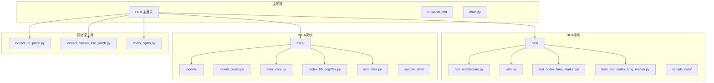

**图表来源**
- [README.md:1-57](file://README.md#L1-L57)
- [hex/hex_architecture.py:1-46](file://hex/hex_architecture.py#L1-L46)
- [mica/models/model_coattn.py:1-714](file://mica/models/model_coattn.py#L1-L714)

**章节来源**
- [README.md:1-57](file://README.md#L1-L57)
- [main.py:1-7](file://main.py#L1-L7)

## 核心组件

### HEX主干架构

HEX的核心是基于MUSK（Multimodal Universal Scale Kit）的视觉编码器，专门用于处理多模态生物医学图像。

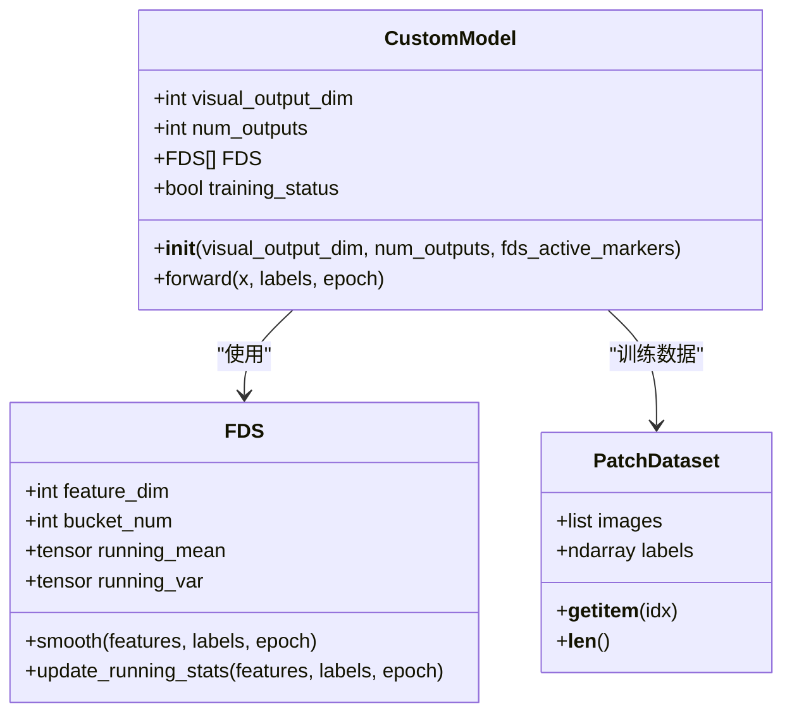

**图表来源**
- [hex/hex_architecture.py:15-46](file://hex/hex_architecture.py#L15-L46)
- [hex/utils.py:116-342](file://hex/utils.py#L116-L342)

### MICA多模态注意力模型

MICA模块实现了多模态注意力机制，用于整合H&E图像和虚拟CODEX图像特征。

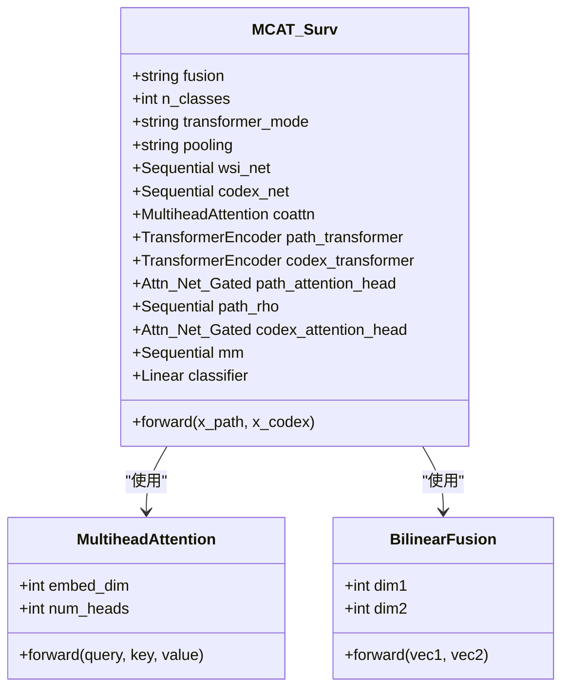

**图表来源**
- [mica/models/model_coattn.py:12-124](file://mica/models/model_coattn.py#L12-L124)
- [mica/models/model_coattn.py:459-615](file://mica/models/model_coattn.py#L459-L615)

**章节来源**
- [hex/hex_architecture.py:15-46](file://hex/hex_architecture.py#L15-L46)
- [hex/utils.py:32-81](file://hex/utils.py#L32-L81)
- [mica/models/model_coattn.py:12-124](file://mica/models/model_coattn.py#L12-L124)

## 架构概览

整个系统采用分层架构设计，从数据预处理到最终的多模态分析：

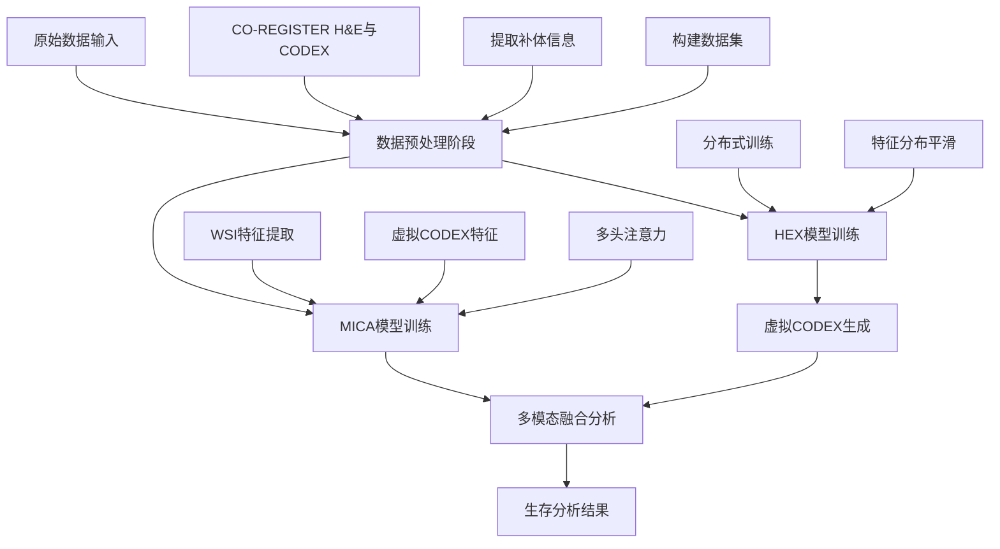

**图表来源**
- [README.md:26-44](file://README.md#L26-L44)
- [hex/train_dist_codex_lung_marker.py:42-400](file://hex/train_dist_codex_lung_marker.py#L42-L400)
- [mica/train_mica.py:28-238](file://mica/train_mica.py#L28-L238)

## 详细组件分析

### 数据预处理流程

数据预处理是整个管道的关键步骤，确保输入数据的质量和一致性。

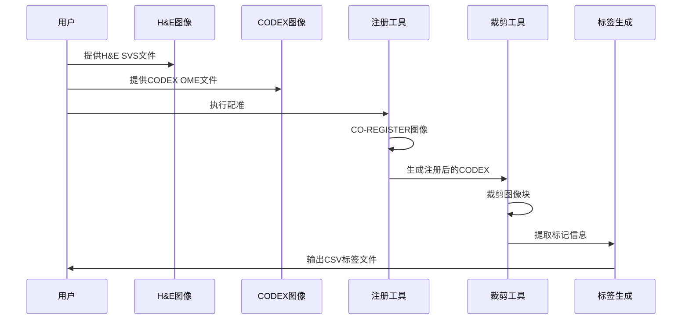

**图表来源**
- [extract_he_patch.py:9-78](file://extract_he_patch.py#L9-L78)
- [extract_marker_info_patch.py:21-74](file://extract_marker_info_patch.py#L21-L74)

#### 分割检查机制

系统内置了完整的分割检查机制，确保训练和验证集的正确性。

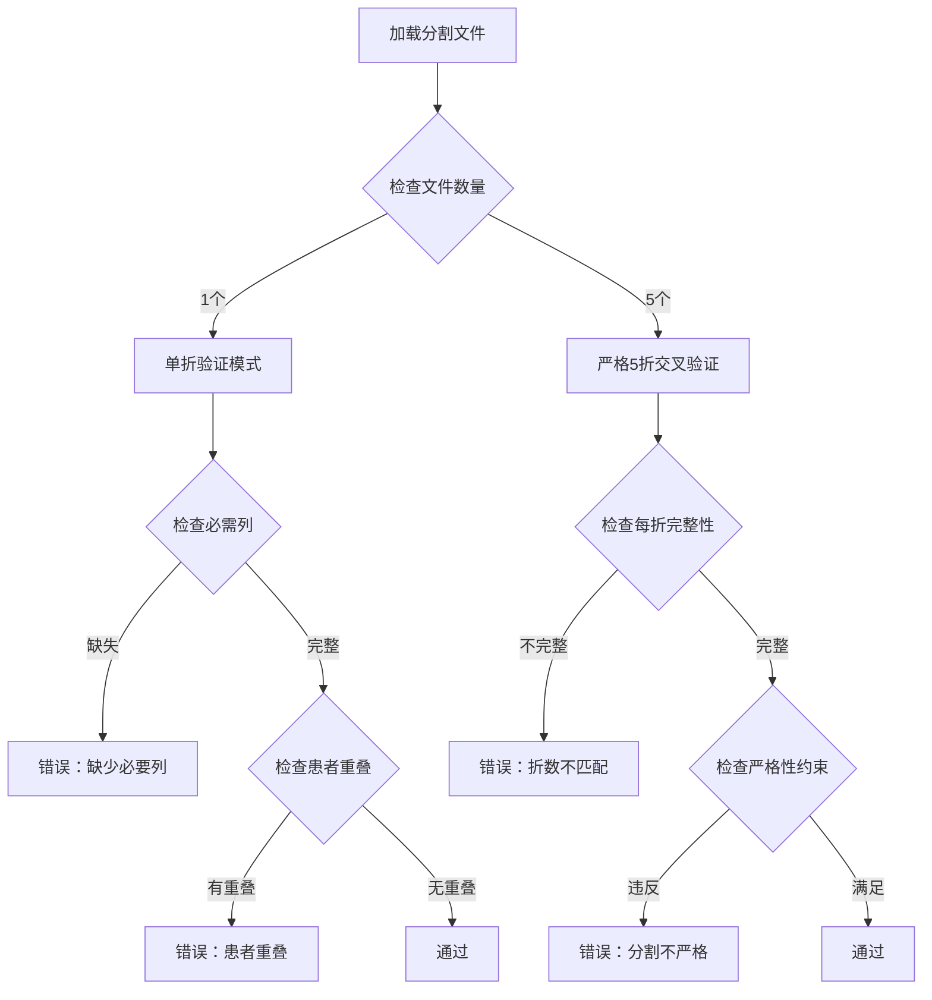

**图表来源**
- [check_splits.py:72-104](file://check_splits.py#L72-L104)
- [check_splits.py:107-148](file://check_splits.py#L107-L148)

**章节来源**
- [extract_he_patch.py:9-78](file://extract_he_patch.py#L9-L78)
- [extract_marker_info_patch.py:21-74](file://extract_marker_info_patch.py#L21-L74)
- [check_splits.py:72-148](file://check_splits.py#L72-L148)

### HEX训练流程

HEX模型采用分布式训练策略，支持大规模数据集的高效训练。

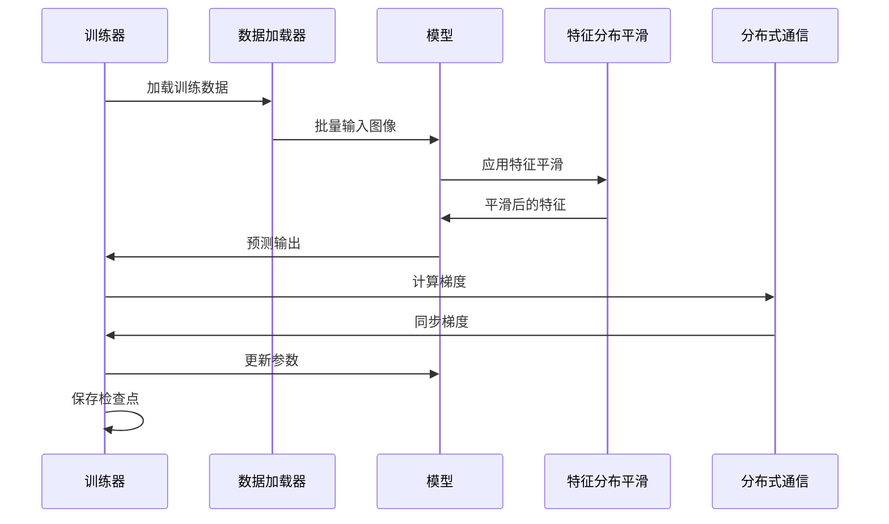

**图表来源**
- [hex/train_dist_codex_lung_marker.py:245-396](file://hex/train_dist_codex_lung_marker.py#L245-L396)

#### 特征分布平滑机制

HEX引入了特征分布平滑（FDS）技术，有效改善了小样本情况下的模型性能。

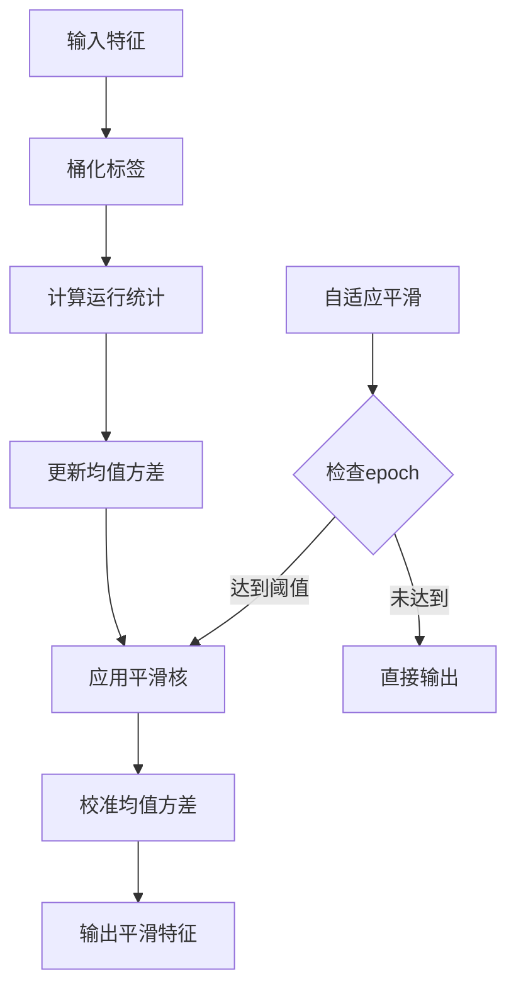

**图表来源**
- [hex/utils.py:116-326](file://hex/utils.py#L116-L326)

**章节来源**
- [hex/train_dist_codex_lung_marker.py:42-396](file://hex/train_dist_codex_lung_marker.py#L42-L396)
- [hex/utils.py:116-326](file://hex/utils.py#L116-L326)

### MICA测试流程

MICA的测试流程包含了生存分析和可解释性分析两个重要方面。

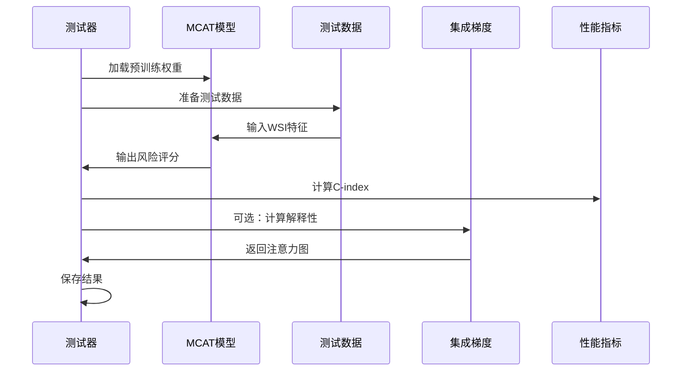

**图表来源**
- [mica/test_mica.py:32-77](file://mica/test_mica.py#L32-L77)

#### 多模态融合策略

MICA实现了多种多模态融合策略，支持不同的注意力机制和池化方式。

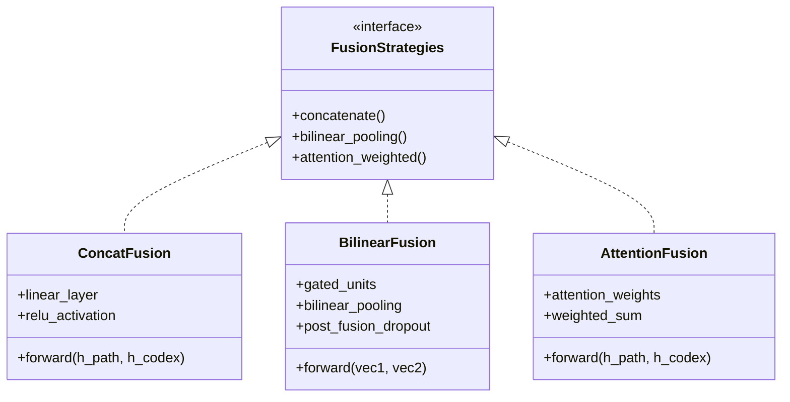

**图表来源**
- [mica/models/model_coattn.py:616-680](file://mica/models/model_coattn.py#L616-L680)

**章节来源**
- [mica/test_mica.py:32-77](file://mica/test_mica.py#L32-L77)
- [mica/models/model_coattn.py:616-680](file://mica/models/model_coattn.py#L616-L680)

## 依赖关系分析

项目依赖关系复杂但结构清晰，主要依赖于多个开源框架和库。

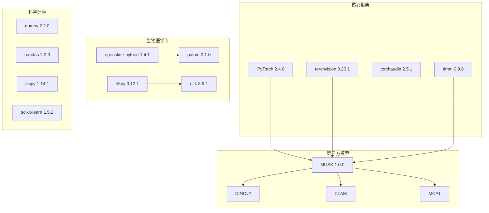

**图表来源**
- [README.md:7-24](file://README.md#L7-L24)

**章节来源**
- [README.md:7-24](file://README.md#L7-L24)

## 性能考虑

### 训练优化策略

HEX采用了多种训练优化技术来提升模型性能：

1. **分布式训练**：支持多GPU并行训练，显著提升训练效率
2. **混合精度训练**：使用FP16半精度减少内存占用
3. **渐进式解冻**：从冻结所有参数到逐步解冻网络层
4. **自适应损失函数**：使用鲁棒损失函数提高模型稳定性

### 推理加速技术

在推理阶段，项目实现了多项优化措施：

1. **特征缓存**：利用FDS机制缓存历史统计信息
2. **批量处理**：优化数据加载和批处理策略
3. **内存管理**：合理管理GPU内存使用

## 故障排除指南

### 常见问题及解决方案

#### 数据预处理问题

**问题1：配准失败**
- 检查CO-REGISTER工具是否正确安装
- 确认H&E和CODEX图像格式兼容
- 验证图像分辨率匹配

**问题2：图像裁剪异常**
- 检查OpenSlide库版本兼容性
- 确认图像路径正确性
- 验证磁放大倍数设置

#### 模型训练问题

**问题3：分布式训练报错**
- 检查NCCL环境配置
- 验证GPU可见性和驱动版本
- 确认端口可用性

**问题4：内存不足**
- 调整批次大小
- 启用梯度累积
- 检查特征维度设置

#### 模型评估问题

**问题5：C-index计算异常**
- 检查生存时间数据格式
- 验证事件状态编码
- 确认风险评分范围

**章节来源**
- [check_splits.py:151-159](file://check_splits.py#L151-L159)
- [hex/train_dist_codex_lung_marker.py:28-39](file://hex/train_dist_codex_lung_marker.py#L28-L39)

## 结论

HEX项目代表了数字病理学和人工智能结合的重要进展。通过将传统的H&E染色图像转换为虚拟蛋白质表达谱，该项目为癌症研究提供了新的工具和视角。

### 主要优势

1. **临床实用性**：基于标准H&E染色，无需额外的昂贵检测
2. **可解释性**：提供空间生物学信息和可视化分析
3. **多模态整合**：支持多种生物标志物的同时分析
4. **开源生态**：基于成熟的开源框架和工具链

### 技术特色

- **特征分布平滑**：有效解决小样本学习问题
- **分布式训练**：支持大规模数据集的高效训练
- **多头注意力**：实现模态间的动态交互
- **集成梯度**：提供模型决策的可解释性

该项目为精准医学和肿瘤免疫治疗研究提供了强有力的技术支撑，具有重要的临床应用价值和科研意义。