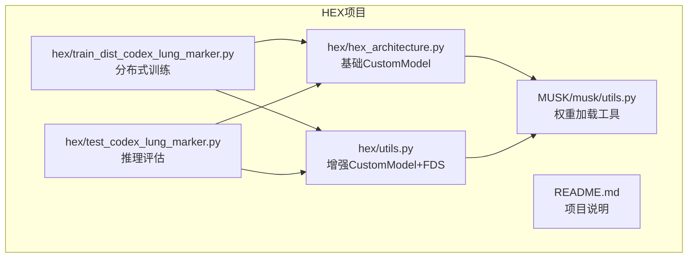
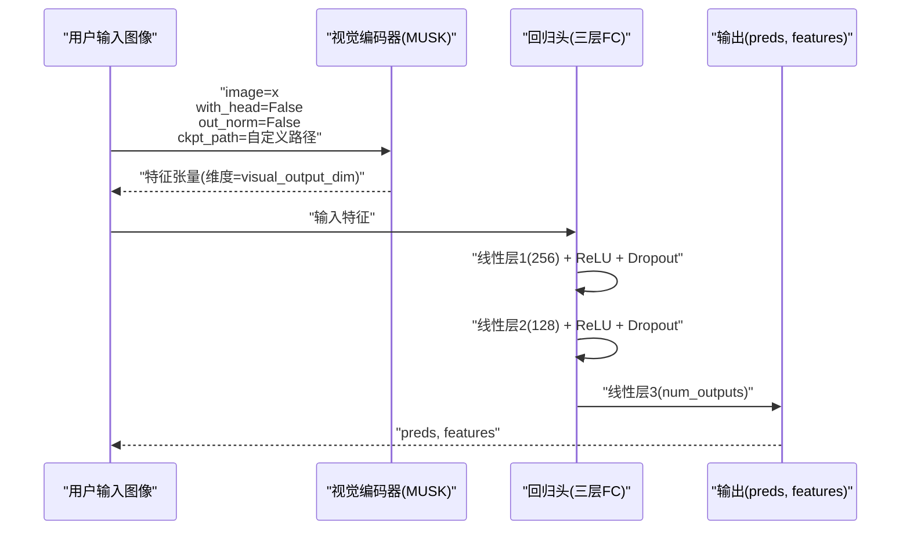
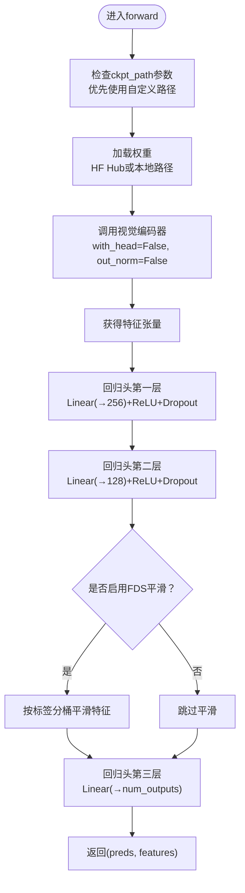
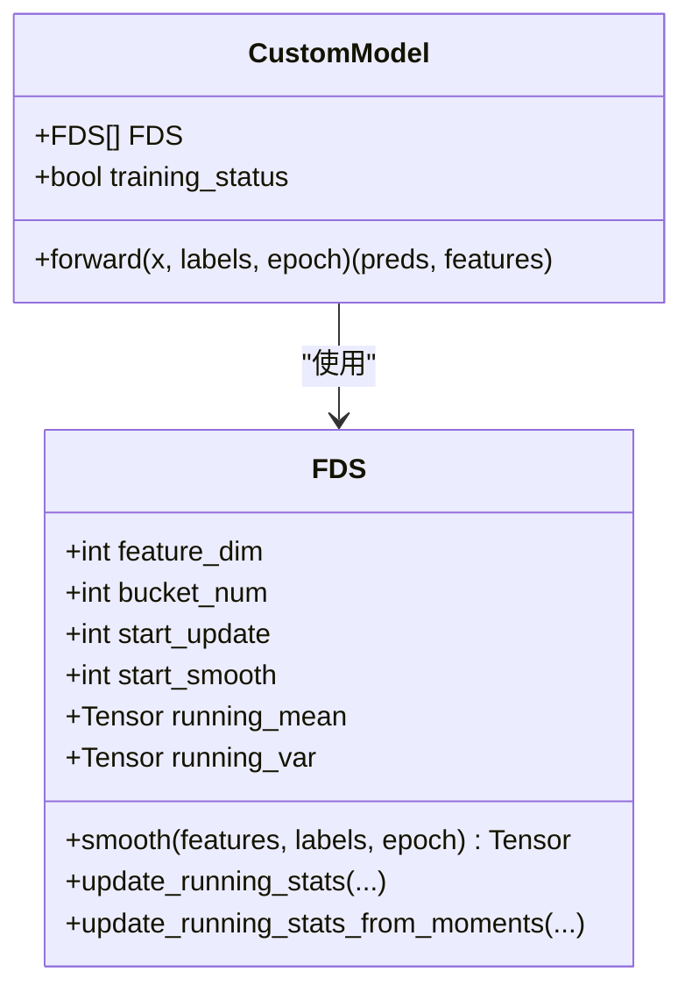
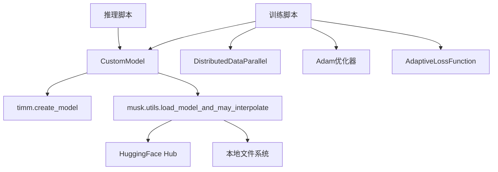

# CustomModel设计原理

<cite>
**本文档引用的文件**
- [hex_architecture.py](file://hex/hex_architecture.py)
- [utils.py](file://hex/utils.py)
- [utils.py](file://MUSK/musk/utils.py)
- [train_dist_codex_lung_marker.py](file://hex/train_dist_codex_lung_marker.py)
- [test_codex_lung_marker.py](file://hex/test_codex_lung_marker.py)
- [README.md](file://README.md)
</cite>

## 更新摘要
**变更内容**
- 更新了CustomModel类的初始化参数，新增ckpt_path参数支持自定义权重路径加载
- 新增了HuggingFace Hub和本地路径两种权重加载机制的详细说明
- 更新了权重加载流程和配置建议
- 完善了模型初始化参数的配置指南

## 目录
1. [引言](#引言)
2. [项目结构](#项目结构)
3. [核心组件](#核心组件)
4. [架构总览](#架构总览)
5. [详细组件分析](#详细组件分析)
6. [依赖关系分析](#依赖关系分析)
7. [性能考虑](#性能考虑)
8. [故障排除指南](#故障排除指南)
9. [结论](#结论)

## 引言
本技术文档围绕CustomModel展开，系统阐述其基于MUSK的视觉编码器架构设计与回归头网络实现。重点包括：
- MUSK_large_patch16_384模型的选择依据与视觉特征提取机制
- 多尺度特征融合策略（通过FDS平滑）
- 回归头网络的三层全连接结构、ReLU激活与Dropout正则化
- forward函数的完整数据流：从视觉编码器输出到最终预测值
- 模型初始化参数visual_output_dim、num_outputs与ckpt_path的含义与配置建议
- 结合训练与推理脚本中的使用方式，提供可操作的实践指导

## 项目结构
该项目采用模块化组织，核心逻辑集中在hex子目录中：
- hex/hex_architecture.py：定义CustomModel基础版本（不含FDS平滑）
- hex/utils.py：定义带FDS平滑的CustomModel增强版、数据集类与FDS平滑模块
- MUSK/musk/utils.py：提供MUSK模型权重加载工具函数
- hex/train_dist_codex_lung_marker.py：分布式训练脚本，展示模型初始化与训练流程
- hex/test_codex_lung_marker.py：推理脚本，展示模型加载与评估流程
- README.md：项目背景、依赖与使用步骤

**图表来源**
- [hex/hex_architecture.py:1-46](file://hex/hex_architecture.py#L1-L46)
- [hex/utils.py:32-81](file://hex/utils.py#L32-L81)
- [MUSK/musk/utils.py:152-238](file://MUSK/musk/utils.py#L152-L238)
- [train_dist_codex_lung_marker.py:179-180](file://hex/train_dist_codex_lung_marker.py#L179-L180)
- [test_codex_lung_marker.py:64-70](file://hex/test_codex_lung_marker.py#L64-L70)

**章节来源**
- [README.md:1-57](file://README.md#L1-L57)

## 核心组件
本节聚焦CustomModel的两大核心部分：视觉编码器与回归头网络。

- 视觉编码器（MUSK_large_patch16_384）
  - 使用timm.create_model创建MUSK大模型，输入图像尺寸为384×384
  - 通过with_head=False、out_norm=False禁用头部与归一化，仅输出特征向量
  - 支持自定义权重路径加载：ckpt_path参数优先使用，否则使用默认MUSK_CKPT_PATH
  - 输出维度由visual_output_dim参数决定，训练脚本中固定为1024

- 回归头网络
  - 三层全连接网络：visual_output_dim → 256 → 128 → num_outputs
  - 中间两层使用ReLU激活与Dropout(p=0.5)进行正则化
  - 最后一层线性层直接输出每个生物标志物的预测值

**章节来源**
- [hex/hex_architecture.py:9-36](file://hex/hex_architecture.py#L9-L36)
- [train_dist_codex_lung_marker.py:144-158](file://hex/train_dist_codex_lung_marker.py#L144-L158)
- [test_codex_lung_marker.py:110-114](file://hex/test_codex_lung_marker.py#L110-L114)

## 架构总览
下图展示了CustomModel的整体数据流：输入图像经MUSK视觉编码器提取特征，再经过三层回归头网络得到预测值与中间特征。

**图表来源**
- [hex/hex_architecture.py:28-36](file://hex/hex_architecture.py#L28-L36)
- [hex/hex_architecture.py:16-26](file://hex/hex_architecture.py#L16-L26)

## 详细组件分析

### 视觉编码器（MUSK_large_patch16_384）设计
- 模型选择依据
  - 输入分辨率：384×384，适配训练与推理脚本中的Resize变换
  - 词表大小：vocab_size=64010，用于MUSK的文本-图像对齐训练
  - 预训练权重：通过utils.load_model_and_may_interpolate从Hugging Face Hub或本地路径加载
- 权重加载机制
  - **HuggingFace Hub加载**：ckpt_path以"hf_hub:"前缀开头，自动下载到本地缓存目录
  - **本地路径加载**：直接从指定本地路径加载权重文件
  - **默认路径**：若未提供ckpt_path，则使用MUSK_CKPT_PATH常量
- 特征提取机制
  - 禁用头部与归一化，仅返回特征表示，便于下游回归任务
  - 输出维度由visual_output_dim控制，训练脚本中固定为1024
- 多尺度特征融合策略
  - 在增强版CustomModel中，通过FDS模块对特征进行分桶统计与平滑，实现跨样本的多尺度信息融合
  - 平滑过程根据标签分布将当前batch特征映射到历史均值/方差分布，提升泛化能力

**章节来源**
- [hex/hex_architecture.py:12-15](file://hex/hex_architecture.py#L12-L15)
- [MUSK/musk/utils.py:152-238](file://MUSK/musk/utils.py#L152-L238)
- [utils.py:116-158](file://hex/utils.py#L116-L158)

### 回归头网络设计
- 结构设计
  - 第一层：Linear(visual_output_dim → 256)，ReLU激活，Dropout(p=0.5)
  - 第二层：Linear(256 → 128)，ReLU激活，Dropout(p=0.5)
  - 第三层：Linear(128 → num_outputs)，无激活，直接输出预测值
- 激活函数作用
  - ReLU引入非线性，增强模型拟合能力；避免梯度消失
- 正则化策略
  - Dropout在训练阶段随机丢弃神经元，降低过拟合风险
- 输出
  - 返回preds（预测值）与features（中间特征），便于后续分析或可视化

**章节来源**
- [hex/hex_architecture.py:16-26](file://hex/hex_architecture.py#L16-L26)

### forward函数执行流程
- 基础版本（无FDS）
  - 调用视觉编码器，获取特征张量
  - 经三层回归头网络得到preds与features
- 增强版本（含FDS）
  - 在训练且满足平滑条件时，对特征进行分桶平滑，再进行线性预测
  - 支持对特定生物标志物集合启用平滑，以提升小样本或长尾分布的稳定性

**图表来源**
- [hex/hex_architecture.py:28-36](file://hex/hex_architecture.py#L28-L36)
- [utils.py:55-80](file://hex/utils.py#L55-L80)

**章节来源**
- [hex/hex_architecture.py:28-36](file://hex/hex_architecture.py#L28-L36)
- [utils.py:55-80](file://hex/utils.py#L55-L80)

### 初始化参数说明与配置建议
- visual_output_dim
  - 含义：视觉编码器输出特征的维度
  - 默认值：1024（训练脚本中固定）
  - 配置建议：
    - 若更换MUSK变体或自定义backbone，需同步调整该参数
    - 确保与视觉编码器实际输出维度一致，否则会引发形状不匹配错误
- num_outputs
  - 含义：回归任务的输出通道数，即生物标志物数量
  - 默认值：40（训练脚本中由label_columns长度推导）
  - 配置建议：
    - 训练时与标签列数量一致
    - 推理时与训练时保持一致，确保模型权重加载成功
- ckpt_path（新增）
  - 含义：自定义MUSK模型权重路径
  - 支持格式：
    - HF Hub路径：`"hf_hub:用户名/仓库名"`
    - 本地路径：`"/path/to/weights.safetensors"`
  - 默认值：`None`（使用MUSK_CKPT_PATH常量）
  - 配置建议：
    - 首次使用建议留空，自动从HF Hub下载
    - 网络受限环境可预先下载到本地路径
    - 确保权重文件格式为safetensors

**章节来源**
- [train_dist_codex_lung_marker.py:172-179](file://hex/train_dist_codex_lung_marker.py#L172-L179)
- [test_codex_lung_marker.py:64-64](file://hex/test_codex_lung_marker.py#L64-L64)
- [hex/hex_architecture.py:15-23](file://hex/hex_architecture.py#L15-L23)

### FDS平滑模块（增强版CustomModel）
- 功能概述
  - 基于标签分布对特征进行分桶统计，记录每桶的均值与方差
  - 对当前batch特征进行"校准"，使其更接近历史分布，提升鲁棒性
- 关键参数
  - feature_dim：特征维度（默认128，对应回归头第二层输出）
  - bucket_num：分桶数量（默认50）
  - start_update/start_smooth：更新与开始平滑的epoch阈值
  - kernel/ks/sigma：平滑核参数（高斯核）
- 使用场景
  - 小样本、长尾分布或标签噪声较多的任务
  - 可针对特定生物标志物启用平滑，以减少极端值影响

**图表来源**
- [utils.py:116-158](file://hex/utils.py#L116-L158)
- [utils.py:32-53](file://hex/utils.py#L32-L53)

**章节来源**
- [utils.py:116-326](file://hex/utils.py#L116-L326)
- [utils.py:32-80](file://hex/utils.py#L32-L80)

## 依赖关系分析
- 模块耦合
  - CustomModel依赖timm创建MUSK模型与预训练权重加载
  - 训练脚本通过DDP并行训练，冻结部分视觉编码器参数，仅训练回归头
  - 推理脚本加载已训练权重，进行批量预测与指标计算
- 外部依赖
  - MUSK、timm、transformers等第三方库
  - 数据预处理遵循ImageNet Inception风格的均值与标准差
- 权重加载依赖
  - MUSK/musk/utils.py提供load_model_and_may_interpolate函数
  - 支持HuggingFace Hub下载和本地文件加载
  - 自动处理位置嵌入插值和权重形状兼容性

**图表来源**
- [hex/hex_architecture.py:5-15](file://hex/hex_architecture.py#L5-L15)
- [MUSK/musk/utils.py:152-238](file://MUSK/musk/utils.py#L152-L238)
- [train_dist_codex_lung_marker.py:190-226](file://hex/train_dist_codex_lung_marker.py#L190-L226)
- [test_codex_lung_marker.py:62-73](file://hex/test_codex_lung_marker.py#L62-L73)

**章节来源**
- [hex/hex_architecture.py:5-15](file://hex/hex_architecture.py#L5-L15)
- [MUSK/musk/utils.py:152-238](file://MUSK/musk/utils.py#L152-L238)
- [train_dist_codex_lung_marker.py:190-226](file://hex/train_dist_codex_lung_marker.py#L190-L226)
- [test_codex_lung_marker.py:62-73](file://hex/test_codex_lung_marker.py#L62-L73)

## 性能考虑
- 计算效率
  - 图像尺寸384×384，batch size在训练脚本中为48，推理脚本中为128，兼顾显存与吞吐
  - AMP混合精度训练（autocast）与GradScaler提升吞吐
- 内存管理
  - 推理阶段使用torch.no_grad与autocast减少显存占用
  - 分布式训练中使用DistributedSampler与DDP同步梯度
- 正则化与泛化
  - Dropout与FDS平滑共同降低过拟合风险，尤其适用于多生物标志物回归任务
- 权重加载性能
  - HF Hub首次下载可能较慢，建议使用本地缓存或预先下载
  - 本地路径加载速度更快，适合大规模部署

## 故障排除指南
- 形状不匹配
  - 症状：RuntimeError提示维度不一致
  - 排查：确认visual_output_dim与视觉编码器输出维度一致；num_outputs与标签列数量一致
- 权重加载失败
  - 症状：missing_keys/unexpected_keys警告
  - 排查：检查checkpoint路径与模型结构一致性；必要时使用strict=False
  - **新增**：检查ckpt_path格式是否正确（HF Hub路径需以"hf_hub:"开头）
- 分布式训练异常
  - 症状：进程间同步错误或梯度不同步
  - 排查：确认NCCL初始化、设备分配与world_size设置正确；检查DDP参数与分布式采样器
- 权重下载问题
  - 症状：HF Hub下载超时或认证失败
  - 排查：检查网络连接；确保HuggingFace Hub凭据正确；考虑使用本地路径替代

**章节来源**
- [test_codex_lung_marker.py:62-73](file://hex/test_codex_lung_marker.py#L62-L73)
- [train_dist_codex_lung_marker.py:28-39](file://hex/train_dist_codex_lung_marker.py#L28-L39)
- [MUSK/musk/utils.py:152-238](file://MUSK/musk/utils.py#L152-L238)

## 结论
CustomModel以MUSK_large_patch16_384为核心视觉编码器，结合三层回归头网络实现多生物标志物表达的高效预测。通过FDS平滑模块进一步提升在小样本与长尾分布下的稳定性。**新增的ckpt_path参数**使得模型能够灵活地从HuggingFace Hub或本地路径加载预训练权重，增强了部署的灵活性和可靠性。训练脚本展示了分布式训练与权重冻结策略，推理脚本提供了端到端的评估流程。合理配置visual_output_dim、num_outputs与ckpt_path，并遵循预处理规范，可确保模型在HEX任务中的稳定运行与良好性能。