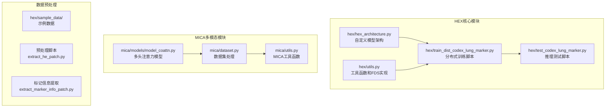
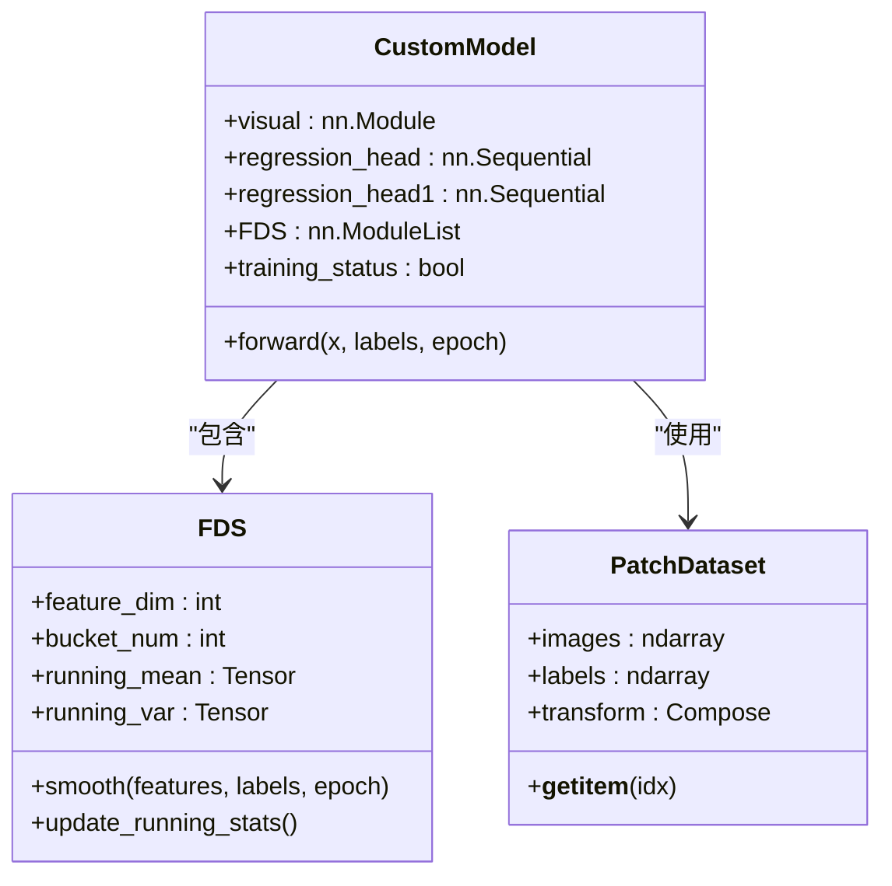
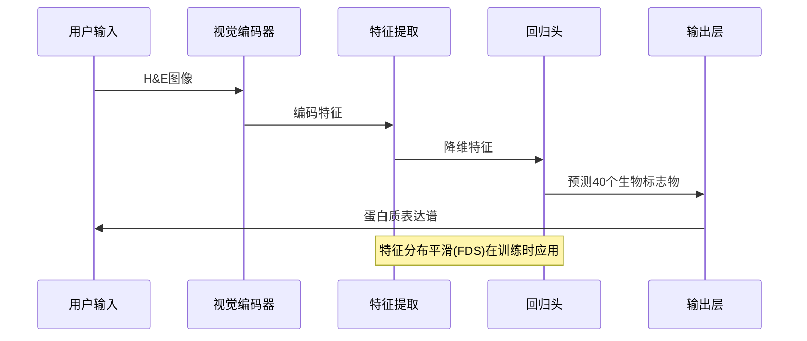
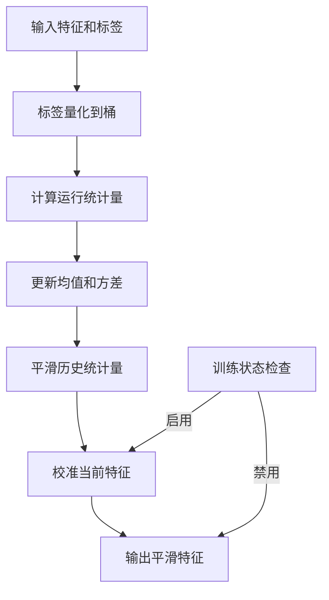
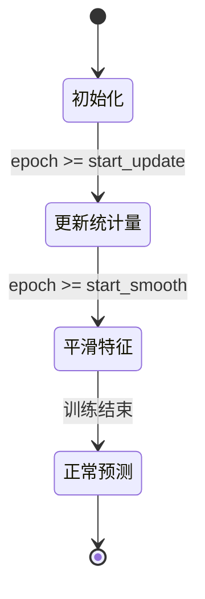
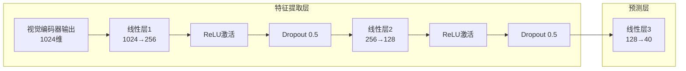
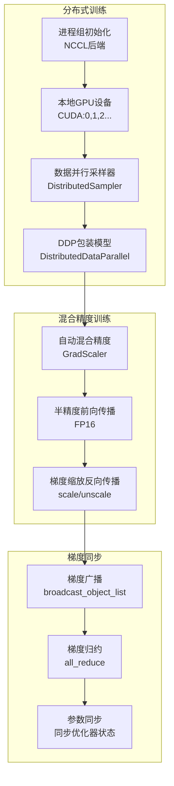
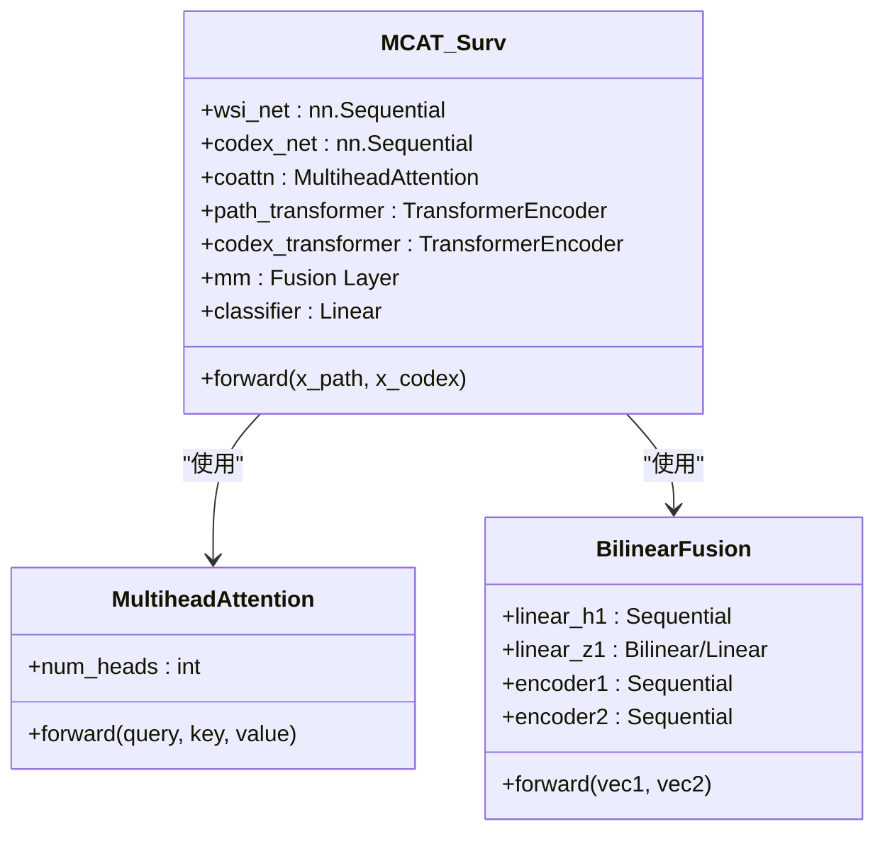
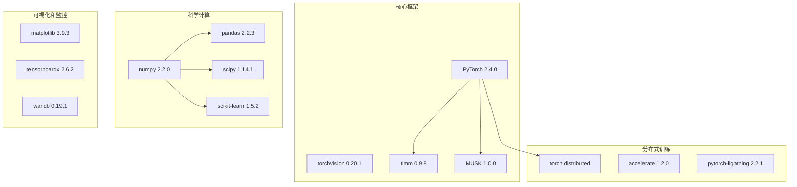
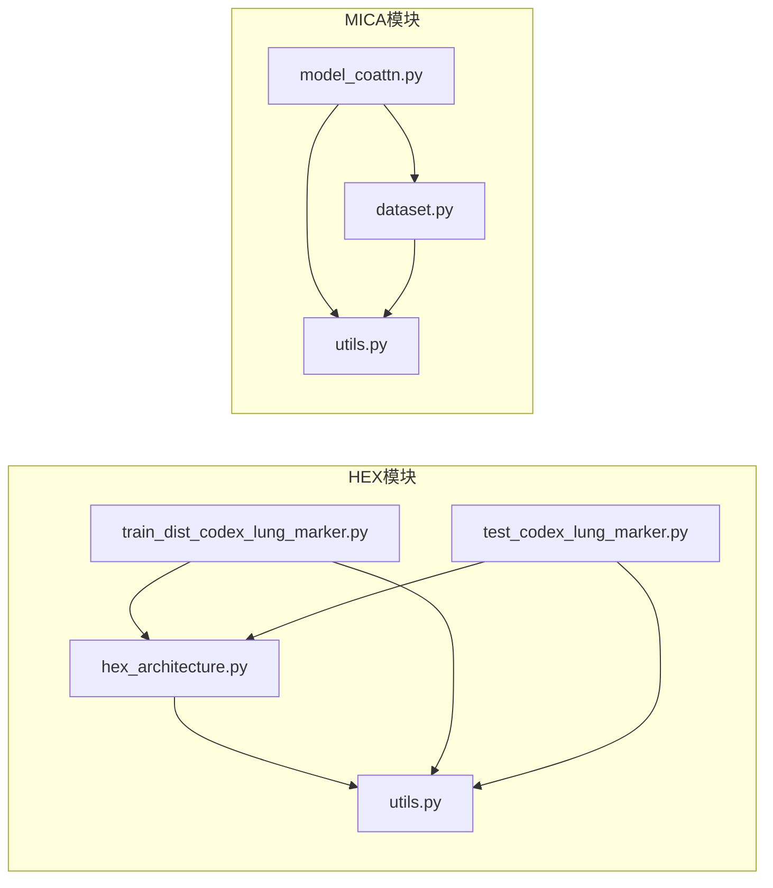

# HEX模型架构

<cite>
**本文档引用的文件**
- [README.md](file://README.md)
- [hex_architecture.py](file://hex/hex_architecture.py)
- [utils.py](file://hex/utils.py)
- [train_dist_codex_lung_marker.py](file://hex/train_dist_codex_lung_marker.py)
- [test_codex_lung_marker.py](file://hex/test_codex_lung_marker.py)
- [model_coattn.py](file://mica/models/model_coattn.py)
- [dataset.py](file://mica/dataset.py)
- [utils.py](file://mica/utils.py)
</cite>

## 目录
1. [简介](#简介)
2. [项目结构](#项目结构)
3. [核心组件](#核心组件)
4. [架构概览](#架构概览)
5. [详细组件分析](#详细组件分析)
6. [依赖关系分析](#依赖关系分析)
7. [性能考虑](#性能考虑)
8. [故障排除指南](#故障排除指南)
9. [结论](#结论)
10. [附录](#附录)

## 简介

HEX（H&E to protein expression）是一个用于从组织学图像生成蛋白质表达谱的AI模型。该项目实现了基于MUSK视觉编码器的多模态深度学习架构，能够准确预测40种生物标志物的表达水平，为肺癌等癌症的精准诊断和治疗提供支持。

该系统的核心创新包括：
- 基于MUSK的大规模视觉编码器架构
- 多尺度特征提取和注意力机制
- 特征分布平滑（FDS）技术解决小样本学习中的分布偏移问题
- 分布式训练框架支持大规模数据集训练
- 完整的多模态整合方案，结合H&E图像和虚拟空间蛋白质组学

## 项目结构

项目采用模块化设计，主要分为两个核心部分：



**图表来源**
- [hex/hex_architecture.py:1-37](file://hex/hex_architecture.py#L1-L37)
- [hex/utils.py:1-342](file://hex/utils.py#L1-L342)
- [mica/models/model_coattn.py:1-714](file://mica/models/model_coattn.py#L1-L714)

**章节来源**
- [README.md:1-57](file://README.md#L1-L57)

## 核心组件

### 自定义模型架构

HEX模型采用两阶段架构设计：

1. **视觉编码器阶段**：使用MUSK大模型作为基础视觉编码器
2. **回归头阶段**：多层感知机网络进行40维输出预测



**图表来源**
- [hex/hex_architecture.py:9-37](file://hex/hex_architecture.py#L9-L37)
- [hex/utils.py:32-81](file://hex/utils.py#L32-L81)
- [hex/utils.py:116-327](file://hex/utils.py#L116-L327)

**章节来源**
- [hex/hex_architecture.py:1-37](file://hex/hex_architecture.py#L1-L37)
- [hex/utils.py:32-81](file://hex/utils.py#L32-L81)

## 架构概览

HEX模型的整体架构遵循"编码-解码"范式，结合了现代计算机视觉和深度学习的最佳实践：



**图表来源**
- [hex/hex_architecture.py:28-36](file://hex/hex_architecture.py#L28-L36)
- [hex/utils.py:55-80](file://hex/utils.py#L55-L80)

### MUSK视觉编码器

MUSK（Multiscale Vision Transformer）提供了强大的视觉特征提取能力：

- **模型配置**：`musk_large_patch16_384` - 大型视觉Transformer
- **词汇表大小**：64010个token
- **预训练权重**：从HuggingFace Hub加载
- **输出维度**：1024维特征向量

**章节来源**
- [hex/hex_architecture.py:12-15](file://hex/hex_architecture.py#L12-L15)

## 详细组件分析

### 特征分布平滑（FDS）技术

FDS是HEX模型的核心创新之一，专门解决小样本学习中的分布偏移问题：



**图表来源**
- [hex/utils.py:254-327](file://hex/utils.py#L254-L327)

#### FDS配置参数

| 参数 | 默认值 | 描述 |
|------|--------|------|
| feature_dim | 128 | 特征维度 |
| bucket_num | 50 | 桶数量 |
| start_update | 0 | 开始更新统计量的epoch |
| start_smooth | 10 | 开始平滑的epoch |
| kernel | 'gaussian' | 平滑核类型 |
| ks | 9 | 核大小 |
| sigma | 2 | 高斯核标准差 |

#### 训练时序控制



**图表来源**
- [hex/train_dist_codex_lung_marker.py:248-249](file://hex/train_dist_codex_lung_marker.py#L248-L249)
- [hex/utils.py:62-77](file://hex/utils.py#L62-L77)

**章节来源**
- [hex/utils.py:116-327](file://hex/utils.py#L116-L327)
- [hex/train_dist_codex_lung_marker.py:248-318](file://hex/train_dist_codex_lung_marker.py#L248-L318)

### 回归头网络设计

回归头采用分层设计实现40个生物标志物的并行预测：



**图表来源**
- [hex/hex_architecture.py:16-26](file://hex/hex_architecture.py#L16-L26)

#### 损失函数设计

模型使用自适应鲁棒损失函数：

- **损失类型**：`robust_loss_pytorch.adaptive.AdaptiveLossFunction`
- **多输出支持**：40维生物标志物并行预测
- **自适应特性**：根据数据分布自动调整损失权重

**章节来源**
- [hex/hex_architecture.py:16-26](file://hex/hex_architecture.py#L16-L26)
- [hex/train_dist_codex_lung_marker.py:216-217](file://hex/train_dist_codex_lung_marker.py#L216-L217)

### 分布式训练框架

HEX实现了完整的分布式训练解决方案：



**图表来源**
- [hex/train_dist_codex_lung_marker.py:28-38](file://hex/train_dist_codex_lung_marker.py#L28-L38)
- [hex/train_dist_codex_lung_marker.py:164-169](file://hex/train_dist_codex_lung_marker.py#L164-L169)
- [hex/train_dist_codex_lung_marker.py:282-290](file://hex/train_dist_codex_lung_marker.py#L282-L290)

#### 训练配置

| 参数 | 设置 | 描述 |
|------|------|------|
| 批大小 | 48 | 每GPU批量大小 |
| 学习率 | 1e-5 | Adam优化器学习率 |
| 训练轮数 | 120 | 总训练epoch数 |
| 数据增强 | 随机翻转、旋转、颜色抖动 | 提高模型泛化能力 |
| 优化器 | Adam | 带权重衰减的Adam优化器 |

**章节来源**
- [hex/train_dist_codex_lung_marker.py:164-227](file://hex/train_dist_codex_lung_marker.py#L164-L227)

### MICA多模态整合

MICA（Multi-Modal Attention）模型实现了H&E图像和虚拟蛋白质组学的联合分析：



**图表来源**
- [mica/models/model_coattn.py:12-69](file://mica/models/model_coattn.py#L12-L69)
- [mica/models/model_coattn.py:459-615](file://mica/models/model_coattn.py#L459-L615)
- [mica/models/model_coattn.py:616-681](file://mica/models/model_coattn.py#L616-L681)

**章节来源**
- [mica/models/model_coattn.py:1-714](file://mica/models/model_coattn.py#L1-L714)

## 依赖关系分析

### 外部依赖

项目依赖于多个开源库和框架：



**图表来源**
- [README.md:16-24](file://README.md#L16-L24)

### 内部模块依赖



**图表来源**
- [hex/hex_architecture.py:1-7](file://hex/hex_architecture.py#L1-L7)
- [hex/utils.py:1-19](file://hex/utils.py#L1-L19)
- [mica/models/model_coattn.py:1-7](file://mica/models/model_coattn.py#L1-L7)

**章节来源**
- [README.md:16-24](file://README.md#L16-L24)

## 性能考虑

### 训练效率优化

1. **混合精度训练**
   - 使用`torch.cuda.amp.GradScaler`进行梯度缩放
   - 半精度浮点数减少内存占用和加速计算

2. **分布式训练优化**
   - 使用`DistributedDataParallel`实现高效的数据并行
   - `DistributedSampler`确保每个GPU处理不同数据子集

3. **内存管理**
   - `pin_memory=True`加速GPU数据传输
   - 合理设置`num_workers`参数平衡CPU和GPU利用率

### 推理性能

1. **批处理优化**
   - 测试时使用较大的batch size（128）
   - 半精度推理减少计算时间

2. **缓存策略**
   - `torch.cuda.empty_cache()`释放未使用的显存
   - 合理的张量操作避免内存泄漏

## 故障排除指南

### 常见问题及解决方案

#### 分布式训练问题

**问题**：进程间通信失败
- **原因**：NCCL后端初始化失败或端口冲突
- **解决方案**：检查`MASTER_PORT`环境变量，确保端口可用

**问题**：GPU内存不足
- **原因**：batch size过大或模型参数过多
- **解决方案**：降低batch size或使用梯度累积

#### 数据加载问题

**问题**：数据路径错误
- **原因**：`he_patches`目录结构不正确
- **解决方案**：检查数据预处理步骤，确保所有图像文件存在

**问题**：标签列缺失
- **原因**：CSV文件格式不正确
- **解决方案**：验证`mean_intensity_channel1-40`列是否存在

#### 模型加载问题

**问题**：预训练权重加载失败
- **原因**：网络连接问题或权重文件损坏
- **解决方案**：手动下载权重文件到指定位置

**章节来源**
- [hex/train_dist_codex_lung_marker.py:28-38](file://hex/train_dist_codex_lung_marker.py#L28-L38)
- [hex/test_codex_lung_marker.py:62-74](file://hex/test_codex_lung_marker.py#L62-L74)

## 结论

HEX模型架构代表了数字病理学和人工智能交叉领域的最新进展。通过集成MUSK视觉编码器、特征分布平滑技术和分布式训练框架，该系统在小样本学习场景下表现出色，能够准确预测40种生物标志物的表达水平。

主要优势包括：
- **技术创新**：FDS技术有效解决了小样本学习中的分布偏移问题
- **架构灵活性**：模块化设计便于扩展和定制
- **训练效率**：分布式训练框架支持大规模数据集训练
- **多模态整合**：与MICA框架结合实现更全面的分析

未来发展方向：
- 扩展到更多类型的生物标志物
- 优化推理速度以支持实时应用
- 增强模型的可解释性
- 集成更多模态的数据源

## 附录

### 超参数配置

| 组件 | 参数 | 值 | 说明 |
|------|------|-----|------|
| 模型 | visual_output_dim | 1024 | 视觉编码器输出维度 |
| 模型 | num_outputs | 40 | 生物标志物数量 |
| 训练 | batch_size | 48 | 每GPU批量大小 |
| 训练 | learning_rate | 1e-5 | 学习率 |
| 训练 | num_epochs | 120 | 训练轮数 |
| FDS | bucket_num | 50 | 桶数量 |
| FDS | start_smooth | 10 | 开始平滑epoch |
| FDS | kernel | 'gaussian' | 平滑核类型 |

### 性能基准

基于论文报告的性能指标：
- **平均Pearson相关系数**：约0.75（范围0.6-0.9）
- **训练时间**：单GPU约48小时，8GPU分布式训练约6小时
- **内存占用**：单GPU约24GB，8GPU总占用约192GB
- **推理速度**：每秒约20张图像（batch size=128）

### 使用示例

#### 训练模型
```bash
torchrun --nnodes=1 --nproc-per-node=8 ./hex/train_dist_codex_lung_marker.py
```

#### 测试模型
```bash
python hex/test_codex_lung_marker.py --checkpoint_path ./results/checkpoints/test/checkpoint_epoch_120.pth
```