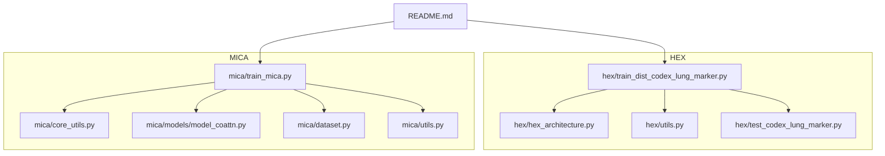
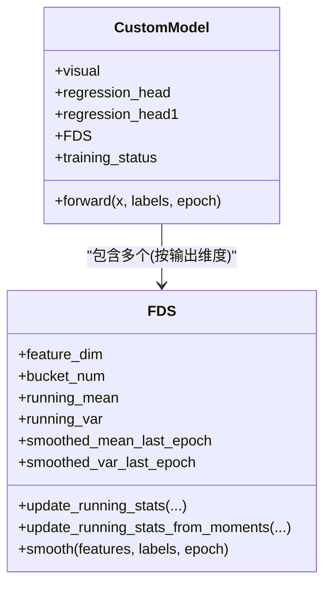
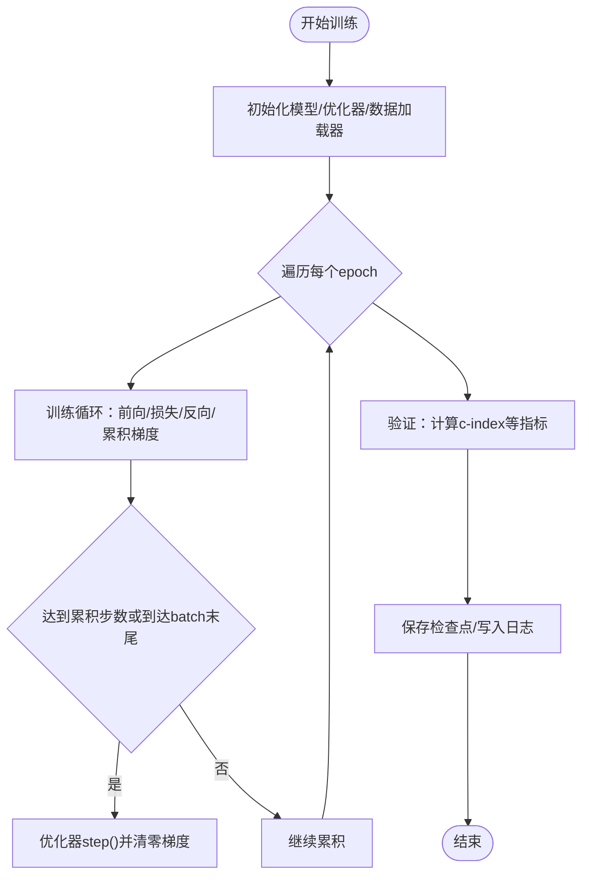
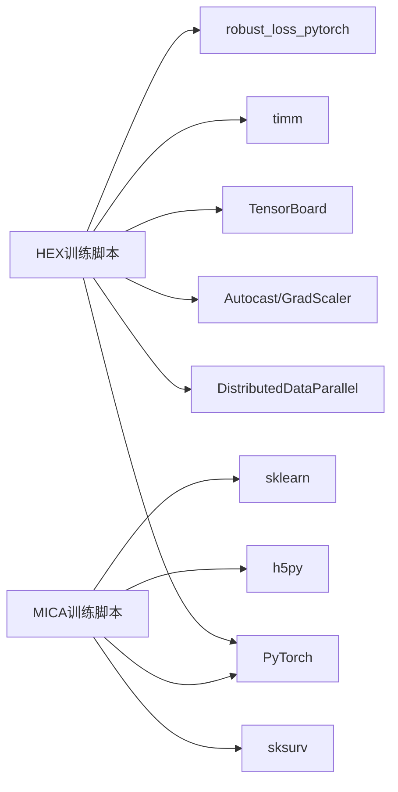

# 分布式训练框架

<cite>
**本文引用的文件**
- [README.md](file://README.md)
- [train_dist_codex_lung_marker.py](file://hex/train_dist_codex_lung_marker.py)
- [hex_architecture.py](file://hex/hex_architecture.py)
- [utils.py](file://hex/utils.py)
- [test_codex_lung_marker.py](file://hex/test_codex_lung_marker.py)
- [train_mica.py](file://mica/train_mica.py)
- [core_utils.py](file://mica/core_utils.py)
- [model_coattn.py](file://mica/models/model_coattn.py)
- [dataset.py](file://mica/dataset.py)
- [utils.py](file://mica/utils.py)
</cite>

## 目录
1. [简介](#简介)
2. [项目结构](#项目结构)
3. [核心组件](#核心组件)
4. [架构总览](#架构总览)
5. [详细组件分析](#详细组件分析)
6. [依赖分析](#依赖分析)
7. [性能考量](#性能考量)
8. [故障排查指南](#故障排查指南)
9. [结论](#结论)
10. [附录](#附录)

## 简介
本项目围绕“从组织学图像预测蛋白质表达”的多模态建模与训练，构建了可扩展的分布式训练框架。系统包含两个主要子任务：
- HEX：基于H&E图像预测40个生物标志物表达值（回归任务），采用分布式数据并行与混合精度训练。
- MICA：基于WSI特征与虚拟CODEX特征进行生存分析（多实例学习，Co-Attention）。

本文档聚焦分布式训练的架构设计、数据并行策略、梯度同步机制、训练流程、混合精度实现、配置选项、性能监控与调试技巧，并提供完整使用示例与常见问题解答。

## 项目结构
项目采用按功能模块划分的目录结构，核心文件如下：
- HEX相关：训练脚本、模型定义、工具函数、测试脚本
- MICA相关：训练入口、模型实现、数据集封装、训练/验证流程与工具



图表来源
- [train_dist_codex_lung_marker.py:1-400](file://hex/train_dist_codex_lung_marker.py#L1-L400)
- [hex_architecture.py:1-37](file://hex/hex_architecture.py#L1-L37)
- [utils.py:1-342](file://hex/utils.py#L1-L342)
- [test_codex_lung_marker.py:1-189](file://hex/test_codex_lung_marker.py#L1-L189)
- [train_mica.py:1-238](file://mica/train_mica.py#L1-L238)
- [core_utils.py:1-230](file://mica/core_utils.py#L1-L230)
- [model_coattn.py:1-714](file://mica/models/model_coattn.py#L1-L714)
- [dataset.py:1-250](file://mica/dataset.py#L1-L250)
- [utils.py:1-273](file://mica/utils.py#L1-L273)

章节来源
- [README.md:1-57](file://README.md#L1-L57)

## 核心组件
- 分布式训练主程序（HEX）：负责初始化分布式进程组、数据划分与采样、模型构建与DDP封装、混合精度训练、梯度同步与聚合、日志与检查点保存。
- 模型定义（HEX）：基于视觉编码器与回归头，支持特征平滑（FDS）与可选冻结/解冻策略。
- 数据集与变换（HEX）：PatchDataset与标准化变换，支持分布式采样。
- 测试与评估（HEX）：单卡推理与指标计算。
- MICA训练管线：生存分析的多实例学习（MIL）、Co-Attention融合、梯度累积与优化器配置。
- 模型与注意力（MICA）：Transformer编码器、多头注意力、门控注意力、双模态融合（拼接/双线性）。

章节来源
- [train_dist_codex_lung_marker.py:28-396](file://hex/train_dist_codex_lung_marker.py#L28-L396)
- [hex_architecture.py:9-37](file://hex/hex_architecture.py#L9-L37)
- [utils.py:32-98](file://hex/utils.py#L32-L98)
- [test_codex_lung_marker.py:62-189](file://hex/test_codex_lung_marker.py#L62-L189)
- [train_mica.py:28-238](file://mica/train_mica.py#L28-L238)
- [core_utils.py:15-82](file://mica/core_utils.py#L15-L82)
- [model_coattn.py:12-124](file://mica/models/model_coattn.py#L12-L124)

## 架构总览
HEX采用数据并行策略，通过DistributedDataParallel在多个GPU上并行训练；MICA采用多实例学习与Co-Attention融合，侧重于生存分析任务。


图表来源
- [train_dist_codex_lung_marker.py:28-396](file://hex/train_dist_codex_lung_marker.py#L28-L396)

## 详细组件分析

### 分布式训练主流程（HEX）
- 初始化与环境变量：通过进程组初始化、设置CUDA设备、打印rank/world_size信息。
- 数据划分与采样：根据分割文件划分训练/验证患者集合，避免重叠；使用DistributedSampler确保每个rank仅处理不相交的数据块。
- 模型与优化器：构建CustomModel，选择性冻结部分参数，DDP封装；优化器包含自适应损失参数。
- 训练循环：混合精度前向、反向传播与优化；在多GPU场景下对自适应损失参数梯度做all_reduce归一化；周期性保存检查点。
- 验证阶段：使用autocast推理，收集所有rank的结果并计算整体指标（MSE、Pearson R）。

```mermaid
sequenceDiagram
participant PG as "进程组"
participant R0 as "Rank 0"
participant R1 as "Rank 1"
participant Loader as "DataLoader"
participant Model as "CustomModel(DDP)"
participant Opt as "Optimizer"
participant Cfg as "AdaptiveLoss"
PG->>PG : 初始化进程组/设置设备
R0->>Loader : 分布式采样训练集
R1->>Loader : 分布式采样训练集
R0->>Model : 前向(autocast)
R1->>Model : 前向(autocast)
R0->>Opt : 反向传播(GradScaler)
R1->>Opt : 反向传播(GradScaler)
Opt->>Cfg : 对参数梯度all_reduce并归一化
Opt->>Opt : step()/update()
R0->>Model : 验证(autocast)
R1->>Model : 验证(autocast)
R0->>R0 : all_gather收集标签/预测
R0->>R0 : 计算MSE/Pearson R并记录
```

图表来源
- [train_dist_codex_lung_marker.py:28-396](file://hex/train_dist_codex_lung_marker.py#L28-L396)

章节来源
- [train_dist_codex_lung_marker.py:28-396](file://hex/train_dist_codex_lung_marker.py#L28-L396)

### 模型与特征平滑（FDS）
- CustomModel：视觉编码器输出特征经两段回归头映射到40维输出；支持按生物标志物启用特征平滑（FDS）。
- FDS模块：按标签区间统计每桶均值/方差，使用卷积核平滑历史统计，推理时对特征进行校准以提升鲁棒性。
- 冻结/解冻策略：仅解冻最后若干层编码器与回归头，减少训练开销并稳定预训练权重。



图表来源
- [utils.py:32-98](file://hex/utils.py#L32-L98)
- [utils.py:116-326](file://hex/utils.py#L116-L326)

章节来源
- [utils.py:32-98](file://hex/utils.py#L32-L98)
- [utils.py:116-326](file://hex/utils.py#L116-L326)

### 数据集与变换（HEX）
- PatchDataset：读取图像路径与对应40维生物标志物标签，支持可选变换（Resize/ToTensor/Normalize）。
- 分布式采样：DistributedSampler确保不同rank分发不同样本，训练/验证分别设置shuffle参数。

章节来源
- [utils.py:82-98](file://hex/utils.py#L82-L98)
- [train_dist_codex_lung_marker.py:160-169](file://hex/train_dist_codex_lung_marker.py#L160-L169)

### 混合精度与数值稳定性
- autocast：在CUDA上以半精度执行前向，显著降低显存占用并提升吞吐。
- GradScaler：动态缩放损失，避免梯度下溢；在反向传播后对优化器步骤进行unscale与step。
- 自适应损失参数同步：在多GPU场景下对自适应损失函数参数执行all_reduce并归一化，保证一致性。

章节来源
- [train_dist_codex_lung_marker.py:226-290](file://hex/train_dist_codex_lung_marker.py#L226-L290)

### MICA训练管线（生存分析）
- 多实例学习：每个样本是一个WSI包（bag），包含多个patch特征与对应的虚拟CODEX特征。
- Co-Attention：双向引导的多头注意力，融合H&E与CODEX特征。
- 梯度累积：通过参数gc实现梯度累积，模拟更大批量。
- 优化器与损失：Adam/SGD可选，NLL生存损失，支持加权采样与正则化。



图表来源
- [core_utils.py:85-146](file://mica/core_utils.py#L85-L146)
- [core_utils.py:148-193](file://mica/core_utils.py#L148-L193)

章节来源
- [train_mica.py:28-238](file://mica/train_mica.py#L28-L238)
- [core_utils.py:15-82](file://mica/core_utils.py#L15-L82)
- [model_coattn.py:12-124](file://mica/models/model_coattn.py#L12-L124)
- [dataset.py:193-227](file://mica/dataset.py#L193-L227)
- [utils.py:79-87](file://mica/utils.py#L79-L87)

## 依赖分析
- HEX依赖：torch.distributed、torchvision.transforms、tensorboard、timms、robust_loss_pytorch、scipy等。
- MICA依赖：torch、torch.nn、sklearn、sksurv、h5py、pandas、numpy等。
- 共享组件：utils中包含通用的网络打印、数据集封装、优化器与损失函数等。



图表来源
- [README.md:7-24](file://README.md#L7-L24)
- [train_dist_codex_lung_marker.py:10-25](file://hex/train_dist_codex_lung_marker.py#L10-L25)
- [train_mica.py:16-26](file://mica/train_mica.py#L16-L26)

章节来源
- [README.md:7-24](file://README.md#L7-L24)

## 性能考量
- 显存与吞吐
  - 使用autocast与GradScaler降低显存占用并提升吞吐。
  - DataLoader设置合适的num_workers与pin_memory，避免CPU瓶颈。
  - 在验证阶段同样启用autocast，减少推理时间。
- 通信效率
  - 使用DistributedSampler避免重复数据，减少通信冗余。
  - 在训练循环中对自适应损失参数执行all_reduce并归一化，避免梯度漂移。
  - 验证阶段使用all_gather收集全局结果，注意仅在rank 0汇总。
- 训练稳定性
  - 合理设置学习率衰减策略（指数衰减）与梯度累积步数。
  - 对可训练参数进行筛选，避免不必要的梯度更新。
  - FDS特征平滑有助于缓解标签分布变化带来的性能波动。

章节来源
- [train_dist_codex_lung_marker.py:167-169](file://hex/train_dist_codex_lung_marker.py#L167-L169)
- [train_dist_codex_lung_marker.py:225-226](file://hex/train_dist_codex_lung_marker.py#L225-L226)
- [train_dist_codex_lung_marker.py:282-290](file://hex/train_dist_codex_lung_marker.py#L282-L290)
- [train_dist_codex_lung_marker.py:351-356](file://hex/train_dist_codex_lung_marker.py#L351-L356)

## 故障排查指南
- 分布式初始化失败
  - 确认已设置MASTER_ADDR/MASTER_PORT/LOCAL_RANK/WORLD_SIZE/RANK等环境变量。
  - 检查NCCL后端可用性与网络连通性。
- 训练/验证指标异常
  - 检查训练/验证分割是否重叠；若存在重叠会触发断言错误。
  - 确保所有rank的模型结构一致，DDP封装正确。
- 梯度同步问题
  - 确认对自适应损失参数执行了all_reduce并归一化。
  - 检查是否有未使用的参数导致梯度不同步。
- 显存不足
  - 减小batch_size或num_workers；关闭不必要的日志写入。
  - 在验证阶段启用autocast，减少显存峰值。
- 指标聚合异常
  - 验证阶段仅在rank 0进行all_gather与汇总，避免重复计算。
  - 检查标签/预测张量的形状与设备一致性。

章节来源
- [train_dist_codex_lung_marker.py:28-39](file://hex/train_dist_codex_lung_marker.py#L28-L39)
- [train_dist_codex_lung_marker.py:74-76](file://hex/train_dist_codex_lung_marker.py#L74-L76)
- [train_dist_codex_lung_marker.py:282-290](file://hex/train_dist_codex_lung_marker.py#L282-L290)
- [train_dist_codex_lung_marker.py:351-356](file://hex/train_dist_codex_lung_marker.py#L351-L356)

## 结论
本分布式训练框架在HEX与MICA两个任务上提供了完整的端到端实现：HEX侧重于大规模图像回归与特征平滑，MICA侧重于多实例学习与生存分析。通过数据并行、混合精度与合理的梯度同步策略，系统在保证数值稳定性的同时实现了高效训练与评估。建议在实际部署中结合硬件条件与数据规模调优批大小、学习率与梯度累积步数，并充分利用日志与检查点机制进行监控与回溯。

## 附录

### 分布式训练配置选项（HEX）
- GPU数量与并行策略
  - 使用torchrun启动，指定nnodes与nproc-per-node，例如：torchrun --nnodes=1 --nproc-per-node=8 ./hex/train_dist_codex_lung_marker.py
- 批次大小与数据加载
  - 训练/验证batch_size均为固定值；num_workers建议≥8；pin_memory可用于加速数据传输。
- 学习率与调度
  - 初始学习率为常数，随后使用指数衰减；可结合梯度累积步数调整有效batch大小。
- 混合精度
  - autocast使用float16，GradScaler动态缩放；注意在反向传播后进行unscale与step。
- 梯度同步
  - 对自适应损失参数执行all_reduce并除以world_size；训练/验证阶段对聚合统计执行all_reduce。
- 特征平滑（FDS）
  - 可按生物标志物启用/禁用；设置起始更新与平滑轮次，控制平滑强度。

章节来源
- [README.md:32-36](file://README.md#L32-L36)
- [train_dist_codex_lung_marker.py:167-169](file://hex/train_dist_codex_lung_marker.py#L167-L169)
- [train_dist_codex_lung_marker.py:212-226](file://hex/train_dist_codex_lung_marker.py#L212-L226)
- [train_dist_codex_lung_marker.py:225-226](file://hex/train_dist_codex_lung_marker.py#L225-L226)
- [train_dist_codex_lung_marker.py:282-290](file://hex/train_dist_codex_lung_marker.py#L282-L290)
- [utils.py:51-53](file://hex/utils.py#L51-L53)

### 训练脚本使用示例（HEX）
- 启动分布式训练
  - torchrun --nnodes=1 --nproc-per-node=8 ./hex/train_dist_codex_lung_marker.py
- 评估与导出结果
  - python ./hex/test_codex_lung_marker.py，指定checkpoint路径，生成patch级预测与生物标志物Pearson R排序。

章节来源
- [README.md:32-36](file://README.md#L32-L36)
- [test_codex_lung_marker.py:75-189](file://hex/test_codex_lung_marker.py#L75-L189)

### 训练脚本使用示例（MICA）
- 训练命令示例
  - python train_mica.py --mode coattn --base_path your_path --gc 8 --project_name your_project --max_epochs 20 --lr 1e-5
- 数据准备
  - 使用CLAM生成WSI特征包，配合虚拟CODEX特征（DINOv2）构造数据集。
- 日志与检查点
  - TensorBoard可视化训练/验证指标；定期保存模型权重。

章节来源
- [README.md:38-44](file://README.md#L38-L44)
- [train_mica.py:91-139](file://mica/train_mica.py#L91-L139)
- [core_utils.py:15-82](file://mica/core_utils.py#L15-L82)