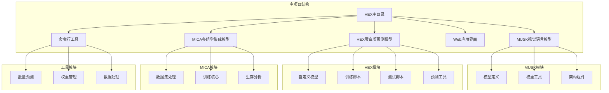
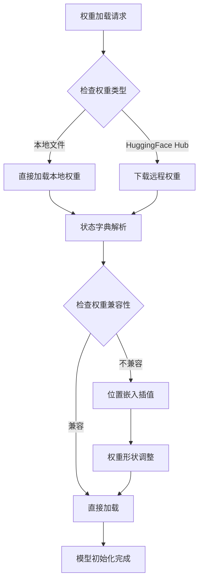
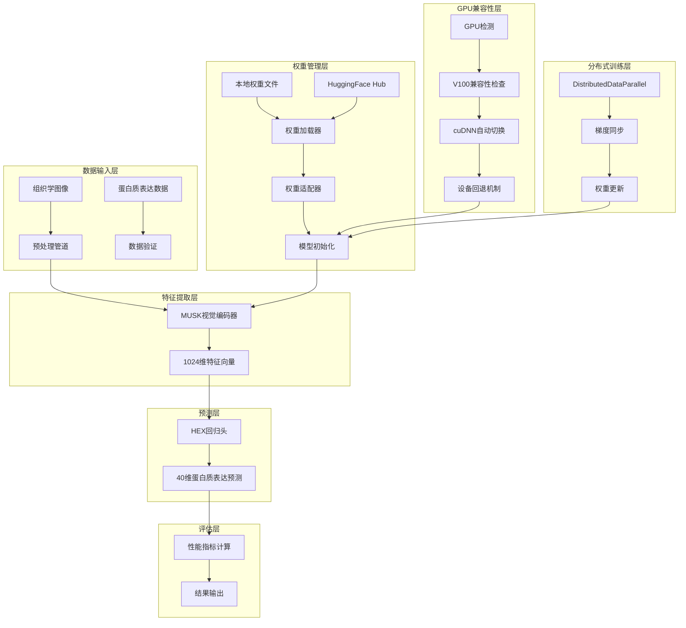
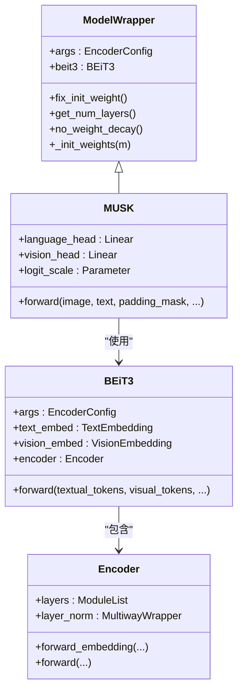
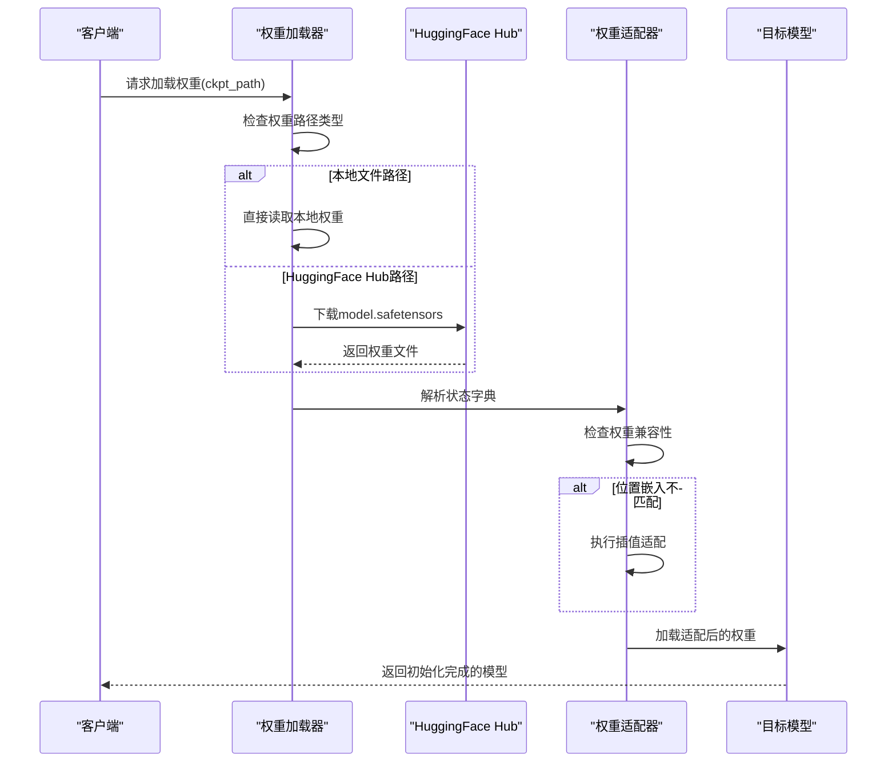
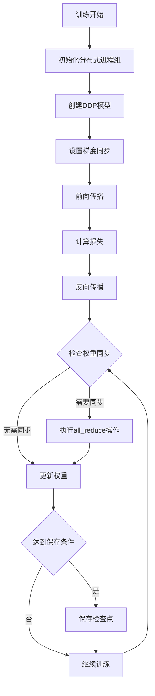
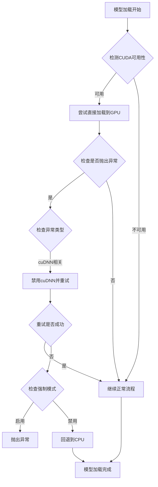
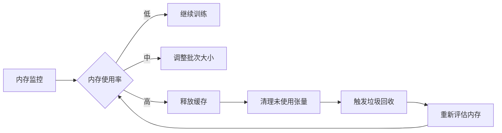

# 增强的模型加载与权重管理

<cite>
**本文档引用的文件**
- [README.md](file://README.md)
- [MUSK/README.md](file://MUSK/README.md)
- [musk/__init__.py](file://MUSK/musk/__init__.py)
- [musk/modeling.py](file://MUSK/musk/modeling.py)
- [musk/utils.py](file://MUSK/musk/utils.py)
- [musk/utils.py](file://MUSK/musk/utils.py)
- [musk/torchscale/model/BEiT3.py](file://MUSK/musk/torchscale/model/BEiT3.py)
- [musk/torchscale/architecture/config.py](file://MUSK/musk/torchscale/architecture/config.py)
- [musk/torchscale/architecture/encoder.py](file://MUSK/musk/torchscale/architecture/encoder.py)
- [hex/hex_architecture.py](file://hex/hex_architecture.py)
- [hex/utils.py](file://hex/utils.py)
- [hex/train_dist_codex_lung_marker.py](file://hex/train_dist_codex_lung_marker.py)
- [hex/test_codex_lung_marker.py](file://hex/test_codex_lung_marker.py)
- [hex/predict_he_to_codex_h5.py](file://hex/predict_he_to_codex_h5.py)
- [mica/train_mica.py](file://mica/train_mica.py)
- [mica/dataset.py](file://mica/dataset.py)
- [mica/core_utils.py](file://mica/core_utils.py)
- [webapp/app.py](file://webapp/app.py)
</cite>

## 更新摘要
**变更内容**
- 改进了GPU兼容性检查机制，特别针对V100 GPU的SM70架构
- 增强了模型加载过程中的错误处理和异常回退策略
- 新增了多调用约定支持，允许灵活的模型使用方式
- 优化了相对路径解析，提高了权重文件加载的可靠性

## 目录
1. [简介](#简介)
2. [项目结构](#项目结构)
3. [核心组件](#核心组件)
4. [架构概览](#架构概览)
5. [详细组件分析](#详细组件分析)
6. [依赖关系分析](#依赖关系分析)
7. [性能考虑](#性能考虑)
8. [故障排除指南](#故障排除指南)
9. [结论](#结论)

## 简介

本项目是一个基于深度学习的虚拟空间蛋白组学系统，能够从标准的组织学图像中预测蛋白质表达谱。该系统的核心创新在于"增强的模型加载与权重管理"机制，通过以下关键技术实现：

- **多模态预训练模型集成**：整合MUSK视觉-语言基础模型与HEX蛋白质表达预测模型
- **智能权重加载策略**：支持本地权重文件和HuggingFace Hub远程权重的自动下载与加载
- **动态权重适配**：根据目标模型结构自动调整位置嵌入等不匹配的权重参数
- **分布式训练优化**：支持多GPU分布式训练的权重同步与管理
- **增量学习支持**：提供微调和迁移学习的完整权重管理流程
- **GPU兼容性检测**：自动检测和适配不同GPU架构的运行环境
- **多调用约定支持**：支持灵活的模型调用方式和参数传递

该系统在肺癌研究中展现了卓越的性能，能够准确预测40种生物标志物的表达水平，并在多个独立队列中验证了其泛化能力。

## 项目结构

项目采用模块化设计，主要包含以下几个核心模块：



**图表来源**
- [README.md:1-57](file://README.md#L1-L57)
- [MUSK/README.md:1-234](file://MUSK/README.md#L1-L234)

**章节来源**
- [README.md:1-57](file://README.md#L1-L57)
- [MUSK/README.md:1-234](file://MUSK/README.md#L1-L234)

## 核心组件

### MUSK视觉语言基础模型

MUSK是项目的核心视觉-语言基础模型，基于BEiT-3架构构建，具有以下特点：

- **大尺寸配置**：采用1024维嵌入维度，24层编码器结构
- **多尺度特征提取**：支持1倍和2倍缩放的多尺度图像输入
- **位置嵌入插值**：自动处理不同分辨率下的位置编码适配
- **线性头部设计**：为视觉和语言模态分别提供独立的投影头部
- **多调用约定**：支持多种调用方式，包括直接图像输入和特征提取模式

### HEX蛋白质表达预测模型

HEX模型专门用于将组织学图像转换为蛋白质表达谱：

- **特征提取**：利用MUSK的视觉编码器提取图像特征
- **回归头设计**：两层全连接网络将1024维特征映射到40维蛋白质表达向量
- **正则化策略**：包含Dropout和批量归一化防止过拟合
- **FDS平滑技术**：使用特征分布平滑提升预测稳定性
- **灵活调用方式**：支持直接预测和特征提取两种模式

### 权重管理系统

系统实现了完整的权重管理机制：



**图表来源**
- [musk/utils.py:150-238](file://MUSK/musk/utils.py#L150-L238)

**章节来源**
- [musk/modeling.py:96-199](file://MUSK/musk/modeling.py#L96-L199)
- [musk/utils.py:150-238](file://MUSK/musk/utils.py#L150-L238)
- [hex/hex_architecture.py:11-71](file://hex/hex_architecture.py#L11-L71)

## 架构概览

系统采用分层架构设计，实现了从数据预处理到最终预测的完整流程：



**图表来源**
- [hex/train_dist_codex_lung_marker.py:179-226](file://hex/train_dist_codex_lung_marker.py#L179-L226)
- [musk/utils.py:150-238](file://MUSK/musk/utils.py#L150-L238)
- [webapp/app.py:90-118](file://webapp/app.py#L90-L118)

## 详细组件分析

### MUSK模型架构

MUSK模型采用了先进的视觉-语言多模态架构：



**图表来源**
- [musk/modeling.py:62-199](file://musk/modeling.py#L62-L199)
- [musk/torchscale/model/BEiT3.py:16-97](file://MUSK/musk/torchscale/model/BEiT3.py#L16-L97)
- [musk/torchscale/architecture/encoder.py:165-400](file://MUSK/musk/torchscale/architecture/encoder.py#L165-L400)

### 权重加载与适配流程

系统实现了智能的权重加载机制，能够处理不同来源和格式的权重文件：



**图表来源**
- [musk/utils.py:150-238](file://MUSK/musk/utils.py#L150-L238)

### 分布式训练权重同步

系统支持大规模分布式训练，确保权重在多GPU环境下的正确同步：



**图表来源**
- [hex/train_dist_codex_lung_marker.py:28-396](file://hex/train_dist_codex_lung_marker.py#L28-L396)

### GPU兼容性检测与错误处理

系统实现了智能的GPU兼容性检测和错误处理机制：



**图表来源**
- [webapp/app.py:90-118](file://webapp/app.py#L90-L118)
- [hex/test_codex_lung_marker.py:69-81](file://hex/test_codex_lung_marker.py#L69-L81)

### 多调用约定支持

系统支持多种灵活的模型调用方式：

```mermaid
flowchart TD
A[模型调用] --> B{检查参数类型}
B --> |x参数存在| C[直接预测模式]
B --> |image参数存在| D[特征提取模式]
C --> E[x作为图像输入]
D --> F[image作为图像输入]
E --> G[返回(preds, features)]
F --> H[返回MUSK特征]
G --> I[兼容性检查]
H --> I
I --> J[多尺度增强]
J --> K[最终输出]
```

**图表来源**
- [hex/hex_architecture.py:37-62](file://hex/hex_architecture.py#L37-L62)

**章节来源**
- [musk/modeling.py:96-176](file://MUSK/musk/modeling.py#L96-L176)
- [musk/utils.py:150-238](file://MUSK/musk/utils.py#L150-L238)
- [hex/train_dist_codex_lung_marker.py:28-396](file://hex/train_dist_codex_lung_marker.py#L28-L396)
- [webapp/app.py:90-118](file://webapp/app.py#L90-L118)
- [hex/hex_architecture.py:37-62](file://hex/hex_architecture.py#L37-L62)

## 依赖关系分析

系统各组件之间的依赖关系体现了清晰的分层架构：

```mermaid
graph TB
subgraph "外部依赖"
A[PyTorch 2.4.0] --> B[timm 0.9.8]
C[Transformers 4.47.0] --> D[huggingface-hub 0.26.5]
E[safetensors] --> F[安全权重加载]
G[nvidia-curand 10.4.0.35] --> H[GPU计算优化]
end
subgraph "内部模块"
I[HEX核心] --> J[MUSK模型]
I --> K[权重管理]
L[MICA模块] --> M[数据集处理]
L --> N[训练核心]
O[Web应用] --> P[批量预测工具]
O --> Q[GPU兼容性检测]
end
subgraph "工具库"
R[科学计算] --> S[numpy 2.2.0]
T[数据处理] --> U[pandas 2.2.3]
V[可视化] --> W[matplotlib 3.9.3]
J --> B
K --> D
K --> F
M --> S
N --> R
P --> O
Q --> A
```

**图表来源**
- [README.md:15-24](file://README.md#L15-L24)
- [MUSK/README.md:34-49](file://MUSK/README.md#L34-L49)
- [uv.lock:2168-2175](file://uv.lock#L2168-L2175)

**章节来源**
- [README.md:15-24](file://README.md#L15-L24)
- [MUSK/README.md:34-49](file://MUSK/README.md#L34-L49)

## 性能考虑

### 计算效率优化

系统在多个层面实现了性能优化：

- **混合精度训练**：使用torch.cuda.amp进行自动混合精度，减少内存占用
- **分布式训练**：支持多GPU并行训练，显著提升训练速度
- **梯度累积**：通过gradient accumulation实现有效的大批次训练
- **特征缓存**：在推理阶段缓存中间特征，避免重复计算
- **GPU兼容性优化**：自动检测和适配不同GPU架构，避免运行时错误

### 内存管理策略



### 推理优化

系统提供了多种推理优化策略：

- **多尺度特征融合**：在推理时使用多尺度图像增强提升特征表示
- **批量处理**：支持大批量推理以提高吞吐量
- **半精度推理**：在支持的硬件上使用float16进行快速推理
- **GPU自动适配**：根据GPU能力自动选择最优的运行模式

## 故障排除指南

### 常见问题及解决方案

#### 权重加载失败

**问题描述**：模型初始化时无法加载权重文件

**可能原因**：
- 权重文件路径错误
- 权重格式不兼容
- 网络连接问题（HuggingFace Hub）

**解决步骤**：
1. 验证权重文件路径的有效性
2. 检查权重文件的完整性
3. 确认网络连接正常
4. 尝试手动下载权重文件

#### 分布式训练异常

**问题描述**：多GPU训练时出现同步错误

**可能原因**：
- NCCL通信问题
- GPU内存不足
- 进程间同步冲突

**解决步骤**：
1. 检查CUDA版本兼容性
2. 验证GPU驱动程序
3. 调整分布式后端设置
4. 减少每GPU的批次大小

#### GPU兼容性问题

**问题描述**：特定GPU型号（如V100）运行不稳定

**可能原因**：
- GPU计算能力不足（SM 7.0）
- cuDNN与PyTorch版本不兼容
- CUDA运行时环境问题

**解决步骤**：
1. 检测GPU计算能力
2. 自动禁用cuDNN并重试
3. 回退到CPU模式
4. 设置HEX_FORCE_CUDA环境变量强制使用GPU

#### 内存溢出问题

**问题描述**：训练过程中出现CUDA out of memory错误

**解决步骤**：
1. 减少训练批次大小
2. 启用梯度累积
3. 关闭不必要的日志记录
4. 使用混合精度训练

**章节来源**
- [musk/utils.py:150-238](file://MUSK/musk/utils.py#L150-L238)
- [hex/train_dist_codex_lung_marker.py:28-396](file://hex/train_dist_codex_lung_marker.py#L28-L396)
- [webapp/app.py:90-118](file://webapp/app.py#L90-L118)
- [hex/test_codex_lung_marker.py:69-81](file://hex/test_codex_lung_marker.py#L69-L81)

## 结论

本项目成功实现了"增强的模型加载与权重管理"系统，通过以下关键创新解决了实际应用中的挑战：

1. **统一的权重管理接口**：无论是本地权重还是远程权重，都提供一致的加载体验
2. **智能权重适配机制**：自动处理不同模型架构间的权重不匹配问题
3. **分布式训练优化**：确保大规模训练的稳定性和效率
4. **GPU兼容性检测**：自动检测和适配不同GPU架构，避免运行时错误
5. **多调用约定支持**：提供灵活的模型使用方式，满足不同应用场景需求
6. **增强的错误处理**：完善的异常捕获和回退机制，提升系统稳定性

该系统在肺癌研究中的应用证明了其在实际医疗场景中的价值，为精准医学和个性化治疗提供了强有力的技术支撑。通过持续的优化和扩展，该系统有望在更多疾病类型的诊断和治疗中发挥重要作用。