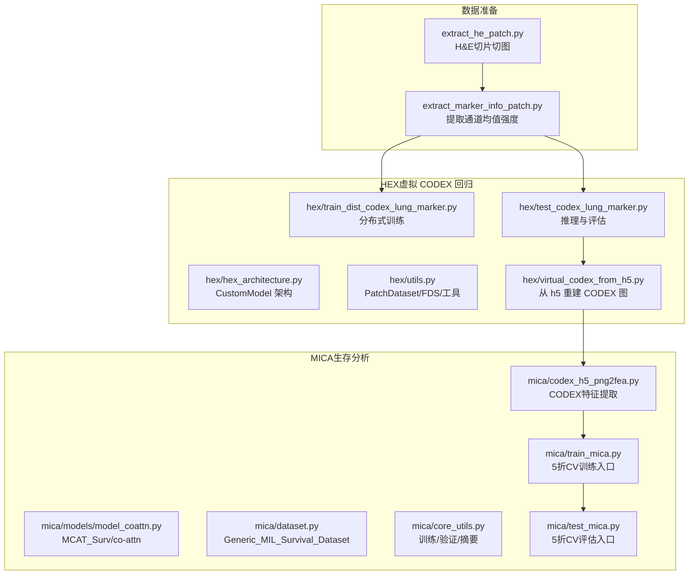
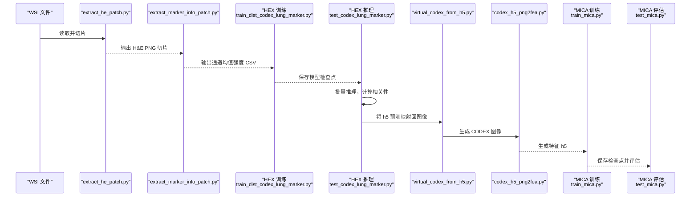
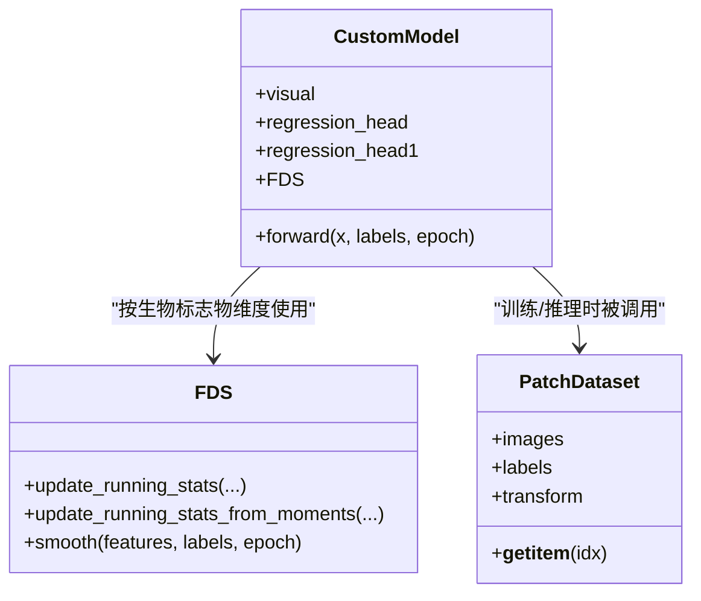
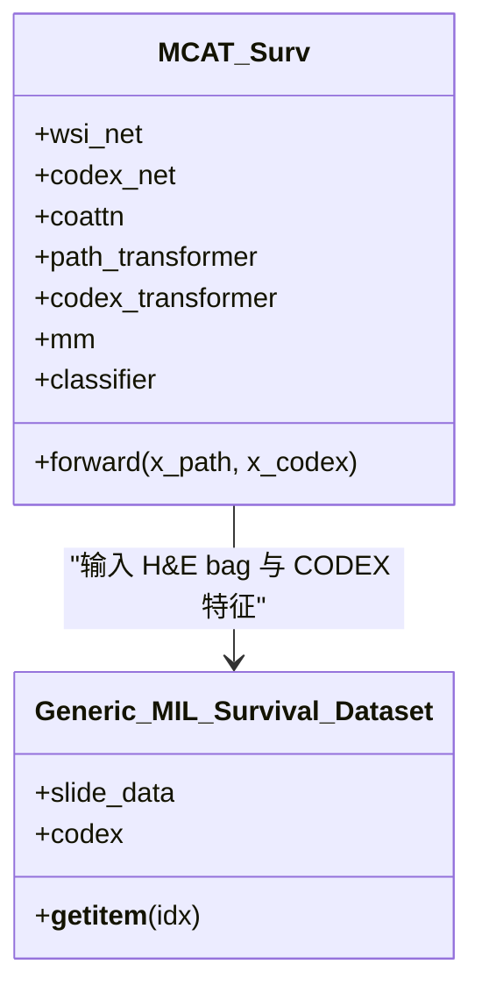
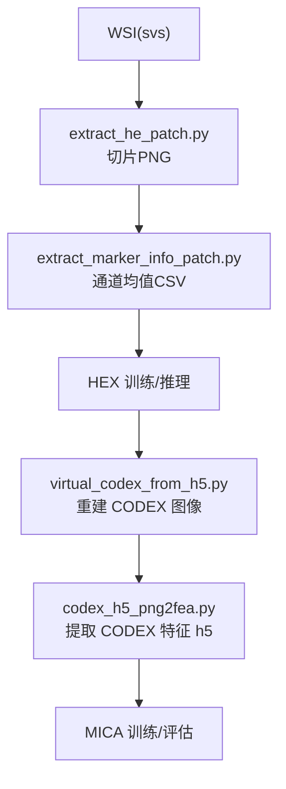
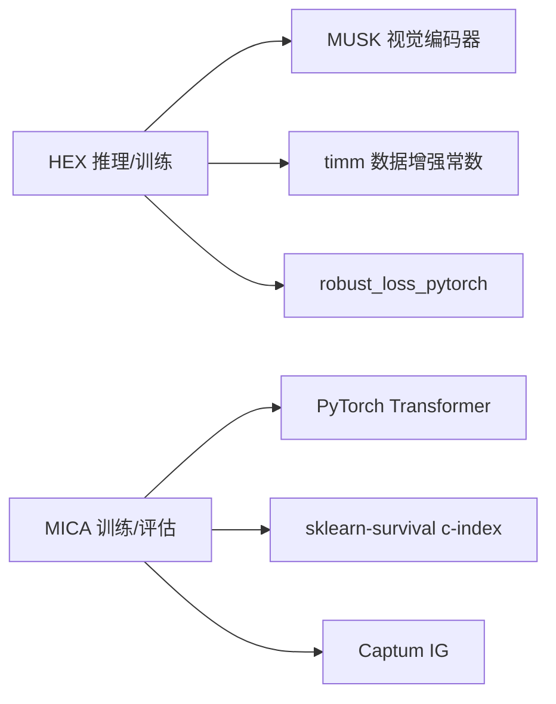

# 模型推理与评估

<cite>
**本文引用的文件**
- [README.md](file://README.md)
- [main.py](file://main.py)
- [hex/hex_architecture.py](file://hex/hex_architecture.py)
- [hex/utils.py](file://hex/utils.py)
- [hex/test_codex_lung_marker.py](file://hex/test_codex_lung_marker.py)
- [hex/train_dist_codex_lung_marker.py](file://hex/train_dist_codex_lung_marker.py)
- [hex/virtual_codex_from_h5.py](file://hex/virtual_codex_from_h5.py)
- [mica/models/model_coattn.py](file://mica/models/model_coattn.py)
- [mica/dataset.py](file://mica/dataset.py)
- [mica/core_utils.py](file://mica/core_utils.py)
- [mica/train_mica.py](file://mica/train_mica.py)
- [mica/test_mica.py](file://mica/test_mica.py)
- [mica/codex_h5_png2fea.py](file://mica/codex_h5_png2fea.py)
- [extract_he_patch.py](file://extract_he_patch.py)
- [extract_marker_info_patch.py](file://extract_marker_info_patch.py)
</cite>

## 目录
1. [引言](#引言)
2. [项目结构](#项目结构)
3. [核心组件](#核心组件)
4. [架构总览](#架构总览)
5. [详细组件分析](#详细组件分析)
6. [依赖关系分析](#依赖关系分析)
7. [性能考量](#性能考量)
8. [故障排除指南](#故障排除指南)
9. [结论](#结论)
10. [附录](#附录)

## 引言
本文件面向“模型推理与评估”的全流程技术文档，围绕以下目标展开：
- 推理流程设计与实现：数据预处理、模型加载、批量推理、结果后处理
- 评估指标与计算方法：回归任务常用指标（如 MAE、RMSE、R²）在本项目中的应用与解读
- 推理脚本使用指南：命令行参数、输入数据格式、输出结果解释
- 性能评估最佳实践：交叉验证策略、A/B 测试方法、性能基准测试
- 完整端到端示例：从 WSI 文件到最终预测结果的流程说明
- 性能优化建议与故障排除

## 项目结构
该项目由两大部分组成：
- HEX：基于 H&E 图像预测虚拟 CODEX（蛋白质表达）的回归模型，支持单张图像到多生物标志物的回归预测
- MICA：多组学注意力融合模型（MCAT），用于生存分析，融合 H&E 片段 bag 与 CODEX 特征

图表来源
- [hex/hex_architecture.py:9-37](file://hex/hex_architecture.py#L9-L37)
- [hex/utils.py:32-81](file://hex/utils.py#L32-L81)
- [hex/train_dist_codex_lung_marker.py:160-169](file://hex/train_dist_codex_lung_marker.py#L160-L169)
- [hex/test_codex_lung_marker.py:115-116](file://hex/test_codex_lung_marker.py#L115-L116)
- [hex/virtual_codex_from_h5.py:37-67](file://hex/virtual_codex_from_h5.py#L37-L67)
- [mica/models/model_coattn.py:12-123](file://mica/models/model_coattn.py#L12-L123)
- [mica/dataset.py:193-227](file://mica/dataset.py#L193-L227)
- [mica/core_utils.py:15-82](file://mica/core_utils.py#L15-L82)
- [mica/train_mica.py:28-88](file://mica/train_mica.py#L28-L88)
- [mica/test_mica.py:79-173](file://mica/test_mica.py#L79-L173)
- [mica/codex_h5_png2fea.py:35-163](file://mica/codex_h5_png2fea.py#L35-L163)
- [extract_he_patch.py:46-77](file://extract_he_patch.py#L46-L77)
- [extract_marker_info_patch.py:21-73](file://extract_marker_info_patch.py#L21-L73)

章节来源
- [README.md:26-44](file://README.md#L26-L44)
- [main.py:1-7](file://main.py#L1-L7)

## 核心组件
- HEX 自定义模型（CustomModel）
  - 视觉编码器来自 MUSK，回归头包含两段全连接层，输出每个生物标志物的表达值
  - 支持 FDS 平滑以提升回归稳定性
- 数据集与数据加载
  - PatchDataset：读取 H&E 切片 PNG 与对应通道均值强度标签
  - 分布式采样器与 DataLoader 配置，支持多卡训练与推理
- 评估与推理
  - 测试脚本进行批量推理，保存 patch 级别预测与标签，并计算每生物标志物的皮尔逊相关系数
- MICA 多模态融合模型
  - MCAT_Surv：H&E 与 CODEX 的交叉注意力与 Transformer 融合，支持注意力可视化
  - 5 折交叉验证训练与评估，使用 c-index 衡量生存预测性能

章节来源
- [hex/hex_architecture.py:9-37](file://hex/hex_architecture.py#L9-L37)
- [hex/utils.py:32-98](file://hex/utils.py#L32-L98)
- [hex/test_codex_lung_marker.py:62-74](file://hex/test_codex_lung_marker.py#L62-L74)
- [mica/models/model_coattn.py:12-123](file://mica/models/model_coattn.py#L12-L123)
- [mica/dataset.py:193-227](file://mica/dataset.py#L193-L227)

## 架构总览
下图展示了从 WSI 到最终预测的端到端流程，涵盖数据准备、HEX 推理、虚拟 CODEX 生成、MICA 训练与评估。

图表来源
- [extract_he_patch.py:46-77](file://extract_he_patch.py#L46-L77)
- [extract_marker_info_patch.py:21-73](file://extract_marker_info_patch.py#L21-L73)
- [hex/train_dist_codex_lung_marker.py:42-96](file://hex/train_dist_codex_lung_marker.py#L42-L96)
- [hex/test_codex_lung_marker.py:75-116](file://hex/test_codex_lung_marker.py#L75-L116)
- [hex/virtual_codex_from_h5.py:37-67](file://hex/virtual_codex_from_h5.py#L37-L67)
- [mica/codex_h5_png2fea.py:35-163](file://mica/codex_h5_png2fea.py#L35-L163)
- [mica/train_mica.py:28-88](file://mica/train_mica.py#L28-L88)
- [mica/test_mica.py:79-173](file://mica/test_mica.py#L79-L173)

## 详细组件分析

### HEX 推理与评估组件
- 模型架构（CustomModel）
  - 视觉编码器：基于 MUSK 的视觉编码器，输出特征向量
  - 回归头：两层全连接 + Dropout，输出 40 维生物标志物表达
  - FDS 平滑：按标签桶统计运行均值/方差，对特征进行平滑校准
- 数据加载（PatchDataset）
  - 输入：H&E PNG 切片路径列表
  - 标签：40 个通道的均值强度（对应 40 个生物标志物）
  - 变换：Resize、ToTensor、Normalize
- 推理流程（test_codex_lung_marker.py）
  - 加载模型权重，设置为 eval
  - 构建 DataLoader，批大小与多进程加载
  - 使用 autocast 进行混合精度推理
  - 保存 patch 级别预测与标签，计算每生物标志物的皮尔逊相关系数
- 训练流程（train_dist_codex_lung_marker.py）
  - 分布式训练，DDP 包装模型
  - AdaptiveLossFunction 作为损失函数
  - FDS 在前若干轮启用，按生物标志物维度更新运行统计
  - 验证阶段收集全局预测与标签，计算整体 MSE 与平均皮尔逊相关系数

图表来源
- [hex/hex_architecture.py:9-37](file://hex/hex_architecture.py#L9-L37)
- [hex/utils.py:32-81](file://hex/utils.py#L32-L81)
- [hex/utils.py:116-326](file://hex/utils.py#L116-L326)

章节来源
- [hex/hex_architecture.py:9-37](file://hex/hex_architecture.py#L9-L37)
- [hex/utils.py:32-98](file://hex/utils.py#L32-L98)
- [hex/test_codex_lung_marker.py:62-189](file://hex/test_codex_lung_marker.py#L62-L189)
- [hex/train_dist_codex_lung_marker.py:160-396](file://hex/train_dist_codex_lung_marker.py#L160-L396)

### MICA 多模态融合与生存分析
- 模型（MCAT_Surv）
  - H&E 与 CODEX 各自通过 FC 映射到统一表征
  - MultiheadAttention 实现跨模态协同注意力
  - Transformer 编码器 + 注意力池化或 GAP 池化
  - 双模态融合（concat 或 bilinear），分类器输出风险/生存函数
- 数据集（Generic_MIL_Survival_Dataset）
  - 从 CSV 读取生存信息与分箱标签
  - 从 h5 中读取每个 slide 的 CODEX 特征
  - 支持按患者/切片级别划分
- 训练与评估（core_utils）
  - NLL 生存损失，梯度累积，c-index 作为指标
  - 5 折交叉验证，保存各折检查点与汇总结果

图表来源
- [mica/models/model_coattn.py:12-123](file://mica/models/model_coattn.py#L12-L123)
- [mica/dataset.py:193-249](file://mica/dataset.py#L193-L249)

章节来源
- [mica/models/model_coattn.py:12-123](file://mica/models/model_coattn.py#L12-L123)
- [mica/dataset.py:193-249](file://mica/dataset.py#L193-L249)
- [mica/core_utils.py:15-82](file://mica/core_utils.py#L15-L82)
- [mica/train_mica.py:28-88](file://mica/train_mica.py#L28-L88)
- [mica/test_mica.py:79-173](file://mica/test_mica.py#L79-L173)

### 数据准备与预处理
- H&E 切片切图（extract_he_patch.py）
  - 读取标注 CSV，按坐标切片，保存为 PNG
- 通道均值强度提取（extract_marker_info_patch.py）
  - 读取注册后的 CODEX OME，按 patch 坐标提取各通道均值强度，输出 CSV
- 虚拟 CODEX 图像重建（virtual_codex_from_h5.py）
  - 将 h5 中的预测按坐标映射回 WSI 尺寸的图像矩阵
- CODEX 特征提取（codex_h5_png2fea.py）
  - 将重建的 CODEX 图像转为 40 通道，使用 DINOv2 提取特征并保存为 h5

图表来源
- [extract_he_patch.py:46-77](file://extract_he_patch.py#L46-L77)
- [extract_marker_info_patch.py:21-73](file://extract_marker_info_patch.py#L21-L73)
- [hex/virtual_codex_from_h5.py:37-67](file://hex/virtual_codex_from_h5.py#L37-L67)
- [mica/codex_h5_png2fea.py:35-163](file://mica/codex_h5_png2fea.py#L35-L163)

章节来源
- [extract_he_patch.py:46-77](file://extract_he_patch.py#L46-L77)
- [extract_marker_info_patch.py:21-73](file://extract_marker_info_patch.py#L21-L73)
- [hex/virtual_codex_from_h5.py:37-67](file://hex/virtual_codex_from_h5.py#L37-L67)
- [mica/codex_h5_png2fea.py:35-163](file://mica/codex_h5_png2fea.py#L35-L163)

## 依赖关系分析
- HEX 依赖
  - 视觉编码器：MUSK（通过 timm 创建）
  - 数据变换：timm 的 IMAGENET_INCEPTION 均值/方差
  - 损失：robust_loss_pytorch 的 AdaptiveLossFunction
  - FDS 平滑：自实现直方图平滑与均值/方差校准
- MICA 依赖
  - 多头注意力与 Transformer 编码器
  - 生存分析指标：sklearn-survival 的 c-index
  - 可解释性：Captum 的 Integrated Gradients

图表来源
- [hex/train_dist_codex_lung_marker.py:24-25](file://hex/train_dist_codex_lung_marker.py#L24-L25)
- [hex/test_codex_lung_marker.py:11-14](file://hex/test_codex_lung_marker.py#L11-L14)
- [mica/test_mica.py:15-16](file://mica/test_mica.py#L15-L16)
- [mica/models/model_coattn.py:459-615](file://mica/models/model_coattn.py#L459-L615)

章节来源
- [hex/train_dist_codex_lung_marker.py:24-25](file://hex/train_dist_codex_lung_marker.py#L24-L25)
- [hex/test_codex_lung_marker.py:11-14](file://hex/test_codex_lung_marker.py#L11-L14)
- [mica/test_mica.py:15-16](file://mica/test_mica.py#L15-L16)
- [mica/models/model_coattn.py:459-615](file://mica/models/model_coattn.py#L459-L615)

## 性能考量
- 训练与推理加速
  - 混合精度：autocast + GradScaler
  - 分布式训练：DDP + DistributedSampler
  - 数据加载：pin_memory、多 worker、大 batch
- 回归稳定性
  - FDS 平滑：按标签桶统计，对特征进行平滑与方差校准
  - AdaptiveLossFunction：对异常值鲁棒
- 生存分析
  - c-index：考虑删失的判别能力指标
  - 5 折交叉验证：降低随机性影响

章节来源
- [hex/train_dist_codex_lung_marker.py:226-227](file://hex/train_dist_codex_lung_marker.py#L226-L227)
- [hex/utils.py:116-326](file://hex/utils.py#L116-L326)
- [mica/core_utils.py:85-193](file://mica/core_utils.py#L85-L193)

## 故障排除指南
- 分布式初始化失败
  - 检查 MASTER_PORT、LOCAL_RANK、RANK 环境变量是否正确设置
  - 确认 NCCL 网络可用且无冲突
- 数据路径错误
  - 确认 sample_data 下的 he_patches 与 channel_registered 存在
  - 确认 splits_0.csv 存在并包含验证集 patient_id
- 设备内存不足
  - 降低 batch size 或 num_workers
  - 关闭不必要的日志与可视化
- 指标异常
  - 检查标签范围与归一化是否一致
  - 对于回归，确认 FDS 是否启用以及平滑参数是否合理

章节来源
- [hex/train_dist_codex_lung_marker.py:28-38](file://hex/train_dist_codex_lung_marker.py#L28-L38)
- [hex/test_codex_lung_marker.py:82-96](file://hex/test_codex_lung_marker.py#L82-L96)

## 结论
本项目提供了从 H&E 切片到虚拟 CODEX 表达的完整回归管线，并进一步将虚拟 CODEX 与 H&E 片段 bag 融合，构建生存分析模型。通过分布式训练、FDS 平滑与稳健损失、5 折交叉验证与 c-index 指标，系统在可解释性与泛化性能之间取得平衡。建议在实际部署中结合 A/B 测试与长期监控，持续评估模型在不同人群与中心的稳定性。

## 附录

### 推理脚本使用指南（HEX）
- 命令行参数
  - checkpoint_path：模型权重路径
  - save_dir：输出目录
  - data_dir：sample_data 根目录
- 输入数据格式
  - he_patches：H&E 切片 PNG（按 slide_id/patch_index 命名）
  - channel_registered：每个 slide 的通道均值强度 CSV（列名 mean_intensity_channel1..40）
  - splits_0.csv：可选，指定验证集 patient_id
- 输出结果解释
  - patch_predictions.csv：每张 patch 的预测与标签
  - biomarker_pearson_r.csv：每个生物标志物的皮尔逊相关系数排序

章节来源
- [hex/test_codex_lung_marker.py:75-189](file://hex/test_codex_lung_marker.py#L75-L189)

### 评估指标与计算方法
- 皮尔逊相关系数（Pearson R）
  - 衡量预测值与真实值线性相关程度，范围 [-1, 1]
  - 在脚本中逐生物标志物计算并汇总统计
- 均方误差（MSE）
  - 计算预测与标签差值平方的均值，用于训练日志与验证阶段
- 平均绝对误差（MAE）
  - 差值绝对值的均值，对异常值更稳健
- 决定系数（R²）
  - 解释回归模型对目标变量方差的解释比例，范围 (-∞, 1]

章节来源
- [hex/test_codex_lung_marker.py:156-180](file://hex/test_codex_lung_marker.py#L156-L180)
- [hex/train_dist_codex_lung_marker.py:363-380](file://hex/train_dist_codex_lung_marker.py#L363-L380)

### 性能评估最佳实践
- 交叉验证策略
  - MICA：5 折 CV，分别保存各折检查点与汇总
  - HEX：可参考 CLAM-style 分割，按患者划分避免泄漏
- A/B 测试方法
  - 对比新旧模型在相同数据分布上的指标差异（如 c-index 或 Pearson R）
  - 控制实验时间窗口与样本量，避免季节性偏差
- 性能基准测试
  - 固定硬件环境与随机种子，记录吞吐、延迟与显存占用
  - 使用标准化数据集与指标，便于复现与比较

章节来源
- [mica/train_mica.py:42-88](file://mica/train_mica.py#L42-L88)
- [mica/test_mica.py:96-173](file://mica/test_mica.py#L96-L173)
- [README.md:26-44](file://README.md#L26-L44)

### 典型推理示例（从 WSI 到预测）
- 准备阶段
  - 使用 extract_he_patch.py 与 extract_marker_info_patch.py 生成 H&E 切片与通道均值 CSV
- 训练阶段
  - 使用 train_dist_codex_lung_marker.py 训练并保存检查点
- 推理阶段
  - 使用 test_codex_lung_marker.py 进行批量推理，得到 patch 级别预测与评估指标
- 虚拟 CODEX 与 MICA
  - 使用 virtual_codex_from_h5.py 与 codex_h5_png2fea.py 生成 CODEX 特征
  - 使用 train_mica.py 与 test_mica.py 进行生存分析训练与评估

章节来源
- [extract_he_patch.py:46-77](file://extract_he_patch.py#L46-L77)
- [extract_marker_info_patch.py:21-73](file://extract_marker_info_patch.py#L21-L73)
- [hex/train_dist_codex_lung_marker.py:42-96](file://hex/train_dist_codex_lung_marker.py#L42-L96)
- [hex/test_codex_lung_marker.py:75-189](file://hex/test_codex_lung_marker.py#L75-L189)
- [hex/virtual_codex_from_h5.py:37-67](file://hex/virtual_codex_from_h5.py#L37-L67)
- [mica/codex_h5_png2fea.py:35-163](file://mica/codex_h5_png2fea.py#L35-L163)
- [mica/train_mica.py:28-88](file://mica/train_mica.py#L28-L88)
- [mica/test_mica.py:79-173](file://mica/test_mica.py#L79-L173)