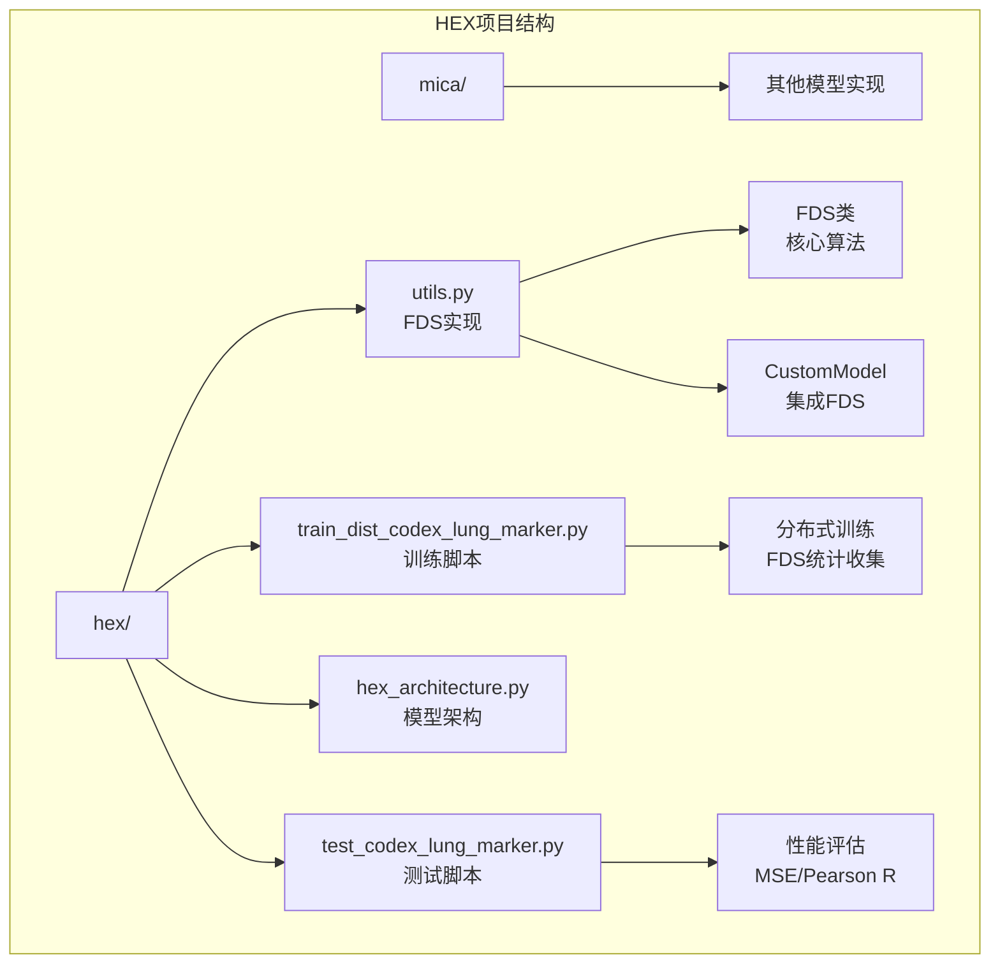
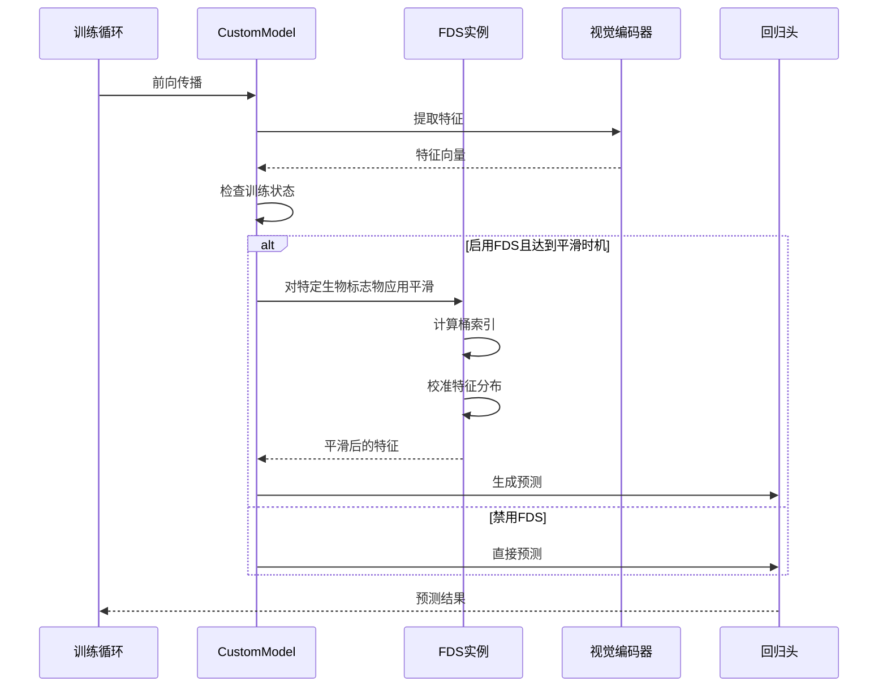
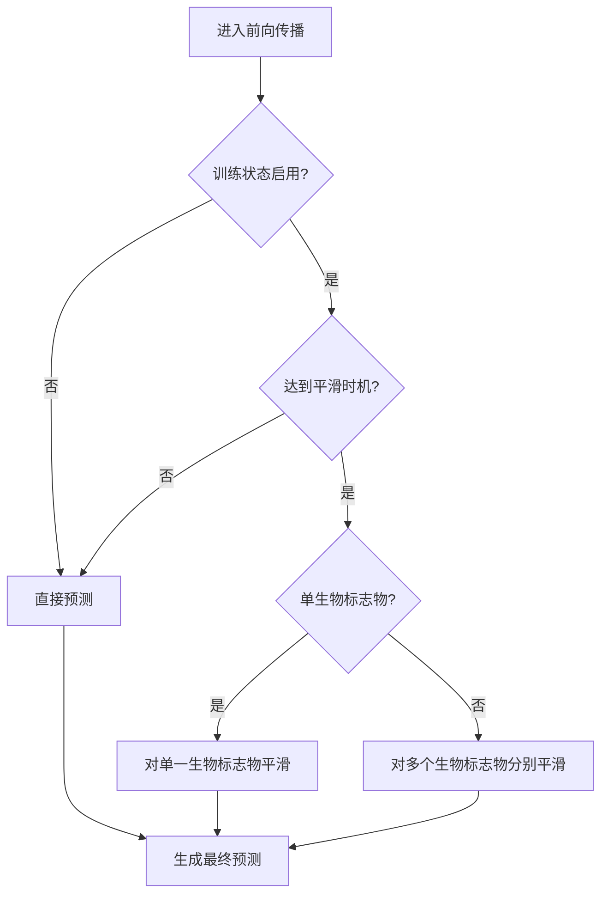
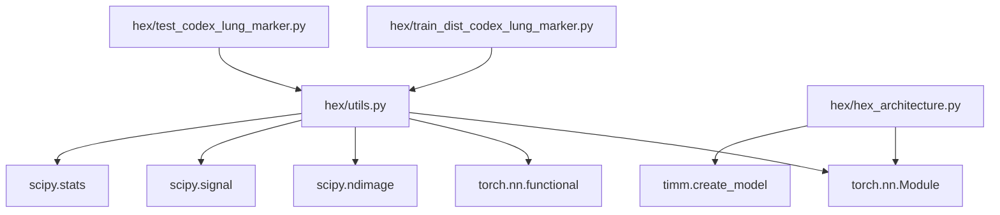

# 特征分布平滑技术

<cite>
**本文档引用的文件**
- [hex/utils.py](file://hex/utils.py)
- [hex/train_dist_codex_lung_marker.py](file://hex/train_dist_codex_lung_marker.py)
- [hex/test_codex_lung_marker.py](file://hex/test_codex_lung_marker.py)
- [hex/hex_architecture.py](file://hex/hex_architecture.py)
- [README.md](file://README.md)
</cite>

## 目录
1. [简介](#简介)
2. [项目结构](#项目结构)
3. [核心组件](#核心组件)
4. [架构概览](#架构概览)
5. [详细组件分析](#详细组件分析)
6. [依赖关系分析](#依赖关系分析)
7. [性能考虑](#性能考虑)
8. [故障排除指南](#故障排除指南)
9. [结论](#结论)
10. [附录](#附录)

## 简介
本文件详细介绍了特征分布平滑（Feature Distribution Smoothing, FDS）技术在HEX模型中的应用。FDS是一种专门针对小样本学习中分布偏移问题设计的正则化技术，通过估计不同标签区间内的特征分布并进行平滑处理，显著提升模型在稀疏或不平衡数据上的泛化能力。

HEX项目专注于从常规组织学图像生成空间蛋白质组学谱，支持40种生物标志物的表达预测。FDS技术在此场景中的应用尤为关键，因为：
- 生物标志物表达通常呈现长尾分布
- 不同表达水平的样本数量差异巨大
- 小样本情况下直接回归容易过拟合
- 需要保持特征表示的统计一致性

## 项目结构
HEX项目采用模块化设计，主要包含以下与FDS相关的组件：



**图表来源**
- [hex/utils.py:1-342](file://hex/utils.py#L1-L342)
- [hex/train_dist_codex_lung_marker.py:1-400](file://hex/train_dist_codex_lung_marker.py#L1-L400)

**章节来源**
- [README.md:1-57](file://README.md#L1-L57)
- [hex/utils.py:1-342](file://hex/utils.py#L1-L342)

## 核心组件
FDS技术由三个核心组件构成：FDS类、CustomModel集成层和训练时的统计收集机制。

### FDS类（核心算法）
FDS类实现了完整的特征分布平滑算法，包括：
- 分桶统计：将连续标签映射到离散桶中
- 运行时统计：维护每个桶的均值和方差
- 平滑处理：使用核函数对统计量进行平滑
- 特征校准：根据目标分布调整输入特征

### CustomModel（模型集成）
CustomModel将FDS无缝集成到HEX的视觉-回归架构中：
- 视觉编码器提取特征
- 回归头进行多输出预测
- FDS实例按需对特定生物标志物进行平滑

### 训练统计收集
训练过程中自动收集各桶的统计信息：
- 每个批次统计各桶的样本数
- 聚合特征和平方和
- 分布式环境下进行全局同步

**章节来源**
- [hex/utils.py:116-327](file://hex/utils.py#L116-L327)
- [hex/utils.py:32-80](file://hex/utils.py#L32-L80)
- [hex/train_dist_codex_lung_marker.py:258-318](file://hex/train_dist_codex_lung_marker.py#L258-L318)

## 架构概览
FDS在HEX中的工作流程如下：



**图表来源**
- [hex/utils.py:55-80](file://hex/utils.py#L55-L80)
- [hex/utils.py:308-326](file://hex/utils.py#L308-L326)
- [hex/train_dist_codex_lung_marker.py:275-277](file://hex/train_dist_codex_lung_marker.py#L275-L277)

## 详细组件分析

### FDS类实现详解

#### 核心数据结构
FDS类维护以下关键缓冲区：
- `running_mean`: 当前运行均值（按桶存储）
- `running_var`: 当前运行方差（按桶存储）
- `running_mean_last_epoch`: 上一周期均值
- `running_var_last_epoch`: 上一周期方差
- `smoothed_mean_last_epoch`: 平滑后的上一周期均值
- `smoothed_var_last_epoch`: 平滑后的上一周期方差
- `num_samples_tracked`: 每桶样本计数

#### 分桶策略
```mermaid
flowchart TD
A[连续标签值] --> B{裁剪到[0,1]}
B --> C[乘以桶数量]
C --> D[转换为整数索引]
D --> E{检查边界}
E --> |小于起始| F[设置为起始桶]
E --> |超过上限| G[设置为最后桶]
E --> |正常范围| H[使用当前索引]
F --> I[返回桶索引]
G --> I
H --> I
```

**图表来源**
- [hex/utils.py:160-180](file://hex/utils.py#L160-L180)

#### 统计更新机制
FDS采用指数移动平均更新统计量：
```
new_stat = (1 - α) × current_stat + α × previous_stat
```

其中α是动量因子，控制新旧统计量的权重平衡。

#### 平滑核函数
支持三种核函数：
- 高斯核：平滑度适中，计算效率高
- 三角核：线性平滑，边缘效应明显
- 拉普拉斯核：重尾分布，对异常值更鲁棒

**章节来源**
- [hex/utils.py:116-327](file://hex/utils.py#L116-L327)

### CustomModel集成分析

#### FDS配置参数
CustomModel中的FDS配置字典包含：
- `feature_dim`: 特征维度（128）
- `start_update`: 开始更新统计的时间点（0）
- `start_smooth`: 开始平滑的时间点（10）
- `kernel`: 核函数类型（'gaussian'）
- `ks`: 核函数大小（9）
- `sigma`: 高斯核标准差（2）

#### 条件平滑逻辑


**图表来源**
- [hex/utils.py:55-80](file://hex/utils.py#L55-L80)

**章节来源**
- [hex/utils.py:32-80](file://hex/utils.py#L32-L80)

### 训练时统计收集

#### 分布式统计聚合
训练过程中，每个进程独立收集桶统计，然后通过分布式同步确保全局一致性：


**图表来源**
- [hex/train_dist_codex_lung_marker.py:298-318](file://hex/train_dist_codex_lung_marker.py#L298-L318)

**章节来源**
- [hex/train_dist_codex_lung_marker.py:258-318](file://hex/train_dist_codex_lung_marker.py#L258-L318)

## 依赖关系分析

### 外部依赖
FDS实现依赖以下关键库：
- **PyTorch**: 核心深度学习框架，提供张量操作和自动微分
- **SciPy**: 提供高斯滤波、卷积等数值计算功能
- **NumPy**: 数值计算基础库
- **TorchVision**: 数据预处理和变换

### 内部模块依赖


**图表来源**
- [hex/utils.py:1-342](file://hex/utils.py#L1-L342)
- [hex/train_dist_codex_lung_marker.py:1-400](file://hex/train_dist_codex_lung_marker.py#L1-L400)

**章节来源**
- [hex/utils.py:1-18](file://hex/utils.py#L1-L18)

## 性能考虑

### 计算复杂度
- **统计收集**: O(N × D)，其中N是批次大小，D是特征维度
- **桶索引计算**: O(N)
- **平滑处理**: O(N × B × D)，其中B是桶数量
- **总体复杂度**: O(N × D × (1 + B))

### 内存优化
- 使用register_buffer注册统计变量，避免梯度计算开销
- 分布式环境下仅同步必要的统计信息
- 支持混合精度训练减少内存占用

### 实际性能指标
基于训练脚本中的指标：
- **MSE损失**: 训练过程中持续监控各生物标志物的均方误差
- **Pearson相关系数**: 评估预测值与真实值的相关性
- **分布式训练**: 支持多GPU并行训练

**章节来源**
- [hex/train_dist_codex_lung_marker.py:326-384](file://hex/train_dist_codex_lung_marker.py#L326-L384)

## 故障排除指南

### 常见问题及解决方案

#### 1. 分布偏移导致的性能下降
**症状**: 某些生物标志物在验证集上表现明显低于训练集
**解决方案**: 
- 检查FDS_ACTIVE_MARKERS配置
- 调整start_smooth参数
- 验证标签分布是否过于稀疏

#### 2. 分布式训练统计不一致
**症状**: 不同进程间的统计信息存在差异
**解决方案**:
- 确保所有进程都调用all_reduce同步
- 检查分布式初始化是否正确
- 验证数据加载器的随机种子设置

#### 3. 内存不足问题
**症状**: GPU内存溢出，特别是在大批次训练时
**解决方案**:
- 减少批次大小
- 关闭不必要的统计收集
- 使用混合精度训练

**章节来源**
- [hex/train_dist_codex_lung_marker.py:283-290](file://hex/train_dist_codex_lung_marker.py#L283-L290)

## 结论
FDS技术为HEX模型提供了强大的正则化能力，特别适用于小样本和分布偏移场景。通过精确的特征分布估计和平滑处理，FDS能够：

1. **提升泛化能力**: 在稀疏数据条件下保持稳定的预测性能
2. **改善分布一致性**: 减少训练和测试分布之间的差异
3. **增强鲁棒性**: 对异常值和噪声具有更好的抗性
4. **支持多任务学习**: 为40种生物标志物提供个性化的分布平滑

FDS的优势在于其理论基础扎实、实现简洁高效，并且与HEX的视觉-回归架构完美融合。通过合理配置参数和监控训练过程，可以显著提升模型在临床应用中的可靠性。

## 附录

### 使用示例

#### 基本配置
```python
# 在CustomModel中启用FDS
config = dict(feature_dim=128, start_update=0, start_smooth=10, kernel='gaussian', ks=9, sigma=2)
self.FDS = nn.ModuleList([FDS(**config) for _ in range(num_outputs)])
```

#### 条件启用
```python
# 训练脚本中的条件判断
use_fds_train = (len(FDS_ACTIVE_MARKERS) > 0) and (epoch < FDS_OFF_EPOCH)
model.module.training_status = use_fds_train
```

#### 性能监控
```python
# 训练过程中的指标记录
writer.add_scalar('MSE_train/avg', avg_train_mse, epoch + 1)
writer.add_scalar('Pearson_R_val/avg', avg_pearson_r, epoch + 1)
```

### 参数调优建议

#### 核心参数
- **start_smooth**: 建议设置为训练轮数的10-20%
- **kernel**: 'gaussian'适合大多数场景
- **ks**: 5-15之间根据数据分布选择
- **sigma**: 1-3之间平衡平滑程度

#### 分布式训练
- 确保所有进程的FDS配置完全一致
- 定期检查统计信息的收敛性
- 监控各桶的样本分布是否均衡