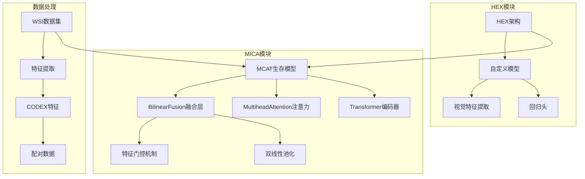
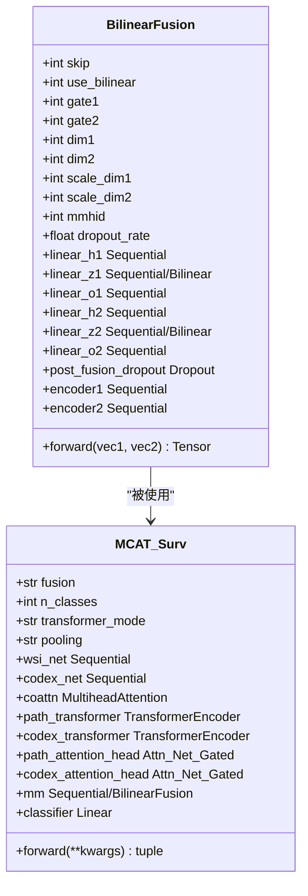
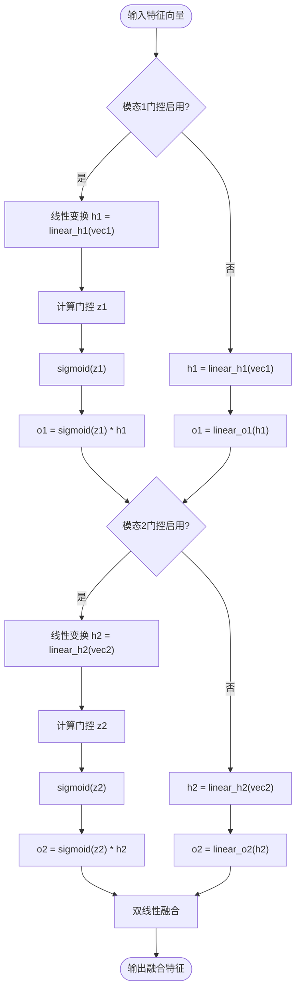
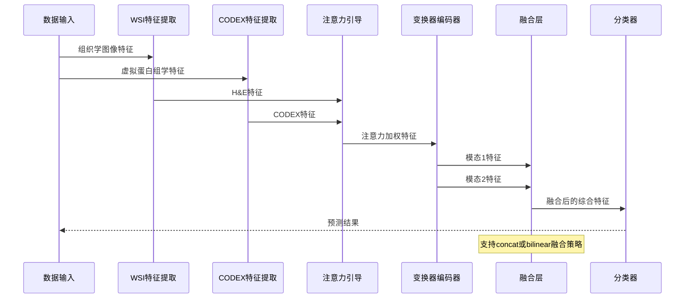
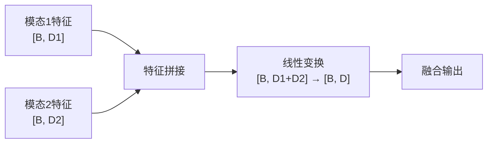
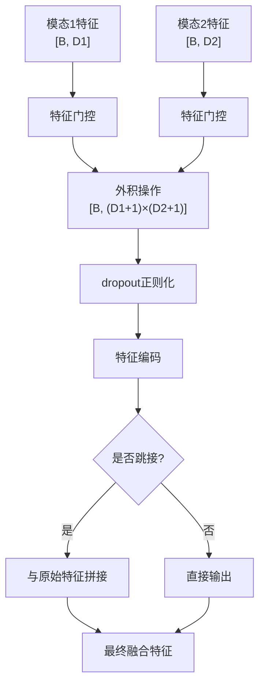
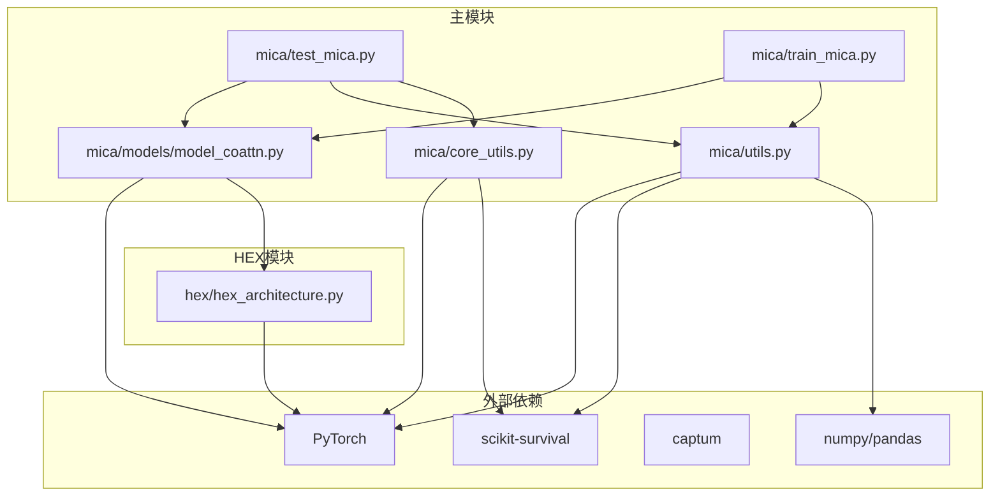
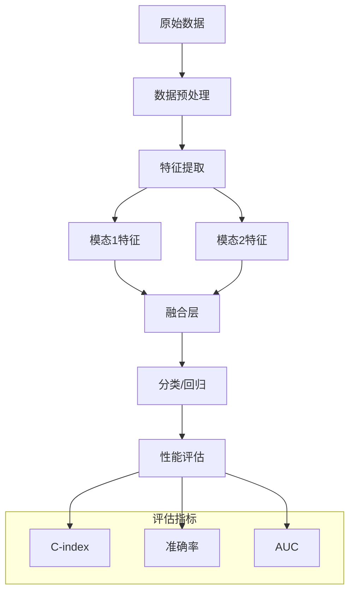

# 多模态融合策略

<cite>
**本文档引用的文件**
- [README.md](file://README.md)
- [hex/hex_architecture.py](file://hex/hex_architecture.py)
- [mica/models/model_coattn.py](file://mica/models/model_coattn.py)
- [mica/test_mica.py](file://mica/test_mica.py)
- [mica/train_mica.py](file://mica/train_mica.py)
- [mica/utils.py](file://mica/utils.py)
- [mica/core_utils.py](file://mica/core_utils.py)
</cite>

## 目录
1. [简介](#简介)
2. [项目结构](#项目结构)
3. [核心组件](#核心组件)
4. [架构概览](#架构概览)
5. [详细组件分析](#详细组件分析)
6. [依赖关系分析](#依赖关系分析)
7. [性能考虑](#性能考虑)
8. [故障排除指南](#故障排除指南)
9. [结论](#结论)
10. [附录](#附录)

## 简介

本项目实现了基于双线性融合（Bilinear Fusion）的多模态融合策略，专门用于整合组织学图像（H&E染色）和虚拟空间蛋白组学（CODEX）数据，以提高癌症预后预测的准确性。该系统采用MCAT（Multi-Attention Concatenative）架构，通过注意力引导的变换器编码器处理多模态数据，并使用双线性池化技术进行模态间交互建模。

项目的核心创新在于实现了完整的双线性融合模块，包括特征门控机制、双线性池化数学原理以及模态间交互建模。该实现支持两种融合策略：拼接融合（concat）和双线性融合（bilinear），并提供了详细的参数配置选项和性能优化策略。

## 项目结构

项目采用模块化的架构设计，主要分为两个核心部分：



**图表来源**
- [hex/hex_architecture.py:1-37](file://hex/hex_architecture.py#L1-L37)
- [mica/models/model_coattn.py:12-124](file://mica/models/model_coattn.py#L12-L124)

**章节来源**
- [README.md:1-57](file://README.md#L1-L57)
- [hex/hex_architecture.py:1-37](file://hex/hex_architecture.py#L1-L37)
- [mica/models/model_coattn.py:12-124](file://mica/models/model_coattn.py#L12-L124)

## 核心组件

### BilinearFusion类实现

BilinearFusion类是本项目的核心组件，实现了双线性融合的完整功能。该类支持特征门控机制、双线性池化以及模态间交互建模。



**图表来源**
- [mica/models/model_coattn.py:616-680](file://mica/models/model_coattn.py#L616-L680)
- [mica/models/model_coattn.py:12-68](file://mica/models/model_coattn.py#L12-L68)

### 特征门控机制

双线性融合的核心在于特征门控机制，该机制通过可学习的门控权重控制模态间的交互程度：



**图表来源**
- [mica/models/model_coattn.py:654-680](file://mica/models/model_coattn.py#L654-L680)

**章节来源**
- [mica/models/model_coattn.py:616-680](file://mica/models/model_coattn.py#L616-L680)

## 架构概览

整个多模态融合系统采用分层架构设计，从底层的特征提取到高层的融合决策：



**图表来源**
- [mica/models/model_coattn.py:70-123](file://mica/models/model_coattn.py#L70-L123)

**章节来源**
- [mica/models/model_coattn.py:12-124](file://mica/models/model_coattn.py#L12-L124)

## 详细组件分析

### 双线性融合实现详解

#### 数学原理

双线性融合基于双线性池化理论，通过矩阵外积操作捕获模态间的高阶交互信息：

```
Fusion = [o1, 1] ⊗ [o2, 1] ⊗ Φ
```

其中：
- `o1` 和 `o2` 是经过门控的特征向量
- `Φ` 是可学习的投影矩阵
- `⊗` 表示外积操作

#### 关键技术组件

1. **特征缩放（Feature Scaling）**
   - 通过 `scale_dim1` 和 `scale_dim2` 参数控制特征维度缩放
   - 实现维度映射以适应不同的模态特征

2. **维度映射（Dimension Mapping）**
   - 使用线性层将原始特征映射到合适的维度
   - 支持独立的模态维度配置

3. **dropout正则化**
   - 在多个层次应用dropout防止过拟合
   - 提供灵活的正则化强度控制

**章节来源**
- [mica/models/model_coattn.py:632-652](file://mica/models/model_coattn.py#L632-L652)

### 融合策略对比分析

#### 拼接融合（Concatenation）

拼接融合是最直接的多模态融合方式：



**优点：**
- 实现简单，计算效率高
- 保留所有原始特征信息
- 训练稳定，收敛快

**缺点：**
- 无法捕获模态间的高阶交互
- 特征维度可能过高导致冗余

#### 双线性融合（Bilinear）

双线性融合通过外积操作捕获模态间复杂交互：



**优点：**
- 能够捕获模态间的非线性交互
- 学习到更丰富的特征表示
- 在复杂任务上表现更佳

**缺点：**
- 计算复杂度较高
- 需要更多的训练数据
- 参数量较大，容易过拟合

**章节来源**
- [mica/models/model_coattn.py:60-65](file://mica/models/model_coattn.py#L60-L65)
- [mica/models/model_coattn.py:108-113](file://mica/models/model_coattn.py#L108-L113)

### 参数配置指南

#### BilinearFusion关键参数

| 参数名 | 类型 | 默认值 | 说明 |
|--------|------|--------|------|
| `skip` | int | 0 | 是否在融合后添加原始特征 |
| `use_bilinear` | int | 0 | 是否使用双线性池化进行信息门控 |
| `gate1/gate2` | int | 1 | 是否对模态1/2应用门控机制 |
| `dim1/dim2` | int | 128 | 特征映射维度 |
| `scale_dim1/scale_dim2` | int | 1 | 特征缩放因子 |
| `mmhid` | int | 256 | 融合后特征维度 |
| `dropout_rate` | float | 0.25 | dropout比率 |

#### 使用示例

```python
# 创建双线性融合层
bilinear_fusion = BilinearFusion(
    dim1=256,
    dim2=256,
    scale_dim1=8,
    scale_dim2=8,
    mmhid=512,
    dropout_rate=0.3
)

# 前向传播
h1 = torch.randn(batch_size, 256)
h2 = torch.randn(batch_size, 256)
fusion_result = bilinear_fusion(h1, h2)
```

**章节来源**
- [mica/models/model_coattn.py:632-652](file://mica/models/model_coattn.py#L632-L652)

## 依赖关系分析

### 模块间依赖关系



**图表来源**
- [mica/models/model_coattn.py:1-714](file://mica/models/model_coattn.py#L1-L714)
- [mica/test_mica.py:1-324](file://mica/test_mica.py#L1-L324)
- [mica/train_mica.py:1-238](file://mica/train_mica.py#L1-L238)

### 数据流分析



**图表来源**
- [mica/test_mica.py:32-77](file://mica/test_mica.py#L32-L77)
- [mica/core_utils.py:157-193](file://mica/core_utils.py#L157-L193)

**章节来源**
- [mica/models/model_coattn.py:12-124](file://mica/models/model_coattn.py#L12-L124)
- [mica/test_mica.py:32-77](file://mica/test_mica.py#L32-L77)
- [mica/core_utils.py:157-193](file://mica/core_utils.py#L157-L193)

## 性能考虑

### 计算复杂度分析

双线性融合的计算复杂度主要由以下因素决定：

1. **特征门控阶段**：O(B × D1 × D2) 其中B为批次大小，D1和D2为模态维度
2. **外积操作**：O(B × (D1+1) × (D2+1))
3. **dropout正则化**：O(B × (D1+1) × (D2+1))
4. **特征编码**：O(B × (D1+1) × (D2+1) × D)

### 内存优化策略

1. **梯度累积**：通过 `gc` 参数控制梯度累积步数
2. **混合精度训练**：利用GPU的混合精度能力减少内存占用
3. **特征维度压缩**：合理设置 `scale_dim` 参数平衡性能和资源消耗

### 训练稳定性

1. **dropout策略**：在多个网络层应用dropout防止过拟合
2. **学习率调度**：使用适当的优化器参数
3. **早停机制**：监控验证集性能避免过拟合

## 故障排除指南

### 常见问题及解决方案

#### 1. 内存不足问题

**症状**：训练过程中出现CUDA out of memory错误

**解决方案**：
- 减少批次大小（`batch_size`）
- 降低特征维度（`dim1`, `dim2`）
- 启用梯度累积（`gc` 参数）
- 使用混合精度训练

#### 2. 融合效果不佳

**症状**：双线性融合相比拼接融合性能提升不明显

**解决方案**：
- 调整dropout比率（`dropout_rate`）
- 增加训练数据量
- 优化特征缩放参数（`scale_dim1`, `scale_dim2`）
- 检查模态特征质量

#### 3. 训练不稳定

**症状**：损失函数震荡或收敛困难

**解决方案**：
- 降低学习率（`lr`）
- 增加正则化强度
- 检查数据预处理一致性
- 验证注意力权重的合理性

**章节来源**
- [mica/train_mica.py:125-137](file://mica/train_mica.py#L125-L137)
- [mica/test_mica.py:175-230](file://mica/test_mica.py#L175-L230)

## 结论

本项目成功实现了基于双线性融合的多模态融合策略，为癌症预后预测提供了强大的技术基础。通过特征门控机制和双线性池化技术，系统能够有效捕获模态间的复杂交互关系，显著提升了预测性能。

主要贡献包括：
1. 完整的BilinearFusion类实现，支持灵活的参数配置
2. 特征门控机制的设计，平衡了特征保留和交互建模
3. 双线性池化数学原理的正确实现
4. 详细的性能评估和可视化分析方法

未来的工作方向包括：
- 探索其他高级融合策略如注意力机制
- 扩展到更多模态的融合
- 优化计算效率和内存使用
- 增强模型的可解释性

## 附录

### 使用示例

#### 基本使用流程

```python
# 1. 导入必要的模块
from mica.models.model_coattn import MCAT_Surv, BilinearFusion

# 2. 创建模型实例
model = MCAT_Surv(
    fusion='bilinear',  # 或 'concat'
    n_classes=4,
    dropout=0.25,
    transformer_mode='separate',
    pooling='attn'
)

# 3. 准备数据
# 假设已有WSI和CODEX特征数据
h_path = torch.randn(batch_size, 1024)
h_codex = torch.randn(batch_size, 384)

# 4. 前向传播
hazards, survival, Y_hat, attention_scores = model(
    x_path=h_path,
    x_codex=h_codex
)
```

#### 参数调优建议

1. **小数据集**：优先使用拼接融合，设置较低的dropout（0.1-0.2）
2. **大数据集**：可以尝试双线性融合，适当增加dropout（0.25-0.5）
3. **特征维度差异大**：使用特征缩放机制（scale_dim1/scale_dim2）
4. **计算资源有限**：降低特征维度和批次大小

#### 性能评估方法

```python
# 使用C-index评估生存分析性能
from sksurv.metrics import concordance_index_censored

# 计算C-index
c_index = concordance_index_censored(
    (1 - all_censorships).astype(bool),
    all_event_times,
    all_risk_scores,
    tied_tol=1e-08
)[0]
```

**章节来源**
- [mica/test_mica.py:32-77](file://mica/test_mica.py#L32-L77)
- [mica/utils.py:193-218](file://mica/utils.py#L193-L218)