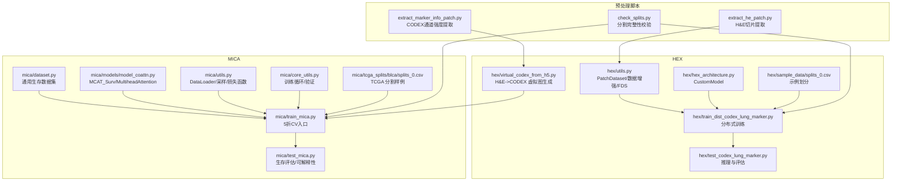
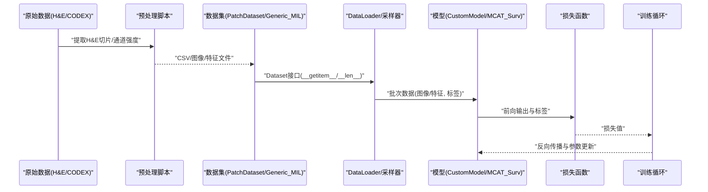
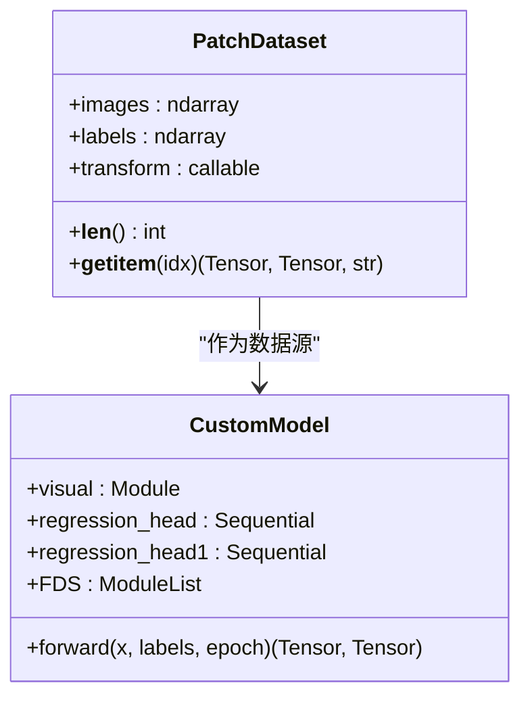
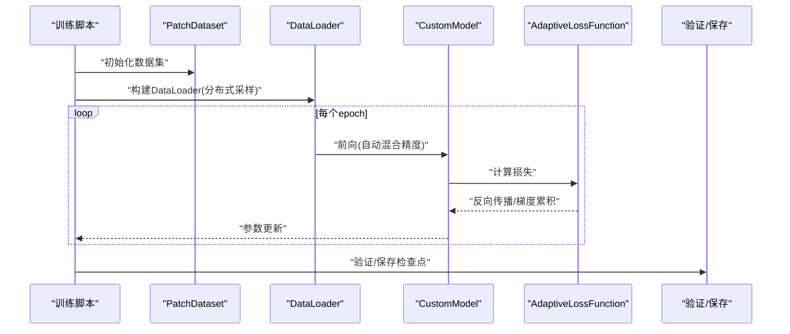
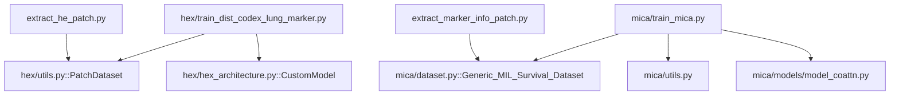

# 数据集处理管道

<cite>
**本文引用的文件**
- [README.md](file://README.md)
- [hex/utils.py](file://hex/utils.py)
- [hex/hex_architecture.py](file://hex/hex_architecture.py)
- [hex/train_dist_codex_lung_marker.py](file://hex/train_dist_codex_lung_marker.py)
- [hex/test_codex_lung_marker.py](file://hex/test_codex_lung_marker.py)
- [hex/virtual_codex_from_h5.py](file://hex/virtual_codex_from_h5.py)
- [hex/sample_data/splits_0.csv](file://hex/sample_data/splits_0.csv)
- [extract_he_patch.py](file://extract_he_patch.py)
- [extract_marker_info_patch.py](file://extract_marker_info_patch.py)
- [check_splits.py](file://check_splits.py)
- [mica/dataset.py](file://mica/dataset.py)
- [mica/models/model_coattn.py](file://mica/models/model_coattn.py)
- [mica/utils.py](file://mica/utils.py)
- [mica/core_utils.py](file://mica/core_utils.py)
- [mica/train_mica.py](file://mica/train_mica.py)
- [mica/test_mica.py](file://mica/test_mica.py)
- [mica/tcga_splits/blca/splits_0.csv](file://mica/tcga_splits/blca/splits_0.csv)
</cite>

## 目录
1. [引言](#引言)
2. [项目结构](#项目结构)
3. [核心组件](#核心组件)
4. [架构总览](#架构总览)
5. [详细组件分析](#详细组件分析)
6. [依赖分析](#依赖分析)
7. [性能考虑](#性能考虑)
8. [故障排查指南](#故障排查指南)
9. [结论](#结论)
10. [附录](#附录)

## 引言
本技术文档围绕数据集处理管道展开，重点阐释 PatchDataset 类的设计与实现，涵盖数据加载器、批处理策略、数据增强、多模态数据组织（H&E 图像与虚拟蛋白质组学数据）、数据预处理流程（特征标准化、缺失值与异常值处理、质量控制）、数据划分与交叉验证，以及性能优化建议与完整使用示例。文档同时结合 HEX（H&E 到蛋白质表达预测）与 MICA（多模态整合生存分析）两条主线，帮助读者在不同任务中高效构建与扩展数据流水线。

## 项目结构
该仓库采用模块化设计，分为两大部分：
- HEX：以 PatchDataset 为核心的数据集与训练流程，负责从 H&E 图像到蛋白质表达的回归任务。
- MICA：基于通用生存分析数据集的多模态融合（H&E + 虚拟蛋白质组学），支持 5 折交叉验证与生存分析评估。

图表来源
- [hex/utils.py:82-98](file://hex/utils.py#L82-L98)
- [hex/train_dist_codex_lung_marker.py:160-169](file://hex/train_dist_codex_lung_marker.py#L160-L169)
- [mica/dataset.py:17-250](file://mica/dataset.py#L17-L250)
- [mica/models/model_coattn.py:12-124](file://mica/models/model_coattn.py#L12-L124)

章节来源
- [README.md:1-57](file://README.md#L1-L57)

## 核心组件
本节聚焦于数据集与数据加载的关键构件，包括 PatchDataset、数据增强、批处理与采样策略、以及多模态数据组织与预处理。

- PatchDataset（HEX）
  - 功能：从 CSV 中读取图像路径与标签列，按索引返回图像、标签与路径；支持可选的图像变换（数据增强）。
  - 关键点：图像路径与标签列由外部 CSV 提供；transform 可传入 torchvision.transforms 组合。
  - 参考路径：[hex/utils.py:82-98](file://hex/utils.py#L82-L98)

- 数据增强（HEX）
  - 训练时增强：随机水平翻转、垂直翻转、旋转、颜色抖动、归一化。
  - 推理时增强：仅尺寸缩放与归一化。
  - 参考路径：[hex/train_dist_codex_lung_marker.py:145-158](file://hex/train_dist_codex_lung_marker.py#L145-L158)

- 批处理与采样（HEX）
  - 训练：随机采样、权重采样（可选）、自定义 collate 函数合并批次。
  - 验证/测试：顺序采样或随机采样，固定 batch_size。
  - 参考路径：[mica/utils.py:53-76](file://mica/utils.py#L53-L76)

- 多模态数据组织（HEX->MICA）
  - H&E 图像：PatchDataset 加载图像与标签。
  - 虚拟蛋白质组学：通过 H&E->CODEX 的映射生成虚拟图，再由 MICA 的 Generic_MIL_Survival_Dataset 组织成 bag（WSI 级别）样本。
  - 参考路径：[hex/virtual_codex_from_h5.py:37-68](file://hex/virtual_codex_from_h5.py#L37-L68)，[mica/dataset.py:230-250](file://mica/dataset.py#L230-L250)

- 特征分布平滑（FDS，HEX）
  - 使用桶化统计与卷积核平滑，对回归特征进行分布校正，提升泛化稳定性。
  - 参考路径：[hex/utils.py:116-327](file://hex/utils.py#L116-L327)

章节来源
- [hex/utils.py:82-98](file://hex/utils.py#L82-L98)
- [hex/train_dist_codex_lung_marker.py:145-158](file://hex/train_dist_codex_lung_marker.py#L145-L158)
- [mica/utils.py:53-76](file://mica/utils.py#L53-L76)
- [hex/virtual_codex_from_h5.py:37-68](file://hex/virtual_codex_from_h5.py#L37-L68)
- [mica/dataset.py:230-250](file://mica/dataset.py#L230-L250)
- [hex/utils.py:116-327](file://hex/utils.py#L116-L327)

## 架构总览
下图展示从原始数据到模型训练与评估的整体流程，强调数据集、数据加载器、模型与损失函数之间的交互。

图表来源
- [extract_he_patch.py:9-78](file://extract_he_patch.py#L9-L78)
- [extract_marker_info_patch.py:21-74](file://extract_marker_info_patch.py#L21-L74)
- [hex/utils.py:82-98](file://hex/utils.py#L82-L98)
- [mica/dataset.py:17-250](file://mica/dataset.py#L17-L250)
- [mica/utils.py:53-76](file://mica/utils.py#L53-L76)
- [mica/models/model_coattn.py:12-124](file://mica/models/model_coattn.py#L12-L124)

## 详细组件分析

### PatchDataset 设计与实现
- 设计要点
  - 以 CSV 为中心的数据组织：images 列为图像路径，label_columns 指定数值型标签列。
  - __getitem__ 返回三元组：图像张量、标签张量、图像路径字符串，便于调试与结果回写。
  - transform 支持外部注入，统一训练/验证的数据增强策略。
- 批处理策略
  - 训练阶段推荐小批量（如 48）以平衡显存与收敛速度；验证阶段可增大 batch_size（如 128）以提升吞吐。
  - 可结合 WeightedRandomSampler 解决类别不平衡问题（MICA）。
- 内存管理
  - PIL.Image 打开图像后建议及时关闭（若自定义读取逻辑），避免内存泄漏。
  - 推理阶段可启用 pin_memory 并限制 num_workers，减少 CPU->GPU 迁移开销。

图表来源
- [hex/utils.py:82-98](file://hex/utils.py#L82-L98)
- [hex/utils.py:32-81](file://hex/utils.py#L32-L81)

章节来源
- [hex/utils.py:82-98](file://hex/utils.py#L82-L98)
- [hex/utils.py:32-81](file://hex/utils.py#L32-L81)

### 数据增强与批处理策略
- 增强策略
  - 训练：随机翻转、旋转、颜色抖动、归一化。
  - 验证：仅尺寸缩放与归一化。
- 批处理
  - 训练：RandomSampler 或 WeightedRandomSampler；collate_MIL_survival_sig 合并多模态批次。
  - 验证：SequentialSampler；pin_memory=True 提升推理吞吐。
- 参考路径
  - [hex/train_dist_codex_lung_marker.py:145-169](file://hex/train_dist_codex_lung_marker.py#L145-L169)
  - [mica/utils.py:53-76](file://mica/utils.py#L53-L76)

章节来源
- [hex/train_dist_codex_lung_marker.py:145-169](file://hex/train_dist_codex_lung_marker.py#L145-L169)
- [mica/utils.py:53-76](file://mica/utils.py#L53-L76)

### 多模态数据组织与配对策略
- H&E 图像与虚拟蛋白质组学配对
  - H&E 图像：PatchDataset 逐切片加载。
  - 虚拟蛋白质组学：通过 H&E->CODEX 映射生成虚拟图，再由 MICA 的 Generic_MIL_Survival_Dataset 组织为 bag（每个 WSI 一个 bag）。
- 数据格式转换
  - H&E 切片：PNG（RGB）。
  - 虚拟蛋白质组学：H5 存储，按坐标映射到图像空间，形成二维特征图。
- 参考路径
  - [hex/virtual_codex_from_h5.py:37-68](file://hex/virtual_codex_from_h5.py#L37-L68)
  - [mica/dataset.py:230-250](file://mica/dataset.py#L230-L250)

章节来源
- [hex/virtual_codex_from_h5.py:37-68](file://hex/virtual_codex_from_h5.py#L37-L68)
- [mica/dataset.py:230-250](file://mica/dataset.py#L230-L250)

### 数据预处理流程与质量控制
- 特征标准化
  - MICA 使用 StandardScaler 对协变量进行标准化（需在外部完成，见 sklearn 文档）。
  - HEX 使用 FDS 对回归特征进行分布平滑，降低长尾影响。
- 缺失值与异常值处理
  - 缺失值：通过 CSV 中的 NaN 处理与过滤（如 dropna）。
  - 异常值：可结合箱线图/分位数裁剪与稳健统计（如中位数、MAD）。
- 数据质量控制
  - check_splits.py 校验训练/验证/测试集合不重叠、患者级别唯一性等。
  - 参考路径：[check_splits.py:72-159](file://check_splits.py#L72-L159)

章节来源
- [check_splits.py:72-159](file://check_splits.py#L72-L159)

### 数据集划分与交叉验证
- HEX 示例划分
  - 单折 CSV：包含 patient_train/patient_val 与 train/val 列。
  - 参考路径：[hex/sample_data/splits_0.csv:1-5](file://hex/sample_data/splits_0.csv#L1-L5)
- MICA 5 折交叉验证
  - 每个癌症亚型（如 BLCA）有 splits_0.csv 至 splits_4.csv，每折包含 train/val/test。
  - 分割完整性检查：确保折间无重叠、患者唯一性、slide 唯一性。
  - 参考路径：[mica/tcga_splits/blca/splits_0.csv:1-356](file://mica/tcga_splits/blca/splits_0.csv#L1-L356)，[check_splits.py:107-148](file://check_splits.py#L107-L148)

章节来源
- [hex/sample_data/splits_0.csv:1-5](file://hex/sample_data/splits_0.csv#L1-L5)
- [mica/tcga_splits/blca/splits_0.csv:1-356](file://mica/tcga_splits/blca/splits_0.csv#L1-L356)
- [check_splits.py:107-148](file://check_splits.py#L107-L148)

### HEX 训练与推理流程
- 训练流程
  - 构建 PatchDataset → DistributedSampler/DataLoader → CustomModel → AdaptiveLossFunction → 分布式训练与梯度累积 → 定期保存检查点。
  - 参考路径：[hex/train_dist_codex_lung_marker.py:160-396](file://hex/train_dist_codex_lung_marker.py#L160-L396)
- 推理流程
  - 加载模型 → 构建 Dataset → DataLoader（pin_memory=True）→ 自动混合精度推理 → 保存 patch 级别预测与标签 → 计算 Pearson 相关系数。
  - 参考路径：[hex/test_codex_lung_marker.py:75-189](file://hex/test_codex_lung_marker.py#L75-L189)

图表来源
- [hex/train_dist_codex_lung_marker.py:160-396](file://hex/train_dist_codex_lung_marker.py#L160-L396)
- [hex/utils.py:32-81](file://hex/utils.py#L32-L81)

章节来源
- [hex/train_dist_codex_lung_marker.py:160-396](file://hex/train_dist_codex_lung_marker.py#L160-L396)
- [hex/test_codex_lung_marker.py:75-189](file://hex/test_codex_lung_marker.py#L75-L189)

### MICA 多模态生存分析
- 数据集与模型
  - Generic_MIL_Survival_Dataset：按 slide 组织 bag，加载 WSI 特征与虚拟蛋白质组学特征。
  - MCAT_Surv：双模态 Transformer + 共注意力 + 融合（拼接/双线性）+ 生存头。
- 训练与评估
  - 5 折交叉验证，NLLSurvLoss，c-index 评估，支持可解释性（Integrated Gradients）。
- 参考路径
  - [mica/dataset.py:17-250](file://mica/dataset.py#L17-L250)
  - [mica/models/model_coattn.py:12-124](file://mica/models/model_coattn.py#L12-L124)
  - [mica/train_mica.py:28-238](file://mica/train_mica.py#L28-L238)
  - [mica/test_mica.py:79-324](file://mica/test_mica.py#L79-L324)

章节来源
- [mica/dataset.py:17-250](file://mica/dataset.py#L17-L250)
- [mica/models/model_coattn.py:12-124](file://mica/models/model_coattn.py#L12-L124)
- [mica/train_mica.py:28-238](file://mica/train_mica.py#L28-L238)
- [mica/test_mica.py:79-324](file://mica/test_mica.py#L79-L324)

## 依赖分析
- 内部依赖
  - HEX：PatchDataset 依赖 PIL.Image、torchvision.transforms；训练脚本依赖 DistributedDataParallel、DistributedSampler。
  - MICA：Generic_MIL_Survival_Dataset 依赖 h5py 读取虚拟蛋白质组学特征；DataLoader 依赖 WeightedRandomSampler。
- 外部依赖
  - 详见根目录 README 的依赖列表，包括 PyTorch、timm、sklearn、scipy、openslide、palom 等。

图表来源
- [hex/train_dist_codex_lung_marker.py:160-190](file://hex/train_dist_codex_lung_marker.py#L160-L190)
- [hex/utils.py:82-98](file://hex/utils.py#L82-L98)
- [hex/hex_architecture.py:9-37](file://hex/hex_architecture.py#L9-L37)
- [mica/train_mica.py:17-238](file://mica/train_mica.py#L17-L238)
- [mica/dataset.py:230-250](file://mica/dataset.py#L230-L250)
- [mica/utils.py:53-76](file://mica/utils.py#L53-L76)
- [mica/models/model_coattn.py:12-124](file://mica/models/model_coattn.py#L12-L124)
- [extract_he_patch.py:9-78](file://extract_he_patch.py#L9-L78)
- [extract_marker_info_patch.py:21-74](file://extract_marker_info_patch.py#L21-L74)

章节来源
- [README.md:7-24](file://README.md#L7-L24)

## 性能考虑
- 批量大小与内存
  - 训练：根据 GPU 显存选择合适 batch_size；必要时启用 gradient accumulation（MICA 已内置）。
  - 推理：增大 batch_size 并开启 pin_memory，减少 CPU->GPU 拷贝。
- 数据并行与分布式
  - 使用 DistributedSampler 保证各进程数据不重复；DDP 提升吞吐。
- 缓存策略
  - 将预处理后的 H&E 切片与虚拟蛋白质组学特征缓存至 SSD/HDD，避免重复 I/O。
  - 对于大图像，可先做金字塔或降采样，再按坐标映射。
- 数据增强与混合精度
  - 训练时启用 auto mixed precision（AMP）以加速并节省显存。
- I/O 与并行
  - 多进程提取 H&E 切片与 CODEX 通道强度，充分利用 CPU 资源。
- 参考路径
  - [hex/train_dist_codex_lung_marker.py:167-227](file://hex/train_dist_codex_lung_marker.py#L167-L227)
  - [mica/utils.py:53-76](file://mica/utils.py#L53-L76)
  - [extract_he_patch.py:60-74](file://extract_he_patch.py#L60-L74)
  - [extract_marker_info_patch.py:56-60](file://extract_marker_info_patch.py#L56-L60)

章节来源
- [hex/train_dist_codex_lung_marker.py:167-227](file://hex/train_dist_codex_lung_marker.py#L167-L227)
- [mica/utils.py:53-76](file://mica/utils.py#L53-L76)
- [extract_he_patch.py:60-74](file://extract_he_patch.py#L60-L74)
- [extract_marker_info_patch.py:56-60](file://extract_marker_info_patch.py#L56-L60)

## 故障排查指南
- 分割错误
  - 症状：训练/验证共享 slide_id 或 patient_id。
  - 处理：使用 check_splits.py 校验；确保每折 CSV 的 train/val 不重叠且患者唯一。
  - 参考路径：[check_splits.py:53-69](file://check_splits.py#L53-L69)，[mica/train_mica.py:52-64](file://mica/train_mica.py#L52-L64)
- 数据加载错误
  - 症状：图像路径不存在或标签列缺失。
  - 处理：确认 CSV 中 images 列与 label_columns 正确；检查路径拼接逻辑。
  - 参考路径：[hex/utils.py:82-98](file://hex/utils.py#L82-L98)
- 分布式训练异常
  - 症状：进程同步失败或梯度未聚合。
  - 处理：检查 NCCL 初始化、端口配置与 WORLD_SIZE；确保所有进程广播对象一致。
  - 参考路径：[hex/train_dist_codex_lung_marker.py:28-39](file://hex/train_dist_codex_lung_marker.py#L28-L39)
- 推理结果异常
  - 症状：预测值全为 NaN 或极值。
  - 处理：检查归一化参数与 transform 一致性；确认输入 dtype 与设备匹配。
  - 参考路径：[hex/test_codex_lung_marker.py:124-133](file://hex/test_codex_lung_marker.py#L124-L133)

章节来源
- [check_splits.py:53-69](file://check_splits.py#L53-L69)
- [mica/train_mica.py:52-64](file://mica/train_mica.py#L52-L64)
- [hex/utils.py:82-98](file://hex/utils.py#L82-L98)
- [hex/train_dist_codex_lung_marker.py:28-39](file://hex/train_dist_codex_lung_marker.py#L28-L39)
- [hex/test_codex_lung_marker.py:124-133](file://hex/test_codex_lung_marker.py#L124-L133)

## 结论
本文系统梳理了数据集处理管道的核心组件与实现细节，覆盖了从数据准备、数据集构建、数据加载器配置、多模态组织、预处理与质量控制，到训练与评估的全流程。通过 PatchDataset 与 MICA 的通用生存数据集，结合分布式训练与可解释性分析，为 H&E 与虚拟蛋白质组学的联合建模提供了可复用的工程化方案。建议在实际部署中重点关注 I/O 并行、批处理策略与分布式同步，以获得最佳性能与稳定性。

## 附录
- 数据加载示例（步骤说明）
  - 准备 H&E 切片：运行 [extract_he_patch.py:46-78](file://extract_he_patch.py#L46-L78)。
  - 提取 CODEX 通道强度：运行 [extract_marker_info_patch.py:21-74](file://extract_marker_info_patch.py#L21-L74)。
  - 生成虚拟蛋白质组学图：运行 [hex/virtual_codex_from_h5.py:37-68](file://hex/virtual_codex_from_h5.py#L37-L68)。
  - 构建数据集与 DataLoader：参考 [hex/utils.py:82-98](file://hex/utils.py#L82-L98) 与 [mica/utils.py:53-76](file://mica/utils.py#L53-L76)。
  - 训练/推理：参考 [hex/train_dist_codex_lung_marker.py:160-396](file://hex/train_dist_codex_lung_marker.py#L160-L396) 与 [hex/test_codex_lung_marker.py:75-189](file://hex/test_codex_lung_marker.py#L75-L189)。
  - 多模态生存分析：参考 [mica/train_mica.py:28-238](file://mica/train_mica.py#L28-L238) 与 [mica/test_mica.py:79-324](file://mica/test_mica.py#L79-L324)。