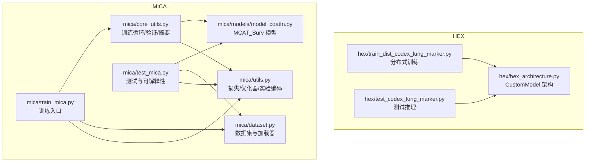
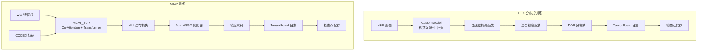
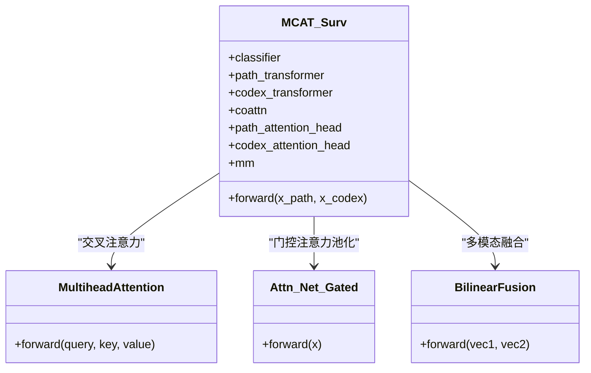
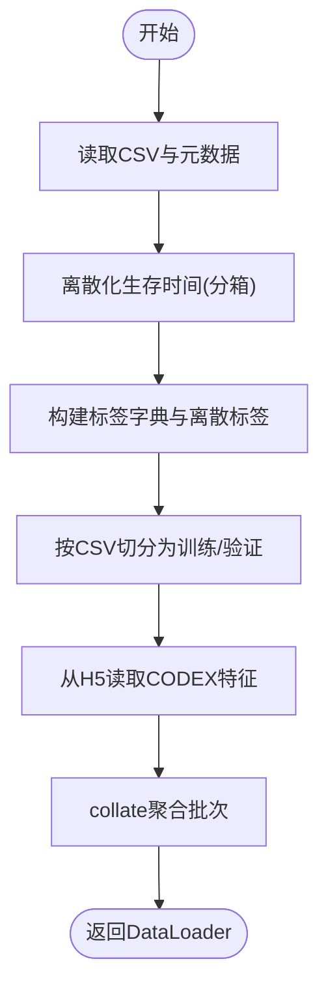
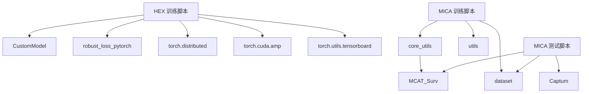

# 训练测试工作流程

<cite>
**本文档引用的文件**
- [README.md](file://README.md)
- [hex/hex_architecture.py](file://hex/hex_architecture.py)
- [hex/train_dist_codex_lung_marker.py](file://hex/train_dist_codex_lung_marker.py)
- [hex/test_codex_lung_marker.py](file://hex/test_codex_lung_marker.py)
- [mica/models/model_coattn.py](file://mica/models/model_coattn.py)
- [mica/train_mica.py](file://mica/train_mica.py)
- [mica/test_mica.py](file://mica/test_mica.py)
- [mica/core_utils.py](file://mica/core_utils.py)
- [mica/dataset.py](file://mica/dataset.py)
- [mica/utils.py](file://mica/utils.py)
</cite>

## 目录
1. [简介](#简介)
2. [项目结构](#项目结构)
3. [核心组件](#核心组件)
4. [架构总览](#架构总览)
5. [详细组件分析](#详细组件分析)
6. [依赖关系分析](#依赖关系分析)
7. [性能考虑](#性能考虑)
8. [故障排查指南](#故障排查指南)
9. [结论](#结论)
10. [附录](#附录)

## 简介
本文件面向训练与测试工作流程，围绕两个主要任务展开：
- HEX：从H&E图像预测蛋白质表达（回归），采用分布式训练与自适应损失函数，支持特征分布统计（FDS）与梯度缩放（AMP）。
- MICA：多模态生存分析（MCAT_Surv），基于注意力引导的双模态融合，使用负对数似然生存损失、梯度累积与TensorBoard日志记录。

文档涵盖训练配置、损失函数、优化器与学习率调度、梯度裁剪、评估指标、注意力与特征重要性分析、监控与调试技术、超参数调优建议以及测试推理流程与结果后处理。

## 项目结构
项目采用模块化组织，分别包含HEX与MICA两套完整流水线：
- HEX子目录：HEX模型架构、分布式训练脚本、测试脚本
- MICA子目录：MCAT_Surv模型实现、训练/测试脚本、数据集与工具函数
- 根目录：说明文档与通用依赖



图表来源
- [hex/hex_architecture.py:9-37](file://hex/hex_architecture.py#L9-L37)
- [hex/train_dist_codex_lung_marker.py:179-227](file://hex/train_dist_codex_lung_marker.py#L179-L227)
- [hex/test_codex_lung_marker.py:62-74](file://hex/test_codex_lung_marker.py#L62-L74)
- [mica/models/model_coattn.py:12-124](file://mica/models/model_coattn.py#L12-L124)
- [mica/train_mica.py:28-88](file://mica/train_mica.py#L28-L88)
- [mica/core_utils.py:15-82](file://mica/core_utils.py#L15-L82)
- [mica/dataset.py:193-227](file://mica/dataset.py#L193-L227)
- [mica/utils.py:79-87](file://mica/utils.py#L79-L87)

章节来源
- [README.md:1-57](file://README.md#L1-L57)

## 核心组件
- HEX回归模型：基于视觉编码器输出，通过回归头预测40个生物标志物强度。
- MICA生存模型：MCAT_Surv，双模态（H&E与CODEX）注意力引导的Transformer与门控注意力池化，输出离散风险与生存函数。
- 数据集：滑脉数据集，按slide级别标注生存时间与删失状态。
- 训练工具：NLL生存损失、优化器选择、梯度累积、TensorBoard日志、可选加权采样。

章节来源
- [hex/hex_architecture.py:9-37](file://hex/hex_architecture.py#L9-L37)
- [mica/models/model_coattn.py:12-124](file://mica/models/model_coattn.py#L12-L124)
- [mica/dataset.py:193-227](file://mica/dataset.py#L193-L227)
- [mica/utils.py:173-216](file://mica/utils.py#L173-L216)

## 架构总览
HEX与MICA分别对应不同的任务范式：前者是多输出回归，后者是生存分析。两者均强调多模态信息融合与注意力机制，并在训练中引入分布式与混合精度以提升效率。



图表来源
- [hex/train_dist_codex_lung_marker.py:215-227](file://hex/train_dist_codex_lung_marker.py#L215-L227)
- [mica/core_utils.py:85-146](file://mica/core_utils.py#L85-L146)
- [mica/utils.py:79-87](file://mica/utils.py#L79-L87)

## 详细组件分析

### HEX 分布式训练与测试
- 分布式初始化与同步：使用NCCL后端，本地/全局rank管理，广播分割集合，避免训练/验证患者重叠。
- 数据加载：PatchDataset，图像归一化，训练/验证增强策略，分布式采样器。
- 模型与冻结策略：仅解冻最后若干编码层与回归头，减少计算开销。
- 损失与优化：自适应损失函数（针对多输出回归），指数衰减学习率调度，混合精度缩放，梯度同步与更新。
- 监控与日志：TensorBoard记录训练/验证MSE与平均Pearson相关系数；定期保存检查点。
- 测试：加载权重，自动混合精度推理，汇总每个patch的预测与标签，计算每生物标志物的Pearson相关系数并排序。

```mermaid
sequenceDiagram
participant Trainer as "分布式训练器"
participant Model as "CustomModel"
participant Loader as "DataLoader"
participant Loss as "自适应损失"
participant Opt as "优化器"
participant AMP as "GradScaler"
participant TB as "TensorBoard"
Trainer->>Loader : 初始化分布式采样器与数据加载
Trainer->>Model : 前向传播(autocast)
Model-->>Trainer : 预测输出, 特征
Trainer->>Loss : 计算损失
Trainer->>AMP : 缩放反向传播
AMP-->>Trainer : 反向梯度
Trainer->>Opt : 同步梯度并更新参数
Trainer->>TB : 记录损失与指标
Trainer->>Trainer : 定期保存检查点
```

图表来源
- [hex/train_dist_codex_lung_marker.py:245-392](file://hex/train_dist_codex_lung_marker.py#L245-L392)

章节来源
- [hex/train_dist_codex_lung_marker.py:28-392](file://hex/train_dist_codex_lung_marker.py#L28-L392)
- [hex/test_codex_lung_marker.py:75-186](file://hex/test_codex_lung_marker.py#L75-L186)

### MICA 训练与评估（MCAT_Surv）
- 模型结构：双模态特征经FC映射后进行交叉注意力（Co-Attention），随后进入H&E引导的Transformer编码，门控注意力池化，多模态融合（拼接或双线性），最终分类器输出离散风险与生存函数。
- 训练循环：单折训练，NLL生存损失，可选正则项，梯度累积，TensorBoard记录训练/验证c-index与损失。
- 评估：验证集上计算c-index，保存检查点，测试时加载权重并计算每个样本的风险评分与删失状态，支持集成梯度可解释性（Captum）。



图表来源
- [mica/models/model_coattn.py:12-124](file://mica/models/model_coattn.py#L12-L124)
- [mica/models/model_coattn.py:459-615](file://mica/models/model_coattn.py#L459-L615)
- [mica/models/model_coattn.py:683-714](file://mica/models/model_coattn.py#L683-L714)
- [mica/models/model_coattn.py:616-680](file://mica/models/model_coattn.py#L616-L680)

章节来源
- [mica/models/model_coattn.py:12-124](file://mica/models/model_coattn.py#L12-L124)
- [mica/core_utils.py:85-193](file://mica/core_utils.py#L85-L193)
- [mica/utils.py:173-216](file://mica/utils.py#L173-L216)

### 数据集与加载器
- Generic_MIL_Survival_Dataset：按slide级别构建生存数据，离散化生存时间，生成标签字典，支持按患者或slide划分。
- Generic_Split：从H5读取CODEX特征，构造滑脉数据集，支持按训练/验证CSV切分。
- 加载器：支持加权采样（平衡类别）、随机/顺序采样，collate函数聚合批次。



图表来源
- [mica/dataset.py:193-227](file://mica/dataset.py#L193-L227)
- [mica/dataset.py:230-250](file://mica/dataset.py#L230-L250)

章节来源
- [mica/dataset.py:17-100](file://mica/dataset.py#L17-L100)
- [mica/dataset.py:193-227](file://mica/dataset.py#L193-L227)

### 训练配置与超参数
- HEX
  - 分布式：NCCL，DDP，分布式采样器，进程间广播/规约
  - 模型：视觉编码器解冻策略，回归头全量训练
  - 损失：自适应损失函数（多输出）
  - 优化：Adam（可选SGD），指数衰减学习率
  - 训练：混合精度缩放，梯度累积，TensorBoard日志
- MICA
  - 模型：MCAT_Surv，支持共享/分离Transformer、门控注意力池化、拼接/双线性融合
  - 损失：NLL生存损失，可调节uncensored权重
  - 优化：Adam/SGD，L2正则，可选加权采样
  - 训练：梯度累积，TensorBoard日志，5折交叉验证

章节来源
- [hex/train_dist_codex_lung_marker.py:28-392](file://hex/train_dist_codex_lung_marker.py#L28-L392)
- [mica/train_mica.py:91-139](file://mica/train_mica.py#L91-L139)
- [mica/utils.py:79-87](file://mica/utils.py#L79-L87)

### 评估指标与注意力分析
- HEX：Patch级Pearson相关系数，按生物标志物排序，统计摘要（均值、中位数、极值）。
- MICA：c-index（删失校正一致性指数），注意力权重（Co-Attention、H&E、CODEX），可选集成梯度解释。

章节来源
- [hex/test_codex_lung_marker.py:156-186](file://hex/test_codex_lung_marker.py#L156-L186)
- [mica/test_mica.py:32-77](file://mica/test_mica.py#L32-L77)
- [mica/models/model_coattn.py](file://mica/models/model_coattn.py#L121)

### 监控与调试技术
- HEX：TensorBoard记录训练/验证MSE与平均Pearson相关系数；定期保存检查点；分布式规约统计。
- MICA：TensorBoard记录训练/验证损失与c-index；可选早停（参数存在但未在脚本中启用）；网络规模打印与参数计数。
- 调试：断言训练/验证不共享slide_id；可选加权采样缓解类别不平衡；梯度累积控制内存占用。

章节来源
- [hex/train_dist_codex_lung_marker.py:326-381](file://hex/train_dist_codex_lung_marker.py#L326-L381)
- [mica/core_utils.py:142-193](file://mica/core_utils.py#L142-L193)
- [mica/train_mica.py:53-64](file://mica/train_mica.py#L53-L64)

## 依赖关系分析
- HEX：依赖视觉编码器（MUSK）、自适应损失（robust_loss_pytorch）、分布式通信（torch.distributed）、混合精度（torch.cuda.amp）、TensorBoard（torch.utils.tensorboard）。
- MICA：依赖PyTorch、sklearn（StandardScaler）、scipy（stats）、lifelines/sksurvival（c-index）、Captum（可解释性）。



图表来源
- [hex/train_dist_codex_lung_marker.py:24-26](file://hex/train_dist_codex_lung_marker.py#L24-L26)
- [mica/train_mica.py:16-20](file://mica/train_mica.py#L16-L20)
- [mica/test_mica.py:15-23](file://mica/test_mica.py#L15-L23)

章节来源
- [hex/train_dist_codex_lung_marker.py:1-400](file://hex/train_dist_codex_lung_marker.py#L1-L400)
- [mica/train_mica.py:1-238](file://mica/train_mica.py#L1-L238)
- [mica/test_mica.py:1-324](file://mica/test_mica.py#L1-L324)

## 性能考虑
- 内存优化
  - 梯度累积：通过增大gc参数减少显存峰值，适合变长bag或大batch场景。
  - 混合精度：AMP自动缩放显著降低显存占用与加速训练。
  - 分布式：DDP并行与分布式采样器，进程间规约统计，适合大规模数据。
- 计算效率
  - 解冻策略：仅训练最后几层与回归头，减少前馈/反向开销。
  - 自适应损失：对多输出回归更鲁棒，有助于稳定收敛。
- I/O与数据加载
  - H5读取CODEX特征，批内collate聚合，注意磁盘带宽与CPU预处理瓶颈。

[本节为通用指导，无需特定文件来源]

## 故障排查指南
- 分割错误
  - 断言训练/验证不共享slide_id与患者id，若失败需检查CSV与数据一致性。
- 分布式问题
  - NCCL初始化失败、端口冲突、GPU可见性；确保环境变量与设备索引正确。
- 指标异常
  - c-index为NaN/Inf：检查删失状态与事件时间是否一致，确认离散化边界。
  - Pearson相关系数异常：检查标签范围与预测范围一致性，必要时做归一化。
- 训练不稳定
  - 学习率过高导致震荡：尝试指数衰减或余弦退火；降低初始学习率。
  - 梯度爆炸：检查损失函数与标签，适当增加正则或使用梯度裁剪（当前未显式使用）。

章节来源
- [mica/train_mica.py:53-64](file://mica/train_mica.py#L53-L64)
- [mica/test_mica.py:106-118](file://mica/test_mica.py#L106-L118)

## 结论
本工作流提供了从图像到蛋白质表达（HEX）与从多模态特征到生存分析（MICA）的完整训练与测试方案。HEX采用分布式与自适应损失，MICA采用MCAT_Surv架构与NLL生存损失。两者均具备完善的日志、检查点与评估能力，并支持注意力与可解释性分析。结合梯度累积、AMP与分布式并行，可在大规模数据上高效训练。

[本节为总结，无需特定文件来源]

## 附录

### 训练配置示例与最佳实践
- HEX
  - 分布式启动：使用torchrun指定节点数与每节点GPU数，确保NCCL后端可用。
  - 冻结策略：先冻结全部参数，再逐步解冻视觉编码器最后几层与回归头。
  - 损失函数：自适应损失函数适合多输出回归，可随训练动态调整权重。
  - 学习率：指数衰减，可在后期冻结视觉编码器时进一步降低学习率。
  - 日志：TensorBoard记录MSE与Pearson相关系数，便于快速定位问题。
- MICA
  - 模型选择：根据数据规模选择共享/分离Transformer；门控注意力池化可提升泛化。
  - 损失与正则：NLL生存损失配合L2/L1正则，可调节uncensored权重以平衡删失样本。
  - 优化器：Adam为主，SGD用于特定场景；L2正则抑制过拟合。
  - 数据划分：严格避免slide/患者重叠，确保交叉验证可靠性。
  - 可解释性：测试阶段可启用集成梯度，可视化空间模式。

章节来源
- [README.md:32-44](file://README.md#L32-L44)
- [hex/train_dist_codex_lung_marker.py:28-392](file://hex/train_dist_codex_lung_marker.py#L28-L392)
- [mica/train_mica.py:91-139](file://mica/train_mica.py#L91-L139)
- [mica/utils.py:79-87](file://mica/utils.py#L79-L87)

### 测试阶段推理与结果后处理
- HEX测试
  - 加载模型权重，自动混合精度推理，汇总所有patch的预测与标签，计算每生物标志物的Pearson相关系数并排序，输出统计摘要。
- MICA测试
  - 加载训练得到的检查点，计算每个样本的风险评分与删失状态，汇总c-index，可选集成梯度解释。

章节来源
- [hex/test_codex_lung_marker.py:75-186](file://hex/test_codex_lung_marker.py#L75-L186)
- [mica/test_mica.py:79-173](file://mica/test_mica.py#L79-L173)