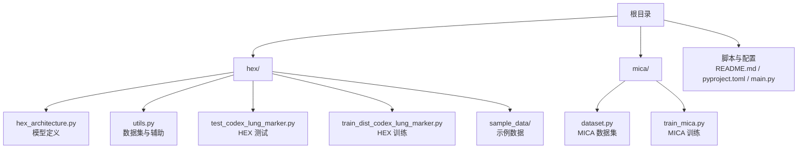
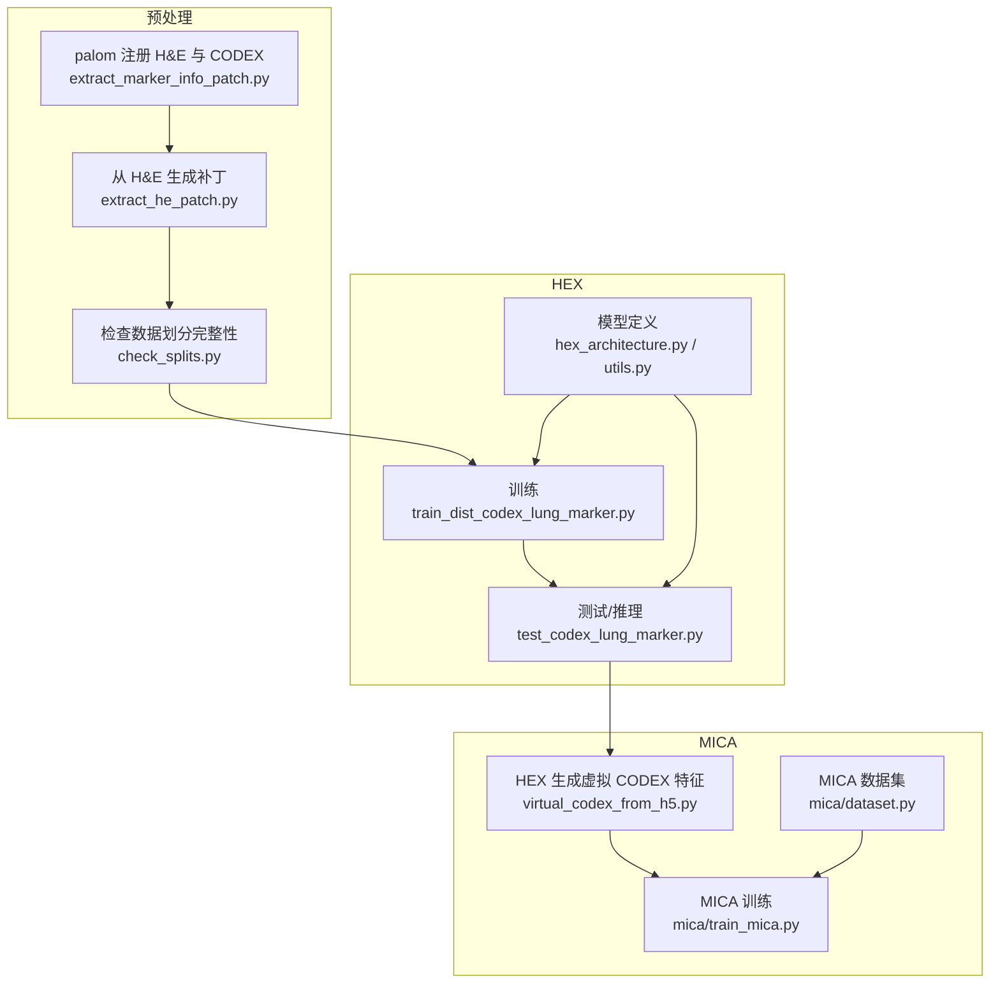
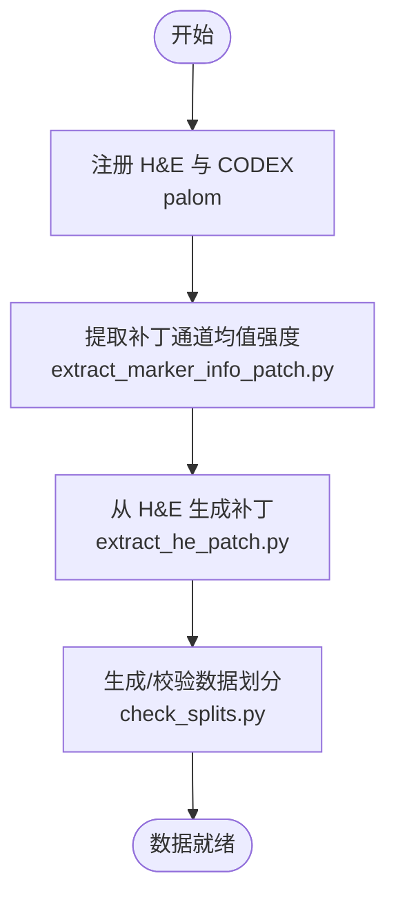
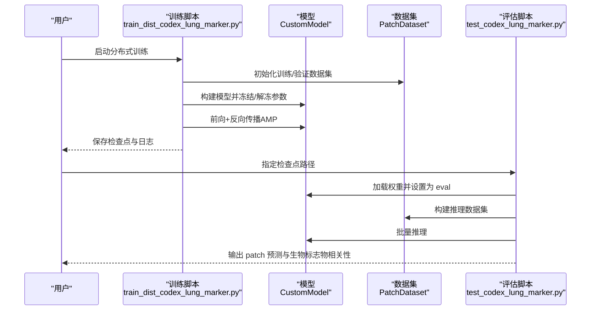
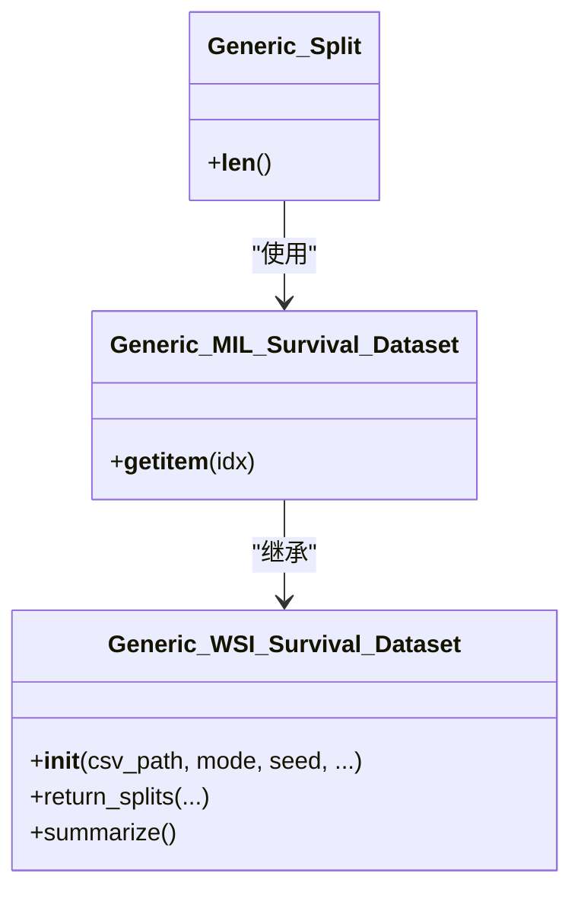
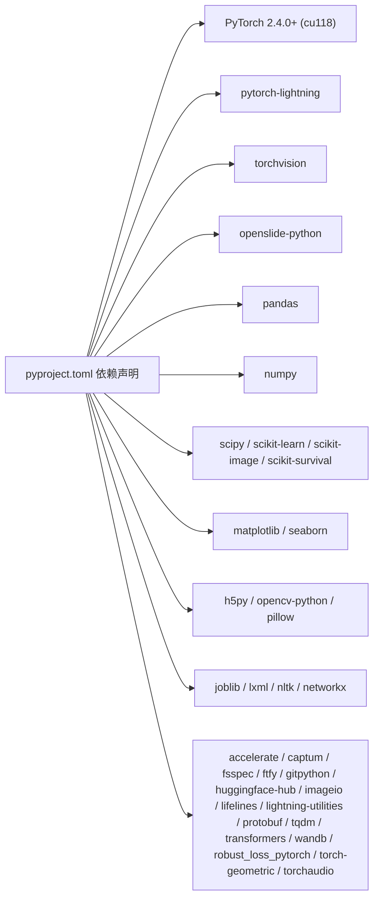

# 快速开始

<cite>
**本文引用的文件**
- [README.md](file://README.md)
- [pyproject.toml](file://pyproject.toml)
- [main.py](file://main.py)
- [hex/hex_architecture.py](file://hex/hex_architecture.py)
- [hex/utils.py](file://hex/utils.py)
- [hex/test_codex_lung_marker.py](file://hex/test_codex_lung_marker.py)
- [hex/train_dist_codex_lung_marker.py](file://hex/train_dist_codex_lung_marker.py)
- [extract_he_patch.py](file://extract_he_patch.py)
- [extract_marker_info_patch.py](file://extract_marker_info_patch.py)
- [check_splits.py](file://check_splits.py)
- [hex/sample_data/splits_0.csv](file://hex/sample_data/splits_0.csv)
- [hex/virtual_codex_from_h5.py](file://hex/virtual_codex_from_h5.py)
- [mica/dataset.py](file://mica/dataset.py)
- [mica/train_mica.py](file://mica/train_mica.py)
</cite>

## 目录
1. [简介](#简介)
2. [项目结构](#项目结构)
3. [核心组件](#核心组件)
4. [架构总览](#架构总览)
5. [详细组件分析](#详细组件分析)
6. [依赖关系分析](#依赖关系分析)
7. [性能与资源建议](#性能与资源建议)
8. [常见问题与故障排除](#常见问题与故障排除)
9. [结论](#结论)
10. [附录：基础使用示例](#附录基础使用示例)

## 简介
本指南面向首次接触 HEX 项目的用户，帮助你在最短时间内完成环境配置、数据准备与基础运行，快速看到预期结果。HEX 是从 H&E 图像生成虚拟空间蛋白组学的 AI 模型，支持对 40 种生物标志物的表达预测，并可与 MICA 联合实现生存分析等下游任务。

## 项目结构
HEX 仓库采用模块化组织：
- 根目录包含训练、测试脚本与项目配置
- hex 子目录包含 HEX 模型、数据集与工具
- mica 子目录包含 MICA 训练与数据集定义
- 提供示例数据用于快速验证

图表来源
- [README.md:1-57](file://README.md#L1-L57)
- [hex/hex_architecture.py:1-37](file://hex/hex_architecture.py#L1-L37)
- [hex/utils.py:1-342](file://hex/utils.py#L1-L342)
- [mica/dataset.py:1-250](file://mica/dataset.py#L1-L250)
- [mica/train_mica.py:1-238](file://mica/train_mica.py#L1-L238)

章节来源
- [README.md:1-57](file://README.md#L1-L57)

## 核心组件
- HEX 模型与回归头：基于视觉编码器输出，通过两段线性层回归得到 40 个生物标志物的表达值。
- 数据集与增强：PatchDataset 支持图像路径、标签列与变换；训练时使用随机翻转、旋转、颜色抖动等增强。
- 分布式训练：使用 torchrun 启动多卡训练，DDP 封装模型，分布式采样与梯度同步。
- 预测与评估：加载预训练权重，对样本数据进行推理，计算每个生物标志物的皮尔逊相关系数并保存结果。

章节来源
- [hex/hex_architecture.py:9-37](file://hex/hex_architecture.py#L9-L37)
- [hex/utils.py:82-98](file://hex/utils.py#L82-L98)
- [hex/train_dist_codex_lung_marker.py:160-169](file://hex/train_dist_codex_lung_marker.py#L160-L169)
- [hex/test_codex_lung_marker.py:62-74](file://hex/test_codex_lung_marker.py#L62-L74)

## 架构总览
HEX 的端到端工作流分为三步：预处理（CODEX/H&E 注册与补丁提取）、训练/测试 HEX、训练/测试 MICA。下图展示了从 WSI 到最终预测的关键路径。

图表来源
- [README.md:26-44](file://README.md#L26-L44)
- [extract_marker_info_patch.py:1-74](file://extract_marker_info_patch.py#L1-L74)
- [extract_he_patch.py:1-78](file://extract_he_patch.py#L1-L78)
- [check_splits.py:1-159](file://check_splits.py#L1-L159)
- [hex/train_dist_codex_lung_marker.py:1-400](file://hex/train_dist_codex_lung_marker.py#L1-L400)
- [hex/test_codex_lung_marker.py:1-189](file://hex/test_codex_lung_marker.py#L1-L189)
- [hex/hex_architecture.py:1-37](file://hex/hex_architecture.py#L1-L37)
- [hex/utils.py:1-342](file://hex/utils.py#L1-L342)
- [hex/virtual_codex_from_h5.py:1-68](file://hex/virtual_codex_from_h5.py#L1-L68)
- [mica/dataset.py:1-250](file://mica/dataset.py#L1-L250)
- [mica/train_mica.py:1-238](file://mica/train_mica.py#L1-L238)

## 详细组件分析

### 环境与依赖
- 硬件要求
  - NVIDIA GPU（已验证在 NVIDIA L40S x8 上运行）
  - CUDA 11.8，cuDNN 9.1（Ubuntu 22.04）
- 软件要求
  - Python 3.10+
  - PyTorch 2.4.0+（带 CUDA 11.8）
- 关键 Python 库（部分）
  - openslide-python、pandas、numpy、torchvision、transformers、timm、pytorch-lightning、scikit-learn、scipy、matplotlib、seaborn、h5py、opencv-python、pillow、wandb、tensorboardx、joblib、lxml、nltk、networkx、captum、accelerate、ftfy、gitpython、huggingface-hub、imageio、lifelines、lightning-utilities、protobuf、scikit-image、scikit-survival、tqdm、wandb、robust_loss_pytorch、torch-geometric、torchaudio
- 包管理与索引
  - 使用 uv 管理依赖，额外索引指向 PyTorch CUDA 11.8

章节来源
- [README.md:9-16](file://README.md#L9-L16)
- [pyproject.toml:1-48](file://pyproject.toml#L1-L48)

### 数据准备流程
- 注册与特征提取
  - 使用 palom 对齐 H&E 与 CODEX 图像，随后用 extract_marker_info_patch.py 为每个补丁计算通道均值强度，生成每张 WSI 的 CSV 文件。
- 补丁提取
  - 使用 extract_he_patch.py 读取 H&E WSI，按 CSV 中坐标裁剪固定尺寸补丁并保存为 PNG。
- 数据划分与校验
  - 使用 CLAM 风格的患者级划分文件（splits_*.csv），check_splits.py 校验训练/验证集合不重叠且覆盖完整。
- 示例数据
  - hex/sample_data/splits_0.csv 提供示例划分；HEX 测试脚本默认读取该示例数据进行推理演示。

图表来源
- [README.md:26-30](file://README.md#L26-L30)
- [extract_marker_info_patch.py:1-74](file://extract_marker_info_patch.py#L1-L74)
- [extract_he_patch.py:1-78](file://extract_he_patch.py#L1-L78)
- [check_splits.py:72-104](file://check_splits.py#L72-L104)
- [hex/sample_data/splits_0.csv:1-5](file://hex/sample_data/splits_0.csv#L1-L5)

章节来源
- [README.md:26-30](file://README.md#L26-L30)
- [extract_marker_info_patch.py:1-74](file://extract_marker_info_patch.py#L1-L74)
- [extract_he_patch.py:1-78](file://extract_he_patch.py#L1-L78)
- [check_splits.py:1-159](file://check_splits.py#L1-L159)
- [hex/sample_data/splits_0.csv:1-5](file://hex/sample_data/splits_0.csv#L1-L5)

### HEX 模型与训练/测试
- 模型结构
  - 基于视觉编码器（musk_large_patch16_384），去除头部与归一化，随后接两段回归头，输出 40 维向量。
- 训练
  - 多卡分布式训练，使用 DDP，训练时启用随机增强与自适应损失函数，支持 FDS 平滑。
- 测试/推理
  - 加载预训练权重，对补丁图像进行推理，计算每个生物标志物的皮尔逊相关系数并保存结果。

图表来源
- [hex/train_dist_codex_lung_marker.py:160-169](file://hex/train_dist_codex_lung_marker.py#L160-L169)
- [hex/train_dist_codex_lung_marker.py:179-226](file://hex/train_dist_codex_lung_marker.py#L179-L226)
- [hex/test_codex_lung_marker.py:62-74](file://hex/test_codex_lung_marker.py#L62-L74)
- [hex/test_codex_lung_marker.py:118-133](file://hex/test_codex_lung_marker.py#L118-L133)
- [hex/hex_architecture.py:9-37](file://hex/hex_architecture.py#L9-L37)
- [hex/utils.py:32-81](file://hex/utils.py#L32-L81)

章节来源
- [hex/hex_architecture.py:9-37](file://hex/hex_architecture.py#L9-L37)
- [hex/utils.py:32-81](file://hex/utils.py#L32-L81)
- [hex/train_dist_codex_lung_marker.py:160-169](file://hex/train_dist_codex_lung_marker.py#L160-L169)
- [hex/test_codex_lung_marker.py:62-74](file://hex/test_codex_lung_marker.py#L62-L74)

### MICA 训练与数据集
- 数据集
  - Generic_MIL_Survival_Dataset 支持生存分析任务，按 slide 维度组织数据，支持多种融合模式（本仓库仅支持 coattn）。
- 训练
  - 通过 mica/train_mica.py 启动 5 折交叉验证，支持不同超参组合，输出汇总结果与 pkl 结果文件。

图表来源
- [mica/dataset.py:17-104](file://mica/dataset.py#L17-L104)
- [mica/dataset.py:193-227](file://mica/dataset.py#L193-L227)
- [mica/dataset.py:230-250](file://mica/dataset.py#L230-L250)

章节来源
- [mica/dataset.py:1-250](file://mica/dataset.py#L1-L250)
- [mica/train_mica.py:1-238](file://mica/train_mica.py#L1-L238)

## 依赖关系分析
- 运行时依赖
  - PyTorch 2.4.0+（CUDA 11.8），timm、transformers、torchvision、openslide-python、pandas、numpy、scipy、matplotlib、seaborn、h5py、opencv-python、pillow、joblib、lxml、nltk、networkx、captum、accelerate、ftfy、gitpython、huggingface-hub、imageio、lifelines、lightning-utilities、protobuf、scikit-image、scikit-survival、tqdm、wandb、robust_loss_pytorch、torch-geometric、torchaudio
- 可选第三方库
  - MUSK、Palom、DINOv2、CLAM、imbalanced-regression、robust_loss_pytorch、MCAT

图表来源
- [pyproject.toml:7-41](file://pyproject.toml#L7-L41)

章节来源
- [pyproject.toml:1-48](file://pyproject.toml#L1-L48)
- [README.md:15-24](file://README.md#L15-L24)

## 性能与资源建议
- 推荐使用至少 8×GPU 的集群以发挥分布式训练优势
- 单卡显存不足时可降低 batch size 或使用 AMP 自动混合精度
- 数据加载与增强应根据机器 CPU/IO 能力调整 num_workers
- 使用 openslide 读取大 WSI 时注意磁盘 IO，建议使用高性能存储

[本节为通用建议，无需特定文件来源]

## 常见问题与故障排除
- CUDA/驱动不匹配
  - 症状：无法导入 torch 或报错找不到 CUDA 符号
  - 解决：确认 PyTorch 与 CUDA 版本一致（仓库要求 CUDA 11.8）
- 依赖安装失败
  - 症状：安装某些包时报错或超时
  - 解决：使用 uv 安装，确保 extra-index-url 指向 PyTorch CUDA 11.8
- 分布式训练初始化失败
  - 症状：NCCL 初始化错误或端口冲突
  - 解决：检查 MASTER_PORT 环境变量，确保端口未被占用；确认 NCCL 环境变量正确
- WSI 读取异常
  - 症状：openslide 打开 .svs 报错
  - 解决：确认 openslide-python 安装正确，确保 .svs 文件完整可用
- 数据划分错误
  - 症状：check_splits.py 报告重叠或缺失
  - 解决：修正 splits_*.csv，确保每折中 train/val 不重叠且覆盖完整
- 权重加载不兼容
  - 症状：load_state_dict 返回 missing/unexpected keys
  - 解决：确认 checkpoint 与模型结构一致，必要时使用 DataParallel 包裹后加载

章节来源
- [README.md:9-16](file://README.md#L9-L16)
- [pyproject.toml:46-48](file://pyproject.toml#L46-L48)
- [check_splits.py:43-104](file://check_splits.py#L43-L104)
- [hex/test_codex_lung_marker.py:62-74](file://hex/test_codex_lung_marker.py#L62-L74)

## 结论
通过本指南，你可以在本地完成环境配置、数据准备与基础运行，快速验证 HEX 的补丁级表达预测能力，并了解后续与 MICA 联合使用的整体流程。建议先使用示例数据验证通路，再逐步替换为自有数据。

[本节为总结，无需特定文件来源]

## 附录：基础使用示例

### 步骤一：环境与依赖
- 安装 Python 3.10+ 与 PyTorch 2.4.0+（CUDA 11.8）
- 使用 uv 安装项目依赖（自动配置 PyTorch 索引）

章节来源
- [README.md:9-16](file://README.md#L9-L16)
- [pyproject.toml:46-48](file://pyproject.toml#L46-L48)

### 步骤二：数据准备
- 注册 H&E 与 CODEX：使用 palom 完成配准
- 提取补丁通道均值强度：运行 extract_marker_info_patch.py
- 生成 H&E 补丁：运行 extract_he_patch.py
- 校验数据划分：运行 check_splits.py

章节来源
- [README.md:26-30](file://README.md#L26-L30)
- [extract_marker_info_patch.py:1-74](file://extract_marker_info_patch.py#L1-L74)
- [extract_he_patch.py:1-78](file://extract_he_patch.py#L1-L78)
- [check_splits.py:1-159](file://check_splits.py#L1-L159)

### 步骤三：运行 HEX 推理（单张 WSI 预测）
- 准备示例数据：使用 hex/sample_data 下的 CSV 与补丁 PNG
- 运行测试脚本：指定 checkpoint 路径，脚本会自动加载模型并进行推理，输出 patch 级预测与生物标志物相关性统计

章节来源
- [hex/test_codex_lung_marker.py:75-189](file://hex/test_codex_lung_marker.py#L75-L189)
- [hex/sample_data/splits_0.csv:1-5](file://hex/sample_data/splits_0.csv#L1-L5)

### 步骤四：训练 HEX（可选）
- 使用 torchrun 启动多卡训练，脚本会自动划分训练/验证集、广播划分信息、记录日志与检查点

章节来源
- [README.md:32-36](file://README.md#L32-L36)
- [hex/train_dist_codex_lung_marker.py:42-48](file://hex/train_dist_codex_lung_marker.py#L42-L48)

### 步骤五：与 MICA 联合（可选）
- 使用 HEX 生成虚拟 CODEX 特征：运行 hex/virtual_codex_from_h5.py
- 使用 CLAM 生成 H&E 特征袋（MCAT 风格）
- 训练 MICA：运行 mica/train_mica.py，选择 coattn 模式

章节来源
- [README.md:38-44](file://README.md#L38-L44)
- [hex/virtual_codex_from_h5.py:1-68](file://hex/virtual_codex_from_h5.py#L1-L68)
- [mica/train_mica.py:1-238](file://mica/train_mica.py#L1-L238)