# WSI文件处理

<cite>
**本文档引用的文件**
- [README.md](file://README.md)
- [pyproject.toml](file://pyproject.toml)
- [uv.lock](file://uv.lock)
- [extract_he_patch.py](file://extract_he_patch.py)
- [hex/virtual_codex_from_h5.py](file://hex/virtual_codex_from_h5.py)
- [mica/codex_h5_png2fea.py](file://mica/codex_h5_png2fea.py)
- [check_splits.py](file://check_splits.py)
- [extract_marker_info_patch.py](file://extract_marker_info_patch.py)
</cite>

## 目录
1. [简介](#简介)
2. [项目结构](#项目结构)
3. [核心组件](#核心组件)
4. [架构概览](#架构概览)
5. [详细组件分析](#详细组件分析)
6. [依赖关系分析](#依赖关系分析)
7. [性能考虑](#性能考虑)
8. [故障排除指南](#故障排除指南)
9. [结论](#结论)

## 简介

本项目专注于WSI（Whole Slide Image，全切片图像）文件处理，特别是使用OpenSlide库进行数字病理切片的读取、处理和分析。WSI文件是高分辨率的病理切片数字化产物，通常包含多个缩放级别的金字塔结构，支持大规模图像的高效访问和处理。

该项目主要处理以下类型的WSI文件：
- **SVS格式**：Aperio公司开发的数字病理切片格式
- **H&E染色切片**：用于组织学分析的标准染色切片
- **虚拟空间蛋白质组学数据**：通过AI模型生成的蛋白质表达图谱

项目采用Python生态系统中的专业库来处理这些复杂的医学影像数据，包括OpenSlide、PIL、NumPy、PyTorch等。

## 项目结构

该项目采用模块化设计，围绕WSI处理的核心功能构建了完整的数据处理流水线：

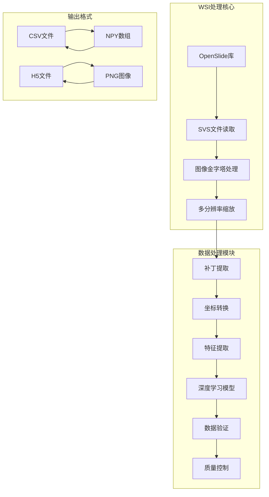

**图表来源**
- [extract_he_patch.py:1-78](file://extract_he_patch.py#L1-L78)
- [hex/virtual_codex_from_h5.py:1-68](file://hex/virtual_codex_from_h5.py#L1-L68)
- [mica/codex_h5_png2fea.py:1-173](file://mica/codex_h5_png2fea.py#L1-L173)

**章节来源**
- [README.md:1-57](file://README.md#L1-L57)
- [pyproject.toml:1-48](file://pyproject.toml#L1-L48)

## 核心组件

### OpenSlide库集成

OpenSlide是该项目的核心依赖，提供了对WSI文件的统一访问接口：

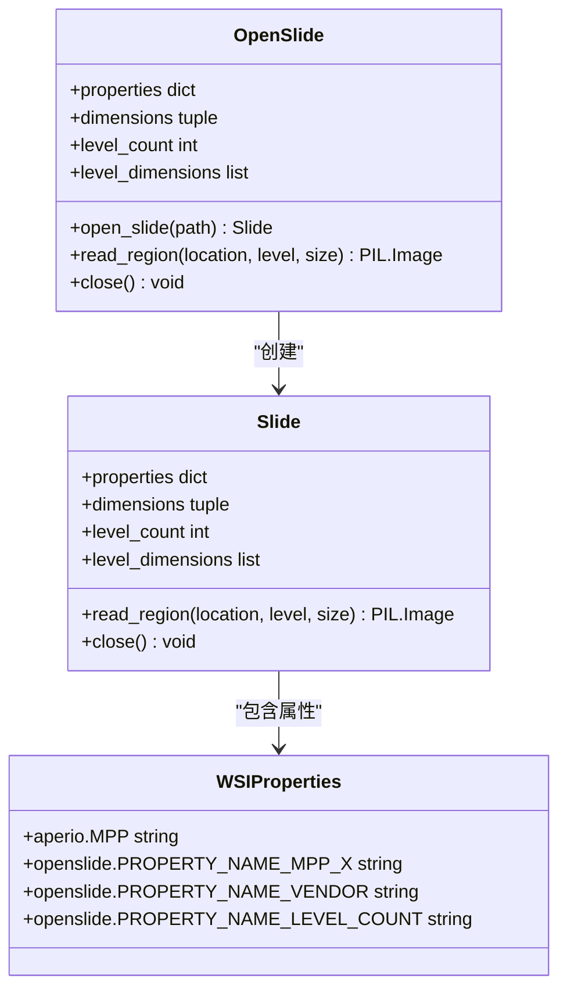

**图表来源**
- [extract_he_patch.py:17-41](file://extract_he_patch.py#L17-L41)
- [hex/virtual_codex_from_h5.py:45-51](file://hex/virtual_codex_from_h5.py#L45-L51)

### 多分辨率图像金字塔

WSI文件采用金字塔结构存储，支持不同缩放级别的快速访问：

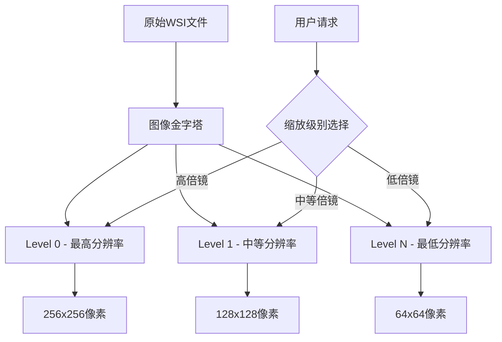

**图表来源**
- [extract_he_patch.py:30](file://extract_he_patch.py#L30)
- [mica/codex_h5_png2fea.py:46-49](file://mica/codex_h5_png2fea.py#L46-L49)

**章节来源**
- [pyproject.toml:25](file://pyproject.toml#L25)
- [uv.lock:2267-2278](file://uv.lock#L2267-L2278)

## 架构概览

项目采用分层架构设计，从底层的WSI文件读取到上层的数据处理和分析：

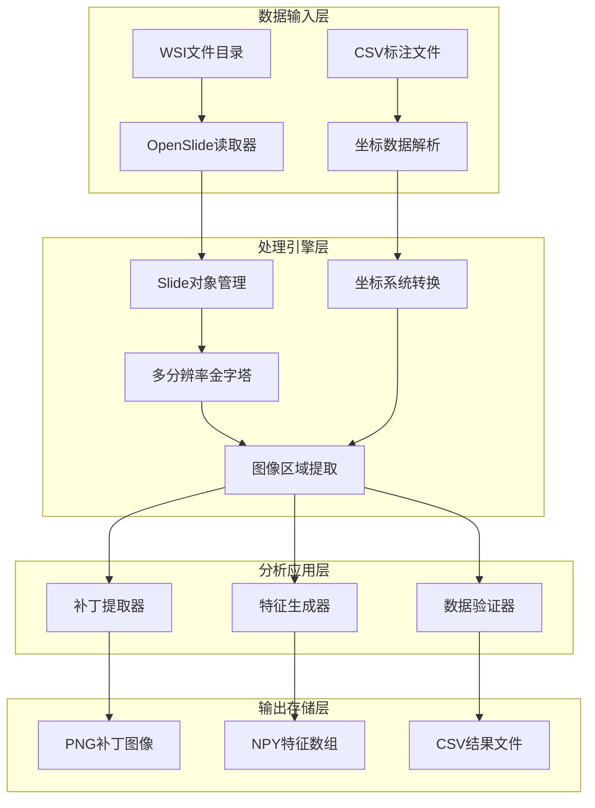

**图表来源**
- [extract_he_patch.py:9-44](file://extract_he_patch.py#L9-L44)
- [hex/virtual_codex_from_h5.py:37-67](file://hex/virtual_codex_from_h5.py#L37-L67)
- [mica/codex_h5_png2fea.py:41-60](file://mica/codex_h5_png2fea.py#L41-L60)

## 详细组件分析

### 补丁提取组件

补丁提取是WSI处理的核心功能之一，负责从高分辨率WSI中提取特定区域的图像块：

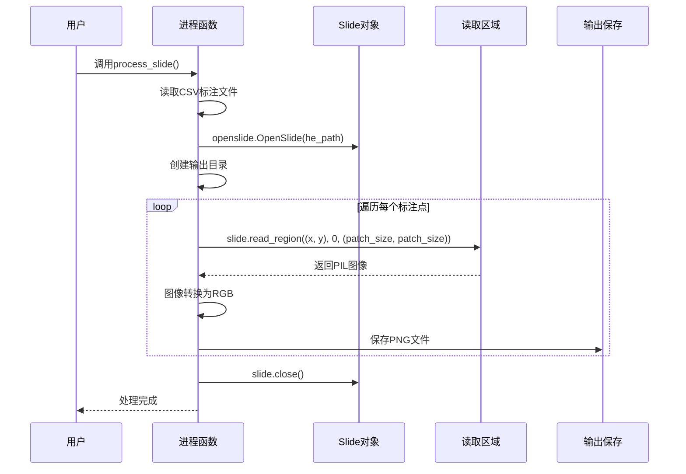

**图表来源**
- [extract_he_patch.py:9-44](file://extract_he_patch.py#L9-L44)

该组件的关键特性包括：
- **并行处理**：使用multiprocessing Pool提高处理效率
- **内存管理**：及时关闭Slide对象释放资源
- **坐标系统**：支持解镜像坐标系转换
- **错误处理**：处理缺失文件和异常情况

**章节来源**
- [extract_he_patch.py:1-78](file://extract_he_patch.py#L1-L78)

### 虚拟空间蛋白质组学组件

该组件处理从H5文件中提取的蛋白质表达预测，并将其映射到WSI坐标系：

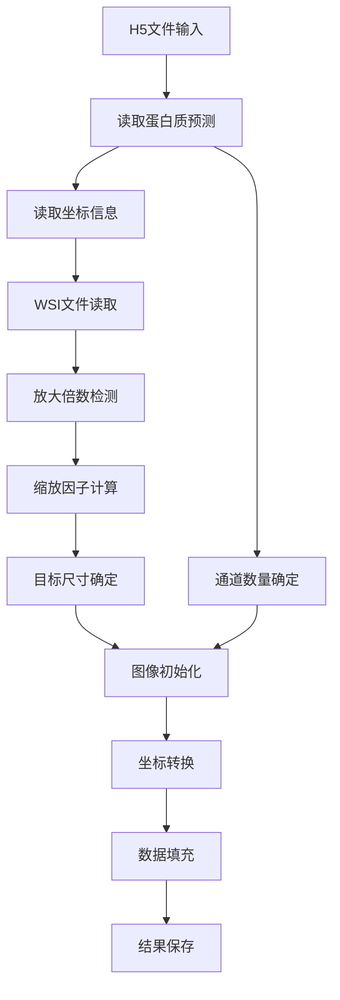

**图表来源**
- [hex/virtual_codex_from_h5.py:37-67](file://hex/virtual_codex_from_h5.py#L37-L67)

**章节来源**
- [hex/virtual_codex_from_h5.py:1-68](file://hex/virtual_codex_from_h5.py#L1-L68)

### 深度学习特征提取组件

该组件使用预训练的深度学习模型对WSI特征进行提取和分析：

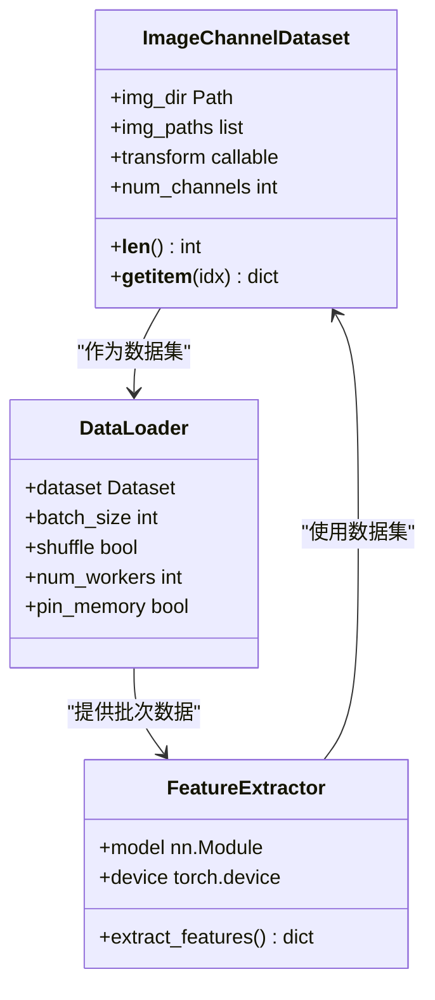

**图表来源**
- [mica/codex_h5_png2fea.py:62-100](file://mica/codex_h5_png2fea.py#L62-L100)
- [mica/codex_h5_png2fea.py:115-131](file://mica/codex_h5_png2fea.py#L115-L131)

**章节来源**
- [mica/codex_h5_png2fea.py:1-173](file://mica/codex_h5_png2fea.py#L1-L173)

### 数据验证组件

项目包含完整的数据验证机制，确保处理流程的正确性和数据质量：

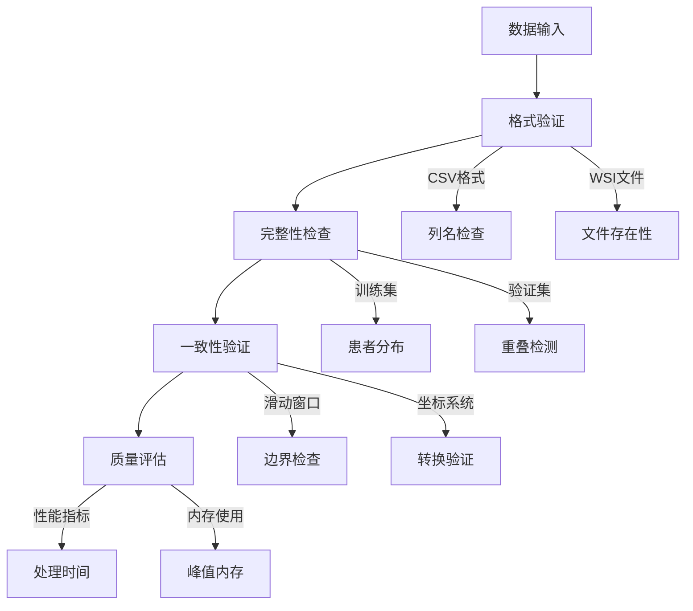

**图表来源**
- [check_splits.py:72-104](file://check_splits.py#L72-L104)
- [check_splits.py:107-148](file://check_splits.py#L107-L148)

**章节来源**
- [check_splits.py:1-159](file://check_splits.py#L1-L159)

## 依赖关系分析

项目依赖关系复杂但结构清晰，主要依赖于OpenSlide生态系统：

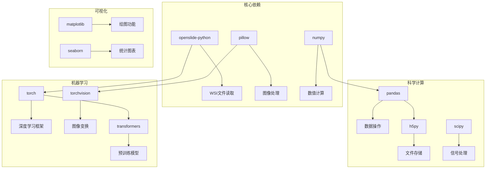

**图表来源**
- [pyproject.toml:7-41](file://pyproject.toml#L7-L41)
- [uv.lock:2267-2278](file://uv.lock#L2267-L2278)

**章节来源**
- [pyproject.toml:1-48](file://pyproject.toml#L1-L48)
- [uv.lock:2267-2278](file://uv.lock#L2267-L2278)

## 性能考虑

### 内存管理优化

WSI文件通常具有极高的分辨率，需要谨慎的内存管理策略：

1. **延迟加载**：只在需要时加载特定缩放级别的图像
2. **资源清理**：及时关闭Slide对象释放内存
3. **批处理**：使用分批处理减少内存峰值
4. **数据类型优化**：使用float16存储中间结果

### 并行处理策略

项目实现了多层次的并行处理以提高效率：

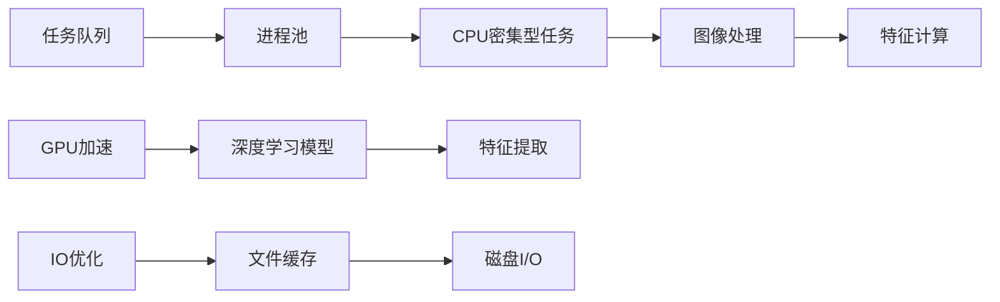

**章节来源**
- [extract_he_patch.py:60-73](file://extract_he_patch.py#L60-L73)
- [mica/codex_h5_png2fea.py:115-125](file://mica/codex_h5_png2fea.py#L115-L125)

### 缓存机制

为了提高重复处理的效率，项目采用了多种缓存策略：

1. **文件级缓存**：避免重复读取相同的WSI文件
2. **中间结果缓存**：保存处理过程中的中间结果
3. **模型权重缓存**：缓存预训练模型权重
4. **坐标转换缓存**：缓存常用的坐标转换结果

## 故障排除指南

### 常见问题及解决方案

#### 文件损坏检测

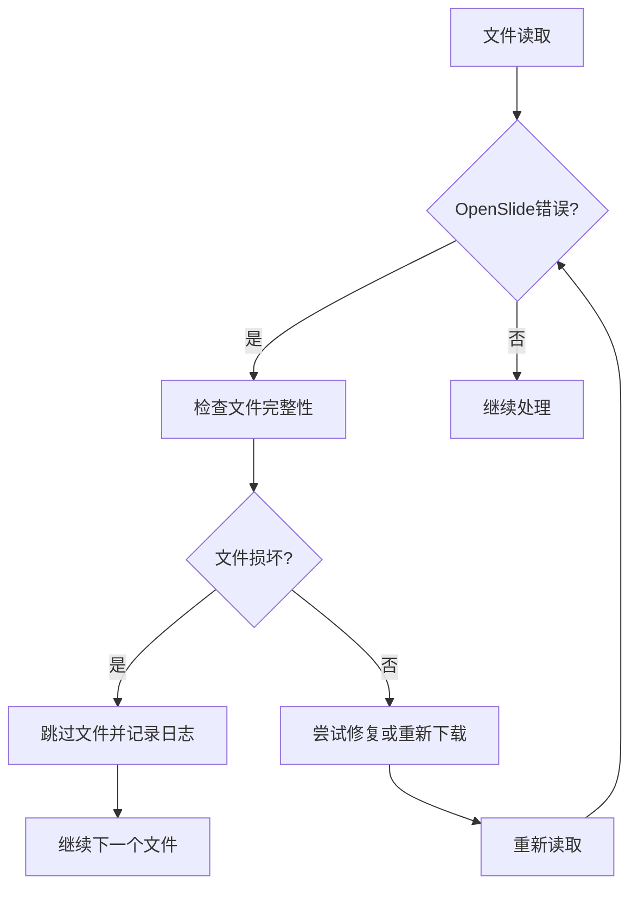

**章节来源**
- [hex/virtual_codex_from_h5.py:40-43](file://hex/virtual_codex_from_h5.py#L40-L43)

#### 内存不足处理

当处理大型WSI文件时，可能出现内存不足的问题：

1. **降低缩放级别**：使用较低分辨率的图像
2. **分块处理**：将大图像分割成小块处理
3. **增加虚拟内存**：配置系统交换空间
4. **优化数据类型**：使用更节省内存的数据类型

#### 大文件读取优化

对于超大WSI文件，建议采用以下策略：

1. **预览模式**：先读取低分辨率版本进行预览
2. **智能缩放**：根据需求动态选择合适的缩放级别
3. **增量处理**：分批次处理大文件内容
4. **压缩存储**：使用压缩格式存储中间结果

### 错误处理最佳实践

项目实现了完善的错误处理机制：

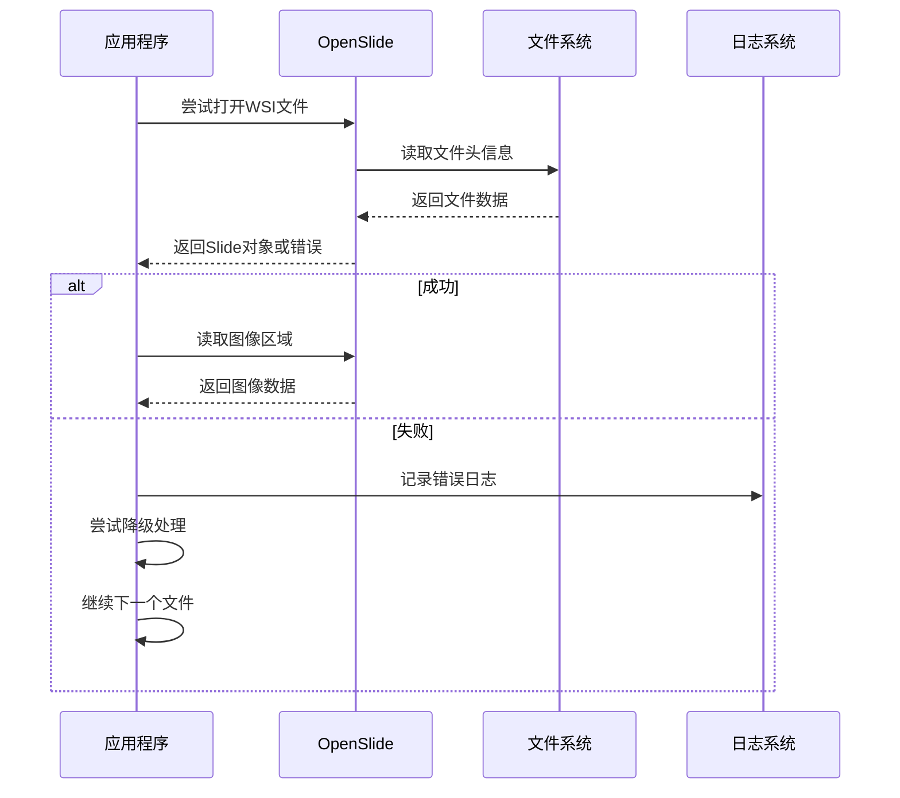

**章节来源**
- [extract_he_patch.py:43-44](file://extract_he_patch.py#L43-L44)
- [mica/codex_h5_png2fea.py:155-157](file://mica/codex_h5_png2fea.py#L155-L157)

## 结论

本项目展示了WSI文件处理的完整技术栈，从底层的OpenSlide库集成到上层的深度学习应用。通过合理的架构设计和性能优化，项目能够高效处理大规模的数字病理切片数据。

关键技术要点包括：

1. **OpenSlide集成**：提供了对WSI文件的统一访问接口
2. **多分辨率处理**：支持金字塔结构的高效访问
3. **并行处理**：利用多核CPU和GPU加速处理
4. **内存优化**：通过多种策略管理内存使用
5. **质量控制**：完整的数据验证和错误处理机制

该项目为数字病理学研究和临床应用提供了坚实的技术基础，特别是在AI辅助的虚拟空间蛋白质组学领域具有重要价值。