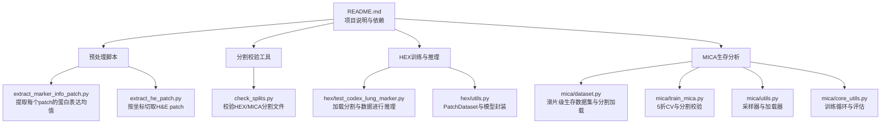
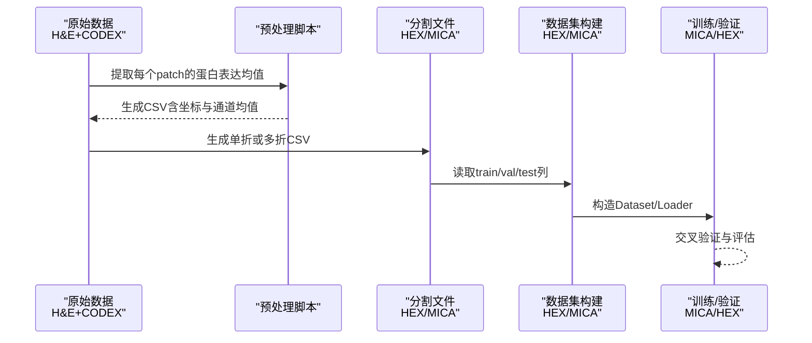
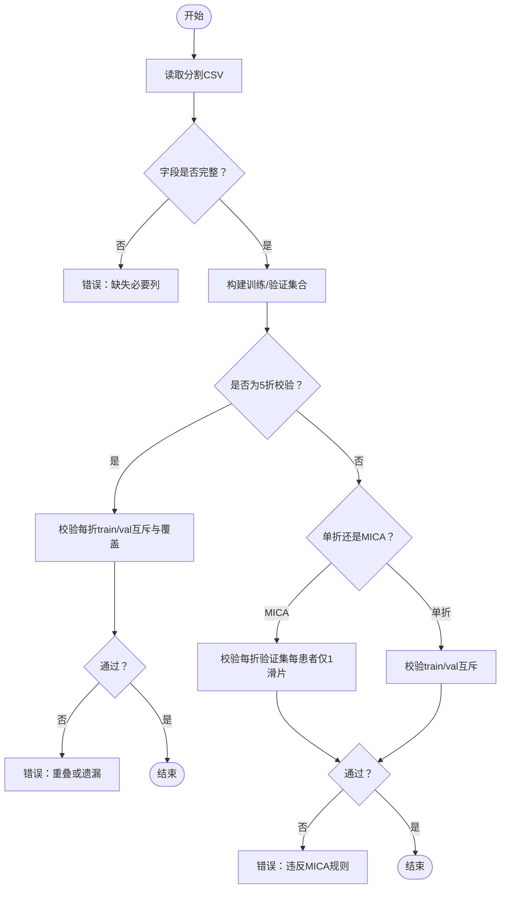
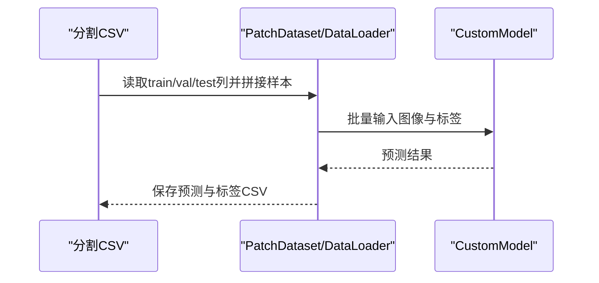
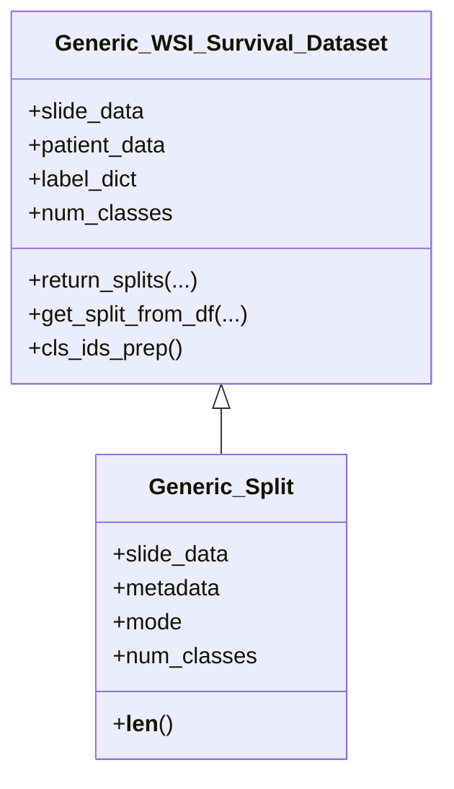
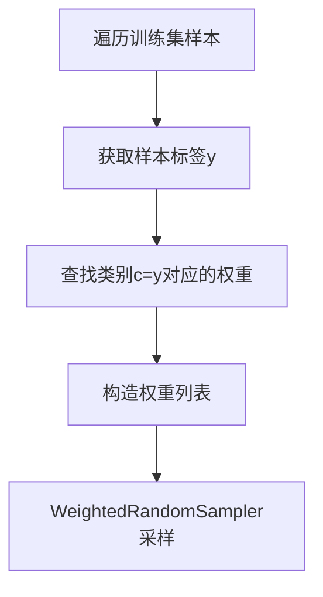
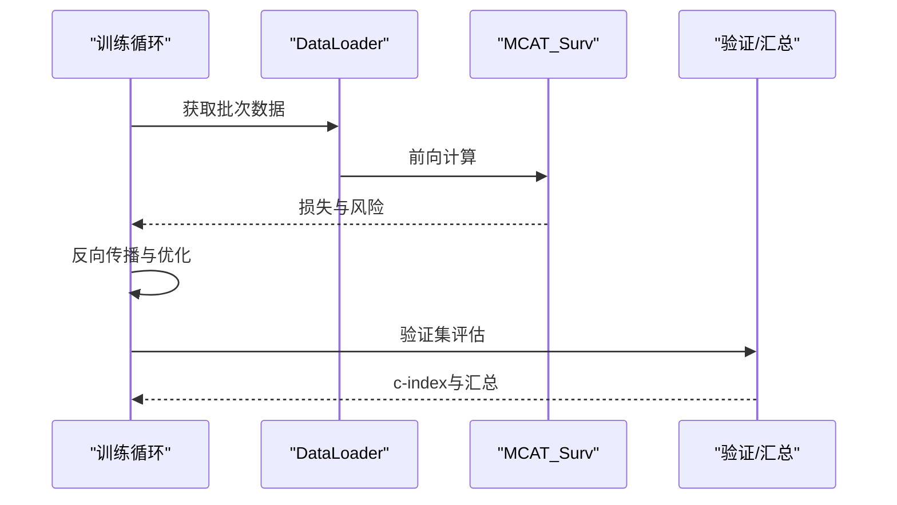
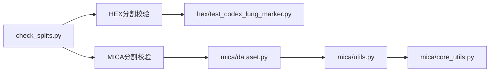

# 数据集构建与分割

<cite>
**本文引用的文件**
- [README.md](file://README.md)
- [check_splits.py](file://check_splits.py)
- [extract_he_patch.py](file://extract_he_patch.py)
- [extract_marker_info_patch.py](file://extract_marker_info_patch.py)
- [hex/utils.py](file://hex/utils.py)
- [hex/test_codex_lung_marker.py](file://hex/test_codex_lung_marker.py)
- [hex/sample_data/splits_0.csv](file://hex/sample_data/splits_0.csv)
- [mica/dataset.py](file://mica/dataset.py)
- [mica/utils.py](file://mica/utils.py)
- [mica/train_mica.py](file://mica/train_mica.py)
- [mica/core_utils.py](file://mica/core_utils.py)
- [mica/tcga_splits/blca/splits_0.csv](file://mica/tcga_splits/blca/splits_0.csv)
</cite>

## 目录
1. [引言](#引言)
2. [项目结构](#项目结构)
3. [核心组件](#核心组件)
4. [架构总览](#架构总览)
5. [详细组件分析](#详细组件分析)
6. [依赖关系分析](#依赖关系分析)
7. [性能考虑](#性能考虑)
8. [故障排查指南](#故障排查指南)
9. [结论](#结论)
10. [附录](#附录)

## 引言
本技术文档围绕“数据集构建与分割”主题，系统梳理并解释本仓库中基于 CLAM 风格的患者级分割策略与数据集构建流程。重点覆盖以下方面：
- 患者 ID 去重、样本聚类与类别平衡
- 训练/验证/测试集划分策略（随机分割、分层抽样、时间序列分割）
- 数据预处理：样本过滤、质量控制、数据清洗、格式标准化
- 分割文件生成与校验机制（CSV 格式规范、字段定义、完整性检查）
- 构建高质量数据集的参数配置、性能优化与常见问题解决
- 统计分析与可视化方法

## 项目结构
本仓库采用模块化组织，涉及 H&E 图像与 CODEX 蛋白表达配对数据的预处理、分割文件生成与校验、以及基于 CLAM 的 WSI 特征 Bag 的生存分析训练。

图示来源
- [README.md:1-57](file://README.md#L1-L57)
- [extract_marker_info_patch.py:1-74](file://extract_marker_info_patch.py#L1-L74)
- [extract_he_patch.py:1-78](file://extract_he_patch.py#L1-L78)
- [check_splits.py:1-159](file://check_splits.py#L1-L159)
- [hex/test_codex_lung_marker.py:1-189](file://hex/test_codex_lung_marker.py#L1-L189)
- [hex/utils.py:1-342](file://hex/utils.py#L1-L342)
- [mica/dataset.py:1-250](file://mica/dataset.py#L1-L250)
- [mica/train_mica.py:1-238](file://mica/train_mica.py#L1-L238)
- [mica/utils.py:1-273](file://mica/utils.py#L1-L273)
- [mica/core_utils.py:1-230](file://mica/core_utils.py#L1-L230)

章节来源
- [README.md:26-44](file://README.md#L26-L44)

## 核心组件
- 分割文件生成与校验
  - HEX 单文件或五折分割文件，字段包含 patient_train/patient_val 或 train/val，并通过 check_splits.py 进行严格校验（无重叠、无遗漏、每折严格互斥）。
  - MICA 使用 TCGA 多癌种目录下的 splits_*.csv，每折包含 train/val/test，且要求每折验证集中仅保留每位患者的一个滑片。
- 数据集构建与加载
  - HEX：PatchDataset 将图像路径与多维标签（40个生物标志物）绑定，支持归一化与批加载；训练/推理脚本按分割文件拼接样本。
  - MICA：Generic_MIL_Survival_Dataset 以滑片为样本单位，按 CSV 列 train/val 加载对应滑片集合；提供分层数（n_bins）离散化生存时间并生成类别标签。
- 类别平衡与采样
  - MICA 提供加权采样器 make_weights_for_balanced_classes_split，按类别样本数反比权重进行训练时重采样。
- 训练与评估
  - MICA 支持 5 折交叉验证，每折独立训练与验证，并输出 c-index 等指标；HEX 提供 patch 级别的回归任务与相关性分析。

章节来源
- [check_splits.py:72-104](file://check_splits.py#L72-L104)
- [check_splits.py:107-148](file://check_splits.py#L107-L148)
- [hex/test_codex_lung_marker.py:75-107](file://hex/test_codex_lung_marker.py#L75-L107)
- [hex/utils.py:82-98](file://hex/utils.py#L82-L98)
- [mica/dataset.py:17-100](file://mica/dataset.py#L17-L100)
- [mica/dataset.py:149-181](file://mica/dataset.py#L149-L181)
- [mica/utils.py:107-116](file://mica/utils.py#L107-L116)
- [mica/train_mica.py:51-70](file://mica/train_mica.py#L51-L70)

## 架构总览
下图展示了从原始数据到训练/验证/测试集的端到端流程，以及分割文件在不同阶段的作用。

图示来源
- [extract_marker_info_patch.py:21-74](file://extract_marker_info_patch.py#L21-L74)
- [extract_he_patch.py:9-78](file://extract_he_patch.py#L9-L78)
- [check_splits.py:72-104](file://check_splits.py#L72-L104)
- [mica/train_mica.py:51-70](file://mica/train_mica.py#L51-L70)
- [hex/test_codex_lung_marker.py:75-107](file://hex/test_codex_lung_marker.py#L75-L107)

## 详细组件分析

### 组件A：分割文件生成与校验（HEX/MICA）
- 字段与格式
  - HEX：单文件可使用 "patient_train","patient_val" 或 "train","val"（自动推断患者ID），五折文件需满足严格互斥与覆盖条件。
  - MICA：每折包含 "train","val","test"，验证集每患者仅一个滑片，且各折间无重叠。
- 校验规则
  - 严格5折校验：确保每折 train/val 无交集、val 不跨折重叠、并覆盖全部患者。
  - MICA 每折校验：train/val 无滑片重叠；若存在 patient_id，则 train/val 无患者重叠；每折验证集每患者仅一个滑片。
- 示例文件
  - HEX 单折示例：hex/sample_data/splits_0.csv
  - MICA 癌种示例：mica/tcga_splits/blca/splits_0.csv

图示来源
- [check_splits.py:19-28](file://check_splits.py#L19-L28)
- [check_splits.py:43-69](file://check_splits.py#L43-L69)
- [check_splits.py:90-104](file://check_splits.py#L90-L104)
- [check_splits.py:107-148](file://check_splits.py#L107-L148)

章节来源
- [check_splits.py:10-17](file://check_splits.py#L10-L17)
- [check_splits.py:30-41](file://check_splits.py#L30-L41)
- [check_splits.py:43-69](file://check_splits.py#L43-L69)
- [check_splits.py:90-104](file://check_splits.py#L90-L104)
- [check_splits.py:107-148](file://check_splits.py#L107-L148)
- [hex/sample_data/splits_0.csv:1-5](file://hex/sample_data/splits_0.csv#L1-L5)
- [mica/tcga_splits/blca/splits_0.csv:1-356](file://mica/tcga_splits/blca/splits_0.csv#L1-L356)

### 组件B：数据集构建与加载（HEX）
- PatchDataset
  - 输入：包含图像路径与多维标签（如 mean_intensity_channel1..40）的 CSV。
  - 输出：图像张量与标签张量，支持可选变换（Resize/Normalize）。
- 推理流程
  - 读取分割文件筛选患者ID，拼接多个 CSV，构造 PatchDataset 并批加载。
  - 模型前向推理，汇总预测与标签，计算每个生物标志物的皮尔逊相关系数并保存结果。

图示来源
- [hex/utils.py:82-98](file://hex/utils.py#L82-L98)
- [hex/test_codex_lung_marker.py:75-107](file://hex/test_codex_lung_marker.py#L75-L107)
- [hex/test_codex_lung_marker.py:109-116](file://hex/test_codex_lung_marker.py#L109-L116)
- [hex/test_codex_lung_marker.py:124-133](file://hex/test_codex_lung_marker.py#L124-L133)
- [hex/test_codex_lung_marker.py:156-172](file://hex/test_codex_lung_marker.py#L156-L172)

章节来源
- [hex/utils.py:82-98](file://hex/utils.py#L82-L98)
- [hex/test_codex_lung_marker.py:75-107](file://hex/test_codex_lung_marker.py#L75-L107)
- [hex/test_codex_lung_marker.py:109-116](file://hex/test_codex_lung_marker.py#L109-L116)
- [hex/test_codex_lung_marker.py:124-133](file://hex/test_codex_lung_marker.py#L124-L133)
- [hex/test_codex_lung_marker.py:156-172](file://hex/test_codex_lung_marker.py#L156-L172)

### 组件C：数据集构建与加载（MICA）
- Generic_MIL_Survival_Dataset
  - 以滑片为样本单位，按 CSV 列 train/val 加载对应滑片集合。
  - 对生存时间进行分层离散化（qcut/qcut后cut），生成类别标签；同时维护患者级与滑片级类别索引。
- 分割加载
  - return_splits/from_id 控制从 CSV 文件加载；get_split_from_df 依据列名筛选滑片并构造 Generic_Split。
- 训练与验证
  - 5 折交叉验证：每折独立构建训练/验证集，执行训练循环与验证，记录 c-index。

图示来源
- [mica/dataset.py:17-100](file://mica/dataset.py#L17-L100)
- [mica/dataset.py:149-181](file://mica/dataset.py#L149-L181)
- [mica/dataset.py:230-250](file://mica/dataset.py#L230-L250)

章节来源
- [mica/dataset.py:17-100](file://mica/dataset.py#L17-L100)
- [mica/dataset.py:149-181](file://mica/dataset.py#L149-L181)
- [mica/train_mica.py:51-70](file://mica/train_mica.py#L51-L70)

### 组件D：类别平衡与采样（MICA）
- 加权采样
  - make_weights_for_balanced_classes_split：按类别样本数量计算反比权重，用于 WeightedRandomSampler。
- 训练加载器
  - get_split_loader：根据 weighted 参数选择 RandomSampler 或 WeightedRandomSampler。

图示来源
- [mica/utils.py:107-116](file://mica/utils.py#L107-L116)
- [mica/utils.py:53-76](file://mica/utils.py#L53-L76)

章节来源
- [mica/utils.py:107-116](file://mica/utils.py#L107-L116)
- [mica/utils.py:53-76](file://mica/utils.py#L53-L76)

### 组件E：训练与评估（MICA）
- 训练循环
  - train：初始化损失函数、模型、优化器与加载器；按 epoch 训练并记录日志。
  - train_loop_survival_coattn：前向、反向传播、梯度累积与日志记录。
  - validate_survival_coattn：验证集评估，计算 c-index。
  - summary_survival_coattn：汇总患者级风险评分与生存信息。
- 5 折交叉验证
  - mica/train_mica.py 中对每折独立执行上述流程，并输出汇总结果。

图示来源
- [mica/core_utils.py:15-82](file://mica/core_utils.py#L15-L82)
- [mica/core_utils.py:85-146](file://mica/core_utils.py#L85-L146)
- [mica/core_utils.py:148-193](file://mica/core_utils.py#L148-L193)
- [mica/core_utils.py:196-230](file://mica/core_utils.py#L196-L230)
- [mica/train_mica.py:51-70](file://mica/train_mica.py#L51-L70)

章节来源
- [mica/core_utils.py:15-82](file://mica/core_utils.py#L15-L82)
- [mica/core_utils.py:85-146](file://mica/core_utils.py#L85-L146)
- [mica/core_utils.py:148-193](file://mica/core_utils.py#L148-L193)
- [mica/core_utils.py:196-230](file://mica/core_utils.py#L196-L230)
- [mica/train_mica.py:51-70](file://mica/train_mica.py#L51-L70)

## 依赖关系分析
- HEX 与 MICA 的数据集构建共享“以 CSV 为入口”的分割约定：前者以患者为单位（HEX），后者以滑片为单位（MICA）。
- 分割校验工具对两种格式分别制定规则，确保训练/验证不重叠、验证集每患者仅一个样本。
- MICA 的类别平衡通过加权采样实现，训练流程由 core_utils.py 统一封装。

图示来源
- [check_splits.py:72-104](file://check_splits.py#L72-L104)
- [check_splits.py:107-148](file://check_splits.py#L107-L148)
- [hex/test_codex_lung_marker.py:75-107](file://hex/test_codex_lung_marker.py#L75-L107)
- [mica/dataset.py:149-181](file://mica/dataset.py#L149-L181)
- [mica/utils.py:53-76](file://mica/utils.py#L53-L76)
- [mica/core_utils.py:15-82](file://mica/core_utils.py#L15-L82)

章节来源
- [check_splits.py:72-104](file://check_splits.py#L72-L104)
- [check_splits.py:107-148](file://check_splits.py#L107-L148)
- [hex/test_codex_lung_marker.py:75-107](file://hex/test_codex_lung_marker.py#L75-L107)
- [mica/dataset.py:149-181](file://mica/dataset.py#L149-L181)
- [mica/utils.py:53-76](file://mica/utils.py#L53-L76)
- [mica/core_utils.py:15-82](file://mica/core_utils.py#L15-L82)

## 性能考虑
- 多进程并行
  - 提取蛋白表达均值与切 H&E patch 均使用多进程池加速（multiprocessing.Pool）。
- 批处理与设备利用
  - DataLoader 使用 pin_memory、num_workers 与 GPU 设备提升吞吐；HEX 推理使用半精度自动混合精度（autocast）。
- 类别平衡
  - MICA 在训练时启用加权采样，缓解类别不平衡带来的偏差。
- I/O 与内存
  - 分割文件与特征文件尽量采用索引化路径，避免重复扫描；HEX 使用图像路径拼接，注意磁盘 IO。

章节来源
- [extract_marker_info_patch.py:56-59](file://extract_marker_info_patch.py#L56-L59)
- [extract_he_patch.py:60-73](file://extract_he_patch.py#L60-L73)
- [hex/test_codex_lung_marker.py:116](file://hex/test_codex_lung_marker.py#L116)
- [mica/utils.py:53-76](file://mica/utils.py#L53-L76)

## 故障排查指南
- 分割文件错误
  - HEX：单折/五折列缺失、train/val 重叠、五折重叠或遗漏。
  - MICA：每折验证集出现同一患者多滑片、train/val 滑片重叠、缺少必要列。
- 训练/验证重叠
  - MICA 在每折训练前会断言校验：train/val 滑片不重叠，若存在 patient_id 则患者也不重叠。
- 数据加载异常
  - 确认 CSV 中图像路径与实际文件一致；检查标签列命名与数量是否匹配。
- 类别不平衡导致性能下降
  - 启用 MICA 的加权采样（weighted_sample）；调整分层数（n_bins）以适配目标分布。

章节来源
- [check_splits.py:72-104](file://check_splits.py#L72-L104)
- [check_splits.py:107-148](file://check_splits.py#L107-L148)
- [mica/train_mica.py:51-70](file://mica/train_mica.py#L51-L70)

## 结论
本仓库提供了完整的 CLAM 风格数据集构建与分割方案：以 CSV 为统一接口，HEX 侧重患者级（HEX）与滑片级（MICA）两类样本单位，结合严格的分割校验与类别平衡策略，支撑高效稳定的训练与评估流程。通过多进程预处理、批加载与加权采样等手段，兼顾了性能与可扩展性。

## 附录
- 参数配置与最佳实践
  - 分割文件：确保字段完整、严格互斥与覆盖；MICA 每折验证集每患者仅一个滑片。
  - 数据加载：HEX 使用 PatchDataset，MICA 使用 Generic_MIL_Survival_Dataset；注意标签列命名与数量。
  - 类别平衡：MICA 开启 weighted_sample；HEX 可在回归任务中关注标签分布与损失函数。
  - 性能优化：合理设置 DataLoader 的 num_workers、pin_memory；HEX 推理启用 autocast；预处理阶段使用多进程池。
- 统计分析与可视化
  - MICA：c-index 作为主要指标；可绘制每折 c-index 曲线与汇总统计。
  - HEX：计算每个生物标志物的皮尔逊相关系数并排序，辅助识别高价值标志物。