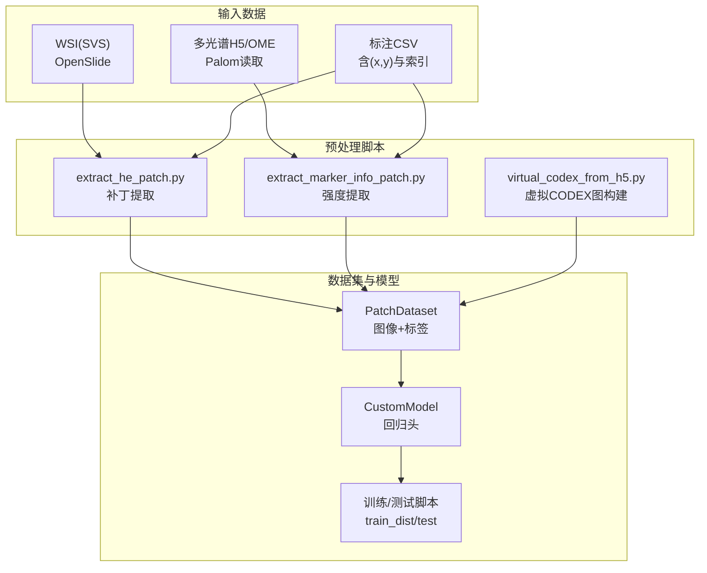
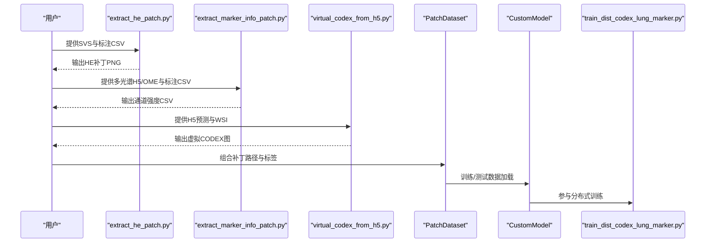
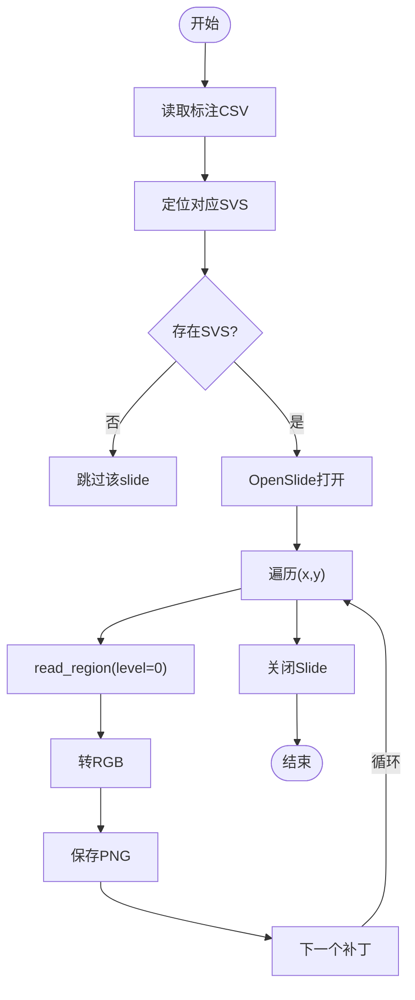
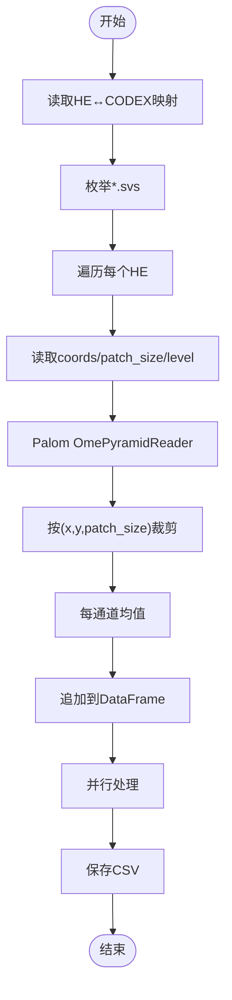
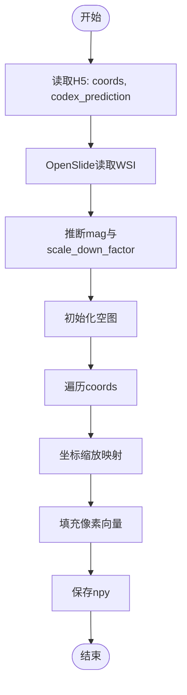
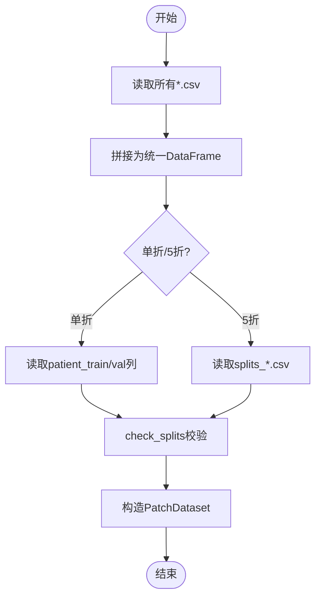
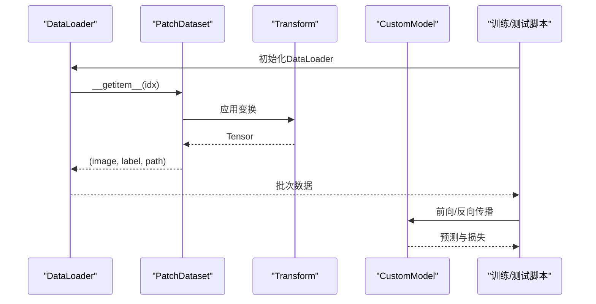
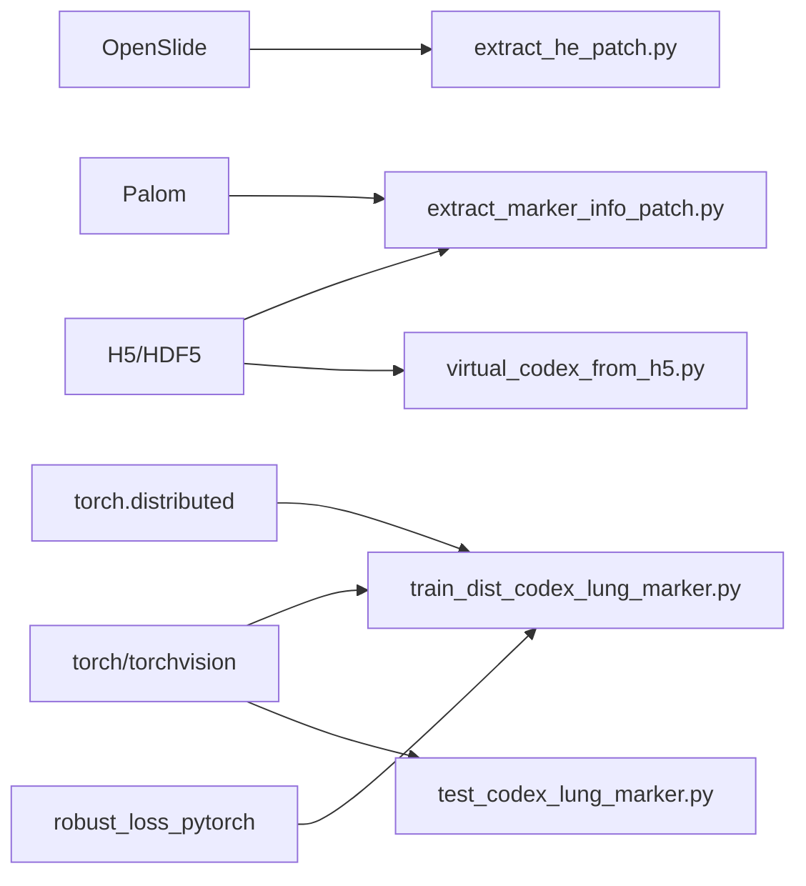

# 数据预处理模块

<cite>
**本文引用的文件**
- [README.md](file://README.md)
- [extract_he_patch.py](file://extract_he_patch.py)
- [extract_marker_info_patch.py](file://extract_marker_info_patch.py)
- [hex/virtual_codex_from_h5.py](file://hex/virtual_codex_from_h5.py)
- [hex/utils.py](file://hex/utils.py)
- [hex/hex_architecture.py](file://hex/hex_architecture.py)
- [hex/train_dist_codex_lung_marker.py](file://hex/train_dist_codex_lung_marker.py)
- [hex/test_codex_lung_marker.py](file://hex/test_codex_lung_marker.py)
- [check_splits.py](file://check_splits.py)
- [hex/sample_data/splits_0.csv](file://hex/sample_data/splits_0.csv)
- [hex/sample_data/channel_registered/0.csv](file://hex/sample_data/channel_registered/0.csv)
</cite>

## 目录
1. [简介](#简介)
2. [项目结构](#项目结构)
3. [核心组件](#核心组件)
4. [架构总览](#架构总览)
5. [详细组件分析](#详细组件分析)
6. [依赖关系分析](#依赖关系分析)
7. [性能考虑](#性能考虑)
8. [故障排查指南](#故障排查指南)
9. [结论](#结论)
10. [附录](#附录)

## 简介
本技术文档聚焦于HEX项目的“数据预处理模块”，系统阐述从WSI（全切片数字成像）到可训练数据集的完整管线：包括OpenSlide格式支持与图像读取、补丁坐标转换、补丁提取算法、蛋白质标记物强度提取（多光谱图像处理与信号量化）、数据集构建与分割策略（CLAM风格的患者级分割）、以及训练/推理阶段的数据加载与评估流程。文档同时提供参数调优建议、性能优化与内存管理策略，并给出常见问题的排查路径。

## 项目结构
该模块围绕三条主线展开：
- WSI补丁提取：基于OpenSlide读取SVS，按CSV中的(x, y)坐标提取固定尺寸补丁，保存为PNG。
- 蛋白质标记物强度提取：使用Palom读取多光谱金字塔数据，按相同坐标计算每个通道的平均强度，输出CSV。
- 数据集构建与分割：将HE补丁路径与对应通道注册后的强度标签进行拼接，形成PatchDataset；采用CLAM风格的患者级分割，确保跨折不重叠且每患者仅出现一次。

**图表来源**
- [extract_he_patch.py:1-78](file://extract_he_patch.py#L1-L78)
- [extract_marker_info_patch.py:1-74](file://extract_marker_info_patch.py#L1-L74)
- [hex/virtual_codex_from_h5.py:1-68](file://hex/virtual_codex_from_h5.py#L1-L68)
- [hex/utils.py:82-97](file://hex/utils.py#L82-L97)
- [hex/hex_architecture.py:9-37](file://hex/hex_architecture.py#L9-L37)
- [hex/train_dist_codex_lung_marker.py:160-161](file://hex/train_dist_codex_lung_marker.py#L160-L161)
- [hex/test_codex_lung_marker.py:109-116](file://hex/test_codex_lung_marker.py#L109-L116)

**章节来源**
- [README.md:26-44](file://README.md#L26-L44)

## 核心组件
- 补丁提取器（WSI→PNG）
  - 使用OpenSlide打开SVS，按CSV中(x, y)与固定patch_size读取区域，转RGB后保存为PNG。
  - 支持多进程并行处理多个slide，进度条显示。
- 强度提取器（多光谱→CSV）
  - 使用Palom读取多光谱金字塔，按H5中coords与patch_size裁剪对应区域，计算各通道均值强度，输出CSV。
- 数据集封装（PatchDataset）
  - 将图像路径与多输出标签（40个生物标志物）组合，提供标准torchvision变换。
- 模型与训练（CustomModel + FDS）
  - 基于MUSK视觉编码器+两层回归头，支持FDS平滑特征分布以提升回归稳定性。
- 分割与校验（CLAM风格）
  - 按患者维度划分训练/验证集，支持单折或5折，check_splits用于完整性校验。

**章节来源**
- [extract_he_patch.py:9-44](file://extract_he_patch.py#L9-L44)
- [extract_marker_info_patch.py:21-73](file://extract_marker_info_patch.py#L21-L73)
- [hex/utils.py:82-97](file://hex/utils.py#L82-L97)
- [hex/hex_architecture.py:9-37](file://hex/hex_architecture.py#L9-L37)
- [check_splits.py:72-104](file://check_splits.py#L72-L104)

## 架构总览
下图展示从WSI到训练数据的关键步骤与模块交互：

**图表来源**
- [extract_he_patch.py:46-78](file://extract_he_patch.py#L46-L78)
- [extract_marker_info_patch.py:21-73](file://extract_marker_info_patch.py#L21-L73)
- [hex/virtual_codex_from_h5.py:37-68](file://hex/virtual_codex_from_h5.py#L37-L68)
- [hex/utils.py:82-97](file://hex/utils.py#L82-L97)
- [hex/hex_architecture.py:28-36](file://hex/hex_architecture.py#L28-L36)
- [hex/train_dist_codex_lung_marker.py:160-161](file://hex/train_dist_codex_lung_marker.py#L160-L161)

## 详细组件分析

### WSI补丁提取流程（OpenSlide + 坐标转换）
- 输入
  - SVS文件（OpenSlide支持）
  - CSV文件，包含每张补丁的slide_index、x、y像素坐标
- 处理
  - 读取SVS，按(0, level=0)读取指定区域
  - 转换为RGB并保存PNG
  - 多进程并行处理多个slide
- 关键点
  - 坐标来自通道注册后映射，需与H5中patch_level一致
  - 输出目录按slide_id分层，便于后续拼接

**图表来源**
- [extract_he_patch.py:9-44](file://extract_he_patch.py#L9-L44)

**章节来源**
- [extract_he_patch.py:9-44](file://extract_he_patch.py#L9-L44)

### 蛋白质标记物强度提取（多光谱图像处理与信号量化）
- 输入
  - 多光谱金字塔（OME/OME.TIFF），H5中保存coords与patch_size/level
- 处理
  - 读取金字塔第0层，按(x, y, patch_size)裁剪
  - 对每个通道做全局均值，得到长度为通道数的向量
  - 并行处理所有补丁，写入CSV
- 输出
  - 每行包含slide、index、x、y与40个通道均值列

**图表来源**
- [extract_marker_info_patch.py:21-73](file://extract_marker_info_patch.py#L21-L73)

**章节来源**
- [extract_marker_info_patch.py:21-73](file://extract_marker_info_patch.py#L21-L73)

### 虚拟CODEX图构建（坐标缩放与空间填充）
- 输入
  - H5中每slide的coords与codex_prediction
  - WSI用于推断放大倍数（依据MPP）
- 处理
  - 推断mag（40/20/80），计算scale_down_factor
  - 将预测向量按坐标映射到二维空间图上
- 输出
  - 每slide一个(H, W, C)的半精度数组，可用于下游任务

**图表来源**
- [hex/virtual_codex_from_h5.py:37-68](file://hex/virtual_codex_from_h5.py#L37-L68)

**章节来源**
- [hex/virtual_codex_from_h5.py:10-28](file://hex/virtual_codex_from_h5.py#L10-L28)
- [hex/virtual_codex_from_h5.py:48-67](file://hex/virtual_codex_from_h5.py#L48-L67)

### 数据集构建与分割策略（CLAM风格）
- 数据拼接
  - 将HE补丁路径与通道强度CSV按slide+index拼接，生成统一的PatchDataset
- 分割
  - 支持单折或5折；按患者维度划分，确保同一患者不出现在不同集合
  - 支持从splits_*.csv读取，或随机划分
- 校验
  - check_splits确保无重叠、无遗漏、每患者唯一

**图表来源**
- [hex/train_dist_codex_lung_marker.py:60-96](file://hex/train_dist_codex_lung_marker.py#L60-L96)
- [check_splits.py:72-104](file://check_splits.py#L72-L104)
- [hex/sample_data/splits_0.csv:1-5](file://hex/sample_data/splits_0.csv#L1-L5)

**章节来源**
- [hex/train_dist_codex_lung_marker.py:60-96](file://hex/train_dist_codex_lung_marker.py#L60-L96)
- [check_splits.py:72-104](file://check_splits.py#L72-L104)
- [hex/sample_data/splits_0.csv:1-5](file://hex/sample_data/splits_0.csv#L1-L5)

### 训练/测试数据流（PatchDataset + Transform）
- 训练
  - 图像变换：Resize、ToTensor、Normalize
  - 分布式采样、混合精度、自适应损失、可选FDS平滑
- 测试
  - 同一变换，无打乱，自动混合精度推理，计算Pearson相关系数

**图表来源**
- [hex/utils.py:82-97](file://hex/utils.py#L82-L97)
- [hex/test_codex_lung_marker.py:109-116](file://hex/test_codex_lung_marker.py#L109-L116)
- [hex/train_dist_codex_lung_marker.py:144-158](file://hex/train_dist_codex_lung_marker.py#L144-L158)

**章节来源**
- [hex/utils.py:82-97](file://hex/utils.py#L82-L97)
- [hex/test_codex_lung_marker.py:109-116](file://hex/test_codex_lung_marker.py#L109-L116)
- [hex/train_dist_codex_lung_marker.py:144-158](file://hex/train_dist_codex_lung_marker.py#L144-L158)

## 依赖关系分析
- OpenSlide：读取SVS，支持多层级金字塔与region读取
- Palom：读取多光谱金字塔，支持OME/OME.TIFF
- H5/HDF5：存储coords、patch_size/level与强度预测
- torchvision.transforms：图像标准化与增强
- torch.distributed：分布式训练与同步
- robust_loss_pytorch：自适应鲁棒损失

**图表来源**
- [extract_he_patch.py:3](file://extract_he_patch.py#L3)
- [extract_marker_info_patch.py:2](file://extract_marker_info_patch.py#L2)
- [hex/virtual_codex_from_h5.py:6](file://hex/virtual_codex_from_h5.py#L6)
- [hex/train_dist_codex_lung_marker.py:10-25](file://hex/train_dist_codex_lung_marker.py#L10-L25)
- [hex/test_codex_lung_marker.py:3-16](file://hex/test_codex_lung_marker.py#L3-L16)

**章节来源**
- [README.md:15-24](file://README.md#L15-L24)

## 性能考虑
- I/O与内存
  - OpenSlide读取大图时应避免重复打开，尽量批量处理并及时关闭
  - 多进程池数量根据CPU核数与磁盘带宽调整，避免过度并发导致IO抖动
  - 强度提取阶段建议使用半精度存储中间结果，降低内存占用
- 图像变换与批处理
  - 训练时启用混合精度与非阻塞传输，减少GPU等待
  - DataLoader合理设置num_workers与pin_memory，加速数据加载
- 分布式训练
  - 使用DistributedSampler确保每卡数据不重复
  - 同步梯度与指标时注意all_reduce/all_gather的通信开销
- FDS平滑
  - 在稳定期开启，避免前期过强的平滑影响收敛

[本节为通用性能建议，无需特定文件来源]

## 故障排查指南
- WSI缺失或路径错误
  - 现象：某slide未处理或报错
  - 排查：确认SVS路径与CSV中的slide_id一致
  - 参考
    - [extract_he_patch.py:14-15](file://extract_he_patch.py#L14-L15)
- 坐标越界或patch_size不匹配
  - 现象：读取region失败或裁剪异常
  - 排查：确认coords来自同一patch_level与patch_size
  - 参考
    - [extract_marker_info_patch.py:29-33](file://extract_marker_info_patch.py#L29-L33)
- 分割重叠或遗漏
  - 现象：训练/验证重叠或部分患者未落入任一集合
  - 排查：运行check_splits，检查splits_*.csv或单折列名
  - 参考
    - [check_splits.py:72-104](file://check_splits.py#L72-L104)
    - [hex/sample_data/splits_0.csv:1-5](file://hex/sample_data/splits_0.csv#L1-L5)
- 分布式训练异常
  - 现象：进程间同步失败或显存不足
  - 排查：核对MASTER_PORT、LOCAL_RANK、WORLD_SIZE；减小batch_size或num_workers
  - 参考
    - [hex/train_dist_codex_lung_marker.py:28-39](file://hex/train_dist_codex_lung_marker.py#L28-L39)
- 标签维度不匹配
  - 现象：模型前向报维度错误
  - 排查：确认label_columns与模型num_outputs一致
  - 参考
    - [hex/train_dist_codex_lung_marker.py:172-179](file://hex/train_dist_codex_lung_marker.py#L172-L179)
    - [hex/test_codex_lung_marker.py:109](file://hex/test_codex_lung_marker.py#L109)

**章节来源**
- [extract_he_patch.py:14-15](file://extract_he_patch.py#L14-L15)
- [extract_marker_info_patch.py:29-33](file://extract_marker_info_patch.py#L29-L33)
- [check_splits.py:72-104](file://check_splits.py#L72-L104)
- [hex/sample_data/splits_0.csv:1-5](file://hex/sample_data/splits_0.csv#L1-L5)
- [hex/train_dist_codex_lung_marker.py:28-39](file://hex/train_dist_codex_lung_marker.py#L28-L39)
- [hex/train_dist_codex_lung_marker.py:172-179](file://hex/train_dist_codex_lung_marker.py#L172-L179)
- [hex/test_codex_lung_marker.py:109](file://hex/test_codex_lung_marker.py#L109)

## 结论
本模块通过OpenSlide与Palom分别完成WSI补丁提取与多光谱强度量化，结合CLAM风格的患者级分割策略，构建了面向回归任务的高质量数据集。配合FDS平滑与分布式训练，可在保证泛化能力的同时提升稳定性。建议在实际部署中关注I/O瓶颈、坐标一致性与分布式环境配置，以获得最佳性能与可复现性。

[本节为总结性内容，无需特定文件来源]

## 附录
- 示例数据位置
  - 分割文件：hex/sample_data/splits_0.csv
  - 通道注册强度：hex/sample_data/channel_registered/*.csv
- 训练/测试入口
  - 训练：hex/train_dist_codex_lung_marker.py
  - 测试：hex/test_codex_lung_marker.py

**章节来源**
- [hex/sample_data/splits_0.csv:1-5](file://hex/sample_data/splits_0.csv#L1-L5)
- [hex/sample_data/channel_registered/0.csv:1-4](file://hex/sample_data/channel_registered/0.csv#L1-L4)
- [README.md:32-44](file://README.md#L32-L44)