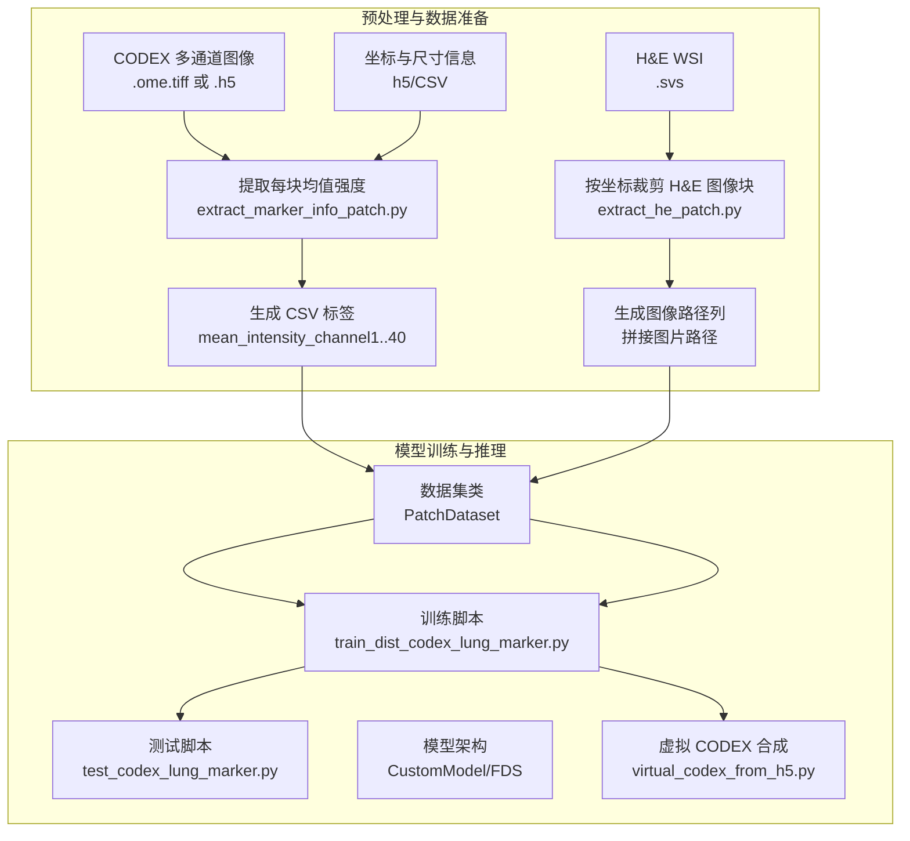
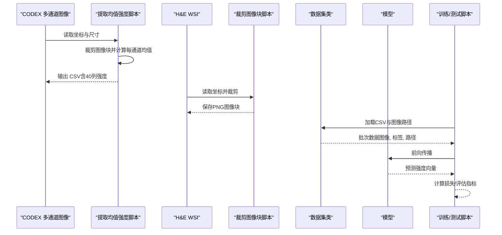
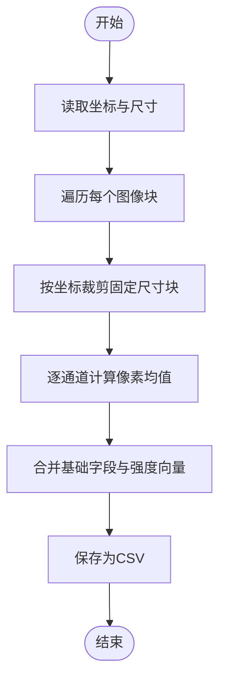
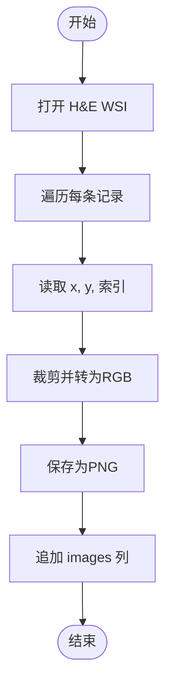
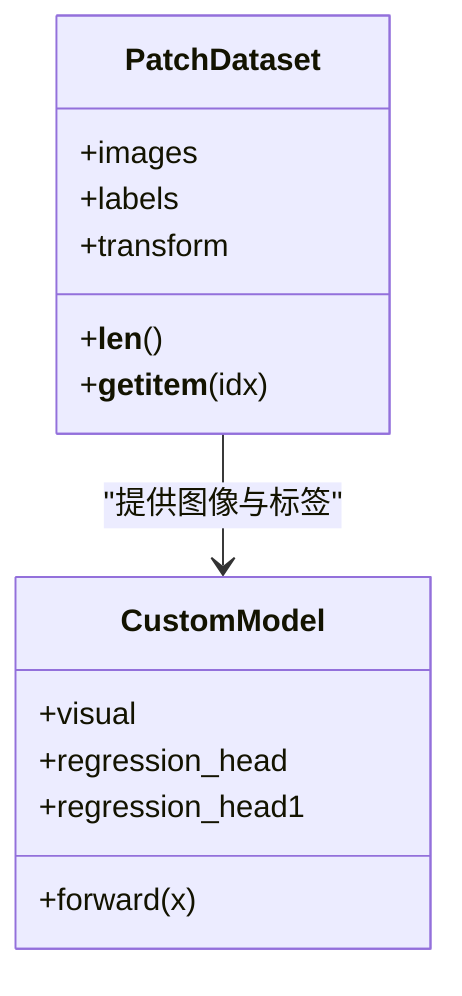
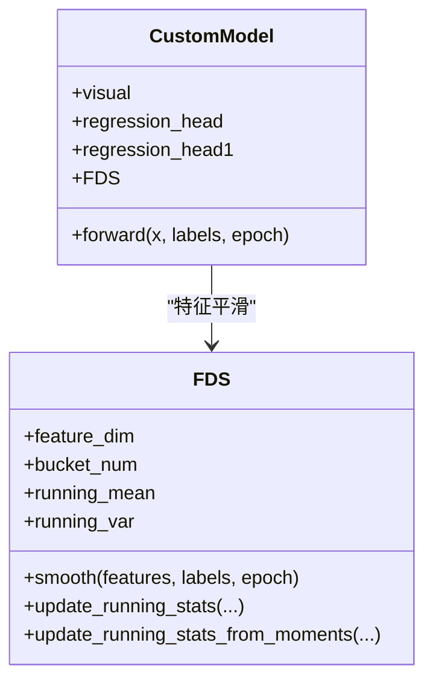
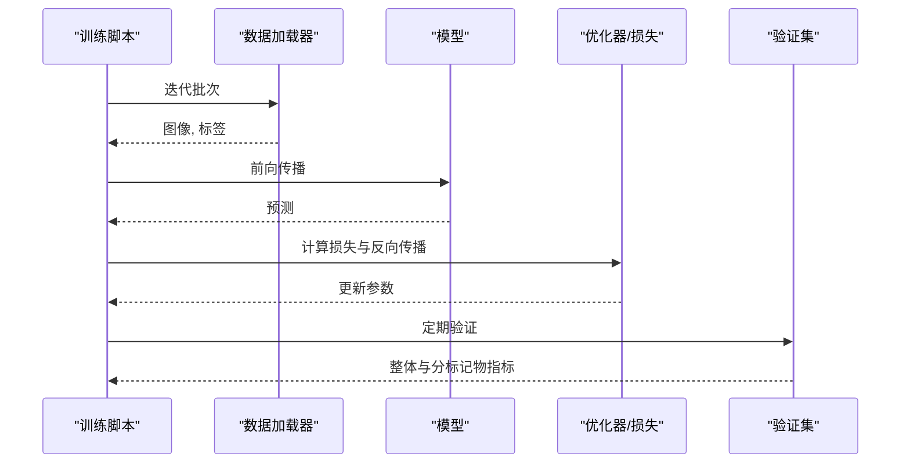
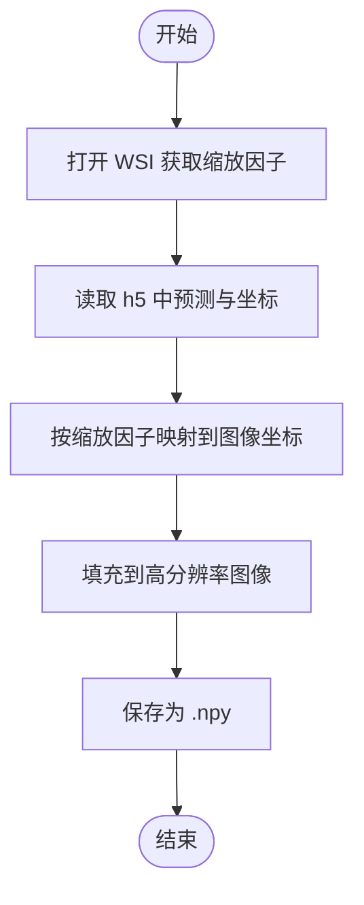
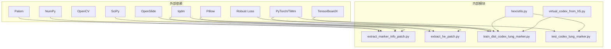

# 标记物强度提取

<cite>
**本文引用的文件**
- [README.md](file://README.md)
- [extract_marker_info_patch.py](file://extract_marker_info_patch.py)
- [extract_he_patch.py](file://extract_he_patch.py)
- [hex/test_codex_lung_marker.py](file://hex/test_codex_lung_marker.py)
- [hex/train_dist_codex_lung_marker.py](file://hex/train_dist_codex_lung_marker.py)
- [hex/utils.py](file://hex/utils.py)
- [hex/hex_architecture.py](file://hex/hex_architecture.py)
- [hex/virtual_codex_from_h5.py](file://hex/virtual_codex_from_h5.py)
- [hex/sample_data/channel_registered/0.csv](file://hex/sample_data/channel_registered/0.csv)
- [hex/sample_data/channel_registered/1.csv](file://hex/sample_data/channel_registered/1.csv)
- [hex/sample_data/splits_0.csv](file://hex/sample_data/splits_0.csv)
</cite>

## 目录
1. [引言](#引言)
2. [项目结构](#项目结构)
3. [核心组件](#核心组件)
4. [架构总览](#架构总览)
5. [详细组件分析](#详细组件分析)
6. [依赖关系分析](#依赖关系分析)
7. [性能考量](#性能考量)
8. [故障排查指南](#故障排查指南)
9. [结论](#结论)
10. [附录](#附录)

## 引言
本技术文档围绕“蛋白质标记物强度提取”功能展开，系统阐述多光谱图像处理与标记物强度计算流程，涵盖以下要点：
- 多光谱图像处理原理：不同波长下的信号检测、光谱分离技术、信号量化方法
- 标记物强度计算算法：像素强度积分、背景扣除、标准化处理、统计特征提取
- 数据格式转换：从原始图像到数值矩阵的转换、数据类型处理、缺失值处理
- 质量控制机制：图像质量评估、异常值检测、数据一致性检查
- 实际应用示例：参数配置指南与常见问题解决方案

该能力以 H&E 图像为输入，通过预处理生成组织学切片的图像块，并结合已注册的多通道成像（如 CODEX）得到的每个图像块的平均强度作为标签，训练回归模型预测 40 种标记物的表达水平。

## 项目结构
本仓库包含两套主要流程：
- 预处理与数据准备：从多通道成像中提取每张切片的图像块均值强度，生成 CSV 标签；同时从 H&E WSI 中按坐标裁剪对应位置的图像块，形成图像-标签配对数据集。
- 模型训练与推理：基于图像块进行回归预测，输出 40 种标记物的强度估计，并进行评估与可视化。

图表来源
- [extract_marker_info_patch.py:1-74](file://extract_marker_info_patch.py#L1-L74)
- [extract_he_patch.py:1-78](file://extract_he_patch.py#L1-L78)
- [hex/train_dist_codex_lung_marker.py:1-400](file://hex/train_dist_codex_lung_marker.py#L1-L400)
- [hex/test_codex_lung_marker.py:1-189](file://hex/test_codex_lung_marker.py#L1-L189)
- [hex/utils.py:1-342](file://hex/utils.py#L1-L342)
- [hex/virtual_codex_from_h5.py:1-68](file://hex/virtual_codex_from_h5.py#L1-L68)

章节来源
- [README.md:26-44](file://README.md#L26-L44)
- [extract_marker_info_patch.py:1-74](file://extract_marker_info_patch.py#L1-L74)
- [extract_he_patch.py:1-78](file://extract_he_patch.py#L1-L78)
- [hex/train_dist_codex_lung_marker.py:1-400](file://hex/train_dist_codex_lung_marker.py#L1-L400)
- [hex/test_codex_lung_marker.py:1-189](file://hex/test_codex_lung_marker.py#L1-L189)
- [hex/utils.py:1-342](file://hex/utils.py#L1-L342)
- [hex/virtual_codex_from_h5.py:1-68](file://hex/virtual_codex_from_h5.py#L1-L68)

## 核心组件
- 数据准备与标签生成
  - 从 CODEX 多通道金字塔中按坐标裁剪固定大小的图像块，计算各通道的像素均值，形成 40 列的“mean_intensity_channel1..40”标签列，保存为 CSV。
  - 从 H&E WSI 中按相同坐标裁剪相同尺寸的图像块，保存为 PNG 文件，并在 CSV 中追加 images 列用于后续加载。
- 数据集与模型
  - PatchDataset 将 CSV 的图像路径、标签向量与变换组合，供 DataLoader 使用。
  - CustomModel 基于视觉编码器提取图像特征，经回归头输出 40 维标记物强度预测；支持 FDS 平滑正则化。
- 训练与评估
  - 分布式训练脚本负责划分训练/验证集、构建数据加载器、优化器、损失函数与学习率调度器，并记录指标。
  - 测试脚本执行推理，计算每种标记物的 Pearson 相关系数并汇总统计。

章节来源
- [extract_marker_info_patch.py:43-73](file://extract_marker_info_patch.py#L43-L73)
- [extract_he_patch.py:9-77](file://extract_he_patch.py#L9-L77)
- [hex/utils.py:82-97](file://hex/utils.py#L82-L97)
- [hex/utils.py:32-81](file://hex/utils.py#L32-L81)
- [hex/train_dist_codex_lung_marker.py:70-169](file://hex/train_dist_codex_lung_marker.py#L70-L169)
- [hex/test_codex_lung_marker.py:75-189](file://hex/test_codex_lung_marker.py#L75-L189)

## 架构总览
下图展示了从多通道成像到标记物强度预测的整体流程与模块交互。

图表来源
- [extract_marker_info_patch.py:21-73](file://extract_marker_info_patch.py#L21-L73)
- [extract_he_patch.py:9-77](file://extract_he_patch.py#L9-L77)
- [hex/utils.py:82-97](file://hex/utils.py#L82-L97)
- [hex/utils.py:32-81](file://hex/utils.py#L32-L81)
- [hex/train_dist_codex_lung_marker.py:160-396](file://hex/train_dist_codex_lung_marker.py#L160-L396)
- [hex/test_codex_lung_marker.py:109-189](file://hex/test_codex_lung_marker.py#L109-L189)

## 详细组件分析

### 组件A：多光谱图像处理与强度提取
- 输入：CODEX 多通道金字塔（.ome.tiff 或 .h5），包含坐标、块尺寸、金字塔层级等元信息。
- 处理逻辑：
  - 读取坐标与尺寸，遍历每个图像块，按通道裁剪并计算均值，得到长度为通道数的向量。
  - 将结果与基础字段（slide/index/x/y）合并，写入 CSV。
- 关键点：
  - 通道均值计算采用整块展平后求均值，确保跨通道可比性。
  - 多进程并行加速，提升大规模数据处理效率。

图表来源
- [extract_marker_info_patch.py:21-73](file://extract_marker_info_patch.py#L21-L73)

章节来源
- [extract_marker_info_patch.py:1-74](file://extract_marker_info_patch.py#L1-L74)

### 组件B：H&E 图像块裁剪与配对
- 输入：H&E WSI（.svs）、已生成的坐标与索引。
- 处理逻辑：
  - 读取 WSI，按 (x, y) 和固定尺寸裁剪图像块，转为 RGB 并保存为 PNG。
  - 在 CSV 中追加 images 列，形成“图像路径-标签”的配对数据。
- 关键点：
  - 保证与多通道成像的坐标一致，确保标签与图像一一对应。
  - 支持多进程并行，提高吞吐。

图表来源
- [extract_he_patch.py:9-77](file://extract_he_patch.py#L9-L77)

章节来源
- [extract_he_patch.py:1-78](file://extract_he_patch.py#L1-L78)

### 组件C：数据集类与数据加载
- PatchDataset 将 CSV 中的 images 列与标签列（mean_intensity_channel1..40）打包，提供 __getitem__ 接口，返回图像张量、标签张量与图像路径。
- 数据类型与缺失值：
  - 标签列强制转换为 float32，避免后续计算精度问题。
  - 若某条记录缺失标签或图像路径，应在上游清洗阶段处理，下游加载时建议进行校验。

图表来源
- [hex/utils.py:82-97](file://hex/utils.py#L82-L97)
- [hex/utils.py:32-81](file://hex/utils.py#L32-L81)

章节来源
- [hex/utils.py:82-97](file://hex/utils.py#L82-L97)

### 组件D：模型架构与特征平滑（FDS）
- 视觉编码器：使用 MUSK 大模型作为骨干，输出固定维度的图像特征。
- 回归头：两层线性层+ReLU+Dropout，最终映射到 40 维输出。
- 特征平滑（FDS）：按标签区间（桶）统计特征均值与方差，使用卷积核平滑后对当前批次特征进行校准，缓解分布偏移与长尾问题。

图表来源
- [hex/utils.py:116-326](file://hex/utils.py#L116-L326)
- [hex/utils.py:32-81](file://hex/utils.py#L32-L81)

章节来源
- [hex/utils.py:116-326](file://hex/utils.py#L116-L326)
- [hex/utils.py:32-81](file://hex/utils.py#L32-L81)

### 组件E：训练与评估流程
- 训练：
  - 分布式采样、混合精度、梯度累积与学习率调度。
  - 自适应鲁棒损失函数，支持多输出（40 个标记物）。
  - 每轮统计每标记物的 MSE 与 Pearson R，并记录 TensorBoard 日志。
- 测试：
  - 加载权重，对验证集进行推理，计算整体与分标记物的 Pearson R，并导出结果与统计摘要。

图表来源
- [hex/train_dist_codex_lung_marker.py:245-396](file://hex/train_dist_codex_lung_marker.py#L245-L396)
- [hex/test_codex_lung_marker.py:118-189](file://hex/test_codex_lung_marker.py#L118-L189)

章节来源
- [hex/train_dist_codex_lung_marker.py:1-400](file://hex/train_dist_codex_lung_marker.py#L1-L400)
- [hex/test_codex_lung_marker.py:1-189](file://hex/test_codex_lung_marker.py#L1-L189)

### 组件F：虚拟 CODEX 合成与可视化
- 将每张 WSI 上的预测向量按缩放因子映射到图像空间，生成虚拟 CODEX 图像（每像素为 40 维向量），便于下游多模态融合与解释。

图表来源
- [hex/virtual_codex_from_h5.py:37-68](file://hex/virtual_codex_from_h5.py#L37-L68)

章节来源
- [hex/virtual_codex_from_h5.py:1-68](file://hex/virtual_codex_from_h5.py#L1-L68)

## 依赖关系分析
- 外部库与工具链
  - 图像处理：OpenSlide（WSI 读取）、Pillow（图像转换）、OpenCV（可选）、Palom（多通道成像读取与坐标映射）
  - 数值计算：NumPy、SciPy（卷积、核密度估计、插值）
  - 深度学习：PyTorch、TorchVision、TiMm（模型构建）、Robust Loss（鲁棒损失）
  - 可视化与日志：TensorBoardX、tqdm
- 内部模块耦合
  - 预处理脚本与数据集类解耦，通过 CSV 与图像目录对接。
  - 模型与数据加载器通过 Dataset 接口解耦，便于分布式训练与测试。

图表来源
- [README.md:15-24](file://README.md#L15-L24)
- [extract_marker_info_patch.py:1-74](file://extract_marker_info_patch.py#L1-L74)
- [extract_he_patch.py:1-78](file://extract_he_patch.py#L1-L78)
- [hex/train_dist_codex_lung_marker.py:1-400](file://hex/train_dist_codex_lung_marker.py#L1-L400)
- [hex/test_codex_lung_marker.py:1-189](file://hex/test_codex_lung_marker.py#L1-L189)
- [hex/utils.py:1-342](file://hex/utils.py#L1-L342)
- [hex/virtual_codex_from_h5.py:1-68](file://hex/virtual_codex_from_h5.py#L1-L68)

章节来源
- [README.md:15-24](file://README.md#L15-L24)
- [hex/utils.py:1-342](file://hex/utils.py#L1-L342)

## 性能考量
- 并行化
  - 多进程并行处理多通道成像与 H&E 裁剪，显著缩短预处理时间。
  - 分布式训练与数据加载器并行，充分利用 GPU 资源。
- 内存与精度
  - 标签列强制 float32，减少内存占用与计算误差。
  - 混合精度训练（半精度）降低显存占用，加速收敛。
- 数据分布与长尾
  - FDS 对特征进行平滑与校准，缓解标签分布不均衡带来的偏差。
- I/O 优化
  - 预先生成 CSV 与图像目录，避免重复读取与计算。
  - 使用 .npy 存储虚拟 CODEX，便于快速加载与下游处理。

## 故障排查指南
- 坐标不匹配
  - 现象：CSV 中的坐标与 H&E/W SI 坐标不一致，导致图像块与标签错位。
  - 处理：确认坐标系与缩放因子一致，必要时重新生成坐标文件。
- 缺失图像或标签
  - 现象：某些图像无法打开或标签列为空。
  - 处理：在上游清洗阶段剔除无效样本，或在 Dataset 中增加校验与跳过策略。
- 分布式训练报错
  - 现象：进程间同步失败或梯度聚合异常。
  - 处理：检查 NCCL 环境变量与 GPU 设备号，确保同一节点内端口未被占用。
- 性能瓶颈
  - 现象：CPU/IO 成为瓶颈。
  - 处理：增加多进程数量、使用更快的存储介质（SSD）、减少不必要的数据转换。
- 结果不稳定
  - 现象：不同运行间指标波动较大。
  - 处理：固定随机种子、启用确定性后端、检查数据增强与学习率调度。

章节来源
- [hex/train_dist_codex_lung_marker.py:28-39](file://hex/train_dist_codex_lung_marker.py#L28-L39)
- [hex/utils.py:20-30](file://hex/utils.py#L20-L30)

## 结论
本功能通过“多通道成像强度提取 + H&E 图像块配对 + 深度学习回归”的方式，实现了对 40 种标记物的强度预测。其核心优势在于：
- 明确的数据流与模块边界，便于扩展与维护；
- 鲁棒损失与特征平滑（FDS）有效缓解长尾与分布偏移；
- 完整的预处理与评估流程，支持大规模数据集的高效训练与验证。

## 附录

### 参数配置指南（示例）
- 预处理
  - CODEX 多通道成像：确保 .h5 中包含 coords、patch_level、patch_size 等元信息。
  - H&E WSI：确保 .svs 文件存在且坐标与多通道成像一致。
- 数据集
  - CSV 字段：必须包含 images 列与 40 个 mean_intensity_channel 列。
  - 数据类型：标签列应为 float32。
- 训练
  - 分布式启动：使用 torchrun 指定节点数与每节点 GPU 数。
  - 学习率与损失：根据数据规模调整初始学习率与自适应损失参数。
- 测试
  - 权重路径：指定 checkpoint 路径，输出预测与评估结果。

章节来源
- [extract_marker_info_patch.py:21-73](file://extract_marker_info_patch.py#L21-L73)
- [extract_he_patch.py:9-77](file://extract_he_patch.py#L9-L77)
- [hex/utils.py:82-97](file://hex/utils.py#L82-L97)
- [hex/train_dist_codex_lung_marker.py:42-169](file://hex/train_dist_codex_lung_marker.py#L42-L169)
- [hex/test_codex_lung_marker.py:75-189](file://hex/test_codex_lung_marker.py#L75-L189)

### 示例数据结构参考
- CSV 标签（节选）
  - 行1：字段名（包含 slide/index/x/y 与 40 个 mean_intensity_channel 列）
  - 行2：示例数值（来自样本数据）

章节来源
- [hex/sample_data/channel_registered/0.csv:1-4](file://hex/sample_data/channel_registered/0.csv#L1-L4)
- [hex/sample_data/channel_registered/1.csv:1-5](file://hex/sample_data/channel_registered/1.csv#L1-L5)