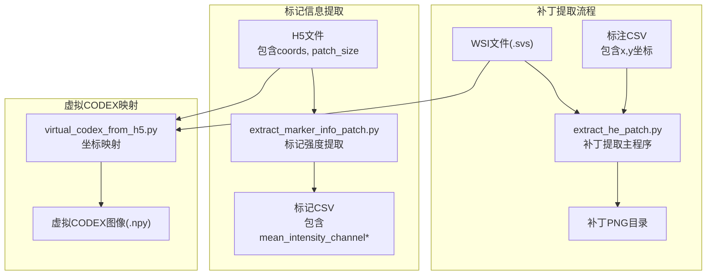
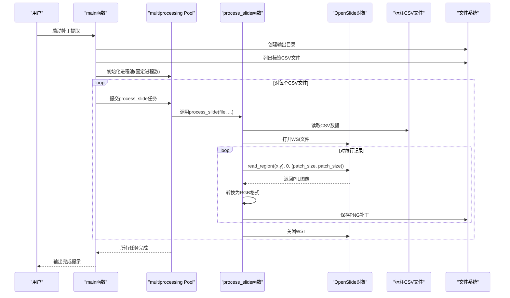
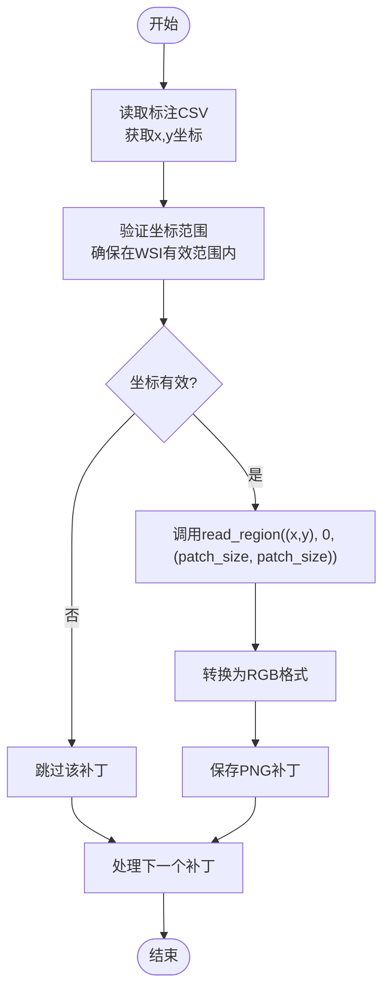
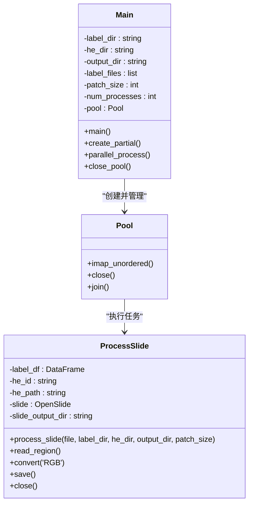
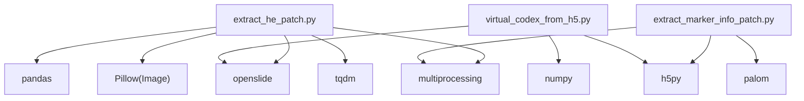

# 补丁提取算法

<cite>
**本文档引用的文件**
- [extract_he_patch.py](file://extract_he_patch.py)
- [extract_marker_info_patch.py](file://extract_marker_info_patch.py)
- [hex/virtual_codex_from_h5.py](file://hex/virtual_codex_from_h5.py)
- [hex/utils.py](file://hex/utils.py)
- [hex/sample_data/channel_registered/0.csv](file://hex/sample_data/channel_registered/0.csv)
- [hex/sample_data/splits_0.csv](file://hex/sample_data/splits_0.csv)
- [README.md](file://README.md)
</cite>

## 目录
1. [简介](#简介)
2. [项目结构](#项目结构)
3. [核心组件](#核心组件)
4. [架构概览](#架构概览)
5. [详细组件分析](#详细组件分析)
6. [依赖关系分析](#依赖关系分析)
7. [性能考量](#性能考量)
8. [故障排除指南](#故障排除指南)
9. [结论](#结论)

## 简介
本文件为补丁提取算法的技术文档，深入解释基于DataFrame坐标的补丁读取、图像区域裁剪、RGB转换等处理流程。文档涵盖补丁坐标系统（x、y坐标含义、坐标原点位置、像素单位转换）、补丁大小参数配置（patch_size选择原则、不同尺寸对模型性能的影响、内存占用考虑）、并行处理机制（multiprocessing池使用、进程数量优化、进度条显示）等关键技术细节，并提供具体的代码示例路径和参数调优指南，帮助解决常见的补丁提取问题如坐标越界、内存溢出、处理速度慢等。

## 项目结构
该项目围绕HEX（H&E to protein expression）工作流构建，包含以下与补丁提取直接相关的模块：
- 补丁提取脚本：从标注CSV中读取坐标，使用OpenSlide读取WSI区域并保存为PNG补丁
- 标记信息提取：从CODEX H5文件中读取坐标，提取通道均值强度并生成CSV
- 虚拟CODEX映射：将H5预测结果映射到WSI空间，生成虚拟CODEX图像
- 数据集工具：定义PatchDataset用于训练和推理的数据加载
- 示例数据：包含已配对的CSV和分割文件，展示数据格式

**图表来源**
- [extract_he_patch.py:1-78](file://extract_he_patch.py#L1-L78)
- [extract_marker_info_patch.py:1-74](file://extract_marker_info_patch.py#L1-L74)
- [hex/virtual_codex_from_h5.py:1-68](file://hex/virtual_codex_from_h5.py#L1-L68)

**章节来源**
- [README.md:26-44](file://README.md#L26-L44)

## 核心组件
本节概述补丁提取算法的关键组件及其职责：
- 坐标系统：基于OpenSlide的全分辨率金字塔，使用(0,0)作为左上角原点，像素单位
- 补丁读取：通过slide.read_region((x, y), level, (patch_size, patch_size))读取指定区域
- 图像处理：转换为RGB格式，移除alpha通道，保存为PNG
- 并行处理：使用multiprocessing Pool进行多进程并行，tqdm显示进度条
- 数据组织：每个WSI生成独立子目录，按slide_index命名补丁文件

**章节来源**
- [extract_he_patch.py:9-45](file://extract_he_patch.py#L9-L45)

## 架构概览
补丁提取的整体架构由三个阶段组成：数据准备、补丁提取、后处理。下图展示了从输入到输出的完整流程。

**图表来源**
- [extract_he_patch.py:46-78](file://extract_he_patch.py#L46-L78)
- [extract_he_patch.py:9-45](file://extract_he_patch.py#L9-L45)

## 详细组件分析

### 坐标系统与像素单位转换
补丁提取算法严格遵循OpenSlide的坐标约定：
- 坐标原点：WSI金字塔的左上角(0,0)，向右为x正方向，向下为y正方向
- 坐标层级：使用level=0（全分辨率），因此(x,y)以像素为单位
- 像素单位转换：patch_size以像素为单位，确保与OpenSlide的像素坐标一致

**图表来源**
- [extract_he_patch.py:24-38](file://extract_he_patch.py#L24-L38)

**章节来源**
- [extract_he_patch.py:24-38](file://extract_he_patch.py#L24-L38)

### 补丁大小参数配置
补丁大小（patch_size）是影响算法性能和精度的关键参数：
- 选择原则：
  - 模型输入尺寸：确保patch_size与模型期望输入尺寸匹配（例如384）
  - 计算资源：较大的patch_size会显著增加内存占用和I/O压力
  - 数据质量：过小的patch_size可能导致信息不足，过大则可能包含过多背景噪声
- 不同尺寸的影响：
  - 尺寸增大：提高特征表达能力但增加内存和计算成本
  - 尺寸减小：降低内存占用但可能丢失关键结构信息
- 内存占用考虑：
  - 单个RGB补丁的内存约为patch_size × patch_size × 3字节
  - 多进程并行时需考虑进程间共享内存和磁盘I/O瓶颈

**章节来源**
- [extract_he_patch.py:57-58](file://extract_he_patch.py#L57-L58)
- [hex/virtual_codex_from_h5.py:48](file://hex/virtual_codex_from_h5.py#L48)

### 并行处理机制
算法采用multiprocessing Pool实现高效并行：
- 进程池初始化：设置固定进程数量（如8），平衡CPU利用率和内存占用
- 任务分发：使用functools.partial固定公共参数，减少序列化开销
- 进度监控：tqdm.imap_unordered提供实时进度条，提升用户体验
- 结果收集：异步迭代器自动管理任务完成顺序，避免阻塞等待

**图表来源**
- [extract_he_patch.py:9-45](file://extract_he_patch.py#L9-L45)
- [extract_he_patch.py:46-78](file://extract_he_patch.py#L46-L78)

**章节来源**
- [extract_he_patch.py:60-73](file://extract_he_patch.py#L60-L73)

### 数据处理流程
补丁提取的完整数据处理流程如下：
- 输入准备：CSV文件包含slide、index、x、y等字段；WSI文件为.svs格式
- 数据读取：pandas读取CSV，OpenSlide打开WSI
- 区域提取：根据(x,y)和patch_size调用read_region
- 图像转换：PIL.Image.convert('RGB')移除alpha通道
- 文件保存：按slide_index命名PNG文件，存储到对应子目录
- 资源清理：关闭OpenSlide句柄，释放内存

**章节来源**
- [extract_he_patch.py:9-45](file://extract_he_patch.py#L9-L45)

### 数据格式与示例
项目提供了标准的数据格式示例，便于理解字段含义和数据组织方式：
- CSV字段：slide（WSI标识）、index（补丁索引）、x/y（像素坐标）、mean_intensity_channel*（标记强度）
- 分割文件：包含训练/验证患者ID的映射关系
- 示例CSV内容展示了坐标和强度数据的组织方式

**章节来源**
- [hex/sample_data/channel_registered/0.csv:1-4](file://hex/sample_data/channel_registered/0.csv#L1-L4)
- [hex/sample_data/splits_0.csv:1-5](file://hex/sample_data/splits_0.csv#L1-L5)

## 依赖关系分析
补丁提取算法涉及多个外部库和内部模块的协作：
- OpenSlide：读取WSI文件，支持多级金字塔和区域读取
- Pandas：处理CSV数据，提供高效的行列操作
- Pillow(PIL)：图像格式转换和保存
- tqdm：进度条显示，提升用户体验
- multiprocessing：并行处理，提高吞吐量

**图表来源**
- [extract_he_patch.py:1-8](file://extract_he_patch.py#L1-L8)
- [extract_marker_info_patch.py:1-10](file://extract_marker_info_patch.py#L1-L10)
- [hex/virtual_codex_from_h5.py:1-7](file://hex/virtual_codex_from_h5.py#L1-L7)

**章节来源**
- [extract_he_patch.py:1-8](file://extract_he_patch.py#L1-L8)
- [extract_marker_info_patch.py:1-10](file://extract_marker_info_patch.py#L1-L10)
- [hex/virtual_codex_from_h5.py:1-7](file://hex/virtual_codex_from_h5.py#L1-L7)

## 性能考量
针对补丁提取算法的性能优化建议：
- 进程数量优化：根据CPU核心数和内存容量调整num_processes，避免过度并发导致上下文切换开销
- 内存管理：合理设置patch_size，避免单个补丁过大导致内存峰值过高；及时关闭OpenSlide句柄
- I/O优化：将输出目录放置在高性能存储设备上；批量写入减少磁盘碎片
- 预处理加速：在读取CSV前进行数据清洗和坐标验证，减少无效任务
- 缓存策略：对于重复访问的WSI，考虑缓存元数据以减少重复解析

## 故障排除指南
常见问题及解决方案：
- 坐标越界：检查CSV中的x、y是否超出WSI的有效范围；在读取前添加边界检查逻辑
- 内存溢出：减小patch_size或num_processes；监控内存使用情况，必要时分批处理
- 处理速度慢：优化I/O路径，使用SSD存储；减少不必要的图像转换步骤
- 文件权限错误：确保输出目录具有写入权限；检查WSI文件的只读属性
- 进程卡死：设置超时机制和异常捕获；定期检查进程状态

**章节来源**
- [extract_he_patch.py:43-44](file://extract_he_patch.py#L43-L44)

## 结论
补丁提取算法通过标准化的坐标系统、灵活的参数配置和高效的并行处理机制，实现了大规模WSI补丁的自动化提取。算法设计充分考虑了内存占用、处理速度和数据质量之间的平衡，为后续的深度学习模型训练和推理奠定了坚实基础。通过合理的参数调优和故障排除策略，可以进一步提升系统的稳定性和性能表现。