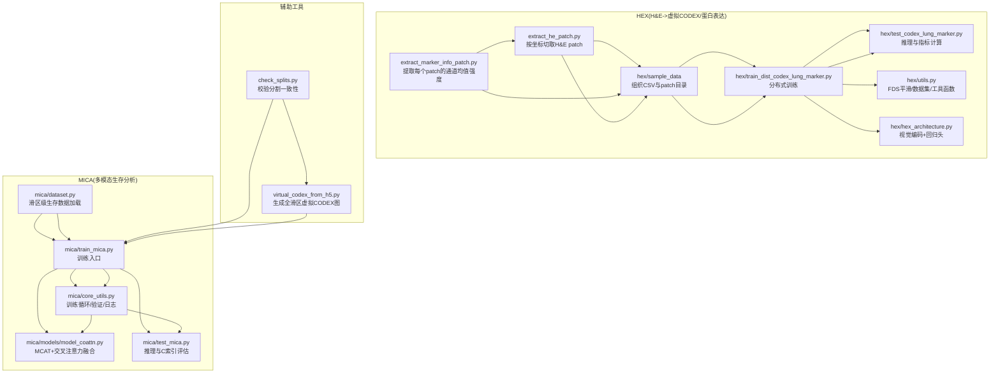
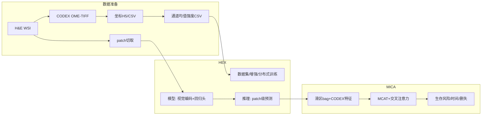
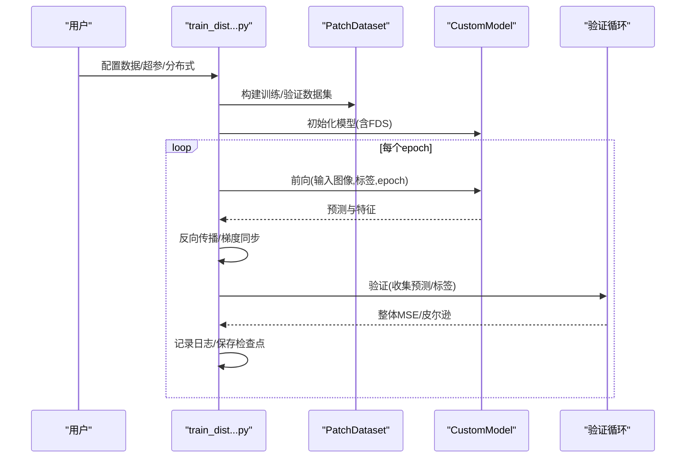
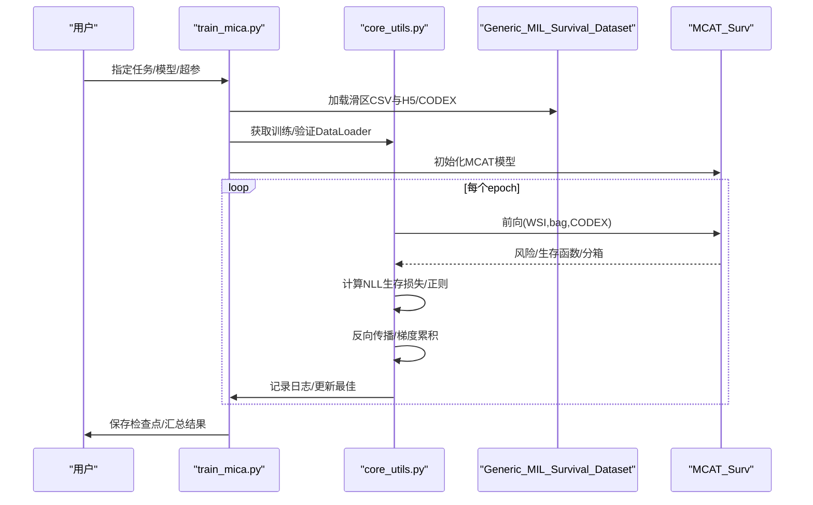
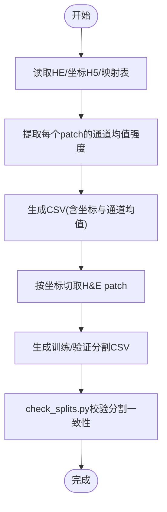
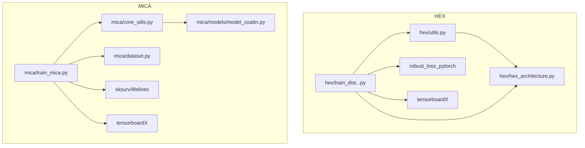

# 示例与最佳实践

<cite>
**本文引用的文件**
- [README.md](file://README.md)
- [main.py](file://main.py)
- [hex/hex_architecture.py](file://hex/hex_architecture.py)
- [hex/utils.py](file://hex/utils.py)
- [hex/train_dist_codex_lung_marker.py](file://hex/train_dist_codex_lung_marker.py)
- [hex/test_codex_lung_marker.py](file://hex/test_codex_lung_marker.py)
- [mica/models/model_coattn.py](file://mica/models/model_coattn.py)
- [mica/dataset.py](file://mica/dataset.py)
- [mica/core_utils.py](file://mica/core_utils.py)
- [mica/train_mica.py](file://mica/train_mica.py)
- [mica/test_mica.py](file://mica/test_mica.py)
- [extract_he_patch.py](file://extract_he_patch.py)
- [extract_marker_info_patch.py](file://extract_marker_info_patch.py)
- [check_splits.py](file://check_splits.py)
- [hex/virtual_codex_from_h5.py](file://hex/virtual_codex_from_h5.py)
</cite>

## 目录
1. [简介](#简介)
2. [项目结构](#项目结构)
3. [核心组件](#核心组件)
4. [架构总览](#架构总览)
5. [详细组件分析](#详细组件分析)
6. [依赖关系分析](#依赖关系分析)
7. [性能考虑](#性能考虑)
8. [故障排除指南](#故障排除指南)
9. [结论](#结论)
10. [附录](#附录)

## 简介
本指南面向HEX项目使用者，提供从数据准备到结果分析的完整端到端工作流程示例，覆盖小规模实验数据与大规模临床数据两类场景；总结参数调优经验法则；给出性能优化建议（内存、计算、分布式）；提供常见问题排查方法；并附带可直接复用的脚手架与模板路径，帮助快速启动新分析项目。

## 项目结构
HEX由两条主线构成：HEX（从H&E预测蛋白表达）与MICA（多组学生存分析）。数据管线贯穿图像预处理、特征提取、模型训练与评估、以及结果解释。

图表来源
- [README.md](file://README.md)
- [extract_marker_info_patch.py](file://extract_marker_info_patch.py)
- [extract_he_patch.py](file://extract_he_patch.py)
- [hex/train_dist_codex_lung_marker.py](file://hex/train_dist_codex_lung_marker.py)
- [hex/test_codex_lung_marker.py](file://hex/test_codex_lung_marker.py)
- [hex/utils.py](file://hex/utils.py)
- [hex/hex_architecture.py](file://hex/hex_architecture.py)
- [mica/dataset.py](file://mica/dataset.py)
- [mica/train_mica.py](file://mica/train_mica.py)
- [mica/core_utils.py](file://mica/core_utils.py)
- [mica/models/model_coattn.py](file://mica/models/model_coattn.py)
- [mica/test_mica.py](file://mica/test_mica.py)
- [check_splits.py](file://check_splits.py)
- [hex/virtual_codex_from_h5.py](file://hex/virtual_codex_from_h5.py)

章节来源
- [README.md](file://README.md)
- [main.py](file://main.py)

## 核心组件
- HEX模型与数据流
  - 视觉编码器与回归头：基于MUSK大模型作为视觉编码器，叠加两段线性回归头，输出40个生物标志物的表达预测。
  - 分布式训练与FDS平滑：支持DDP分布式训练，结合特征分布平滑（FDS）稳定回归学习。
  - 推理与评估：使用ImageNet Inception归一化，半精度推理，保存patch级预测与整体指标。
- MICA模型与数据流
  - 多模态生存分析：H&E bag特征与CODEX深度特征经交叉注意力与Transformer融合，输出生存风险与c-index。
  - 数据加载：按滑区粒度读取bag特征与CODEX H5，构建滑区级生存数据集。
  - 训练/测试：支持5折交叉验证，TensorBoard日志，集成梯度解释。

章节来源
- [hex/hex_architecture.py](file://hex/hex_architecture.py)
- [hex/utils.py](file://hex/utils.py)
- [hex/train_dist_codex_lung_marker.py](file://hex/train_dist_codex_lung_marker.py)
- [hex/test_codex_lung_marker.py](file://hex/test_codex_lung_marker.py)
- [mica/models/model_coattn.py](file://mica/models/model_coattn.py)
- [mica/dataset.py](file://mica/dataset.py)
- [mica/core_utils.py](file://mica/core_utils.py)
- [mica/train_mica.py](file://mica/train_mica.py)
- [mica/test_mica.py](file://mica/test_mica.py)

## 架构总览
下图展示HEX与MICA在端到端管线中的位置与交互：HEX负责从H&E生成虚拟CODEX或直接回归蛋白表达；MICA以滑区为单位整合H&E bag与CODEX特征进行生存分析。

图表来源
- [extract_he_patch.py](file://extract_he_patch.py)
- [extract_marker_info_patch.py](file://extract_marker_info_patch.py)
- [hex/hex_architecture.py](file://hex/hex_architecture.py)
- [hex/utils.py](file://hex/utils.py)
- [mica/models/model_coattn.py](file://mica/models/model_coattn.py)
- [mica/dataset.py](file://mica/dataset.py)

## 详细组件分析

### 组件A：HEX模型与训练流程
- 模型结构
  - 视觉编码器来自MUSK大模型，输出维度固定；回归头包含两段线性层+Dropout，最终映射到40维生物标志物。
  - 支持FDS特征分布平滑，按epoch动态启用/关闭，针对选定生物标志物进行特征域对抗平滑。
- 训练流程
  - 分布式训练：DDP初始化、本地rank/world size、采样器与数据加载器配置。
  - 冻结策略：仅解冻最后若干编码层与回归头，降低显存占用并加速收敛。
  - 优化器与损失：Adam优化器，自适应鲁棒损失函数，指数衰减学习率调度。
  - 日志与检查点：TensorBoard记录损失与每生物标志物MSE/皮尔逊相关系数，周期性保存权重。
- 推理流程
  - 使用ImageNet Inception均值/方差归一化，半精度推理，批量收集预测与标签，计算整体统计与排序。

图表来源
- [hex/train_dist_codex_lung_marker.py](file://hex/train_dist_codex_lung_marker.py)
- [hex/utils.py](file://hex/utils.py)
- [hex/hex_architecture.py](file://hex/hex_architecture.py)

章节来源
- [hex/hex_architecture.py](file://hex/hex_architecture.py)
- [hex/utils.py](file://hex/utils.py)
- [hex/train_dist_codex_lung_marker.py](file://hex/train_dist_codex_lung_marker.py)
- [hex/test_codex_lung_marker.py](file://hex/test_codex_lung_marker.py)

### 组件B：MICA模型与训练流程
- 模型结构
  - H&E bag经FC映射后进入Transformer编码器；CODEX经独立FC映射后与H&E进行交叉注意力对齐。
  - 支持共享/分离Transformer权重，池化方式支持全局平均或注意力加权。
  - 融合策略支持拼接或双线性池化，最终分类器输出离散生存分箱。
- 训练流程
  - 5折CV：按滑区划分训练/验证，确保同一患者不同slide不重叠。
  - 优化器与损失：NLL生存损失，支持正则项；梯度累积减少显存峰值。
  - 日志与评估：TensorBoard记录损失与c-index，保存最佳检查点，测试阶段可选集成梯度解释。

图表来源
- [mica/train_mica.py](file://mica/train_mica.py)
- [mica/core_utils.py](file://mica/core_utils.py)
- [mica/dataset.py](file://mica/dataset.py)
- [mica/models/model_coattn.py](file://mica/models/model_coattn.py)

章节来源
- [mica/train_mica.py](file://mica/train_mica.py)
- [mica/core_utils.py](file://mica/core_utils.py)
- [mica/dataset.py](file://mica/dataset.py)
- [mica/models/model_coattn.py](file://mica/models/model_coattn.py)
- [mica/test_mica.py](file://mica/test_mica.py)

### 组件C：数据准备与质量控制
- 通道均值强度提取：从CODEX OME-TIFF中按patch坐标读取，计算各通道均值，输出CSV供HEX回归训练。
- H&E patch切取：根据CSV坐标读取对应slide区域，保存为PNG，供HEX模型训练/推理。
- 分割校验：对HEX单折或多折分割进行一致性检查，确保train/val无重叠且覆盖完整。
- 虚拟CODEX合成：将HEX预测的CODEX向量映射回WSI空间，生成全滑区虚拟CODEX图。

图表来源
- [extract_marker_info_patch.py](file://extract_marker_info_patch.py)
- [extract_he_patch.py](file://extract_he_patch.py)
- [check_splits.py](file://check_splits.py)

章节来源
- [extract_marker_info_patch.py](file://extract_marker_info_patch.py)
- [extract_he_patch.py](file://extract_he_patch.py)
- [check_splits.py](file://check_splits.py)
- [hex/virtual_codex_from_h5.py](file://hex/virtual_codex_from_h5.py)

## 依赖关系分析
- HEX侧
  - 模型依赖MUSK视觉编码器与timm；数据增强依赖torchvision；鲁棒损失来自robust_loss_pytorch；半精度训练依赖AMP。
  - 训练脚本依赖分布式包torch.distributed与DDP封装；日志依赖tensorboardX。
- MICA侧
  - 模型依赖torch与torch.nn；数据加载依赖h5py；生存指标依赖sksurv与lifelines；可解释性使用captum。
  - 训练脚本依赖argparse与自定义core_utils封装训练/验证循环。

图表来源
- [hex/utils.py](file://hex/utils.py)
- [hex/hex_architecture.py](file://hex/hex_architecture.py)
- [hex/train_dist_codex_lung_marker.py](file://hex/train_dist_codex_lung_marker.py)
- [mica/core_utils.py](file://mica/core_utils.py)
- [mica/models/model_coattn.py](file://mica/models/model_coattn.py)
- [mica/train_mica.py](file://mica/train_mica.py)
- [mica/dataset.py](file://mica/dataset.py)

章节来源
- [hex/utils.py](file://hex/utils.py)
- [hex/hex_architecture.py](file://hex/hex_architecture.py)
- [hex/train_dist_codex_lung_marker.py](file://hex/train_dist_codex_lung_marker.py)
- [mica/core_utils.py](file://mica/core_utils.py)
- [mica/models/model_coattn.py](file://mica/models/model_coattn.py)
- [mica/train_mica.py](file://mica/train_mica.py)
- [mica/dataset.py](file://mica/dataset.py)

## 性能考虑
- 显存与吞吐
  - 半精度训练（AMP）与混合精度优化器缩放，显著降低显存占用并提升吞吐。
  - 批次大小与梯度累积：在有限显存下增大有效批次，通过梯度累积平衡稳定性与速度。
  - 数据加载：合理设置num_workers与pin_memory，避免CPU瓶颈；分布式采样器保证样本均匀分布。
- 计算效率
  - 冻结预训练编码器前层，仅训练下游回归头，减少计算开销。
  - 合理的数据增强（随机翻转/旋转/颜色扰动）在提升泛化的同时控制额外计算。
- 分布式训练
  - 使用DDP与分布式采样器，确保跨GPU数据均衡；在反向传播后同步鲁棒损失参数。
  - 在高epoch阶段冻结视觉编码器，切换eval模式，进一步节省显存。
- FDS平滑
  - 仅对选定生物标志物启用，设定合适的起始epoch与平滑窗口，避免过度平滑导致信息丢失。
- I/O与中间产物
  - 将HE patch与通道均值CSV组织在高效存储上；虚拟CODEX合成时注意坐标缩放与内存写入策略。

[本节为通用性能建议，无需特定文件引用]

## 故障排除指南
- 数据质量问题
  - H&E与CODEX配准/坐标不一致：确认坐标H5与CSV生成流程正确，核对patch尺寸与层级。
  - 分割重叠或缺失：使用check_splits.py逐项检查train/val是否跨fold重叠、是否覆盖全部患者。
- 模型收敛问题
  - 学习率过低/过高：从基准学习率开始，结合指数衰减或余弦调度；若出现震荡，适当降低初始学习率。
  - 正则化不足：增加L2/L1正则或提高dropout；对长尾分布可考虑FDS平滑。
  - 数据不平衡：采用加权采样或鲁棒损失；关注每生物标志物的MSE与皮尔逊相关系数差异。
- 内存不足
  - 减小batch size或增大gradient accumulation；关闭不必要的日志与调试信息；在高epoch冻结视觉编码器。
  - 使用半精度与AMP；确保num_workers与pin_memory配置合理。
- 分布式训练异常
  - NCCL初始化失败：检查MASTER_ADDR/PORT、CUDA可见设备与进程数匹配。
  - 梯度同步错误：确认所有参与训练的参数均被优化器管理；对鲁棒损失参数执行all_reduce。
- 结果解释与可视化
  - MICA集成梯度：在测试脚本中启用IG，得到空间重要性图；注意归一化与阈值设置。
  - 虚拟CODEX可视化：将生成的全滑区数组保存为npy或转换为图像，叠加于WSI上观察异质性。

章节来源
- [check_splits.py](file://check_splits.py)
- [hex/train_dist_codex_lung_marker.py](file://hex/train_dist_codex_lung_marker.py)
- [mica/test_mica.py](file://mica/test_mica.py)
- [hex/virtual_codex_from_h5.py](file://hex/virtual_codex_from_h5.py)

## 结论
HEX与MICA共同构成了从H&E到多组学生存分析的完整管线。通过规范化的数据准备、稳健的模型设计与分布式训练策略，可在小规模实验与大规模临床数据上取得可靠的结果。建议优先遵循本文的参数调优经验与性能优化建议，并结合check_splits.py与推理脚本快速落地新项目。

[本节为总结性内容，无需特定文件引用]

## 附录

### A. 端到端工作流模板（步骤化）
- 数据准备
  - 使用通道均值提取脚本生成CSV，再用patch切取脚本生成H&E patch目录。
  - 生成训练/验证分割CSV，并用check_splits.py进行一致性校验。
- HEX训练
  - 使用分布式训练脚本，配置batch size、学习率、FDS参数与保存路径。
  - 训练完成后使用推理脚本进行预测与指标统计。
- MICA训练
  - 准备滑区级bag与CODEX H5，运行训练脚本，启用5折CV与日志记录。
  - 测试阶段可选集成梯度解释，导出c-index与汇总结果。
- 结果解释
  - 将HEX预测的CODEX向量映射回WSI空间，生成虚拟CODEX图用于可视化。

章节来源
- [extract_marker_info_patch.py](file://extract_marker_info_patch.py)
- [extract_he_patch.py](file://extract_he_patch.py)
- [check_splits.py](file://check_splits.py)
- [hex/train_dist_codex_lung_marker.py](file://hex/train_dist_codex_lung_marker.py)
- [hex/test_codex_lung_marker.py](file://hex/test_codex_lung_marker.py)
- [mica/train_mica.py](file://mica/train_mica.py)
- [mica/test_mica.py](file://mica/test_mica.py)
- [hex/virtual_codex_from_h5.py](file://hex/virtual_codex_from_h5.py)

### B. 参数调优最佳实践（经验法则）
- 学习率与调度
  - 初始学习率：HEX回归头约1e-5；MICA生存头约2e-4；根据batch size线性缩放。
  - 调度：指数衰减或余弦退火；在高epoch阶段冻结编码器并切换eval。
- 批次大小与梯度累积
  - 以显存为上限，先定batch size，再用梯度累积达到目标有效batch。
- 正则化
  - L2权重衰减：1e-5~1e-4；dropout：0.25；FDS平滑：仅对关键生物标志物启用。
- 数据增强
  - 随机水平/垂直翻转、旋转、颜色抖动；保持归一化一致。

[本节为经验总结，无需特定文件引用]

### C. 代码模板与脚手架路径
- HEX训练入口：[hex/train_dist_codex_lung_marker.py](file://hex/train_dist_codex_lung_marker.py)
- HEX推理入口：[hex/test_codex_lung_marker.py](file://hex/test_codex_lung_marker.py)
- MICA训练入口：[mica/train_mica.py](file://mica/train_mica.py)
- MICA测试入口：[mica/test_mica.py](file://mica/test_mica.py)
- 数据准备脚本：
  - [extract_marker_info_patch.py](file://extract_marker_info_patch.py)
  - [extract_he_patch.py](file://extract_he_patch.py)
  - [check_splits.py](file://check_splits.py)
  - [hex/virtual_codex_from_h5.py](file://hex/virtual_codex_from_h5.py)

章节来源
- [hex/train_dist_codex_lung_marker.py](file://hex/train_dist_codex_lung_marker.py)
- [hex/test_codex_lung_marker.py](file://hex/test_codex_lung_marker.py)
- [mica/train_mica.py](file://mica/train_mica.py)
- [mica/test_mica.py](file://mica/test_mica.py)
- [extract_marker_info_patch.py](file://extract_marker_info_patch.py)
- [extract_he_patch.py](file://extract_he_patch.py)
- [check_splits.py](file://check_splits.py)
- [hex/virtual_codex_from_h5.py](file://hex/virtual_codex_from_h5.py)