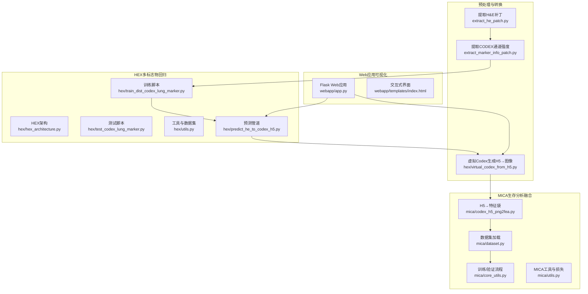
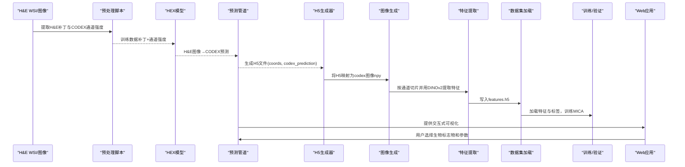
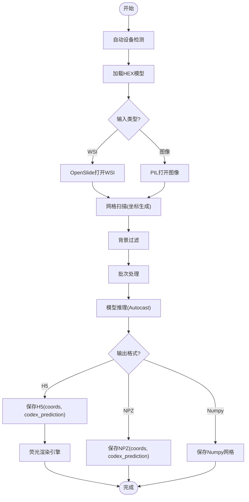
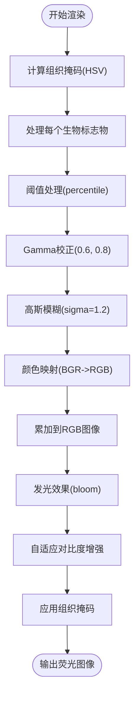
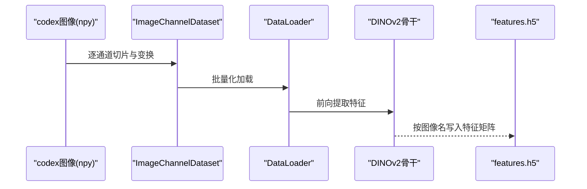
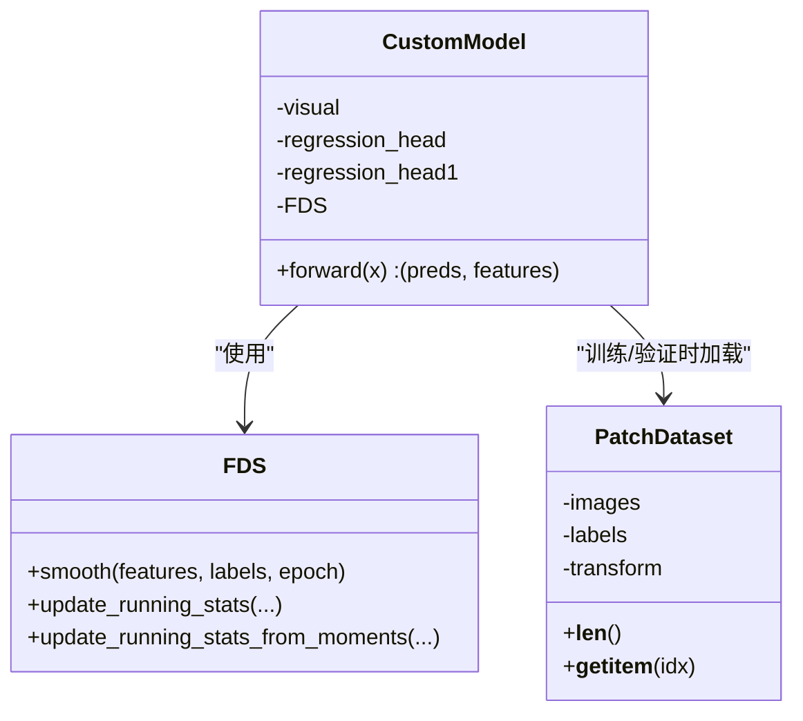
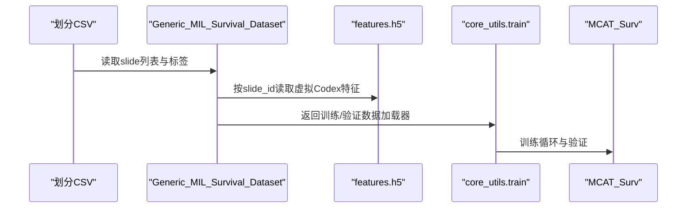
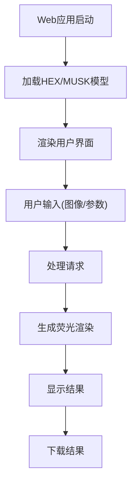
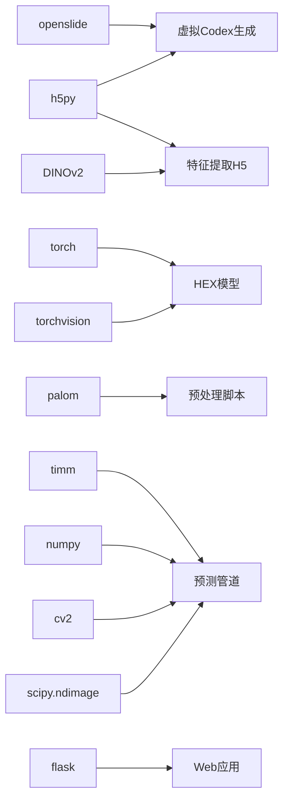

# 虚拟Codex生成

<cite>
**本文引用的文件**
- [predict_he_to_codex_h5.py](file://hex/predict_he_to_codex_h5.py)
- [virtual_codex_from_h5.py](file://hex/virtual_codex_from_h5.py)
- [codex_h5_png2fea.py](file://mica/codex_h5_png2fea.py)
- [hex_architecture.py](file://hex/hex_architecture.py)
- [utils.py](file://hex/utils.py)
- [test_codex_lung_marker.py](file://hex/test_codex_lung_marker.py)
- [train_dist_codex_lung_marker.py](file://hex/train_dist_codex_lung_marker.py)
- [dataset.py](file://mica/dataset.py)
- [core_utils.py](file://mica/core_utils.py)
- [utils.py（MICA）](file://mica/utils.py)
- [extract_he_patch.py](file://extract_he_patch.py)
- [extract_marker_info_patch.py](file://extract_marker_info_patch.py)
- [README.md](file://README.md)
- [app.py](file://webapp/app.py)
</cite>

## 更新摘要
**变更内容**
- 新增完整的H&E到CODEX转换预测管道，包括新的predict_he_to_codex_h5.py脚本
- 显著增强的虚拟Codex生成功能，包括新的荧光渲染引擎、组织掩码算法和多生物标志物通道支持
- 改进的虚拟Codex生成流程，支持WSI和普通图像的统一处理
- 增强的空间坐标映射功能，支持更精确的分辨率匹配
- 新增背景过滤和批次处理优化
- 完善的命令行接口和批量处理能力
- Web应用集成，提供交互式可视化界面

## 目录
1. [引言](#引言)
2. [项目结构](#项目结构)
3. [核心组件](#核心组件)
4. [架构总览](#架构总览)
5. [详细组件分析](#详细组件分析)
6. [依赖分析](#依赖分析)
7. [性能考虑](#性能考虑)
8. [故障排查指南](#故障排查指南)
9. [结论](#结论)
10. [附录](#附录)

## 引言
本文件围绕HEX项目的"虚拟Codex生成"能力，系统化梳理从H&E图像到蛋白质表达图谱的完整转换流程、空间坐标映射与分辨率匹配策略、H5数据处理与批量读取优化、质量控制与验证方法，以及完整的数据格式转换示例与性能优化建议。本次更新重点介绍了新增的H&E到CODEX转换预测管道，包括完整的命令行接口、背景过滤、批次处理和多格式支持，以及显著增强的荧光渲染引擎和组织掩码算法。

## 项目结构
HEX项目采用模块化组织：HEX侧负责基于H&E图像的多标志物回归模型训练与推理；MICA侧负责将HEX生成的虚拟Codex与WSI Bag特征融合进行生存分析建模。虚拟Codex生成的核心脚本位于hex与mica两个子目录中，分别承担H5→图像与图像→特征袋的任务。Web应用提供交互式可视化界面。



**图表来源**
- [hex_architecture.py:1-62](file://hex/hex_architecture.py#L1-L62)
- [train_dist_codex_lung_marker.py:1-400](file://hex/train_dist_codex_lung_marker.py#L1-L400)
- [test_codex_lung_marker.py:1-197](file://hex/test_codex_lung_marker.py#L1-L197)
- [utils.py:1-342](file://hex/utils.py#L1-L342)
- [predict_he_to_codex_h5.py:1-841](file://hex/predict_he_to_codex_h5.py#L1-L841)
- [codex_h5_png2fea.py:1-173](file://mica/codex_h5_png2fea.py#L1-L173)
- [dataset.py:1-250](file://mica/dataset.py#L1-L250)
- [core_utils.py:1-230](file://mica/core_utils.py#L1-L230)
- [utils.py（MICA）:1-273](file://mica/utils.py#L1-L273)
- [extract_he_patch.py:1-78](file://extract_he_patch.py#L1-L78)
- [extract_marker_info_patch.py:1-74](file://extract_marker_info_patch.py#L1-L74)
- [virtual_codex_from_h5.py:1-68](file://hex/virtual_codex_from_h5.py#L1-L68)
- [app.py:1-1405](file://webapp/app.py#L1-L1405)

**章节来源**
- [README.md:1-57](file://README.md#L1-L57)

## 核心组件
- **H&E到CODEX转换预测管道**
  - 功能：完整的端到端预测管道，支持WSI和普通图像，自动背景过滤，批次处理，多格式输出
  - 关键特性：自动设备检测、批量推理、背景区域过滤、H5和NPZ格式输出、多生物标志物通道支持
- **增强的荧光渲染引擎**
  - 功能：基于真实免疫荧光成像原理的多通道渲染，支持组织掩码、阈值处理、高斯模糊和发光效果
  - 关键特性：40种生物标志物颜色映射、组织特异性表达、真实感视觉效果
- **虚拟Codex生成（H5→图像）**
  - 功能：将每个WSI对应的H5文件中的预测向量与坐标映射到统一分辨率的二维图像，保存为npy格式
  - 关键点：基于OpenSlide读取WSI元数据推断放大倍数，计算缩放因子，按坐标落格累加至codex图像
- **图像→特征袋（DINOv2）**
  - 功能：将每个WSI的codex图像按通道切片，使用DINOv2提取特征，写入H5
- **HEX多标志物回归**
  - 功能：以H&E补丁为输入，回归40个蛋白标志物表达，支持分布式训练与评估
- **MICA生存分析融合**
  - 功能：将WSI Bag特征与虚拟Codex深度特征融合，进行生存分析建模与可解释性分析
- **Web应用可视化**
  - 功能：提供交互式界面，支持实时荧光渲染、组织掩码分析和多生物标志物可视化

**章节来源**
- [predict_he_to_codex_h5.py:1-841](file://hex/predict_he_to_codex_h5.py#L1-L841)
- [virtual_codex_from_h5.py:1-68](file://hex/virtual_codex_from_h5.py#L1-L68)
- [codex_h5_png2fea.py:1-173](file://mica/codex_h5_png2fea.py#L1-L173)
- [hex_architecture.py:1-62](file://hex/hex_architecture.py#L1-L62)
- [utils.py:1-342](file://hex/utils.py#L1-L342)
- [dataset.py:1-250](file://mica/dataset.py#L1-L250)
- [core_utils.py:1-230](file://mica/core_utils.py#L1-L230)
- [app.py:1-1405](file://webapp/app.py#L1-L1405)

## 架构总览
下图展示从H&E到虚拟Codex再到生存分析的整体流程，突出数据流与模块边界，包括新增的Web应用集成。



**图表来源**
- [extract_he_patch.py:1-78](file://extract_he_patch.py#L1-L78)
- [extract_marker_info_patch.py:1-74](file://extract_marker_info_patch.py#L1-L74)
- [train_dist_codex_lung_marker.py:1-400](file://hex/train_dist_codex_lung_marker.py#L1-L400)
- [predict_he_to_codex_h5.py:1-841](file://hex/predict_he_to_codex_h5.py#L1-L841)
- [virtual_codex_from_h5.py:1-68](file://hex/virtual_codex_from_h5.py#L1-L68)
- [codex_h5_png2fea.py:1-173](file://mica/codex_h5_png2fea.py#L1-L173)
- [dataset.py:1-250](file://mica/dataset.py#L1-L250)
- [core_utils.py:1-230](file://mica/core_utils.py#L1-L230)
- [app.py:1-1405](file://webapp/app.py#L1-L1405)

## 详细组件分析

### 组件A：H&E到CODEX转换预测管道
- **输入**
  - H&E WSI：OpenSlide支持的格式（.svs, .mrxs, .ndpi, .scn）
  - 普通图像：PNG, JPG, TIFF格式
  - 模型权重：HEX预训练检查点
- **核心功能**
  - 自动设备检测：优先使用CUDA，若不兼容则回退CPU
  - 批次网格扫描：支持自定义patch_size和stride
  - 背景过滤：基于白色阈值过滤无意义区域
  - 多格式输出：支持H5、NPZ、Numpy网格三种格式
  - **新增**：多生物标志物通道渲染，支持40种生物标志物的独立可视化
- **处理流程**
  - 图像预处理：Resize(384,384)、ToTensor、Normalize
  - 模型推理：自动混合精度推理，支持GPU加速
  - 结果保存：动态H5创建，支持增量写入
  - **新增**：组织掩码计算，背景过滤，荧光渲染



**图表来源**
- [predict_he_to_codex_h5.py:1-841](file://hex/predict_he_to_codex_h5.py#L1-L841)

**章节来源**
- [predict_he_to_codex_h5.py:1-841](file://hex/predict_he_to_codex_h5.py#L1-L841)

### 组件B：增强的荧光渲染引擎
- **多生物标志物通道支持**
  - 支持40种生物标志物的独立可视化
  - 每种标志物具有特定的荧光颜色映射
  - 组织特异性表达模式模拟
- **组织掩码算法**
  - HSV色彩空间分析识别组织区域
  - 二值化闭合和孔洞填充处理
  - 组织掩码应用于所有渲染通道
- **真实感渲染效果**
  - 高斯模糊模拟荧光扩散
  - 发光(bloom)效果增强视觉效果
  - 阈值处理和对比度增强
  - alpha通道混合实现透明度效果



**图表来源**
- [predict_he_to_codex_h5.py:133-244](file://hex/predict_he_to_codex_h5.py#L133-L244)
- [app.py:844-978](file://webapp/app.py#L844-L978)

**章节来源**
- [predict_he_to_codex_h5.py:133-244](file://hex/predict_he_to_codex_h5.py#L133-L244)
- [app.py:844-978](file://webapp/app.py#L844-L978)

### 组件C：虚拟Codex生成（H5→图像）
- **输入**
  - H5文件：包含两组键值
    - codex_prediction：形状(N, C)，N为采样点数，C为通道数（40或与模型一致）
    - coords：形状(N, 2)，像素坐标(x, y)
  - WSI：OpenSlide对象，用于读取尺寸与MPP信息
- **空间坐标映射与分辨率匹配**
  - 放大倍数推断：优先读取aperio.MPP或PROPERTIES中的MPP，换算得到mag
  - 缩放因子：scale_down_factor = floor(224 / (40 / mag))
  - 输出图像尺寸：width = W//factor+1, height = H//factor+1
- **像素落格与累加**
  - 对每个坐标(x,y)，整除缩放因子后映射到(height,width)网格
  - 使用原生数组索引直接赋值，避免插值（保持离散性）
- **输出**
  - 保存为npy：形状(height, width, C)，dtype=float16


**图表来源**
- [virtual_codex_from_h5.py:1-68](file://hex/virtual_codex_from_h5.py#L1-L68)

**章节来源**
- [virtual_codex_from_h5.py:1-68](file://hex/virtual_codex_from_h5.py#L1-L68)

### 组件D：图像→特征袋（DINOv2）
- **数据准备**
  - 读取每个WSI的codex图像（npy），逐通道转为RGB单通道图
  - 使用DataLoader批量化加载，支持多进程与pin_memory
- **特征提取**
  - 使用DINOv2骨干网络提取特征，按图像名聚合为(num_channels, feat_dim)
  - 写入H5，键名为图像名
- **验证**
  - 读取H5并打印键数量与每张图的特征形状，确保结构正确



**图表来源**
- [codex_h5_png2fea.py:1-173](file://mica/codex_h5_png2fea.py#L1-L173)

**章节来源**
- [codex_h5_png2fea.py:1-173](file://mica/codex_h5_png2fea.py#L1-L173)

### 组件E：HEX多标志物回归（训练与测试）
- **模型架构**
  - 视觉编码器来自MUSK，回归头由两段线性层+激活+Dropout组成
  - 支持FDS平滑（分桶统计+核平滑）提升小样本稳定性
- **训练**
  - 分布式训练，AMP混合精度，自适应损失函数
  - 支持冻结部分参数微调，学习率指数衰减
- **测试**
  - 自动混合精度推理，计算每个标志物的皮尔逊相关系数并汇总



**图表来源**
- [hex_architecture.py:1-62](file://hex/hex_architecture.py#L1-L62)
- [utils.py:1-342](file://hex/utils.py#L1-L342)
- [train_dist_codex_lung_marker.py:1-400](file://hex/train_dist_codex_lung_marker.py#L1-L400)
- [test_codex_lung_marker.py:1-197](file://hex/test_codex_lung_marker.py#L1-L197)

**章节来源**
- [hex_architecture.py:1-62](file://hex/hex_architecture.py#L1-L62)
- [utils.py:1-342](file://hex/utils.py#L1-L342)
- [train_dist_codex_lung_marker.py:1-400](file://hex/train_dist_codex_lung_marker.py#L1-L400)
- [test_codex_lung_marker.py:1-197](file://hex/test_codex_lung_marker.py#L1-L197)

### 组件F：MICA生存分析融合
- **数据集加载**
  - 从H5读取每个slide的虚拟Codex深度特征，拼接WSI Bag特征
- **训练/验证**
  - 使用NLL生存损失，支持梯度累积、权重采样与日志记录
  - 最终保存checkpoint并评估c-index



**图表来源**
- [dataset.py:1-250](file://mica/dataset.py#L1-L250)
- [core_utils.py:1-230](file://mica/core_utils.py#L1-L230)
- [utils.py（MICA）:1-273](file://mica/utils.py#L1-L273)

**章节来源**
- [dataset.py:1-250](file://mica/dataset.py#L1-L250)
- [core_utils.py:1-230](file://mica/core_utils.py#L1-L230)
- [utils.py（MICA）:1-273](file://mica/utils.py#L1-L273)

### 组件G：Web应用可视化
- **交互式界面**
  - 实时生物标志物选择和参数调整
  - 荧光渲染效果预览
  - 组织掩码分析可视化
- **核心功能**
  - 生物标志物分类和推荐
  - 参数调节（alpha透明度、稀疏百分比）
  - 多种渲染模式支持
- **技术实现**
  - Flask后端提供API接口
  - HTML/CSS/JavaScript前端界面
  - Canvas绘图实现实时渲染



**图表来源**
- [app.py:1-1405](file://webapp/app.py#L1-L1405)

**章节来源**
- [app.py:1-1405](file://webapp/app.py#L1-L1405)

## 依赖分析
- **外部库**
  - openslide：读取WSI元数据与尺寸
  - h5py：H5读写（coords、codex_prediction、features.h5）
  - torch/torchvision：模型与数据加载
  - DINOv2：特征提取
  - palom：OME金字塔读取（CODEX通道强度）
  - timm：图像预处理标准化
  - numpy：数值计算与数组操作
  - **新增**：cv2：计算机视觉处理（HSV转换、图像处理）
  - **新增**：scipy.ndimage：科学计算与图像滤波
  - **新增**：flask：Web应用框架
- **模块耦合**
  - HEX与MICA通过H5文件衔接，形成"图像→特征袋"的数据桥
  - 预处理脚本为HEX训练提供配对数据（H&E补丁+CODEX通道强度）
  - 新增的预测管道作为HEX推理的统一入口
  - **新增**：Web应用提供交互式可视化界面



**图表来源**
- [virtual_codex_from_h5.py:1-68](file://hex/virtual_codex_from_h5.py#L1-L68)
- [codex_h5_png2fea.py:1-173](file://mica/codex_h5_png2fea.py#L1-L173)
- [extract_marker_info_patch.py:1-74](file://extract_marker_info_patch.py#L1-L74)
- [predict_he_to_codex_h5.py:1-841](file://hex/predict_he_to_codex_h5.py#L1-L841)
- [app.py:1-1405](file://webapp/app.py#L1-L1405)

**章节来源**
- [virtual_codex_from_h5.py:1-68](file://hex/virtual_codex_from_h5.py#L1-L68)
- [codex_h5_png2fea.py:1-173](file://mica/codex_h5_png2fea.py#L1-L173)
- [extract_marker_info_patch.py:1-74](file://extract_marker_info_patch.py#L1-L74)
- [predict_he_to_codex_h5.py:1-841](file://hex/predict_he_to_codex_h5.py#L1-L841)
- [app.py:1-1405](file://webapp/app.py#L1-L1405)

## 性能考虑
- **H5读取与内存占用**
  - 采用只读方式打开H5，按需读取coords与codex_prediction，避免一次性加载全部数据
  - codex图像使用float16存储，显著降低内存与IO压力
- **批次处理与并行**
  - 图像→特征袋阶段使用高batch_size与多worker，结合pin_memory加速GPU传输
  - 预处理阶段（提取H&E补丁、提取CODEX通道强度）使用多进程池并行处理
  - 新增的预测管道支持批量推理，显著提升处理效率
  - **新增**：多生物标志物并行处理，提高渲染效率
- **分辨率与缩放**
  - 以224为基准计算缩放因子，兼顾速度与空间分辨率
  - 坐标映射采用整除与边界裁剪，避免插值带来的模糊与额外开销
  - **新增**：组织掩码预计算，避免重复计算
- **背景过滤优化**
  - 基于白色阈值的快速背景检测，过滤无效区域
  - 支持最大补丁数限制，防止内存溢出
  - **新增**：HSV色彩空间分析，提高组织识别准确性
- **训练优化**
  - AMP混合精度、分布式训练、学习率调度与自适应损失，提升收敛稳定性与吞吐
- **Web应用性能**
  - **新增**：Canvas渲染优化，减少重绘开销
  - **新增**：参数缓存，避免重复计算
  - **新增**：异步处理，提升用户体验

**章节来源**
- [virtual_codex_from_h5.py:1-68](file://hex/virtual_codex_from_h5.py#L1-L68)
- [codex_h5_png2fea.py:1-173](file://mica/codex_h5_png2fea.py#L1-L173)
- [extract_he_patch.py:1-78](file://extract_he_patch.py#L1-L78)
- [extract_marker_info_patch.py:1-74](file://extract_marker_info_patch.py#L1-L74)
- [train_dist_codex_lung_marker.py:1-400](file://hex/train_dist_codex_lung_marker.py#L1-L400)
- [predict_he_to_codex_h5.py:1-841](file://hex/predict_he_to_codex_h5.py#L1-L841)
- [app.py:1-1405](file://webapp/app.py#L1-L1405)

## 故障排查指南
- **H5文件缺失或路径错误**
  - 现象：提示跳过缺失的WSI
  - 排查：确认codex_h5_dir与he_dir路径配置正确，检查文件命名一致性
- **WSI无法打开或MPP缺失**
  - 现象：放大倍数推断失败，使用默认值
  - 排查：确认WSI格式兼容OpenSlide，必要时手动指定
- **坐标越界或空图像**
  - 现象：部分像素未被赋值
  - 排查：检查缩放因子与WSI尺寸，确认coords范围
- **特征提取异常**
  - 现象：H5写入失败或形状不一致
  - 排查：确认npy通道数与num_channels一致，检查transform与归一化
- **训练/验证指标异常**
  - 现象：皮尔逊相关低或c-index异常
  - 排查：检查数据划分、标签分布、预处理一致性与模型冻结策略
- **预测管道错误**
  - 现象：设备不兼容或内存不足
  - 排查：检查GPU兼容性（CC≥7.5），调整batch_size和max_patches参数
- **背景过滤问题**
  - 现象：过滤过度或不过滤
  - 排查：调整white_thresh参数，检查图像质量
- **荧光渲染异常**
  - **新增**：现象：渲染效果不理想或颜色异常
  - **新增**：排查：检查生物标志物名称映射，确认阈值参数设置
- **Web应用问题**
  - **新增**：现象：页面加载缓慢或功能异常
  - **新增**：排查：检查模型加载状态，确认依赖库版本兼容性

**章节来源**
- [virtual_codex_from_h5.py:1-68](file://hex/virtual_codex_from_h5.py#L1-L68)
- [codex_h5_png2fea.py:1-173](file://mica/codex_h5_png2fea.py#L1-L173)
- [test_codex_lung_marker.py:1-197](file://hex/test_codex_lung_marker.py#L1-L197)
- [dataset.py:1-250](file://mica/dataset.py#L1-L250)
- [predict_he_to_codex_h5.py:1-841](file://hex/predict_he_to_codex_h5.py#L1-L841)
- [app.py:1-1405](file://webapp/app.py#L1-L1405)

## 结论
虚拟Codex生成通过H5→图像的轻量映射，将AI回归得到的蛋白质表达向量还原为空间图像，再经由图像→特征袋流程进入MICA生存分析。本次更新引入了完整的H&E到CODEX转换预测管道，提供了统一的命令行接口、智能的背景过滤、高效的批次处理和多格式输出支持。**新增的显著增强功能包括：先进的荧光渲染引擎，能够模拟真实的多通道免疫荧光成像效果；改进的组织掩码算法，提供更准确的组织区域识别；全面的多生物标志物通道支持，涵盖40种不同的生物标志物。**这些增强功能使得虚拟Codex生成不仅具备了更高的视觉保真度，还提供了更强的生物学解释能力。配合HEX的分布式训练与MICA的融合建模，整体方案具备良好的临床转化潜力和用户体验。

## 附录

### 数据格式与转换示例
- **输入**
  - H5文件：键"coords"(N,2)、"codex_prediction"(N,C)
  - WSI：OpenSlide支持的格式（如.svs）
  - 普通图像：PNG, JPG, TIFF格式
- **中间文件**
  - codex图像：npy，形状(height,width,C)，dtype=float16
  - features.h5：键为图像名，值为形状(num_channels, feat_dim)的数组
  - **新增**：荧光渲染图像：PNG格式，包含叠加和仅荧光两种模式
- **输出**
  - MICA训练所需特征袋与标签
  - 预测管道输出：H5、NPZ、Numpy网格三种格式
  - **新增**：Web应用可视化结果

**章节来源**
- [virtual_codex_from_h5.py:1-68](file://hex/virtual_codex_from_h5.py#L1-L68)
- [codex_h5_png2fea.py:1-173](file://mica/codex_h5_png2fea.py#L1-L173)
- [predict_he_to_codex_h5.py:1-841](file://hex/predict_he_to_codex_h5.py#L1-L841)
- [app.py:1-1405](file://webapp/app.py#L1-L1405)

### 空间坐标映射与分辨率匹配要点
- **放大倍数推断**：优先使用aperio.MPP或MPP_X属性，否则回退默认值
- **缩放因子**：以224为基准，按40mag换算得到scale_down_factor
- **坐标映射**：整除缩放因子后裁剪到图像边界，直接赋值
- **插值策略**：当前实现为最近邻式落格，不进行双线性/三次插值
- **分辨率匹配**：支持不同放大倍数的WSI，自动计算合适的缩放因子

**章节来源**
- [virtual_codex_from_h5.py:1-68](file://hex/virtual_codex_from_h5.py#L1-L68)

### 质量控制与验证方法
- **与真实蛋白质组学数据对比**
  - 使用HEX测试脚本计算每个标志物的皮尔逊相关系数，评估预测质量
- **空间一致性检查**
  - 对比WSI尺寸与生成图像尺寸，检查缩放因子与边界裁剪逻辑
- **噪声抑制**
  - HEX采用FDS平滑与自适应损失，减少极端值影响
  - MICA使用生存损失与梯度累积，提升模型鲁棒性
- **预测质量评估**
  - 新增的预测管道支持批量处理，提供进度监控和结果验证
  - 支持多种输出格式，便于后续分析和验证
- **荧光渲染质量控制**
  - **新增**：阈值参数敏感性分析
  - **新增**：组织掩码准确性验证
  - **新增**：多生物标志物一致性检查

**章节来源**
- [test_codex_lung_marker.py:1-197](file://hex/test_codex_lung_marker.py#L1-L197)
- [utils.py:1-342](file://hex/utils.py#L1-L342)
- [core_utils.py:1-230](file://mica/core_utils.py#L1-L230)
- [predict_he_to_codex_h5.py:1-841](file://hex/predict_he_to_codex_h5.py#L1-L841)
- [app.py:1-1405](file://webapp/app.py#L1-L1405)

### 命令行接口使用示例
- **基本WSI预测**
  ```bash
  python predict_he_to_codex_h5.py --input slide.svs --output_h5 slide_pred.h5 --hex_ckpt checkpoint.pth
  ```
- **批量图像处理**
  ```bash
  python predict_he_to_codex_h5.py --input /path/to/images --output_dir /path/to/output --batch_size 32
  ```
- **自定义参数**
  ```bash
  python predict_he_to_codex_h5.py --input image.png --patch_size 256 --stride 128 --white_thresh 0.95 --clip_01
  ```
- **荧光渲染参数**
  ```bash
  python predict_he_to_codex_h5.py --input slide.svs --export_png_dir ./fluorescent_output --export_markers DAPI,CD8,Pan-Cytokeratin --export_alpha 0.7 --export_sparsity_percentile 80.0
  ```

**章节来源**
- [predict_he_to_codex_h5.py:685-841](file://hex/predict_he_to_codex_h5.py#L685-L841)

### Web应用使用指南
- **启动Web应用**
  ```bash
  python webapp/app.py
  ```
- **访问界面**
  - 打开浏览器访问 http://localhost:5000
- **主要功能**
  - 图像上传和分析
  - 生物标志物选择和参数调节
  - 实时荧光渲染预览
  - 结果下载和导出

**章节来源**
- [app.py:1-1405](file://webapp/app.py#L1-L1405)

### 生物标志物颜色映射表
- **DAPI**：蓝色 - 核染色
- **CD8**：绿色 - 细胞毒性T细胞
- **CD3e**：青绿色 - T细胞
- **CD4**：黄绿色 - 辅助T细胞
- **CD20**：黄色 - B细胞
- **CD45**：橙黄色 - 白细胞
- **Pan-Cytokeratin**：粉红色 - 上皮细胞
- **EpCAM**：品红色 - 上皮细胞
- **E-cadherin**：紫色 - 上皮标记
- **CD31**：天蓝色 - 血管内皮
- **CD34**：浅蓝色 - 血管
- **FAP**：橙色 - 成纤维细胞
- **aSMA**：橙红色 - 平滑肌
- **Collagen IV**：棕色 - 基底膜
- **CD68**：青色 - 巨噬细胞
- **CD163**：深青色 - M2巨噬细胞
- **CD11c**：浅蓝色 - 树突细胞
- **CD66b**：浅橙色 - 中性粒细胞
- **MPO**：红色 - 髓过氧化物酶
- **Ki67**：红色 - 增殖标记
- **PD-1**：粉色 - 免疫检查点
- **PD-L1**：紫红色 - 免疫检查点
- **Granzyme B**：红色 - 细胞毒性
- **FOXP3**：紫色 - Treg
- **LAG3**：蓝紫色 - 免疫检查点
- **TIM3**：紫色 - 免疫检查点
- **VISTA**：浅蓝色 - 免疫检查点
- **CD39**：青绿色 - 免疫检查点
- **HLA-E**：黄褐色 - MHC
- **HLA-DR**：黄褐色 - MHC II
- **CD44**：粉紫色 - 干细胞标记
- **CD138**：绿色 - 浆细胞
- **MMP9**：黄橙色 - 基质金属蛋白酶
- **HIF1A**：蓝色 - 缺氧标记
- **Bcl-2**：黄绿色 - 抗凋亡
- **TCF-1**：青绿色 - T细胞标记
- **ICOS**：黄绿色 - 共刺激分子
- **CD45RO**：橙黄色 - 记忆T细胞
- **CD14**：青色 - 单核细胞
- **CD21**：紫色 - B细胞标记
- **CD40**：浅红色 - 共刺激分子

**章节来源**
- [predict_he_to_codex_h5.py:75-117](file://hex/predict_he_to_codex_h5.py#L75-L117)
- [app.py:446-488](file://webapp/app.py#L446-L488)