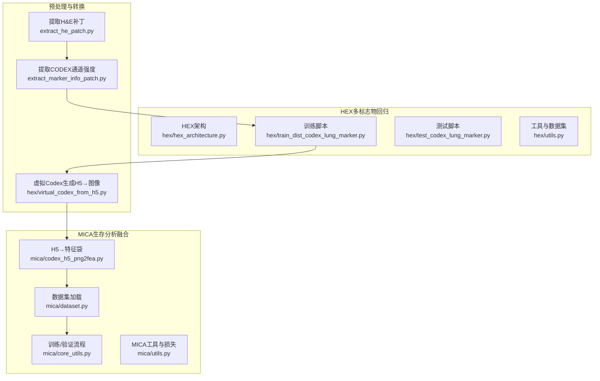
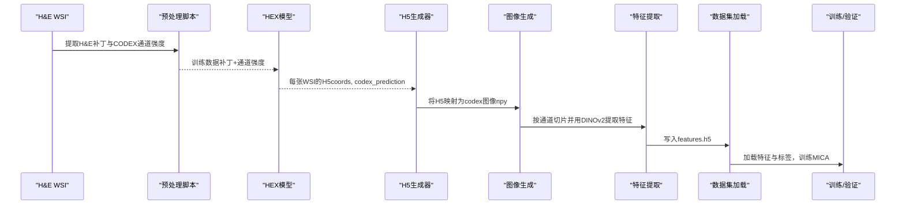
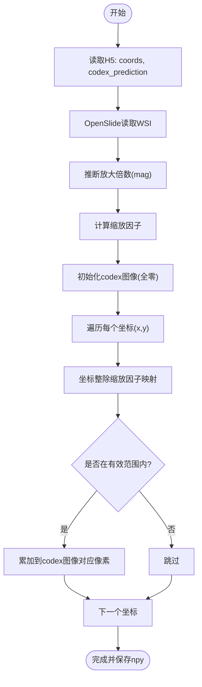
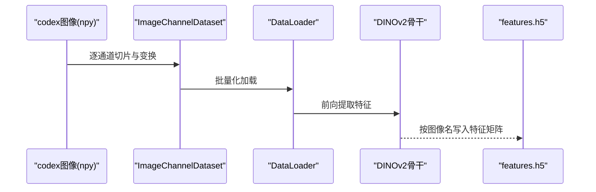
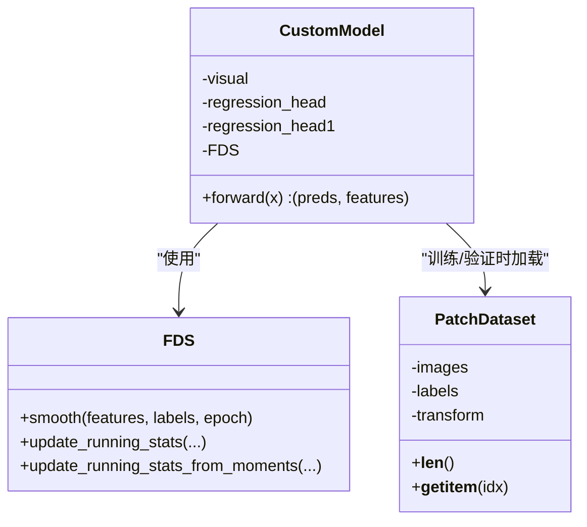
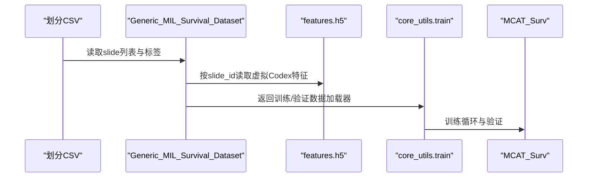
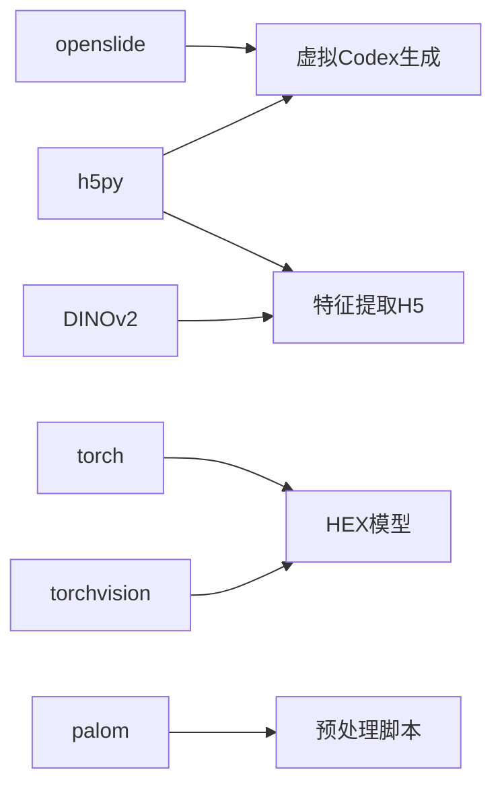

# 虚拟Codex生成

<cite>
**本文引用的文件**
- [virtual_codex_from_h5.py](file://hex/virtual_codex_from_h5.py)
- [codex_h5_png2fea.py](file://mica/codex_h5_png2fea.py)
- [hex_architecture.py](file://hex/hex_architecture.py)
- [utils.py](file://hex/utils.py)
- [test_codex_lung_marker.py](file://hex/test_codex_lung_marker.py)
- [train_dist_codex_lung_marker.py](file://hex/train_dist_codex_lung_marker.py)
- [dataset.py](file://mica/dataset.py)
- [core_utils.py](file://mica/core_utils.py)
- [utils.py（MICA）](file://mica/utils.py)
- [extract_he_patch.py](file://extract_he_patch.py)
- [extract_marker_info_patch.py](file://extract_marker_info_patch.py)
- [README.md](file://README.md)
</cite>

## 目录
1. [引言](#引言)
2. [项目结构](#项目结构)
3. [核心组件](#核心组件)
4. [架构总览](#架构总览)
5. [详细组件分析](#详细组件分析)
6. [依赖分析](#依赖分析)
7. [性能考虑](#性能考虑)
8. [故障排查指南](#故障排查指南)
9. [结论](#结论)
10. [附录](#附录)

## 引言
本文件围绕HEX项目的“虚拟Codex生成”能力，系统化梳理从H&E图像到蛋白质表达图谱的转换流程、空间坐标映射与分辨率匹配策略、H5数据处理与批量读取优化、质量控制与验证方法，以及完整的数据格式转换示例与性能优化建议。目标是帮助读者在不深入源码的前提下，理解端到端工作流，并在实际部署中高效、稳健地运行。

## 项目结构
HEX项目采用模块化组织：HEX侧负责基于H&E图像的多标志物回归模型训练与推理；MICA侧负责将HEX生成的虚拟Codex与WSI Bag特征融合进行生存分析建模。虚拟Codex生成的核心脚本位于hex与mica两个子目录中，分别承担H5→图像与图像→特征袋的任务。

图表来源
- [hex_architecture.py:1-37](file://hex/hex_architecture.py#L1-L37)
- [train_dist_codex_lung_marker.py:1-400](file://hex/train_dist_codex_lung_marker.py#L1-L400)
- [test_codex_lung_marker.py:1-189](file://hex/test_codex_lung_marker.py#L1-L189)
- [utils.py:1-342](file://hex/utils.py#L1-L342)
- [codex_h5_png2fea.py:1-173](file://mica/codex_h5_png2fea.py#L1-L173)
- [dataset.py:1-250](file://mica/dataset.py#L1-L250)
- [core_utils.py:1-230](file://mica/core_utils.py#L1-L230)
- [utils.py（MICA）:1-273](file://mica/utils.py#L1-L273)
- [extract_he_patch.py:1-78](file://extract_he_patch.py#L1-L78)
- [extract_marker_info_patch.py:1-74](file://extract_marker_info_patch.py#L1-L74)
- [virtual_codex_from_h5.py:1-68](file://hex/virtual_codex_from_h5.py#L1-L68)

章节来源
- [README.md:1-57](file://README.md#L1-L57)

## 核心组件
- 虚拟Codex生成（H5→图像）
  - 功能：将每个WSI对应的H5文件中的预测向量与坐标映射到统一分辨率的二维图像，保存为npy格式。
  - 关键点：基于OpenSlide读取WSI元数据推断放大倍数，计算缩放因子，按坐标落格累加至codex图像。
- 图像→特征袋（DINOv2）
  - 功能：将每个WSI的codex图像按通道切片，使用DINOv2提取特征，写入H5。
- HEX多标志物回归
  - 功能：以H&E补丁为输入，回归40个蛋白标志物表达，支持分布式训练与评估。
- MICA生存分析融合
  - 功能：将WSI Bag特征与虚拟Codex深度特征融合，进行生存分析建模与可解释性分析。

章节来源
- [virtual_codex_from_h5.py:1-68](file://hex/virtual_codex_from_h5.py#L1-L68)
- [codex_h5_png2fea.py:1-173](file://mica/codex_h5_png2fea.py#L1-L173)
- [hex_architecture.py:1-37](file://hex/hex_architecture.py#L1-L37)
- [utils.py:1-342](file://hex/utils.py#L1-L342)
- [dataset.py:1-250](file://mica/dataset.py#L1-L250)
- [core_utils.py:1-230](file://mica/core_utils.py#L1-L230)

## 架构总览
下图展示从H&E到虚拟Codex再到生存分析的整体流程，突出数据流与模块边界。

图表来源
- [extract_he_patch.py:1-78](file://extract_he_patch.py#L1-L78)
- [extract_marker_info_patch.py:1-74](file://extract_marker_info_patch.py#L1-L74)
- [train_dist_codex_lung_marker.py:1-400](file://hex/train_dist_codex_lung_marker.py#L1-L400)
- [virtual_codex_from_h5.py:1-68](file://hex/virtual_codex_from_h5.py#L1-L68)
- [codex_h5_png2fea.py:1-173](file://mica/codex_h5_png2fea.py#L1-L173)
- [dataset.py:1-250](file://mica/dataset.py#L1-L250)
- [core_utils.py:1-230](file://mica/core_utils.py#L1-L230)

## 详细组件分析

### 组件A：虚拟Codex生成（H5→图像）
- 输入
  - H5文件：包含两组键值
    - codex_prediction：形状(N, C)，N为采样点数，C为通道数（40或与模型一致）
    - coords：形状(N, 2)，像素坐标(x, y)
  - WSI：OpenSlide对象，用于读取尺寸与MPP信息
- 空间坐标映射与分辨率匹配
  - 放大倍数推断：优先读取aperio.MPP或PROPERTIES中的MPP，换算得到mag
  - 缩放因子：scale_down_factor = floor(224 / (40 / mag))
  - 输出图像尺寸：width = W//factor+1, height = H//factor+1
- 像素落格与累加
  - 对每个坐标(x,y)，整除缩放因子后映射到(height,width)网格
  - 使用原生数组索引直接赋值，避免插值（保持离散性）
- 输出
  - 保存为npy：形状(height, width, C)，dtype=float16

图表来源
- [virtual_codex_from_h5.py:1-68](file://hex/virtual_codex_from_h5.py#L1-L68)

章节来源
- [virtual_codex_from_h5.py:1-68](file://hex/virtual_codex_from_h5.py#L1-L68)

### 组件B：图像→特征袋（DINOv2）
- 数据准备
  - 读取每个WSI的codex图像（npy），逐通道转为RGB单通道图
  - 使用DataLoader批量化加载，支持多进程与pin_memory
- 特征提取
  - 使用DINOv2骨干网络提取特征，按图像名聚合为(num_channels, feat_dim)
  - 写入H5，键名为图像名
- 验证
  - 读取H5并打印键数量与每张图的特征形状，确保结构正确

图表来源
- [codex_h5_png2fea.py:1-173](file://mica/codex_h5_png2fea.py#L1-L173)

章节来源
- [codex_h5_png2fea.py:1-173](file://mica/codex_h5_png2fea.py#L1-L173)

### 组件C：HEX多标志物回归（训练与测试）
- 模型架构
  - 视觉编码器来自MUSK，回归头由两段线性层+激活+Dropout组成
  - 支持FDS平滑（分桶统计+核平滑）提升小样本稳定性
- 训练
  - 分布式训练，AMP混合精度，自适应损失函数
  - 支持冻结部分参数微调，学习率指数衰减
- 测试
  - 自动混合精度推理，计算每个标志物的皮尔逊相关系数并汇总

图表来源
- [hex_architecture.py:1-37](file://hex/hex_architecture.py#L1-L37)
- [utils.py:1-342](file://hex/utils.py#L1-L342)
- [train_dist_codex_lung_marker.py:1-400](file://hex/train_dist_codex_lung_marker.py#L1-L400)
- [test_codex_lung_marker.py:1-189](file://hex/test_codex_lung_marker.py#L1-L189)

章节来源
- [hex_architecture.py:1-37](file://hex/hex_architecture.py#L1-L37)
- [utils.py:1-342](file://hex/utils.py#L1-L342)
- [train_dist_codex_lung_marker.py:1-400](file://hex/train_dist_codex_lung_marker.py#L1-L400)
- [test_codex_lung_marker.py:1-189](file://hex/test_codex_lung_marker.py#L1-L189)

### 组件D：MICA生存分析融合
- 数据集加载
  - 从H5读取每个slide的虚拟Codex深度特征，拼接WSI Bag特征
- 训练/验证
  - 使用NLL生存损失，支持梯度累积、权重采样与日志记录
  - 最终保存checkpoint并评估c-index

图表来源
- [dataset.py:1-250](file://mica/dataset.py#L1-L250)
- [core_utils.py:1-230](file://mica/core_utils.py#L1-L230)
- [utils.py（MICA）:1-273](file://mica/utils.py#L1-L273)

章节来源
- [dataset.py:1-250](file://mica/dataset.py#L1-L250)
- [core_utils.py:1-230](file://mica/core_utils.py#L1-L230)
- [utils.py（MICA）:1-273](file://mica/utils.py#L1-L273)

## 依赖分析
- 外部库
  - openslide：读取WSI元数据与尺寸
  - h5py：H5读写（coords、codex_prediction、features.h5）
  - torch/torchvision：模型与数据加载
  - DINOv2：特征提取
  - palom：OME金字塔读取（CODEX通道强度）
- 模块耦合
  - HEX与MICA通过H5文件衔接，形成“图像→特征袋”的数据桥
  - 预处理脚本为HEX训练提供配对数据（H&E补丁+CODEX通道强度）

图表来源
- [virtual_codex_from_h5.py:1-68](file://hex/virtual_codex_from_h5.py#L1-L68)
- [codex_h5_png2fea.py:1-173](file://mica/codex_h5_png2fea.py#L1-L173)
- [extract_marker_info_patch.py:1-74](file://extract_marker_info_patch.py#L1-L74)

章节来源
- [virtual_codex_from_h5.py:1-68](file://hex/virtual_codex_from_h5.py#L1-L68)
- [codex_h5_png2fea.py:1-173](file://mica/codex_h5_png2fea.py#L1-L173)
- [extract_marker_info_patch.py:1-74](file://extract_marker_info_patch.py#L1-L74)

## 性能考虑
- H5读取与内存占用
  - 采用只读方式打开H5，按需读取coords与codex_prediction，避免一次性加载全部数据
  - codex图像使用float16存储，显著降低内存与IO压力
- 批量化与并行
  - 图像→特征袋阶段使用高batch_size与多worker，结合pin_memory加速GPU传输
  - 预处理阶段（提取H&E补丁、提取CODEX通道强度）使用多进程池并行处理
- 分辨率与缩放
  - 以224为基准计算缩放因子，兼顾速度与空间分辨率
  - 坐标映射采用整除与边界裁剪，避免插值带来的模糊与额外开销
- 训练优化
  - AMP混合精度、分布式训练、学习率调度与自适应损失，提升收敛稳定性与吞吐

章节来源
- [virtual_codex_from_h5.py:1-68](file://hex/virtual_codex_from_h5.py#L1-L68)
- [codex_h5_png2fea.py:1-173](file://mica/codex_h5_png2fea.py#L1-L173)
- [extract_he_patch.py:1-78](file://extract_he_patch.py#L1-L78)
- [extract_marker_info_patch.py:1-74](file://extract_marker_info_patch.py#L1-L74)
- [train_dist_codex_lung_marker.py:1-400](file://hex/train_dist_codex_lung_marker.py#L1-L400)

## 故障排查指南
- H5文件缺失或路径错误
  - 现象：提示跳过缺失的WSI
  - 排查：确认codex_h5_dir与he_dir路径配置正确，检查文件命名一致性
- WSI无法打开或MPP缺失
  - 现象：放大倍数推断失败，使用默认值
  - 排查：确认WSI格式兼容OpenSlide，必要时手动指定
- 坐标越界或空图像
  - 现象：部分像素未被赋值
  - 排查：检查缩放因子与WSI尺寸，确认coords范围
- 特征提取异常
  - 现象：H5写入失败或形状不一致
  - 排查：确认npy通道数与num_channels一致，检查transform与归一化
- 训练/验证指标异常
  - 现象：皮尔逊相关低或c-index异常
  - 排查：检查数据划分、标签分布、预处理一致性与模型冻结策略

章节来源
- [virtual_codex_from_h5.py:1-68](file://hex/virtual_codex_from_h5.py#L1-L68)
- [codex_h5_png2fea.py:1-173](file://mica/codex_h5_png2fea.py#L1-L173)
- [test_codex_lung_marker.py:1-189](file://hex/test_codex_lung_marker.py#L1-L189)
- [dataset.py:1-250](file://mica/dataset.py#L1-L250)

## 结论
虚拟Codex生成通过H5→图像的轻量映射，将AI回归得到的蛋白质表达向量还原为空间图像，再经由图像→特征袋流程进入MICA生存分析。该流程在保证空间一致性的前提下，实现了高效的批量处理与可扩展的多标志物回归。配合HEX的分布式训练与MICA的融合建模，整体方案具备良好的临床转化潜力。

## 附录

### 数据格式与转换示例
- 输入
  - H5文件：键"coords"(N,2)、"codex_prediction"(N,C)
  - WSI：OpenSlide支持的格式（如.svs）
- 中间文件
  - codex图像：npy，形状(height,width,C)，dtype=float16
  - features.h5：键为图像名，值为形状(num_channels, feat_dim)的数组
- 输出
  - MICA训练所需特征袋与标签

章节来源
- [virtual_codex_from_h5.py:1-68](file://hex/virtual_codex_from_h5.py#L1-L68)
- [codex_h5_png2fea.py:1-173](file://mica/codex_h5_png2fea.py#L1-L173)

### 空间坐标映射与分辨率匹配要点
- 放大倍数推断：优先使用aperio.MPP或MPP_X属性，否则回退默认值
- 缩放因子：以224为基准，按40mag换算得到scale_down_factor
- 坐标映射：整除缩放因子后裁剪到图像边界，直接赋值
- 插值策略：当前实现为最近邻式落格，不进行双线性/三次插值

章节来源
- [virtual_codex_from_h5.py:1-68](file://hex/virtual_codex_from_h5.py#L1-L68)

### 质量控制与验证方法
- 与真实蛋白质组学数据对比
  - 使用HEX测试脚本计算每个标志物的皮尔逊相关系数，评估预测质量
- 空间一致性检查
  - 对比WSI尺寸与生成图像尺寸，检查缩放因子与边界裁剪逻辑
- 噪声抑制
  - HEX采用FDS平滑与自适应损失，减少极端值影响
  - MICA使用生存损失与梯度累积，提升模型鲁棒性

章节来源
- [test_codex_lung_marker.py:1-189](file://hex/test_codex_lung_marker.py#L1-L189)
- [utils.py:1-342](file://hex/utils.py#L1-L342)
- [core_utils.py:1-230](file://mica/core_utils.py#L1-L230)