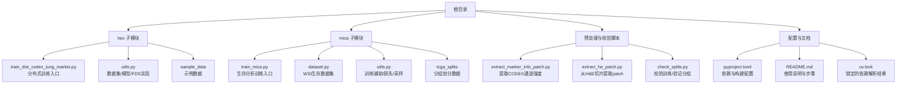
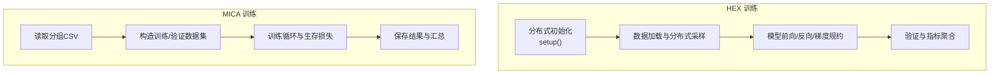
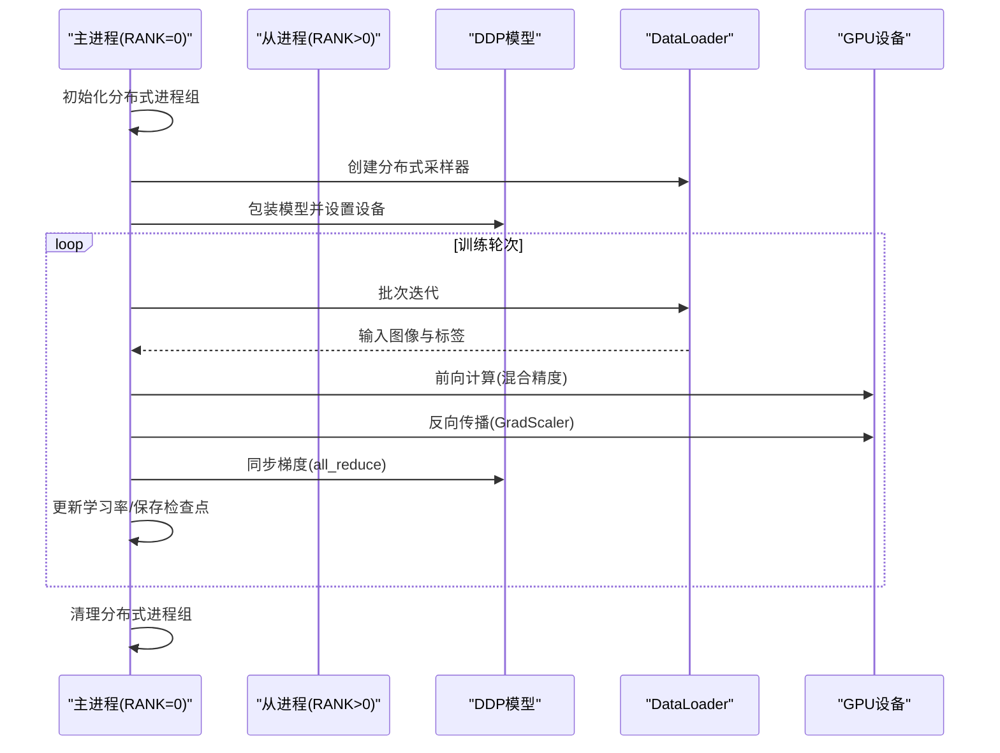
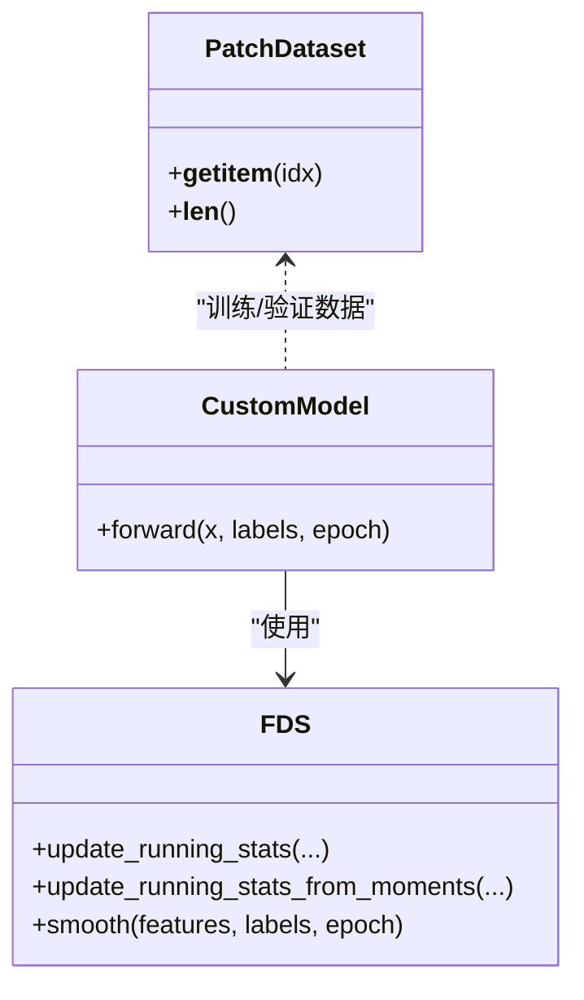
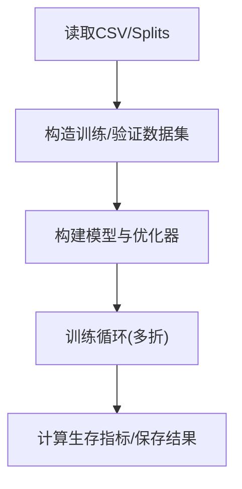
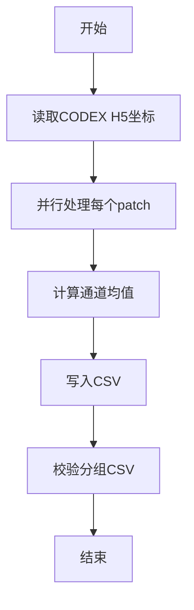
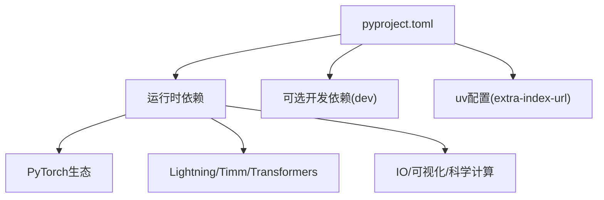

# 配置与部署

<cite>
**本文引用的文件**   
- [pyproject.toml](file://pyproject.toml)
- [README.md](file://README.md)
- [hex/train_dist_codex_lung_marker.py](file://hex/train_dist_codex_lung_marker.py)
- [hex/utils.py](file://hex/utils.py)
- [mica/train_mica.py](file://mica/train_mica.py)
- [mica/dataset.py](file://mica/dataset.py)
- [mica/utils.py](file://mica/utils.py)
- [check_splits.py](file://check_splits.py)
- [extract_he_patch.py](file://extract_he_patch.py)
- [extract_marker_info_patch.py](file://extract_marker_info_patch.py)
- [uv.lock](file://uv.lock)
</cite>

## 目录
1. [简介](#简介)
2. [项目结构](#项目结构)
3. [核心组件](#核心组件)
4. [架构总览](#架构总览)
5. [详细组件分析](#详细组件分析)
6. [依赖分析](#依赖分析)
7. [性能考量](#性能考量)
8. [故障排除指南](#故障排除指南)
9. [结论](#结论)
10. [附录](#附录)

## 简介
本指南面向HEX项目的配置与部署，覆盖以下主题：
- 项目配置文件（pyproject.toml）的参数说明与最佳实践
- 分布式训练部署策略（多GPU、进程间通信、资源分配）
- 生产环境部署建议（容器化、监控、日志、错误处理）
- 不同硬件环境的性能优化（GPU内存、批大小、混合精度）
- 模型版本管理与更新策略（打包、版本控制、向后兼容）
- 完整部署检查清单与故障排除

## 项目结构
HEX项目采用分层组织：顶层为根配置与说明文档；hex子模块包含HEX训练与推理相关逻辑；mica子模块负责生存分析模型训练；另有若干预处理脚本与校验工具。

图表来源
- [pyproject.toml:1-48](file://pyproject.toml#L1-L48)
- [README.md:1-57](file://README.md#L1-L57)
- [hex/train_dist_codex_lung_marker.py:1-400](file://hex/train_dist_codex_lung_marker.py#L1-L400)
- [hex/utils.py:1-342](file://hex/utils.py#L1-L342)
- [mica/train_mica.py:1-238](file://mica/train_mica.py#L1-L238)
- [mica/dataset.py:1-250](file://mica/dataset.py#L1-L250)
- [mica/utils.py:1-273](file://mica/utils.py#L1-L273)
- [check_splits.py:1-159](file://check_splits.py#L1-L159)
- [extract_he_patch.py:1-78](file://extract_he_patch.py#L1-L78)
- [extract_marker_info_patch.py:1-74](file://extract_marker_info_patch.py#L1-L74)

章节来源
- [README.md:1-57](file://README.md#L1-L57)
- [pyproject.toml:1-48](file://pyproject.toml#L1-L48)

## 核心组件
- 分布式训练入口（HEX）：通过torchrun启动多进程，使用NCCL后端进行进程间通信，支持DDP封装与分布式采样。
- 数据与模型（HEX）：PatchDataset与CustomModel，结合FDS平滑统计提升回归稳定性。
- 生存分析训练入口（MICA）：基于CLAM风格的五折交叉验证，支持co-attention模式融合PATH与CODEX特征。
- 数据集与损失（MICA）：Generic_MIL_Survival_Dataset与NLL生存损失函数。
- 预处理与校验：从CODEX/H&E配准到patch提取、分组校验，保证训练质量。

章节来源
- [hex/train_dist_codex_lung_marker.py:28-39](file://hex/train_dist_codex_lung_marker.py#L28-L39)
- [hex/utils.py:32-81](file://hex/utils.py#L32-L81)
- [mica/train_mica.py:28-88](file://mica/train_mica.py#L28-L88)
- [mica/dataset.py:193-227](file://mica/dataset.py#L193-L227)
- [mica/utils.py:173-216](file://mica/utils.py#L173-L216)
- [check_splits.py:72-104](file://check_splits.py#L72-L104)

## 架构总览
HEX与MICA分别承担“从H&E预测蛋白表达”和“基于多模态生存分析”的任务。HEX训练采用分布式数据并行，MICA训练采用分层数据加载与生存损失。

图表来源
- [hex/train_dist_codex_lung_marker.py:28-39](file://hex/train_dist_codex_lung_marker.py#L28-L39)
- [hex/train_dist_codex_lung_marker.py:164-169](file://hex/train_dist_codex_lung_marker.py#L164-L169)
- [hex/train_dist_codex_lung_marker.py:271-291](file://hex/train_dist_codex_lung_marker.py#L271-L291)
- [mica/train_mica.py:52-70](file://mica/train_mica.py#L52-L70)
- [mica/dataset.py:193-227](file://mica/dataset.py#L193-L227)

## 详细组件分析

### 分布式训练组件（HEX）
- 进程组初始化与设备设置：通过NCCL后端初始化，按LOCAL_RANK设置CUDA设备。
- 数据加载与分布式采样：使用DistributedSampler在各进程中均匀划分样本。
- 混合精度与梯度规约：autocast与GradScaler配合DDP，必要时对自定义损失参数做all_reduce。
- 模型与冻结策略：仅解冻最后若干编码器层与回归头，减少显存占用。
- 日志与检查点：TensorBoard记录指标，定期保存权重。

图表来源
- [hex/train_dist_codex_lung_marker.py:28-39](file://hex/train_dist_codex_lung_marker.py#L28-L39)
- [hex/train_dist_codex_lung_marker.py:164-169](file://hex/train_dist_codex_lung_marker.py#L164-L169)
- [hex/train_dist_codex_lung_marker.py:271-291](file://hex/train_dist_codex_lung_marker.py#L271-L291)
- [hex/train_dist_codex_lung_marker.py:386-392](file://hex/train_dist_codex_lung_marker.py#L386-L392)

章节来源
- [hex/train_dist_codex_lung_marker.py:28-39](file://hex/train_dist_codex_lung_marker.py#L28-L39)
- [hex/train_dist_codex_lung_marker.py:164-169](file://hex/train_dist_codex_lung_marker.py#L164-L169)
- [hex/train_dist_codex_lung_marker.py:271-291](file://hex/train_dist_codex_lung_marker.py#L271-L291)
- [hex/train_dist_codex_lung_marker.py:386-392](file://hex/train_dist_codex_lung_marker.py#L386-L392)

### 数据与模型组件（HEX）
- PatchDataset：从CSV读取图像路径与多输出标签，支持可选变换。
- CustomModel：基于MUSK视觉编码器，附加回归头；FDS模块按标签桶统计均值方差并平滑特征。
- FDS类：维护运行均值/方差、上一epoch统计、卷积核平滑，并提供smooth接口。

图表来源
- [hex/utils.py:82-97](file://hex/utils.py#L82-L97)
- [hex/utils.py:32-81](file://hex/utils.py#L32-L81)
- [hex/utils.py:116-326](file://hex/utils.py#L116-L326)

章节来源
- [hex/utils.py:82-97](file://hex/utils.py#L82-L97)
- [hex/utils.py:32-81](file://hex/utils.py#L32-L81)
- [hex/utils.py:116-326](file://hex/utils.py#L116-L326)

### 生存分析组件（MICA）
- Generic_MIL_Survival_Dataset：从CSV与H5中加载PATH与CODEX特征，构造生存任务数据集。
- NLLSurvLoss：生存分析负似然损失，支持删失数据。
- 训练入口：支持五折交叉验证、实验参数编码、结果保存。

图表来源
- [mica/dataset.py:193-227](file://mica/dataset.py#L193-L227)
- [mica/utils.py:173-216](file://mica/utils.py#L173-L216)
- [mica/train_mica.py:68-88](file://mica/train_mica.py#L68-L88)

章节来源
- [mica/dataset.py:193-227](file://mica/dataset.py#L193-L227)
- [mica/utils.py:173-216](file://mica/utils.py#L173-L216)
- [mica/train_mica.py:68-88](file://mica/train_mica.py#L68-L88)

### 预处理与校验组件
- 提取CODEX通道强度：遍历H5坐标，计算每个patch的通道平均强度，输出CSV。
- 从H&E提取patch：根据标注坐标读取区域并保存为PNG。
- 分组校验：确保训练/验证不重叠、每折完整性与一致性。

图表来源
- [extract_marker_info_patch.py:21-74](file://extract_marker_info_patch.py#L21-L74)
- [check_splits.py:72-104](file://check_splits.py#L72-L104)

章节来源
- [extract_marker_info_patch.py:21-74](file://extract_marker_info_patch.py#L21-L74)
- [extract_he_patch.py:9-44](file://extract_he_patch.py#L9-L44)
- [check_splits.py:72-104](file://check_splits.py#L72-L104)

## 依赖分析
- 语言与运行时：Python 3.10+，CUDA 11.8（由构建索引指定）。
- 关键库：PyTorch生态（torch, torchvision, torchaudio）、Lightning、Timm、Transformers、HuggingFace Hub、OpenSlide、DINOV2（通过MICA流程间接使用）、Robust Loss等。
- 构建与索引：使用uv工具，额外索引指向PyTorch CUDA 11.8。

图表来源
- [pyproject.toml:1-48](file://pyproject.toml#L1-L48)
- [uv.lock](file://uv.lock)

章节来源
- [pyproject.toml:1-48](file://pyproject.toml#L1-L48)
- [uv.lock](file://uv.lock)

## 性能考量
- 分布式训练
  - 使用DistributedSampler避免重复样本，num_workers与batch_size需平衡CPU/GPU利用率。
  - 混合精度训练启用GradScaler，减少显存占用并提升吞吐。
  - 对自定义损失参数执行all_reduce以保持一致性。
- 模型与数据
  - 冻结大部分参数仅微调最后几层，降低显存峰值。
  - 图像变换与归一化遵循ImageNet Inception统计量，确保预训练权重适配。
- 硬件与资源
  - 多GPU场景下，LOCAL_RANK与CUDA设备绑定，确保每卡独立资源。
  - NUMA友好与PCIe带宽对吞吐影响显著，尽量避免跨节点通信。
- 训练稳定性
  - FDS按标签桶统计特征分布并平滑，有助于回归稳定性。
  - 生存分析使用删失数据的NLL损失，注意分箱与权重设置。

章节来源
- [hex/train_dist_codex_lung_marker.py:164-169](file://hex/train_dist_codex_lung_marker.py#L164-L169)
- [hex/train_dist_codex_lung_marker.py:226-227](file://hex/train_dist_codex_lung_marker.py#L226-L227)
- [hex/train_dist_codex_lung_marker.py:283-291](file://hex/train_dist_codex_lung_marker.py#L283-L291)
- [hex/utils.py:116-326](file://hex/utils.py#L116-L326)
- [mica/utils.py:173-216](file://mica/utils.py#L173-L216)

## 故障排除指南
- 分布式初始化失败
  - 检查NCCL后端可用性与MASTER_PORT设置；确认LOCAL_RANK与CUDA可见设备一致。
- 训练/验证重叠或缺失
  - 使用分组校验脚本检查CSV列名与内容，确保每折唯一患者/切片集合。
- 显存不足
  - 减小batch_size或num_workers；冻结更多参数；关闭不必要的日志写入。
- 混合精度异常
  - 确认autocast类型匹配（dtype），GradScaler缩放策略与all_reduce顺序正确。
- 数据加载问题
  - 确认图像路径与CSV字段一致；检查OpenSlide/H5读取权限与路径。

章节来源
- [check_splits.py:43-69](file://check_splits.py#L43-L69)
- [check_splits.py:107-148](file://check_splits.py#L107-L148)
- [hex/train_dist_codex_lung_marker.py:28-39](file://hex/train_dist_codex_lung_marker.py#L28-L39)
- [hex/train_dist_codex_lung_marker.py:271-291](file://hex/train_dist_codex_lung_marker.py#L271-L291)

## 结论
本指南提供了HEX项目从配置到部署的全链路方法论：明确依赖与构建索引、规范分布式训练流程、建立生产级监控与日志体系、针对不同硬件进行性能调优，并给出模型版本与更新策略建议。结合分组校验与预处理脚本，可有效保障训练数据质量与系统稳定性。

## 附录

### A. 配置文件（pyproject.toml）参数说明
- 项目元信息：名称、版本、描述、自述文件、Python版本要求。
- 依赖声明：涵盖深度学习框架、数据处理、可视化、科学计算等核心库。
- 可选依赖：开发测试依赖（如pytest）。
- 构建配置：uv额外索引URL指向PyTorch CUDA 11.8，确保安装兼容的二进制包。

章节来源
- [pyproject.toml:1-48](file://pyproject.toml#L1-L48)
- [uv.lock](file://uv.lock)

### B. 分布式训练部署要点
- 启动命令参考：使用torchrun指定节点数与每节点GPU数，按需设置MASTER_PORT与环境变量。
- 进程间通信：NCCL后端，确保网络与驱动版本兼容。
- 资源分配：每卡独立batch，num_workers与pin_memory按硬件能力调节。
- 检查点与日志：统一writer_dir与checkpoint_dir，按rank写入避免冲突。

章节来源
- [README.md:32-36](file://README.md#L32-L36)
- [hex/train_dist_codex_lung_marker.py:28-39](file://hex/train_dist_codex_lung_marker.py#L28-L39)
- [hex/train_dist_codex_lung_marker.py:234-242](file://hex/train_dist_codex_lung_marker.py#L234-L242)

### C. 生产环境部署最佳实践
- 容器化：基于官方CUDA/Python镜像，固定uv索引与依赖版本，减少环境漂移。
- 监控：集成TensorBoard/W&B，记录指标与超参；结合系统监控（GPU利用率、内存、网络）。
- 日志：统一日志格式与级别，区分训练/验证/评估阶段；保留关键上下文（epoch、rank、loss）。
- 错误处理：捕获分布式异常、数据加载异常与OOM；实现断点续训与检查点回滚。

### D. 硬件环境优化策略
- GPU内存管理：减小batch、冻结参数、使用混合精度；合理设置num_workers避免CPU瓶颈。
- 批处理大小：从单卡基准开始逐步扩大，观察显存与吞吐曲线。
- 混合精度训练：启用GradScaler，注意数值稳定性与梯度裁剪。

### E. 模型版本管理与更新策略
- 版本控制：以语义化版本命名检查点，记录训练超参与数据集摘要。
- 向后兼容：模型结构变更时保留旧权重映射或提供转换脚本。
- 打包与发布：将权重与配置打包为可复现的制品，附带校验哈希与依赖清单。

### F. 部署检查清单
- 环境准备：Python版本、CUDA/cuDNN、驱动与NCCL版本匹配。
- 依赖安装：使用锁定的依赖清单，确保索引与二进制兼容。
- 数据准备：分组CSV完整、patch与H5路径正确、通道强度CSV生成完成。
- 训练验证：单卡/多卡训练通过，指标收敛；分组校验全部通过。
- 监控与日志：指标可采集、日志可检索、告警阈值已设定。
- 回滚预案：具备快速回退至上一稳定版本的能力。