# Web应用程序开发指南

<cite>
**本文档引用的文件**
- [README.md](file://README.md)
- [webapp/app.py](file://webapp/app.py)
- [webapp/templates/index.html](file://webapp/templates/index.html)
- [hex/hex_architecture.py](file://hex/hex_architecture.py)
- [hex/utils.py](file://hex/utils.py)
- [hex/test_codex_lung_marker.py](file://hex/test_codex_lung_marker.py)
- [mica/dataset.py](file://mica/dataset.py)
- [mica/utils.py](file://mica/utils.py)
- [mica/test_mica.py](file://mica/test_mica.py)
- [MUSK/musk/modeling.py](file://MUSK/musk/modeling.py)
- [pyproject.toml](file://pyproject.toml)
</cite>

## 更新摘要
**变更内容**
- 新增完整的荧光叠加功能模块
- 添加生物标记选择控件和交互界面
- 实现透明度控制和稀疏度阈值调节
- 开发双视图模式（叠加、仅荧光、原始图像）
- 增强可视化系统的交互性和实用性
- **新增** 完善的错误处理机制和进度跟踪
- **新增** 多种预测模式和渲染选项
- **新增** 实时交互控制和防抖机制

## 目录
1. [简介](#简介)
2. [项目结构](#项目结构)
3. [核心组件](#核心组件)
4. [架构概览](#架构概览)
5. [详细组件分析](#详细组件分析)
6. [依赖关系分析](#依赖关系分析)
7. [性能考虑](#性能考虑)
8. [故障排除指南](#故障排除指南)
9. [结论](#结论)

## 简介

这是一个基于AI的虚拟空间蛋白质组学Web应用程序，专门用于从H&E病理图像中预测蛋白质表达。该项目结合了MUSK（多模态空间知识模型）和HEX（H&E到蛋白质组学）技术，为肺癌研究提供先进的生物标志物发现工具。

**更新** 新增了强大的荧光叠加功能，允许用户以伪荧光形式直观地可视化蛋白质表达预测结果。应用程序现在提供完整的错误处理机制和实时进度跟踪，确保用户获得流畅的分析体验。

该应用程序提供了直观的Web界面，允许用户上传H&E图像，实时分析并可视化蛋白质表达预测结果，包括：
- 40种生物标志物的表达水平预测
- 按功能分类的结果展示
- **新增** 虚拟荧光层叠加效果
- **新增** 生物标记选择控件
- **新增** 透明度和稀疏度控制
- **新增** 双视图模式切换
- **新增** 实时进度指示和错误处理
- **新增** 多种预测模式（空间分布、随机分布、HEX脚本）
- 空间分布可视化
- 批量分析功能

## 项目结构

项目采用模块化设计，主要包含以下核心模块：

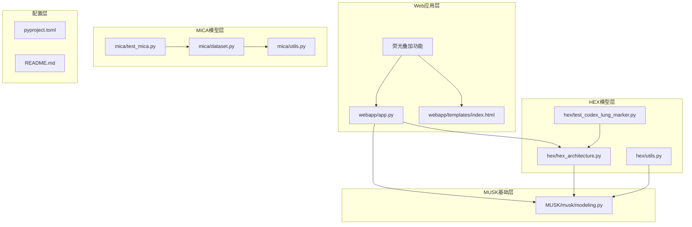

**图表来源**
- [webapp/app.py:1-1405](file://webapp/app.py#L1-L1405)
- [hex/hex_architecture.py:1-62](file://hex/hex_architecture.py#L1-L62)
- [MUSK/musk/modeling.py:1-199](file://MUSK/musk/modeling.py#L1-L199)

**章节来源**
- [README.md:1-57](file://README.md#L1-L57)
- [pyproject.toml:1-48](file://pyproject.toml#L1-L48)

## 核心组件

### Web应用服务器

Web应用程序基于Flask框架构建，提供RESTful API端点和交互式前端界面。主要功能包括：

- **图像分析API**: `/analyze` 和 `/batch_analyze`
- **可视化生成**: 荧光层叠加、空间分布图
- **静态资源服务**: 图像、样式和脚本文件
- **实时反馈**: 进度指示和错误处理
- **新增** 荧光叠加API**: `/generate_fluorescent`
- **新增** 颜色信息API**: `/get_marker_colors`

### MUSK模型集成

应用程序集成了MUSK视觉语言模型，用于：
- 图像特征提取
- 多尺度增强处理
- 归一化嵌入输出
- 注意力权重计算

### HEX模型架构

HEX模型采用两层架构设计：
- **视觉编码器**: 基于MUSK的大型视觉模型
- **回归头部**: 40维输出的多任务回归网络
- **特征平滑**: FDS（Feature Distribution Smoothing）技术

### **新增** 荧光叠加系统

**更新** 新增了完整的荧光叠加功能，包括：

- **生物标记选择**: 用户可选择特定的40种生物标志物进行可视化
- **透明度控制**: 滑块调节荧光层与H&E图像的叠加强度
- **稀疏度阈值**: 百分位数控制信号分布的稀疏程度
- **双视图模式**: 叠加图像、仅荧光层、原始H&E图像三种显示模式
- **通道图层**: 支持单独查看每个生物标志物的荧光分布
- **预测模式**: 空间分布预测、随机分布预测、HEX脚本渲染
- **实时防抖**: 防止频繁重新生成荧光层
- **多通道渲染**: 支持独立通道的荧光图像生成

**章节来源**
- [webapp/app.py:56-88](file://webapp/app.py#L56-L88)
- [webapp/app.py:409-551](file://webapp/app.py#L409-L551)
- [webapp/app.py:808-942](file://webapp/app.py#L808-L942)
- [webapp/app.py:1075-1303](file://webapp/app.py#L1075-L1303)
- [hex/hex_architecture.py:15-46](file://hex/hex_architecture.py#L15-L46)
- [hex/utils.py:32-81](file://hex/utils.py#L32-L81)

## 架构概览

应用程序采用分层架构设计，确保模块间的清晰分离和可维护性：

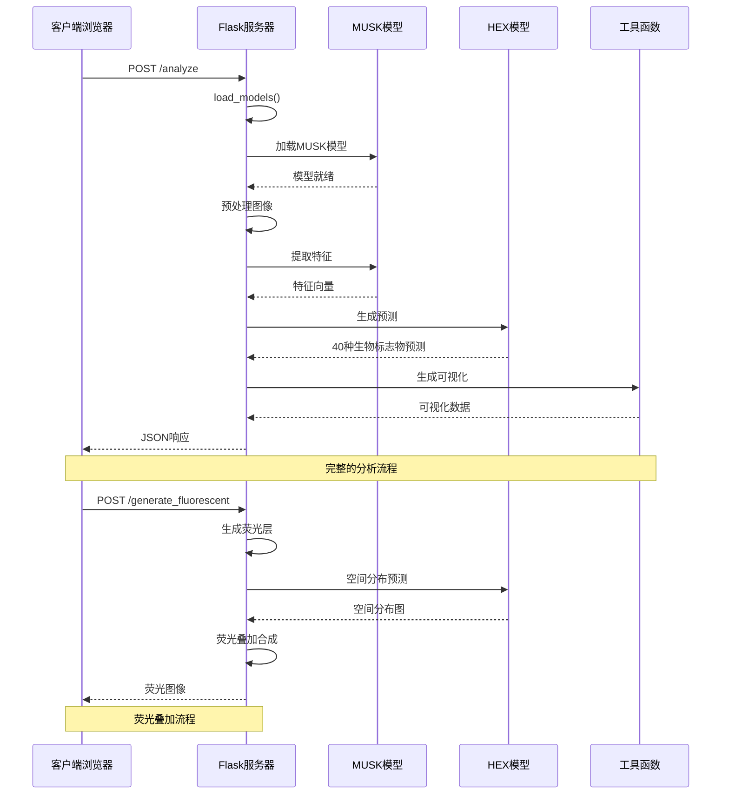

**图表来源**
- [webapp/app.py:200-283](file://webapp/app.py#L200-L283)
- [webapp/app.py:1039-1144](file://webapp/app.py#L1039-L1144)
- [webapp/app.py:149-176](file://webapp/app.py#L149-L176)

### 数据流架构

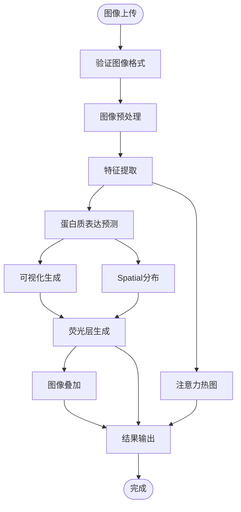

**图表来源**
- [webapp/app.py:232-274](file://webapp/app.py#L232-L274)
- [webapp/app.py:149-176](file://webapp/app.py#L149-L176)

## 详细组件分析

### Flask Web服务器

Web服务器实现了完整的REST API，支持多种分析模式：

#### 核心路由功能

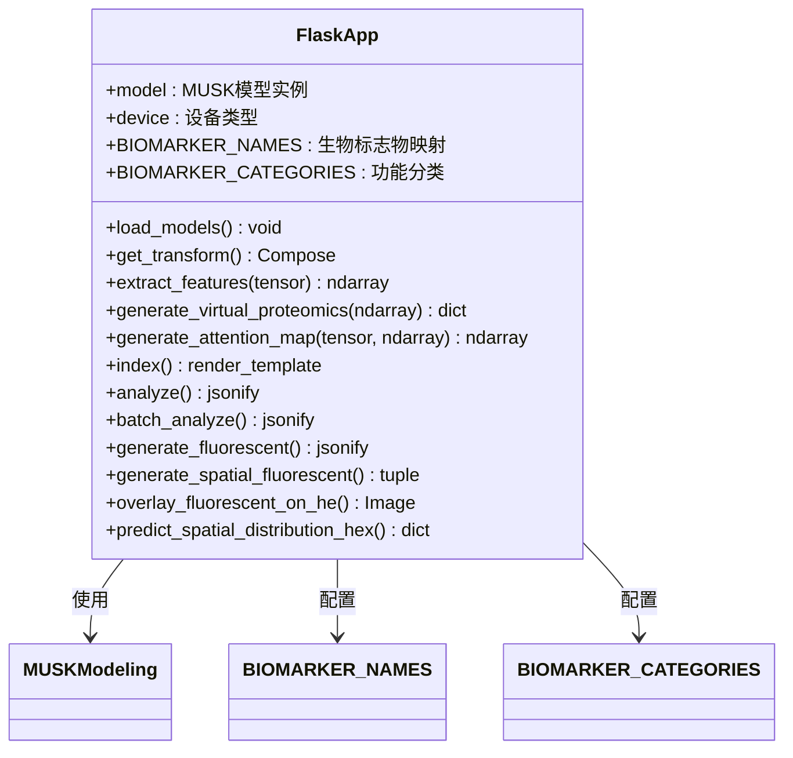

**图表来源**
- [webapp/app.py:26-88](file://webapp/app.py#L26-L88)
- [webapp/app.py:179-283](file://webapp/app.py#L179-L283)
- [webapp/app.py:1039-1144](file://webapp/app.py#L1039-L1144)

#### 图像分析流程

应用程序支持三种图像分析模式：

1. **单图像分析**: 用户上传单张H&E图像
2. **批量分析**: 自动分析示例图像集合
3. **新增** 荧光叠加分析**: 基于预测结果生成伪荧光图像
4. **新增** 多种预测模式**: 空间分布、随机分布、HEX脚本渲染

**章节来源**
- [webapp/app.py:179-336](file://webapp/app.py#L179-L336)
- [webapp/app.py:1039-1144](file://webapp/app.py#L1039-L1144)

### MUSK模型集成

MUSK（Multi-modal Spatial Knowledge）模型是应用程序的核心视觉编码器：

#### 模型架构

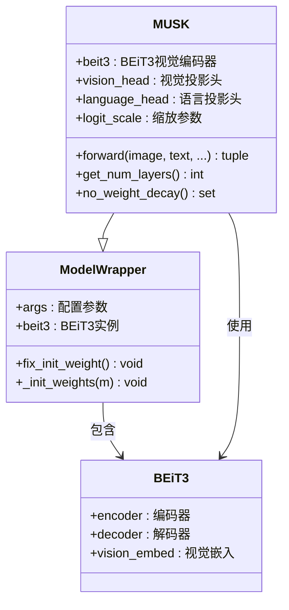

**图表来源**
- [MUSK/musk/modeling.py:96-175](file://MUSK/musk/modeling.py#L96-L175)
- [MUSK/musk/modeling.py:62-94](file://MUSK/musk/modeling.py#L62-L94)

#### 多尺度特征提取

应用程序利用MUSK的多尺度特性进行增强分析：

- **默认尺度**: [1, 2]（1x和2x缩放）
- **最大分割大小**: 自动优化内存使用
- **多尺度前向传播**: 提高特征丰富性

**章节来源**
- [MUSK/musk/modeling.py:108-175](file://MUSK/musk/modeling.py#L108-L175)
- [webapp/app.py:143-159](file://webapp/app.py#L143-L159)

### HEX模型架构

HEX模型专门用于从H&E图像预测蛋白质表达：

#### 回归架构

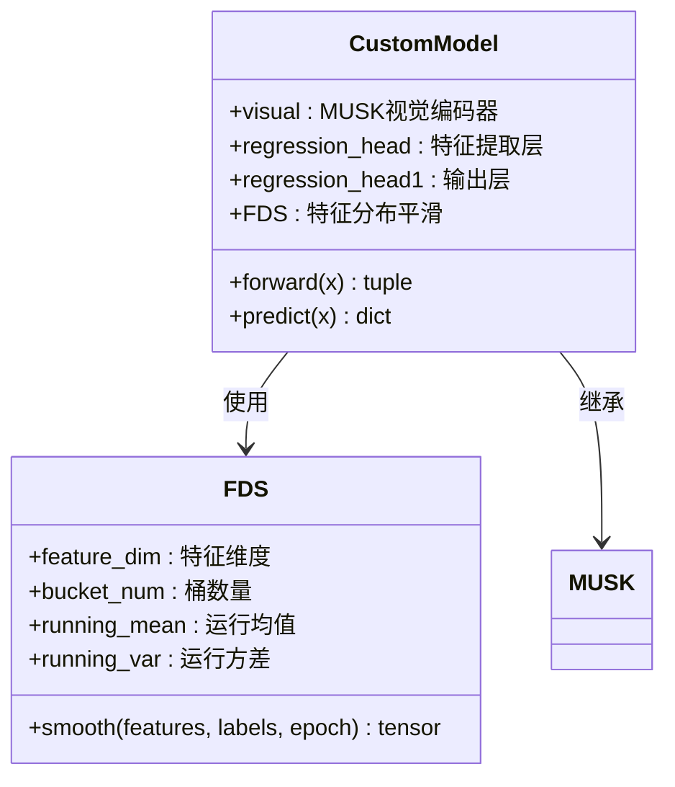

**图表来源**
- [hex/hex_architecture.py:15-46](file://hex/hex_architecture.py#L15-L46)
- [hex/utils.py:116-326](file://hex/utils.py#L116-L326)

#### 特征分布平滑（FDS）

FDS技术通过以下方式改善预测质量：

- **桶化策略**: 将连续特征映射到离散桶
- **平滑核**: 高斯核进行特征平滑
- **动态更新**: 基于训练进度的自适应平滑

**章节来源**
- [hex/utils.py:116-326](file://hex/utils.py#L116-L326)

### **新增** 荧光叠加系统

**更新** 新增了完整的荧光叠加功能，提供专业的虚拟蛋白质组学可视化：

#### 荧光层生成算法

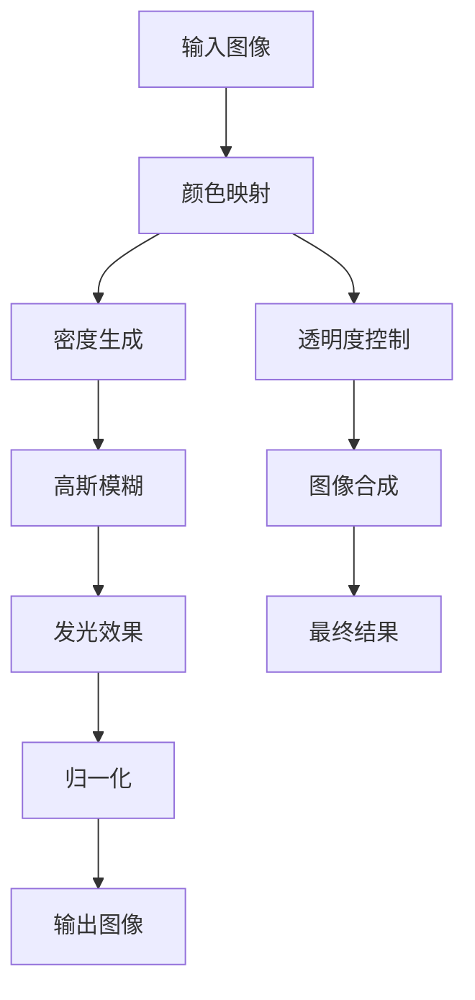

**图表来源**
- [webapp/app.py:455-551](file://webapp/app.py#L455-L551)
- [webapp/app.py:808-942](file://webapp/app.py#L808-L942)

#### 空间分布预测

应用程序支持三种空间预测模式：

1. **空间分布模式**: 基于图像patch的真实空间位置
2. **随机分布模式**: 快速生成的伪随机分布
3. **HEX脚本模式**: 使用HEX脚本进行真实CODEX多通道渲染
4. **新增** 通道图层模式**: 单独显示每个生物标志物的荧光分布

**章节来源**
- [webapp/app.py:483-580](file://webapp/app.py#L483-L580)
- [webapp/app.py:794-897](file://webapp/app.py#L794-L897)
- [webapp/app.py:1039-1144](file://webapp/app.py#L1039-L1144)

### 前端界面设计

Web界面采用现代化的设计理念，新增了丰富的交互功能：

#### 响应式布局

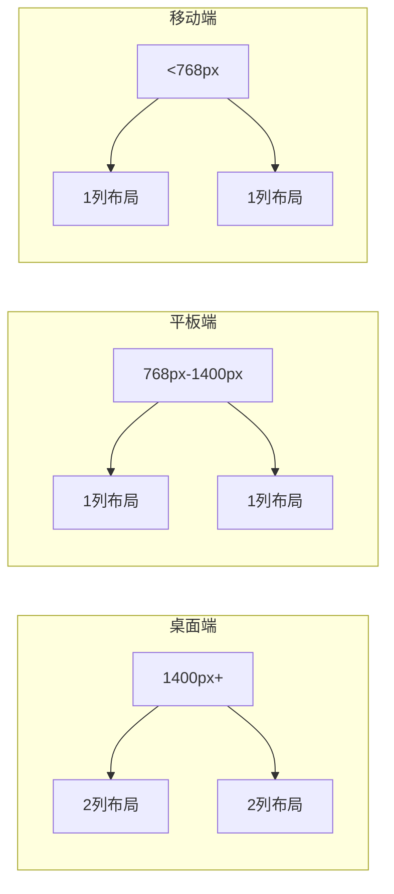

**图表来源**
- [webapp/templates/index.html:352-360](file://webapp/templates/index.html#L352-L360)

#### 交互功能

- **实时图表**: 使用Chart.js生成雷达图和柱状图
- **进度指示**: 四步分析流程的可视化进度
- **批量处理**: 支持多图像同时分析
- **新增** 生物标记选择**: 复选框控件选择特定标记物
- **新增** 透明度控制**: 滑块调节叠加强度
- **新增** 稀疏度调节**: 百分位数控制信号分布
- **新增** 双视图模式**: 切换不同显示模式
- **新增** 通道图层**: 查看单个标记物的分布
- **新增** 实时防抖**: 防止频繁重新生成
- **新增** 多种预测模式**: 空间分布、随机分布、HEX脚本

**章节来源**
- [webapp/templates/index.html:540-800](file://webapp/templates/index.html#L540-L800)
- [webapp/templates/index.html:881-1192](file://webapp/templates/index.html#L881-L1192)

## 依赖关系分析

应用程序的依赖关系复杂但结构清晰：

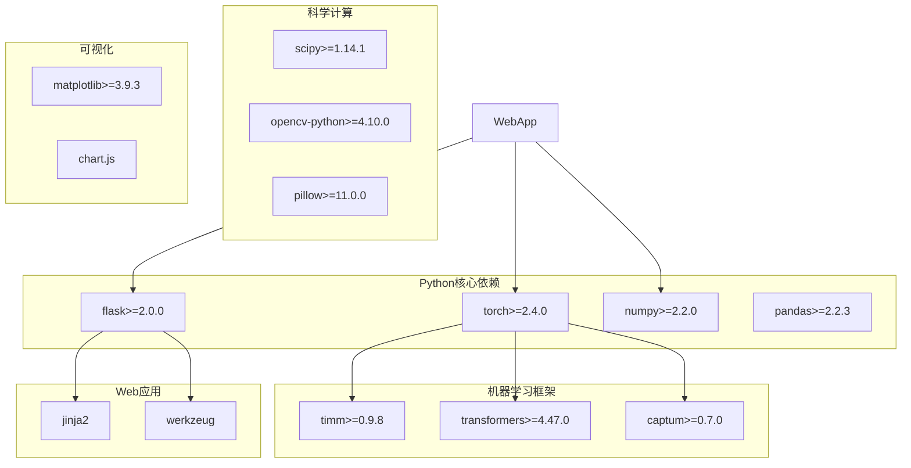

**图表来源**
- [pyproject.toml:7-41](file://pyproject.toml#L7-L41)

### 第三方模型集成

应用程序集成了多个开源模型：

#### MUSK模型集成

- **模型来源**: Stanford Lilab开源项目
- **版本要求**: 1.0.0
- **模型类型**: 大型视觉语言模型
- **特征维度**: 1024维

#### 其他集成组件

- **Palom**: H&E和CODEX图像配准
- **CLAM**: WSI预处理和特征提取
- **DINOv2**: 特征提取基准模型

**章节来源**
- [README.md:15-24](file://README.md#L15-L24)
- [hex/hex_architecture.py:10-13](file://hex/hex_architecture.py#L10-L13)

## 性能考虑

### 内存优化策略

应用程序采用了多项内存优化技术：

#### 模型加载优化

- **延迟加载**: 模型在首次请求时加载
- **设备检测**: 自动检测GPU兼容性
- **内存管理**: 及时释放CUDA缓存

#### 图像处理优化

- **尺寸适配**: 自动调整图像到384x384像素
- **批处理**: 支持批量图像分析
- **缓存机制**: 临时文件的智能管理
- **新增** 图像尺寸控制**: 推理时使用较小尺寸，显示时使用适中尺寸

### 计算效率优化

#### 多尺度特征提取

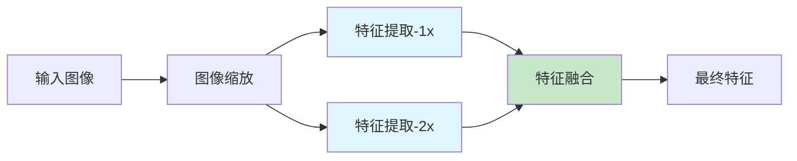

**图表来源**
- [webapp/app.py:143-159](file://webapp/app.py#L143-L159)

#### GPU加速利用

- **自动设备检测**: 检测CUDA可用性和兼容性
- **混合精度**: 在支持的GPU上使用FP16
- **内存碎片化**: 优化张量分配策略
- **新增** 多线程处理**: 荧光生成的防抖机制

#### **新增** 荧光叠加性能优化

- **智能缓存**: 防抖机制避免频繁重新生成
- **渐进式渲染**: 先显示基本图像，再逐步增强效果
- **尺寸适配**: 推理使用小尺寸，显示使用中等尺寸
- **通道分离**: 支持单独渲染每个生物标志物
- **新增** 多模式渲染**: 根据模式选择最优算法

## 故障排除指南

### 常见问题及解决方案

#### 模型加载失败

**症状**: 应用启动时报错，无法加载MUSK模型

**可能原因**:
1. 模型文件路径不正确
2. PyTorch版本不兼容
3. CUDA驱动版本过低

**解决方案**:
1. 验证模型文件存在性
2. 检查PyTorch和CUDA版本兼容性
3. 更新显卡驱动程序

#### 图像处理错误

**症状**: 上传图像后分析失败

**可能原因**:
1. 图像格式不支持
2. 图像尺寸过大
3. 内存不足

**解决方案**:
1. 确认图像格式为TIFF/PNG/JPG
2. 限制图像尺寸不超过2048x2048像素
3. 关闭其他内存占用程序

#### **新增** 荧光叠加问题

**症状**: 荧光层生成失败或显示异常

**可能原因**:
1. 生物标记选择无效
2. 透明度值超出范围
3. 稀疏度阈值设置不当
4. 图像尺寸过大导致内存不足
5. **新增** 预测模式选择错误
6. **新增** HEX脚本依赖缺失

**解决方案**:
1. 确保至少选择一个生物标记物
2. 调整透明度到0-1范围内的有效值
3. 设置稀疏度阈值在50-95之间的合理范围
4. 使用较小的图像尺寸或增加系统内存
5. **新增** 选择合适的预测模式（空间分布/随机分布/HEX脚本）
6. **新增** 确保HEX脚本依赖正确安装

#### **新增** 错误处理和调试

**症状**: 应用程序崩溃或返回错误

**可能原因**:
1. 异常处理机制触发
2. 内存溢出
3. 网络连接问题

**解决方案**:
1. 检查服务器日志获取详细错误信息
2. 减少图像分辨率或生物标记物数量
3. 确保网络连接稳定

#### 性能问题

**症状**: 分析速度慢或内存使用过高

**解决方案**:
1. 启用GPU加速
2. 减少图像分辨率
3. 关闭不必要的浏览器标签页
4. **新增** 减少生物标记物数量
5. **新增** 调整稀疏度阈值以减少计算量
6. **新增** 使用合适的预测模式（空间分布模式较慢但准确）

**章节来源**
- [webapp/app.py:276-282](file://webapp/app.py#L276-L282)
- [webapp/app.py:67-72](file://webapp/app.py#L67-L72)

### 调试工具

应用程序内置了完善的错误处理机制：

#### 错误捕获和报告

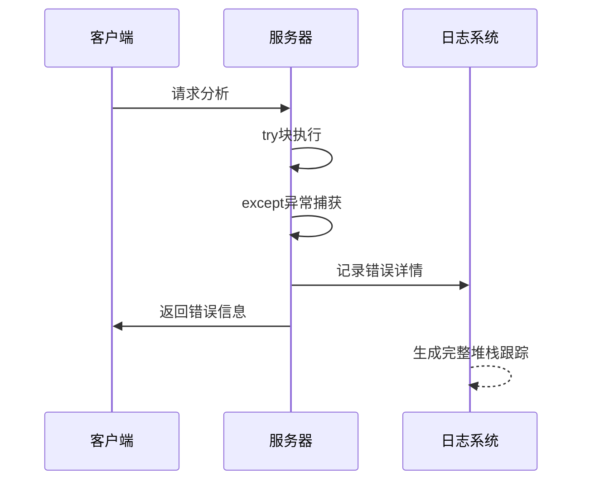

**图表来源**
- [webapp/app.py:276-282](file://webapp/app.py#L276-L282)

#### **新增** 进度监控

- **设备信息**: 显示当前使用的硬件
- **特征形状**: 记录特征向量维度
- **处理时间**: 监控各阶段耗时
- **新增** 荧光生成状态**: 显示生成进度和参数
- **新增** 模式选择**: 显示当前使用的预测模式

## 结论

这个Web应用程序成功地将先进的AI技术转化为易用的临床工具，为肺癌研究提供了强大的蛋白质组学分析能力。**更新** 新增的荧光叠加功能显著增强了应用的可视化能力和用户体验，同时完善的错误处理机制和进度跟踪确保了稳定的用户体验。

项目的主要优势包括：

### 技术创新

- **多模态融合**: 结合H&E图像和AI预测结果
- **新增** 虚拟荧光技术**: 提供专业的蛋白质组学可视化
- **新增** 交互式控制**: 生物标记选择、透明度和稀疏度调节
- **新增** 多视图模式**: 灵活的图像显示选项
- **新增** 多种预测模式**: 空间分布、随机分布、HEX脚本渲染
- **新增** 实时防抖机制**: 防止频繁重新生成
- **新增** 完善的错误处理**: 提供详细的错误信息和堆栈跟踪
- **新增** 进度跟踪**: 实时显示分析进度
- **实时可视化**: 提供直观的分析结果展示
- **可扩展架构**: 支持未来功能扩展

### 实用价值

- **临床应用**: 为病理诊断提供辅助工具
- **研究支持**: 支持生物标志物发现研究
- **新增** 教育用途**: 帮助医学专业人员理解空间蛋白质组学
- **新增** 专业可视化**: 模拟真实CODEX多通道免疫荧光成像
- **新增** 多种渲染选项**: 满足不同用户需求

### 发展前景

随着技术的不断进步，该应用程序可以在以下方面进一步发展：
- 支持更多类型的医学图像
- 集成更多的生物标志物
- **新增** 支持更多可视化模式
- **新增** 实时交互功能
- **新增** 导出和分享功能
- **新增** 更多的预测模式
- 扩展到其他疾病领域

该项目展示了如何将复杂的AI技术转化为实用的医疗工具，为精准医学的发展做出了重要贡献。**更新** 新增的荧光叠加功能、错误处理机制和进度跟踪使其成为了一个功能完整、专业级且用户友好的虚拟空间蛋白质组学分析平台。