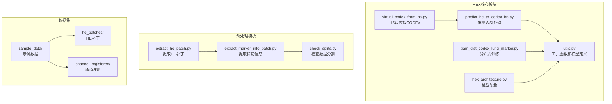
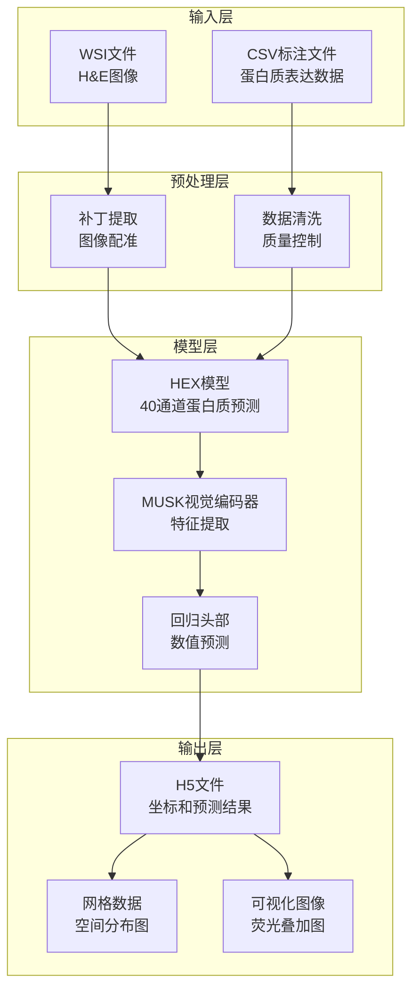
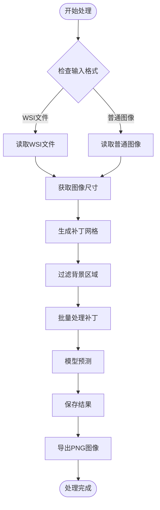
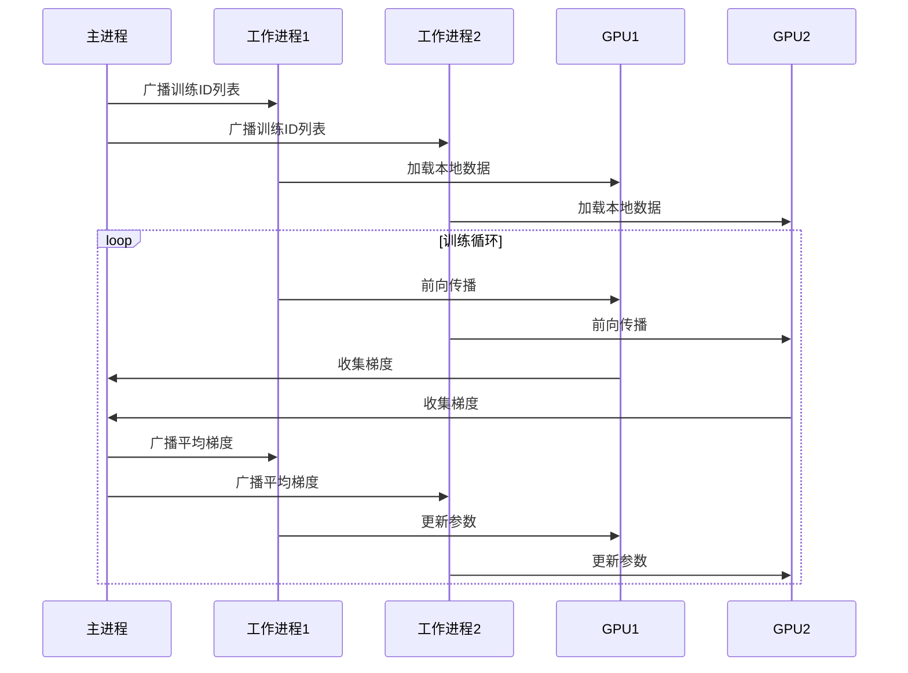
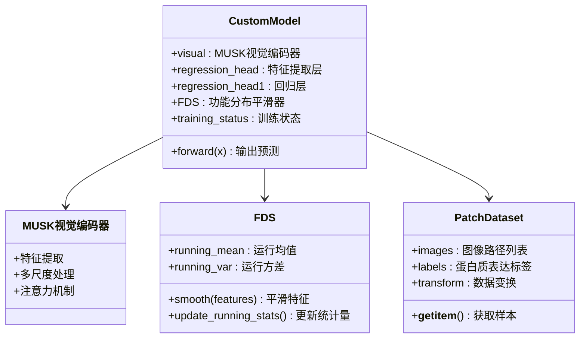
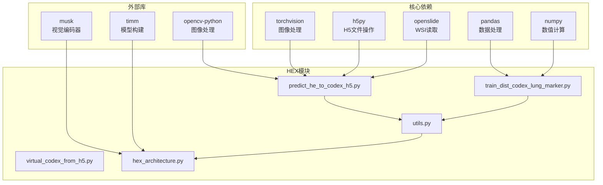

# 批量处理功能

<cite>
**本文档引用的文件**
- [predict_he_to_codex_h5.py](file://hex/predict_he_to_codex_h5.py)
- [train_dist_codex_lung_marker.py](file://hex/train_dist_codex_lung_marker.py)
- [virtual_codex_from_h5.py](file://hex/virtual_codex_from_h5.py)
- [utils.py](file://hex/utils.py)
- [hex_architecture.py](file://hex/hex_architecture.py)
- [test_codex_lung_marker.py](file://hex/test_codex_lung_marker.py)
- [extract_he_patch.py](file://extract_he_patch.py)
- [extract_marker_info_patch.py](file://extract_marker_info_patch.py)
- [check_splits.py](file://check_splits.py)
- [README.md](file://README.md)
</cite>

## 目录
1. [简介](#简介)
2. [项目结构](#项目结构)
3. [核心组件](#核心组件)
4. [架构概览](#架构概览)
5. [详细组件分析](#详细组件分析)
6. [依赖关系分析](#依赖关系分析)
7. [性能考虑](#性能考虑)
8. [故障排除指南](#故障排除指南)
9. [结论](#结论)

## 简介

本文档深入分析了HEX项目中的批量处理功能，该项目是一个AI驱动的虚拟空间蛋白质组学系统，能够从标准组织病理学切片中计算生成蛋白质表达图谱。批量处理功能是整个系统的核心，支持大规模WSI（全幻灯片成像）图像的高效处理、训练和推理。

该系统主要包含三个核心功能模块：
- **批量WSI处理**：将WSI图像分割成补丁并进行蛋白质表达预测
- **分布式训练**：支持多GPU环境下的大规模模型训练
- **批量数据预处理**：处理组织学图像和蛋白质组学数据的配对

## 项目结构

HEX项目的整体架构采用模块化设计，主要分为以下几个层次：

**图表来源**
- [predict_he_to_codex_h5.py:1-841](file://hex/predict_he_to_codex_h5.py#L1-L841)
- [train_dist_codex_lung_marker.py:1-400](file://hex/train_dist_codex_lung_marker.py#L1-L400)
- [utils.py:1-342](file://hex/utils.py#L1-L342)

**章节来源**
- [README.md:1-57](file://README.md#L1-L57)

## 核心组件

### 批量WSI处理引擎

批量WSI处理是系统的核心功能，负责将大型WSI图像分割成可管理的补丁，并使用深度学习模型进行蛋白质表达预测。

#### 主要特性
- **智能补丁分割**：基于网格的补丁生成策略
- **内存优化**：批量处理减少内存占用
- **多格式支持**：支持多种WSI格式（SVS、MRXS、NDPI等）
- **质量控制**：背景过滤和白点阈值检测

#### 关键参数
- `patch_size`：补丁大小，默认224像素
- `stride`：补丁步长，默认等于补丁大小
- `batch_size`：批量大小，默认64
- `white_thresh`：白点阈值，默认0.92

**章节来源**
- [predict_he_to_codex_h5.py:685-800](file://hex/predict_he_to_codex_h5.py#L685-L800)

### 分布式训练框架

系统支持多GPU环境下的分布式训练，采用PyTorch的DDP（分布式数据并行）实现。

#### 训练特点
- **数据并行**：自动将数据分发到多个GPU
- **梯度同步**：所有GPU之间同步梯度更新
- **混合精度**：使用FP16提高训练效率
- **自适应损失**：使用鲁棒损失函数处理异常值

#### 训练流程
1. 初始化分布式环境
2. 创建训练和验证数据集
3. 设置分布式采样器
4. 定义模型和优化器
5. 执行训练循环

**章节来源**
- [train_dist_codex_lung_marker.py:42-397](file://hex/train_dist_codex_lung_marker.py#L42-L397)

### 数据预处理管道

系统提供完整的数据预处理管道，包括WSI图像处理和蛋白质组学数据提取。

#### 预处理步骤
1. **WSI补丁提取**：从WSI中提取标准化尺寸的补丁
2. **通道注册**：将CODEX图像与H&E图像进行配准
3. **标记信息提取**：计算每个补丁的蛋白质表达强度
4. **数据分割验证**：确保训练和验证集的完整性

**章节来源**
- [extract_he_patch.py:9-78](file://extract_he_patch.py#L9-L78)
- [extract_marker_info_patch.py:1-74](file://extract_marker_info_patch.py#L1-L74)

## 架构概览

系统采用分层架构设计，从底层的数据处理到上层的应用接口形成完整的处理流水线。

**图表来源**
- [predict_he_to_codex_h5.py:257-437](file://hex/predict_he_to_codex_h5.py#L257-L437)
- [utils.py:32-81](file://hex/utils.py#L32-L81)

## 详细组件分析

### 批量WSI处理组件

#### 补丁生成算法

批量WSI处理的核心是高效的补丁生成算法，该算法采用网格扫描策略：

**图表来源**
- [predict_he_to_codex_h5.py:40-62](file://hex/predict_he_to_codex_h5.py#L40-L62)
- [predict_he_to_codex_h5.py:314-437](file://hex/predict_he_to_codex_h5.py#L314-L437)

#### 内存管理策略

系统采用智能的内存管理策略来处理大型WSI文件：

1. **批量缓冲**：将补丁按批次存储在内存中
2. **延迟加载**：只在需要时加载数据到GPU
3. **自动类型转换**：使用float16节省内存
4. **进度监控**：实时显示处理进度

**章节来源**
- [predict_he_to_codex_h5.py:354-414](file://hex/predict_he_to_codex_h5.py#L354-L414)

### 分布式训练组件

#### 训练数据管理

分布式训练系统提供了高效的数据管理机制：

**图表来源**
- [train_dist_codex_lung_marker.py:28-39](file://hex/train_dist_codex_lung_marker.py#L28-L39)
- [train_dist_codex_lung_marker.py:282-290](file://hex/train_dist_codex_lung_marker.py#L282-L290)

#### 模型架构设计

HEX模型采用分层架构设计，结合了视觉编码器和回归头部：

**图表来源**
- [utils.py:32-81](file://hex/utils.py#L32-L81)
- [utils.py:116-158](file://hex/utils.py#L116-L158)
- [utils.py:82-97](file://hex/utils.py#L82-L97)

**章节来源**
- [utils.py:32-81](file://hex/utils.py#L32-L81)

### 数据预处理组件

#### 多进程补丁提取

系统采用多进程技术加速WSI补丁提取过程：

**图表来源**
- [extract_he_patch.py:60-73](file://extract_he_patch.py#L60-L73)
- [extract_he_patch.py:9-44](file://extract_he_patch.py#L9-L44)

#### 蛋白质表达强度计算

标记信息提取模块计算每个补丁的蛋白质表达强度：

**章节来源**
- [extract_marker_info_patch.py:43-73](file://extract_marker_info_patch.py#L43-L73)

## 依赖关系分析

系统各组件之间的依赖关系形成了一个复杂的网络：

**图表来源**
- [predict_he_to_codex_h5.py:1-12](file://hex/predict_he_to_codex_h5.py#L1-L12)
- [train_dist_codex_lung_marker.py:1-26](file://hex/train_dist_codex_lung_marker.py#L1-L26)

**章节来源**
- [README.md:15-24](file://README.md#L15-L24)

## 性能考虑

### 内存优化策略

系统采用了多种内存优化技术来处理大型WSI文件：

1. **批量处理**：通过调整batch_size参数控制内存使用
2. **数据类型优化**：使用float16减少内存占用
3. **延迟加载**：只在需要时将数据加载到GPU
4. **垃圾回收**：定期清理不需要的中间变量

### 计算效率优化

- **混合精度训练**：在支持的硬件上使用FP16提高计算速度
- **分布式训练**：利用多GPU并行加速训练过程
- **预取优化**：提前准备下一批次的数据
- **内存池**：重用内存分配减少分配开销

### 扩展性设计

系统具有良好的扩展性，支持：
- **水平扩展**：通过增加GPU数量提升处理能力
- **垂直扩展**：通过增加单机GPU显存容量
- **数据扩展**：支持更大规模的数据集
- **模型扩展**：可以轻松替换不同的视觉编码器

## 故障排除指南

### 常见问题及解决方案

#### GPU兼容性问题
- **问题**：V100 GPU（CC 7.0）不兼容
- **解决方案**：系统会自动检测GPU能力并切换到CPU模式

#### 内存不足问题
- **问题**：处理大型WSI时内存溢出
- **解决方案**：减小batch_size或patch_size参数

#### 文件格式问题
- **问题**：WSI文件格式不受支持
- **解决方案**：确保使用OpenSlide支持的格式

#### 数据分割错误
- **问题**：训练和验证集重叠
- **解决方案**：使用check_splits.py验证数据分割

**章节来源**
- [test_codex_lung_marker.py:62-82](file://hex/test_codex_lung_marker.py#L62-L82)
- [check_splits.py:72-104](file://check_splits.py#L72-L104)

### 性能监控

系统提供了完善的性能监控机制：

- **进度显示**：实时显示处理进度和统计数据
- **内存监控**：监控内存使用情况
- **GPU利用率**：监控GPU使用率
- **错误日志**：记录详细的错误信息

## 结论

HEX项目的批量处理功能展现了现代AI系统的设计理念，通过模块化架构、分布式计算和智能内存管理实现了高效的大规模WSI处理。该系统的主要优势包括：

1. **高效率**：通过批量处理和分布式计算显著提升了处理速度
2. **高精度**：使用先进的深度学习模型实现了准确的蛋白质表达预测
3. **高可扩展性**：支持从小规模到超大规模数据集的处理
4. **高可靠性**：完善的错误处理和性能监控机制

该系统的批量处理功能为生物医学研究提供了强大的工具，特别是在癌症研究和药物发现领域具有重要的应用价值。通过持续的优化和改进，该系统有望在临床诊断和个性化医疗中发挥更大的作用。