# 荧光叠加系统

<cite>
**本文档引用的文件**
- [README.md](file://README.md)
- [main.py](file://main.py)
- [hex_architecture.py](file://hex/hex_architecture.py)
- [modeling.py](file://MUSK/musk/modeling.py)
- [train_dist_codex_lung_marker.py](file://hex/train_dist_codex_lung_marker.py)
- [test_codex_lung_marker.py](file://hex/test_codex_lung_marker.py)
- [utils.py](file://hex/utils.py)
- [app.py](file://webapp/app.py)
- [index.html](file://webapp/templates/index.html)
- [demo.ipynb](file://MUSK/demo.ipynb)
- [virtual_codex_from_h5.py](file://hex/virtual_codex_from_h5.py)
- [codex_h5_png2fea.py](file://mica/codex_h5_png2fea.py)
- [dataset.py](file://mica/dataset.py)
- [train_mica.py](file://mica/train_mica.py)
- [test_mica.py](file://mica/test_mica.py)
</cite>

## 目录
1. [项目简介](#项目简介)
2. [项目结构](#项目结构)
3. [核心组件](#核心组件)
4. [架构概览](#架构概览)
5. [详细组件分析](#详细组件分析)
6. [依赖关系分析](#依赖关系分析)
7. [性能考虑](#性能考虑)
8. [故障排除指南](#故障排除指南)
9. [结论](#结论)

## 项目简介

荧光叠加系统是一个基于人工智能的虚拟空间蛋白质组学平台，专门用于从标准的H&E染色病理切片中计算生成蛋白质表达谱。该系统结合了MUSK视觉语言基础模型和深度学习技术，能够准确预测40种生物标志物的表达水平，并提供直观的荧光叠加可视化功能。

### 系统特性

- **AI驱动的蛋白质表达预测**：基于MUSK模型的深度学习算法
- **多模态数据融合**：结合H&E图像和虚拟空间蛋白质组学
- **实时可视化**：提供交互式荧光叠加效果
- **临床应用导向**：专为肺癌等癌症研究设计
- **可扩展架构**：支持大规模数据集和分布式训练

## 项目结构

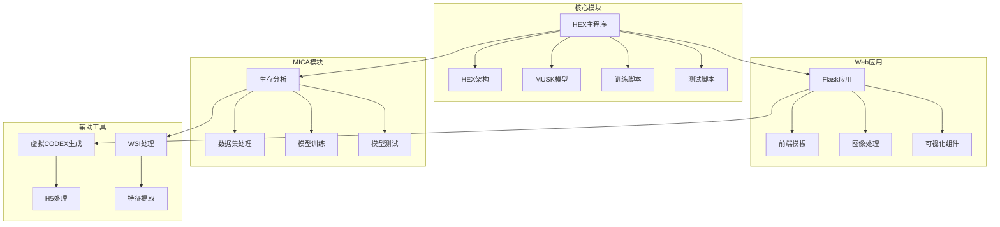

**图表来源**
- [main.py:1-7](file://main.py#L1-L7)
- [hex_architecture.py:1-62](file://hex/hex_architecture.py#L1-L62)
- [app.py:1-1405](file://webapp/app.py#L1-L1405)

**章节来源**
- [README.md:1-57](file://README.md#L1-L57)
- [main.py:1-7](file://main.py#L1-L7)

## 核心组件

### MUSK视觉编码器

MUSK（Multimodal Universal Spatial Knowledge）是系统的核心视觉编码器，基于BEiT-3架构构建，专门用于病理图像分析。

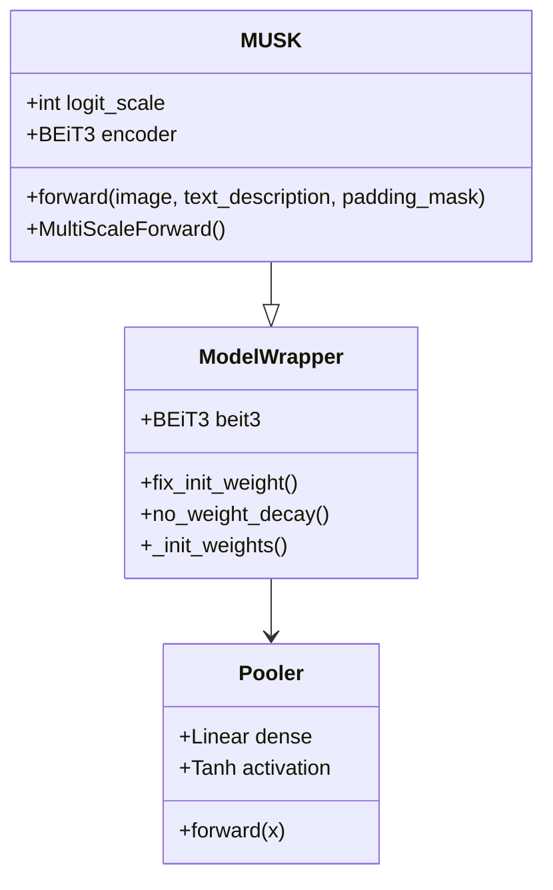

**图表来源**
- [modeling.py:96-175](file://MUSK/musk/modeling.py#L96-L175)
- [modeling.py:62-95](file://MUSK/musk/modeling.py#L62-L95)

### HEX回归头部

HEX模块在MUSK视觉编码器基础上添加了专门的回归头部，用于将视觉特征映射到40种蛋白质表达值。

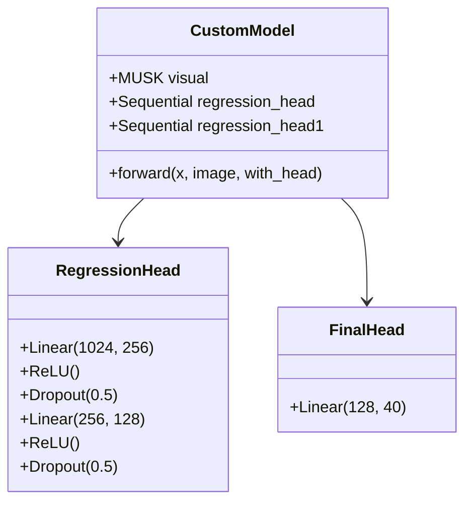

**图表来源**
- [hex_architecture.py:9-62](file://hex/hex_architecture.py#L9-L62)
- [utils.py:32-80](file://hex/utils.py#L32-L80)

**章节来源**
- [hex_architecture.py:1-62](file://hex/hex_architecture.py#L1-L62)
- [modeling.py:1-199](file://MUSK/musk/modeling.py#L1-L199)

## 架构概览

系统采用分层架构设计，从底层的视觉编码器到顶层的应用接口，形成了完整的AI驱动蛋白质组学分析流程。

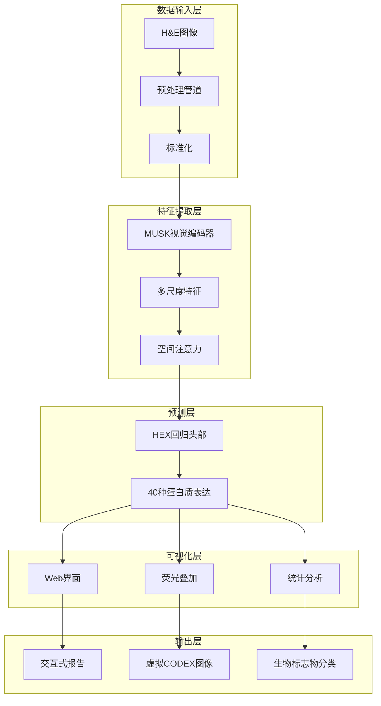

**图表来源**
- [app.py:175-230](file://webapp/app.py#L175-L230)
- [utils.py:55-80](file://hex/utils.py#L55-L80)

## 详细组件分析

### Web应用系统

Web应用提供了用户友好的交互界面，支持图像上传、实时分析和结果可视化。

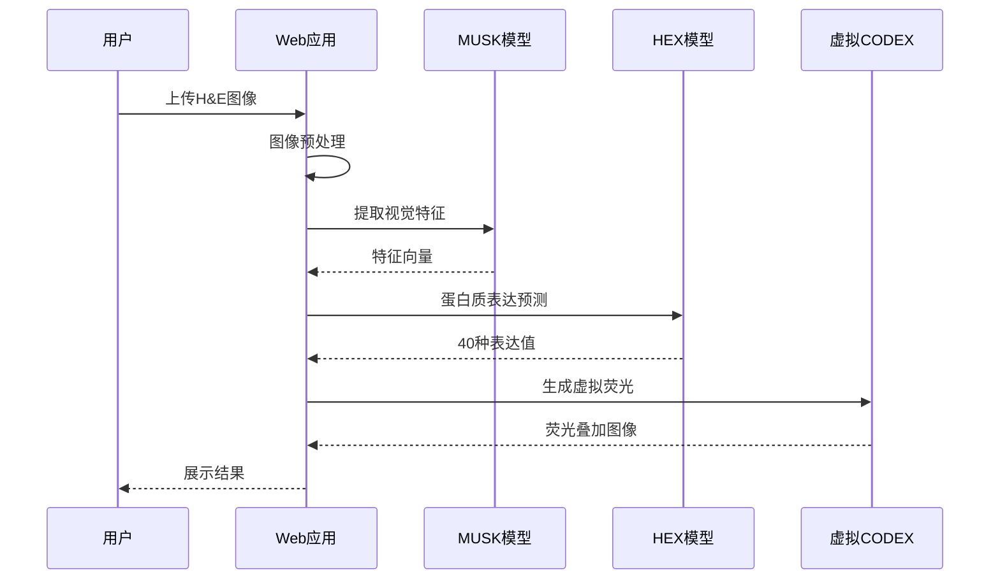

**图表来源**
- [app.py:292-382](file://webapp/app.py#L292-L382)
- [app.py:590-694](file://webapp/app.py#L590-L694)

#### 图像处理管道

系统实现了完整的图像处理流水线，包括预处理、特征提取和后处理。

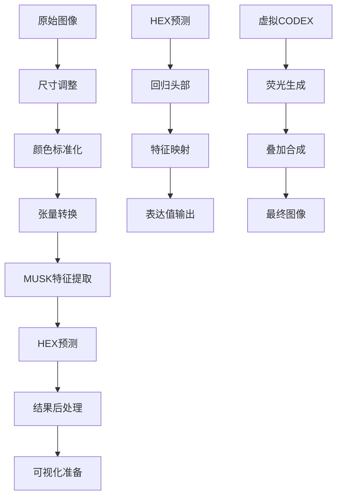

**图表来源**
- [app.py:123-129](file://webapp/app.py#L123-L129)
- [app.py:175-188](file://webapp/app.py#L175-L188)

**章节来源**
- [app.py:1-1405](file://webapp/app.py#L1-L1405)
- [index.html:1-800](file://webapp/templates/index.html#L1-L800)

### 训练和推理系统

系统提供了完整的训练和推理管道，支持分布式训练和高效推理。

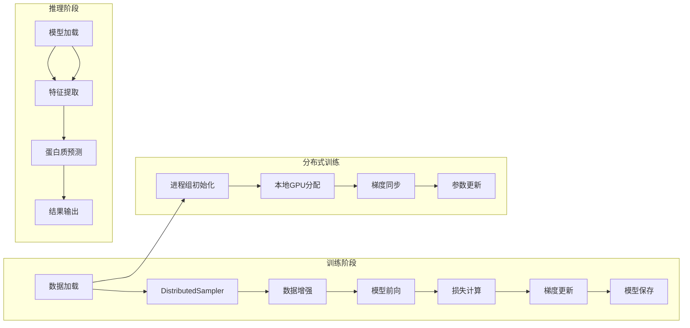

**图表来源**
- [train_dist_codex_lung_marker.py:28-39](file://hex/train_dist_codex_lung_marker.py#L28-L39)
- [train_dist_codex_lung_marker.py:164-169](file://hex/train_dist_codex_lung_marker.py#L164-L169)

#### 数据处理管道

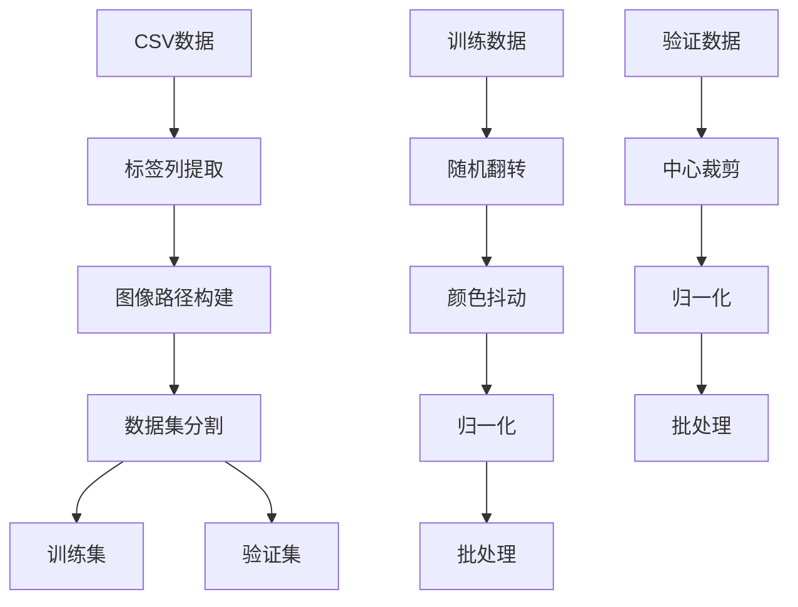

**图表来源**
- [train_dist_codex_lung_marker.py:84-96](file://hex/train_dist_codex_lung_marker.py#L84-L96)
- [train_dist_codex_lung_marker.py:145-158](file://hex/train_dist_codex_lung_marker.py#L145-L158)

**章节来源**
- [train_dist_codex_lung_marker.py:1-400](file://hex/train_dist_codex_lung_marker.py#L1-L400)
- [test_codex_lung_marker.py:1-197](file://hex/test_codex_lung_marker.py#L1-L197)

### MICA生存分析模块

MICA模块专注于多实例学习和生存分析，结合WSI特征和虚拟CODEX特征进行预后预测。

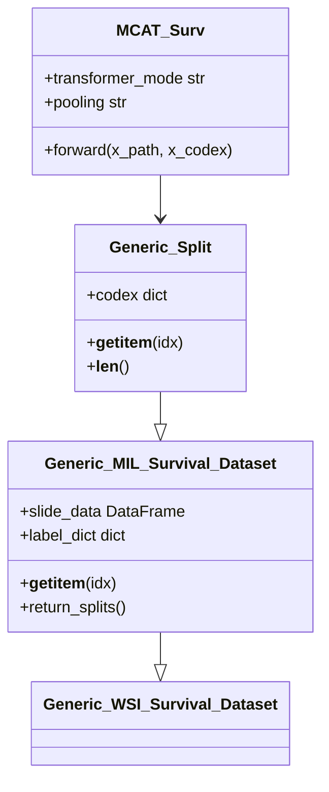

**图表来源**
- [dataset.py:193-227](file://mica/dataset.py#L193-L227)
- [test_mica.py:132-142](file://mica/test_mica.py#L132-L142)

#### 特征提取和融合

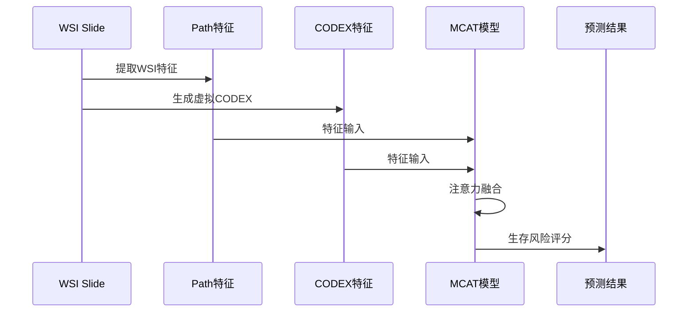

**图表来源**
- [codex_h5_png2fea.py:127-131](file://mica/codex_h5_png2fea.py#L127-L131)
- [dataset.py:200-227](file://mica/dataset.py#L200-L227)

**章节来源**
- [mica/dataset.py:1-250](file://mica/dataset.py#L1-L250)
- [mica/train_mica.py:1-238](file://mica/train_mica.py#L1-L238)
- [mica/test_mica.py:1-324](file://mica/test_mica.py#L1-L324)

## 依赖关系分析

系统具有清晰的模块化依赖关系，各组件之间通过明确定义的接口进行交互。

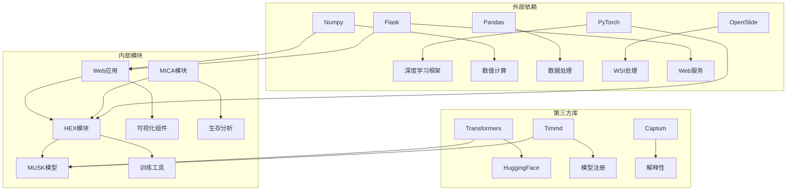

**图表来源**
- [README.md:7-24](file://README.md#L7-L24)
- [hex/utils.py:12-13](file://hex/utils.py#L12-L13)

### 模块耦合度分析

系统采用了松耦合的设计原则，主要体现在：

- **HEX模块**：独立的蛋白质表达预测模块
- **Web应用**：与核心算法解耦的用户界面层
- **MICA模块**：专注于生存分析的独立模块
- **工具模块**：提供通用功能支持

**章节来源**
- [README.md:1-57](file://README.md#L1-L57)
- [hex/utils.py:1-342](file://hex/utils.py#L1-L342)

## 性能考虑

### 训练优化策略

系统实现了多种性能优化技术：

1. **分布式训练**：支持多GPU并行训练
2. **混合精度训练**：减少内存占用和加速计算
3. **渐进式冻结**：先训练视觉编码器，再微调回归头部
4. **自适应损失函数**：提高训练稳定性

### 推理优化

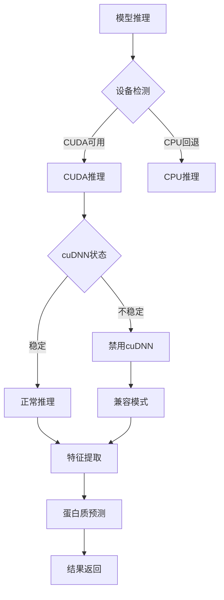

**图表来源**
- [app.py:92-118](file://webapp/app.py#L92-L118)
- [test_codex_lung_marker.py:68-77](file://hex/test_codex_lung_marker.py#L68-L77)

### 内存管理

系统实现了智能的内存管理策略：

- **特征缓存**：避免重复计算
- **批量处理**：优化GPU内存使用
- **自动类型转换**：根据设备能力选择数据类型

## 故障排除指南

### 常见问题及解决方案

#### CUDA相关问题

**问题**：CUDA运行不稳定或无法找到引擎
**解决方案**：
1. 自动检测并禁用cuDNN
2. 回退到CPU模式
3. 设置环境变量强制使用CUDA

#### 模型加载问题

**问题**：MUSK权重加载失败
**解决方案**：
1. 检查模型权重文件完整性
2. 验证HuggingFace令牌配置
3. 确认网络连接状态

#### 内存不足问题

**问题**：GPU内存不足导致训练中断
**解决方案**：
1. 减少批次大小
2. 启用混合精度训练
3. 优化数据加载器设置

**章节来源**
- [app.py:98-116](file://webapp/app.py#L98-L116)
- [train_dist_codex_lung_marker.py:282-290](file://hex/train_dist_codex_lung_marker.py#L282-L290)

## 结论

荧光叠加系统是一个功能完整、架构清晰的AI驱动蛋白质组学平台。系统成功地将MUSK视觉编码器与深度学习技术相结合，实现了从H&E图像到蛋白质表达的精确预测，并提供了直观的可视化功能。

### 主要优势

1. **准确性**：基于大规模数据集训练的高精度模型
2. **可扩展性**：模块化设计支持功能扩展
3. **用户友好**：提供直观的Web界面
4. **临床价值**：专为癌症研究设计的实用工具

### 发展方向

1. **模型优化**：持续改进预测精度
2. **功能扩展**：支持更多生物标志物类型
3. **性能提升**：优化推理速度和资源使用
4. **集成增强**：与其他医疗信息系统集成

该系统为精准医学研究和临床诊断提供了强有力的技术支撑，具有重要的科学价值和应用前景。