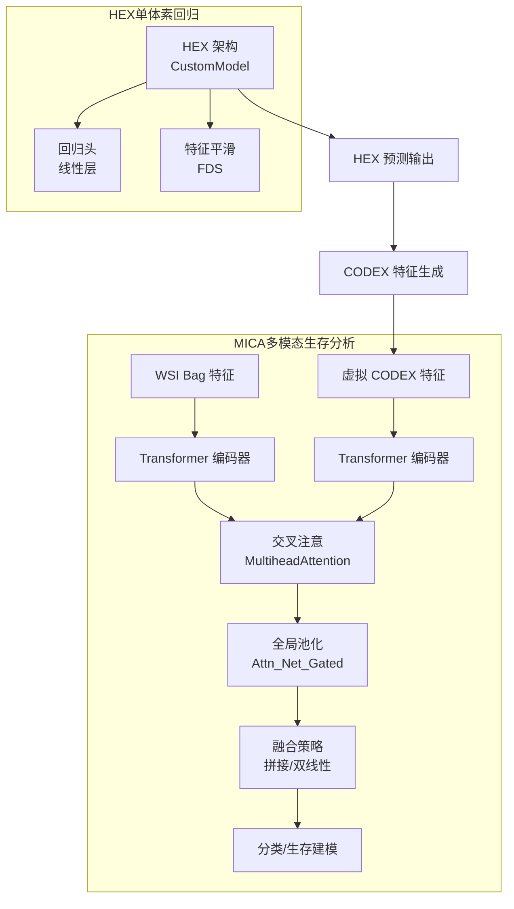
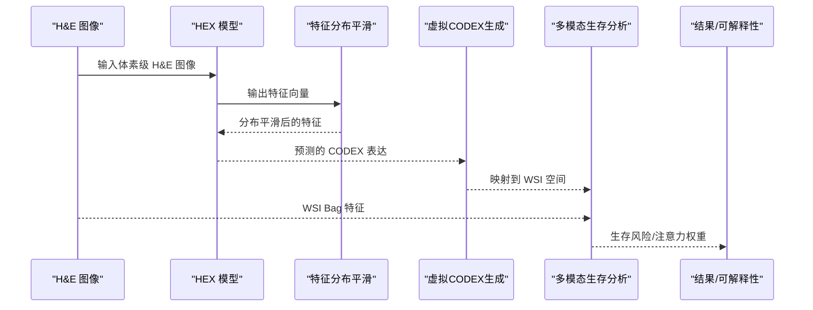
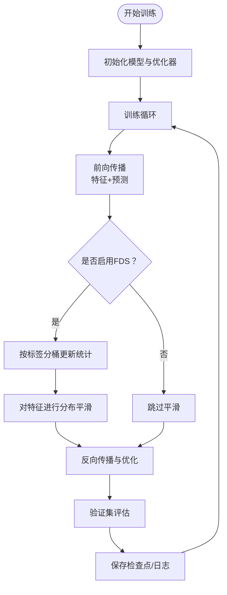
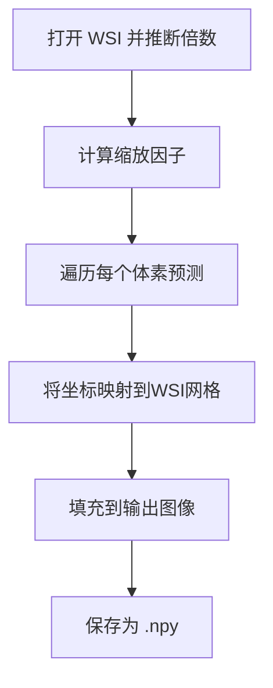
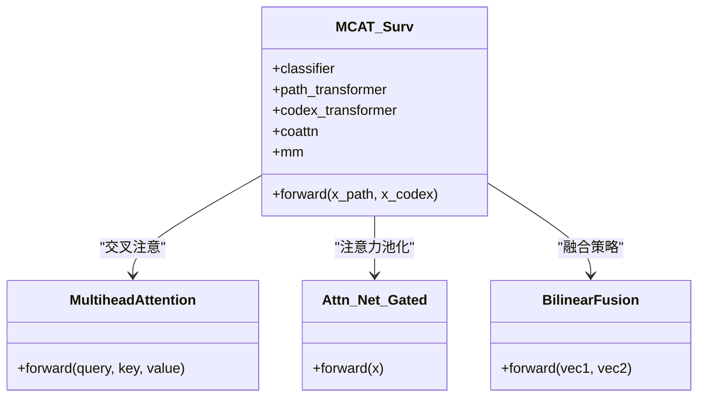
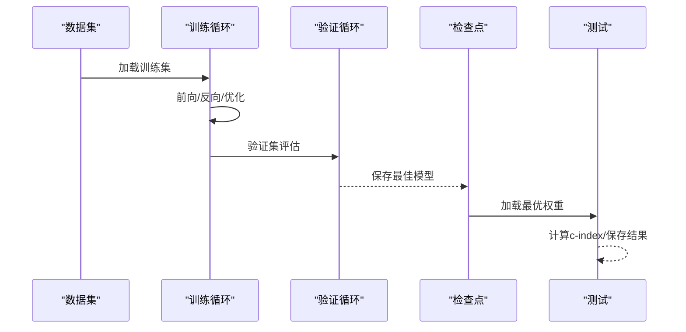
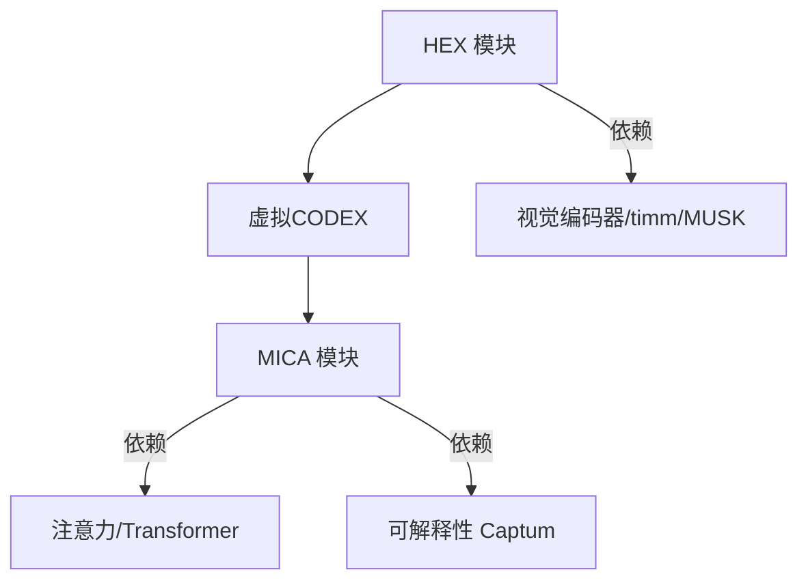

# 创新特性

<cite>
**本文引用的文件**
- [README.md](file://README.md)
- [hex_architecture.py](file://hex/hex_architecture.py)
- [utils.py](file://hex/utils.py)
- [virtual_codex_from_h5.py](file://hex/virtual_codex_from_h5.py)
- [train_dist_codex_lung_marker.py](file://hex/train_dist_codex_lung_marker.py)
- [test_codex_lung_marker.py](file://hex/test_codex_lung_marker.py)
- [model_coattn.py](file://mica/models/model_coattn.py)
- [dataset.py](file://mica/dataset.py)
- [core_utils.py](file://mica/core_utils.py)
- [train_mica.py](file://mica/train_mica.py)
- [test_mica.py](file://mica/test_mica.py)
</cite>

## 目录
1. [引言](#引言)
2. [项目结构](#项目结构)
3. [核心组件](#核心组件)
4. [架构总览](#架构总览)
5. [详细组件分析](#详细组件分析)
6. [依赖分析](#依赖分析)
7. [性能考量](#性能考量)
8. [故障排查指南](#故障排查指南)
9. [结论](#结论)
10. [附录](#附录)

## 引言
本文件聚焦于HEX项目的创新特性，系统阐述其在可解释性AI、多模态数据融合、大规模数据分析、小样本学习分布平滑、注意力机制在空间模式识别中的作用，以及虚拟空间蛋白质组学（HEX到CODEX）技术的开创性意义。项目通过“从常规组织学图像生成空间蛋白质组学”的端到端管线，实现低成本、高通量、可复现的研究范式，并在肺癌多队列中显著提升预后与免疫治疗响应预测性能。

## 项目结构
HEX由两大部分组成：HEX模块（从H&E图像预测蛋白表达）与MICA模块（多模态生存分析）。HEX负责单体素尺度的回归预测；MICA将HEX生成的虚拟CODEX特征与WSI Bag特征进行联合建模，利用交叉注意与多头注意力实现空间与分子信号的深度融合。

图示来源
- [hex_architecture.py:1-37](file://hex/hex_architecture.py#L1-L37)
- [utils.py:32-81](file://hex/utils.py#L32-L81)
- [model_coattn.py:12-124](file://mica/models/model_coattn.py#L12-L124)

章节来源
- [README.md:26-44](file://README.md#L26-L44)

## 核心组件
- HEX回归模型：基于视觉编码器提取表型特征，经两段回归头得到多标志物表达值，支持分布式训练与特征平滑。
- 特征分布平滑（FDS）：按标签区间统计特征均值/方差，采用卷积核平滑历史分布，在推理阶段对特征进行分布校准，缓解小样本偏移。
- 虚拟空间蛋白质组学：将HEX预测的CODEX特征映射回WSI空间，形成连续的空间表达图谱，用于下游多模态建模。
- 多模态生存分析（MICA）：以交叉注意引导WSI与虚拟CODEX特征对齐，结合Transformer与注意力池化，实现可解释的生存预测。

章节来源
- [hex_architecture.py:9-37](file://hex/hex_architecture.py#L9-L37)
- [utils.py:32-81](file://hex/utils.py#L32-L81)
- [utils.py:116-326](file://hex/utils.py#L116-L326)
- [virtual_codex_from_h5.py:10-68](file://hex/virtual_codex_from_h5.py#L10-L68)
- [model_coattn.py:12-124](file://mica/models/model_coattn.py#L12-L124)

## 架构总览
HEX与MICA协同工作：HEX在体素粒度上从H&E图像回归40个生物标志物表达；MICA将WSI Bag特征与HEX生成的虚拟CODEX特征进行跨模态对齐与融合，借助注意力机制识别空间模式，最终完成生存分析与可解释性解读。

图示来源
- [train_dist_codex_lung_marker.py:245-392](file://hex/train_dist_codex_lung_marker.py#L245-L392)
- [virtual_codex_from_h5.py:37-68](file://hex/virtual_codex_from_h5.py#L37-L68)
- [model_coattn.py:70-124](file://mica/models/model_coattn.py#L70-L124)

## 详细组件分析

### 组件A：HEX回归模型与特征分布平滑（FDS）
- 视觉编码器：使用预训练视觉模型作为骨干，输出固定维度特征，再经两段回归头得到多标志物表达。
- 分布平滑（FDS）：按标签范围分桶统计特征均值/方差，使用卷积核对历史均值/方差进行平滑，推理时对当前特征做均值/方差校准，有效缓解小样本下的分布偏移。
- 训练策略：分布式训练、混合精度、自适应损失、冻结/解冻策略，支持多尺度数据增强与验证指标记录。

图示来源
- [train_dist_codex_lung_marker.py:245-392](file://hex/train_dist_codex_lung_marker.py#L245-L392)
- [utils.py:116-326](file://hex/utils.py#L116-L326)

章节来源
- [hex_architecture.py:9-37](file://hex/hex_architecture.py#L9-L37)
- [utils.py:32-81](file://hex/utils.py#L32-L81)
- [train_dist_codex_lung_marker.py:174-226](file://hex/train_dist_codex_lung_marker.py#L174-L226)

### 组件B：虚拟空间蛋白质组学（HEX→CODEX）
- 功能：将HEX对每个体素的预测结果重采样到WSI分辨率，生成连续空间的虚拟CODEX表达图谱，便于与WSI Bag特征进行空间对齐。
- 关键点：自动推断显微镜倍数，按比例缩放坐标，将预测向量填充到对应像素位置，保存为Numpy数组供后续使用。

图示来源
- [virtual_codex_from_h5.py:10-68](file://hex/virtual_codex_from_h5.py#L10-L68)

章节来源
- [virtual_codex_from_h5.py:10-68](file://hex/virtual_codex_from_h5.py#L10-L68)

### 组件C：多模态生存分析（MICA，含交叉注意与注意力池化）
- 交叉注意（Co-Attention）：将WSI Bag与虚拟CODEX特征互为Q/K/V，动态对齐不同模态间的关注区域，捕捉空间与分子信号的协同模式。
- Transformer 编码器：分别对两种模态进行序列编码，支持共享或分离的Transformer权重。
- 注意力池化：使用门控注意力网络对序列加权聚合，得到全局表示。
- 融合策略：支持拼接或双线性融合，最后进入分类/生存建模头。
- 可解释性：提供注意力权重，便于可视化空间模式与生物标志物共定位。

图示来源
- [model_coattn.py:12-124](file://mica/models/model_coattn.py#L12-L124)
- [model_coattn.py:459-615](file://mica/models/model_coattn.py#L459-L615)
- [model_coattn.py:683-714](file://mica/models/model_coattn.py#L683-L714)

章节来源
- [model_coattn.py:12-124](file://mica/models/model_coattn.py#L12-L124)
- [test_mica.py:32-77](file://mica/test_mica.py#L32-L77)

### 组件D：数据加载与训练流程（MICA）
- 数据集：按滑脉络（slide）级别构建生存数据集，支持多折划分与患者/滑脉络去重。
- 训练循环：支持梯度累积、生存损失、c-index评估与TensorBoard日志。
- 测试流程：加载最佳检查点，汇总生存结果并计算c-index，支持集成梯度可解释性分析。

图示来源
- [dataset.py:193-250](file://mica/dataset.py#L193-L250)
- [core_utils.py:15-82](file://mica/core_utils.py#L15-L82)
- [train_mica.py:28-88](file://mica/train_mica.py#L28-L88)
- [test_mica.py:79-173](file://mica/test_mica.py#L79-L173)

章节来源
- [dataset.py:193-250](file://mica/dataset.py#L193-L250)
- [core_utils.py:15-82](file://mica/core_utils.py#L15-L82)
- [train_mica.py:28-88](file://mica/train_mica.py#L28-L88)
- [test_mica.py:79-173](file://mica/test_mica.py#L79-L173)

## 依赖分析
- 第三方库：PyTorch、timm、MUSK、robust-loss、Captum、OpenSlide、HDF5等，支撑视觉编码、稳健回归、可解释性与WSI处理。
- 开源基础：CLAM、MCAT、DINOv2等，用于WSI Bag提取与特征对齐。
- 依赖耦合：HEX与MICA通过中间产物（虚拟CODEX特征）耦合，整体形成“HEX→MICA”的端到端管线。

图示来源
- [README.md:15-24](file://README.md#L15-L24)
- [hex_architecture.py:5-6](file://hex/hex_architecture.py#L5-L6)
- [test_mica.py:16](file://mica/test_mica.py#L16)

章节来源
- [README.md:15-24](file://README.md#L15-L24)

## 性能考量
- 小样本学习：通过FDS对特征分布进行历史统计平滑，缓解小样本下标签分布偏移，提升回归稳定性与泛化能力。
- 注意力机制：交叉注意与注意力池化帮助模型聚焦关键空间区域与生物标志物组合，提升判别力与可解释性。
- 大规模数据：分布式训练、混合精度与梯度累积显著降低内存占用，加速收敛。
- 可复现性：严格的随机种子设置、分层数据划分与统一评估指标（Pearson相关系数、c-index）保障实验一致性。

## 故障排查指南
- 分割错误：确保训练/验证不共享同一滑脉络或患者ID，脚本内置断言会报错提示重划分。
- 设备/端口：分布式训练需正确配置本地GPU编号与主端口，初始化失败时检查环境变量。
- 数据路径：虚拟CODEX生成脚本需要指定WSI目录、H5预测目录与输出目录，路径缺失会导致跳过处理。
- 可解释性：若需使用集成梯度，确保已安装Captum并正确构造输入梯度张量。

章节来源
- [train_mica.py:53-64](file://mica/train_mica.py#L53-L64)
- [train_dist_codex_lung_marker.py:28-39](file://hex/train_dist_codex_lung_marker.py#L28-L39)
- [virtual_codex_from_h5.py:30-36](file://hex/virtual_codex_from_h5.py#L30-L36)
- [test_mica.py:54-66](file://mica/test_mica.py#L54-L66)

## 结论
HEX通过“从常规组织学图像生成空间蛋白质组学”的创新路径，解决了临床转化中的成本与可及性难题；结合MICA的多模态融合与注意力机制，实现了对肿瘤微环境的高分辨率解析与可解释性解读。项目在大规模队列中显著提升预后与免疫治疗响应预测性能，具备强大的前瞻性与引领作用。

## 附录
- 开源与许可：仓库包含第三方组件，遵循各自许可证；项目本身提供可复现的训练/测试脚本与示例数据。
- 引用与致谢：项目基于多个开源工作，文中给出参考与致谢信息。

章节来源
- [README.md:47-57](file://README.md#L47-L57)