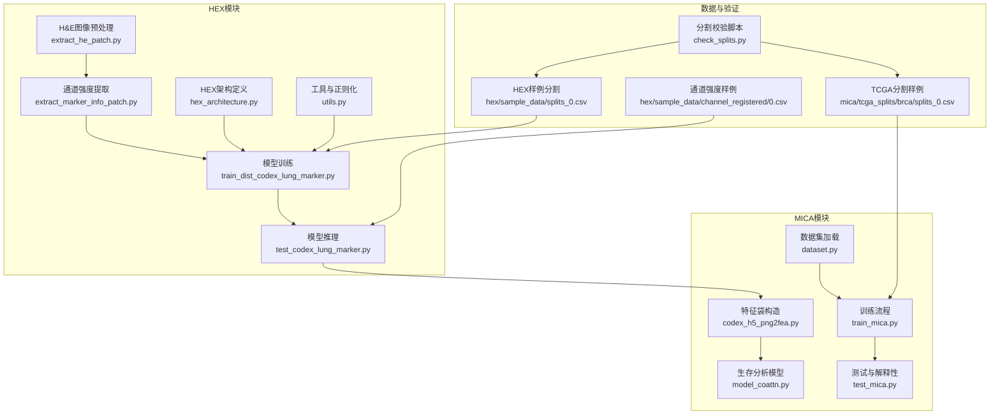
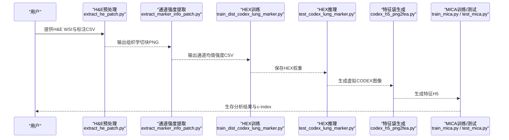
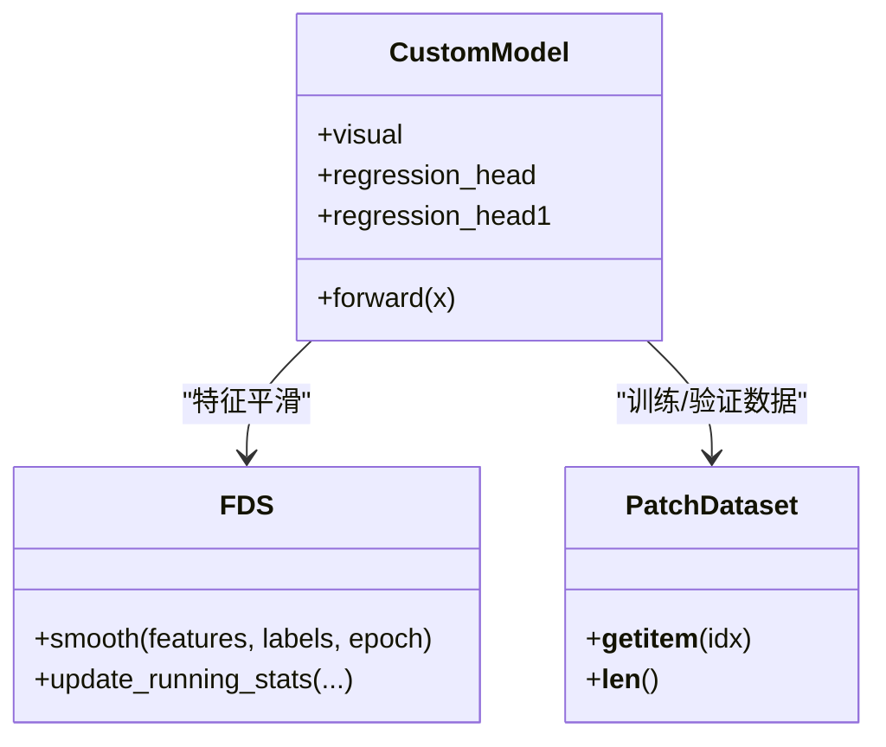
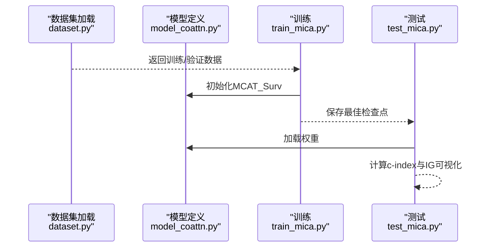
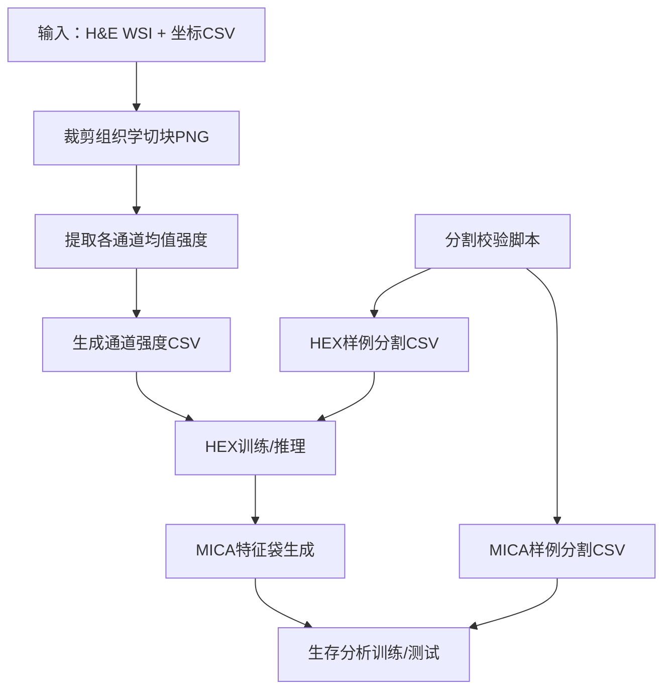
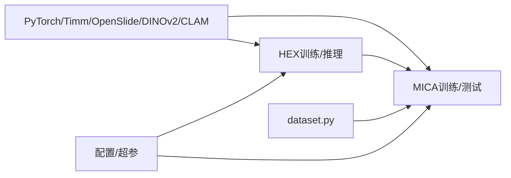

# 应用场景

<cite>
**本文引用的文件**
- [README.md](file://README.md)
- [hex/hex_architecture.py](file://hex/hex_architecture.py)
- [hex/test_codex_lung_marker.py](file://hex/test_codex_lung_marker.py)
- [hex/train_dist_codex_lung_marker.py](file://hex/train_dist_codex_lung_marker.py)
- [hex/utils.py](file://hex/utils.py)
- [mica/models/model_coattn.py](file://mica/models/model_coattn.py)
- [mica/dataset.py](file://mica/dataset.py)
- [mica/train_mica.py](file://mica/train_mica.py)
- [mica/test_mica.py](file://mica/test_mica.py)
- [mica/codex_h5_png2fea.py](file://mica/codex_h5_png2fea.py)
- [extract_he_patch.py](file://extract_he_patch.py)
- [extract_marker_info_patch.py](file://extract_marker_info_patch.py)
- [check_splits.py](file://check_splits.py)
- [hex/sample_data/splits_0.csv](file://hex/sample_data/splits_0.csv)
- [hex/sample_data/channel_registered/0.csv](file://hex/sample_data/channel_registered/0.csv)
- [mica/tcga_splits/brca/splits_0.csv](file://mica/tcga_splits/brca/splits_0.csv)
</cite>

## 目录
1. [引言](#引言)
2. [项目结构](#项目结构)
3. [核心组件](#核心组件)
4. [架构总览](#架构总览)
5. [详细组件分析](#详细组件分析)
6. [依赖关系分析](#依赖关系分析)
7. [性能考量](#性能考量)
8. [故障排查指南](#故障排查指南)
9. [结论](#结论)
10. [附录](#附录)

## 引言
本项目面向生物医学研究与转化医学，围绕“从常规H&E病理切片生成虚拟空间蛋白组学（HEX）”这一核心技术，构建了从图像预处理、模型训练到多模态生存分析的完整工作流。其目标是实现低成本、可扩展的空间生物学研究，支撑肺癌等肿瘤的精准诊断、治疗反应预测、药物研发辅助，并推动生物标志物发现与预后评估等转化应用。

## 项目结构
项目由两大部分组成：HEX模块（基于H&E图像预测蛋白质表达）与MICA模块（多模态注意力融合生存分析）。配套脚本覆盖数据准备、特征提取、交叉验证与结果评估。

**图示来源**
- [extract_he_patch.py:1-78](file://extract_he_patch.py#L1-L78)
- [extract_marker_info_patch.py:1-74](file://extract_marker_info_patch.py#L1-L74)
- [train_dist_codex_lung_marker.py:1-400](file://hex/train_dist_codex_lung_marker.py#L1-L400)
- [test_codex_lung_marker.py:1-189](file://hex/test_codex_lung_marker.py#L1-L189)
- [hex/hex_architecture.py:1-37](file://hex/hex_architecture.py#L1-L37)
- [hex/utils.py:1-342](file://hex/utils.py#L1-L342)
- [mica/codex_h5_png2fea.py:1-173](file://mica/codex_h5_png2fea.py#L1-L173)
- [mica/models/model_coattn.py:1-714](file://mica/models/model_coattn.py#L1-L714)
- [mica/dataset.py:1-250](file://mica/dataset.py#L1-L250)
- [mica/train_mica.py:1-238](file://mica/train_mica.py#L1-L238)
- [mica/test_mica.py:1-324](file://mica/test_mica.py#L1-L324)
- [hex/sample_data/splits_0.csv:1-5](file://hex/sample_data/splits_0.csv#L1-L5)
- [hex/sample_data/channel_registered/0.csv:1-4](file://hex/sample_data/channel_registered/0.csv#L1-L4)
- [mica/tcga_splits/brca/splits_0.csv:1-800](file://mica/tcga_splits/brca/splits_0.csv#L1-L800)
- [check_splits.py:1-159](file://check_splits.py#L1-L159)

**章节来源**
- [README.md:1-57](file://README.md#L1-L57)
- [extract_he_patch.py:1-78](file://extract_he_patch.py#L1-L78)
- [extract_marker_info_patch.py:1-74](file://extract_marker_info_patch.py#L1-L74)
- [train_dist_codex_lung_marker.py:1-400](file://hex/train_dist_codex_lung_marker.py#L1-L400)
- [test_codex_lung_marker.py:1-189](file://hex/test_codex_lung_marker.py#L1-L189)
- [hex/hex_architecture.py:1-37](file://hex/hex_architecture.py#L1-L37)
- [hex/utils.py:1-342](file://hex/utils.py#L1-L342)
- [mica/codex_h5_png2fea.py:1-173](file://mica/codex_h5_png2fea.py#L1-L173)
- [mica/models/model_coattn.py:1-714](file://mica/models/model_coattn.py#L1-L714)
- [mica/dataset.py:1-250](file://mica/dataset.py#L1-L250)
- [mica/train_mica.py:1-238](file://mica/train_mica.py#L1-L238)
- [mica/test_mica.py:1-324](file://mica/test_mica.py#L1-L324)
- [check_splits.py:1-159](file://check_splits.py#L1-L159)

## 核心组件
- HEX模型：基于视觉编码器与回归头，从H&E图像预测40种蛋白质表达，支持分布式训练与特征平滑正则化。
- MICA模型：多模态注意力融合（H&E与虚拟CODEX），用于生存分析任务，支持注意力可视化与解释性分析。
- 数据管线：从WSI切片到特征袋，再到多模态训练与测试的完整流程。
- 预处理工具：H&E切片切块、通道强度统计、分割校验等。

**章节来源**
- [hex/hex_architecture.py:9-37](file://hex/hex_architecture.py#L9-L37)
- [hex/utils.py:32-81](file://hex/utils.py#L32-L81)
- [mica/models/model_coattn.py:12-124](file://mica/models/model_coattn.py#L12-L124)
- [mica/dataset.py:17-250](file://mica/dataset.py#L17-L250)
- [mica/codex_h5_png2fea.py:1-173](file://mica/codex_h5_png2fea.py#L1-L173)

## 架构总览
HEX负责从H&E图像预测蛋白质表达，MICA将H&E与HEX生成的虚拟CODEX进行多模态融合，学习更稳健的预后预测。整体流程如下：

**图示来源**
- [extract_he_patch.py:1-78](file://extract_he_patch.py#L1-L78)
- [extract_marker_info_patch.py:1-74](file://extract_marker_info_patch.py#L1-L74)
- [train_dist_codex_lung_marker.py:1-400](file://hex/train_dist_codex_lung_marker.py#L1-L400)
- [test_codex_lung_marker.py:1-189](file://hex/test_codex_lung_marker.py#L1-L189)
- [mica/codex_h5_png2fea.py:1-173](file://mica/codex_h5_png2fea.py#L1-L173)
- [mica/train_mica.py:1-238](file://mica/train_mica.py#L1-L238)
- [mica/test_mica.py:1-324](file://mica/test_mica.py#L1-L324)

## 详细组件分析

### 组件A：HEX模型与训练流程
- 模型结构：视觉编码器输出经两段回归头映射至40维蛋白质表达向量；支持特征平滑正则化（FDS）以提升泛化。
- 训练策略：分布式训练、自适应损失、余弦退火调度、混合精度加速。
- 推理流程：读取切块图像，标准化后前向得到每张切片的蛋白质表达预测，计算与标签的皮尔逊相关系数。

**图示来源**
- [hex/hex_architecture.py:9-37](file://hex/hex_architecture.py#L9-L37)
- [hex/utils.py:32-81](file://hex/utils.py#L32-L81)
- [hex/utils.py:116-327](file://hex/utils.py#L116-L327)
- [hex/utils.py:82-98](file://hex/utils.py#L82-L98)

**章节来源**
- [hex/hex_architecture.py:1-37](file://hex/hex_architecture.py#L1-L37)
- [hex/utils.py:1-342](file://hex/utils.py#L1-L342)
- [train_dist_codex_lung_marker.py:1-400](file://hex/train_dist_codex_lung_marker.py#L1-L400)
- [test_codex_lung_marker.py:1-189](file://hex/test_codex_lung_marker.py#L1-L189)

### 组件B：MICA多模态生存分析
- 模型设计：H&E与虚拟CODEX分别经全连接投影，通过跨模态注意力交互，再经Transformer编码与全局池化，最终分类器输出风险评分与生存曲线。
- 数据加载：按TCGA标准格式加载WSI特征与虚拟CODEX特征，支持5折交叉验证。
- 解释性：集成梯度可视化关注区域，辅助解读模型决策。

**图示来源**
- [mica/dataset.py:17-250](file://mica/dataset.py#L17-L250)
- [mica/models/model_coattn.py:12-124](file://mica/models/model_coattn.py#L12-L124)
- [mica/train_mica.py:1-238](file://mica/train_mica.py#L1-L238)
- [mica/test_mica.py:1-324](file://mica/test_mica.py#L1-L324)

**章节来源**
- [mica/models/model_coattn.py:1-714](file://mica/models/model_coattn.py#L1-L714)
- [mica/dataset.py:1-250](file://mica/dataset.py#L1-L250)
- [mica/train_mica.py:1-238](file://mica/train_mica.py#L1-L238)
- [mica/test_mica.py:1-324](file://mica/test_mica.py#L1-L324)

### 组件C：数据预处理与质量控制
- H&E切块：根据坐标从WSI中裁剪固定尺寸的组织学切块。
- 通道强度：从注册后的CODEX图像中提取每个切块的通道均值强度，形成CSV。
- 分割校验：确保HEX与MICA的训练/验证分割不重叠且覆盖完整。

**图示来源**
- [extract_he_patch.py:1-78](file://extract_he_patch.py#L1-L78)
- [extract_marker_info_patch.py:1-74](file://extract_marker_info_patch.py#L1-L74)
- [check_splits.py:1-159](file://check_splits.py#L1-L159)
- [hex/sample_data/splits_0.csv:1-5](file://hex/sample_data/splits_0.csv#L1-L5)
- [mica/tcga_splits/brca/splits_0.csv:1-800](file://mica/tcga_splits/brca/splits_0.csv#L1-L800)

**章节来源**
- [extract_he_patch.py:1-78](file://extract_he_patch.py#L1-L78)
- [extract_marker_info_patch.py:1-74](file://extract_marker_info_patch.py#L1-L74)
- [check_splits.py:1-159](file://check_splits.py#L1-L159)

## 依赖关系分析
- 外部依赖：PyTorch、Timm、OpenSlide、DINOv2、CLAM等，支撑模型训练、图像处理与多模态特征提取。
- 内部耦合：HEX推理产物作为MICA输入；数据集类统一管理TCGA格式；训练/测试脚本封装超参与日志。

**图示来源**
- [README.md:7-24](file://README.md#L7-L24)
- [mica/dataset.py:1-250](file://mica/dataset.py#L1-L250)
- [mica/train_mica.py:1-238](file://mica/train_mica.py#L1-L238)
- [mica/test_mica.py:1-324](file://mica/test_mica.py#L1-L324)

**章节来源**
- [README.md:1-57](file://README.md#L1-L57)
- [mica/dataset.py:1-250](file://mica/dataset.py#L1-L250)

## 性能考量
- 训练效率：分布式训练、混合精度、余弦退火调度；FDS特征平滑减少过拟合。
- 推理效率：批量推理、CUDA半精度；特征袋生成采用高效图像处理与批处理。
- 可扩展性：模块化设计，支持不同癌症类型与多中心数据。

[本节为通用指导，无需引用具体文件]

## 故障排查指南
- 分割错误：使用校验脚本检查训练/验证集合是否重叠或缺失。
- 数据路径：确认WSI、CSV与输出目录路径正确，注意TCGA格式字段名一致性。
- 环境依赖：核对Python版本、CUDA/cuDNN版本与第三方库版本。

**章节来源**
- [check_splits.py:1-159](file://check_splits.py#L1-L159)
- [README.md:7-24](file://README.md#L7-L24)

## 结论
HEX与MICA构成一套从常规H&E到虚拟空间蛋白组学再到多模态生存分析的闭环系统，具备高准确性、可解释性与良好可扩展性，适用于肺癌等肿瘤的精准诊断、治疗反应预测与药物研发辅助，同时支撑基础空间生物学研究与转化医学应用。

[本节为总结性内容，无需引用具体文件]

## 附录

### 应用场景与实践建议
- 肺癌精准诊断
  - 使用HEX从H&E预测关键免疫与基质标志物，辅助识别T细胞耗竭、巨噬细胞极化等微环境特征。
  - 实践要点：确保切片质量与坐标注册准确；使用校验脚本保证分割质量。
- 治疗反应预测
  - 将HEX生成的虚拟CODEX与H&E联合建模，提升免疫治疗响应预测性能。
  - 实践要点：采用5折交叉验证；关注注意力热图与集成梯度解释性。
- 药物研发辅助
  - 利用空间蛋白组学特征筛选候选靶点与组合疗法，加速药效评估。
  - 实践要点：统一数据格式与特征工程；建立标准化评估指标。
- 生物标志物发现与预后评估
  - 基于HEX预测的蛋白质表达与生存信息关联分析，识别新的预后标志物。
  - 实践要点：结合多中心队列与盲法验证；报告c-index与校准曲线。
- 免疫治疗机制探索
  - 通过多模态融合揭示肿瘤-免疫相互作用的空间模式，指导联合治疗策略。
  - 实践要点：关注跨模态注意力分布与IG可视化。

[本节为概念性内容，无需引用具体文件]