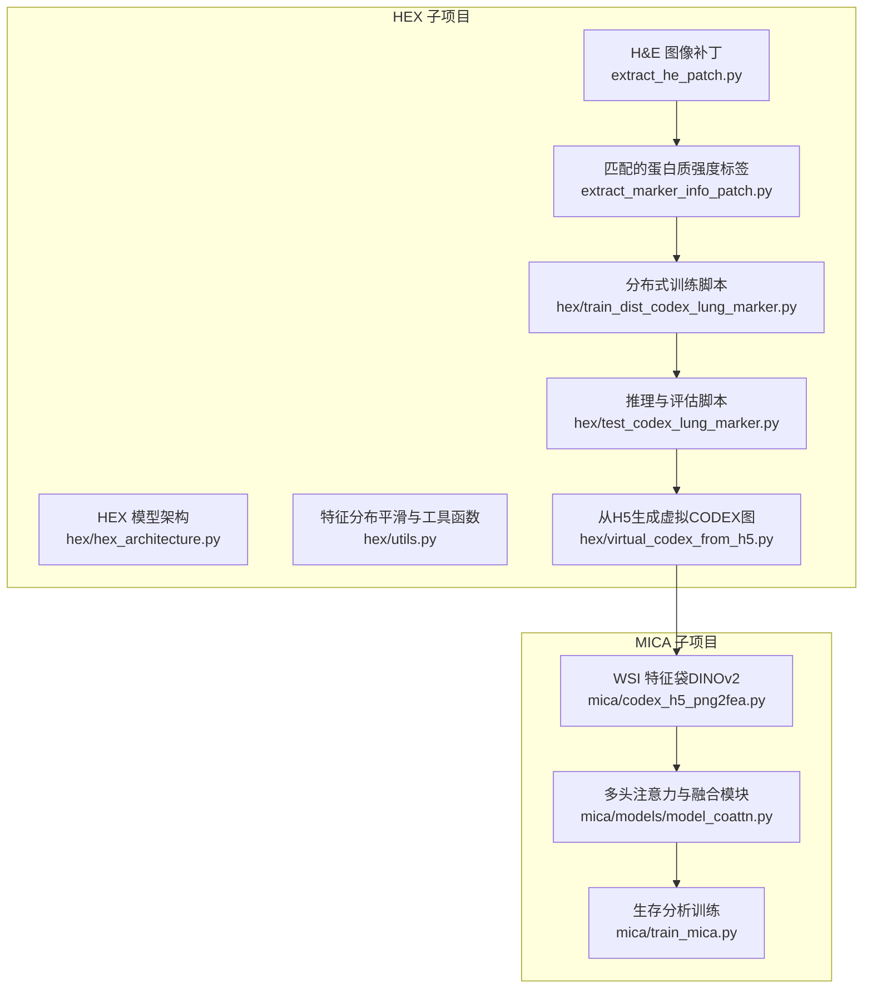
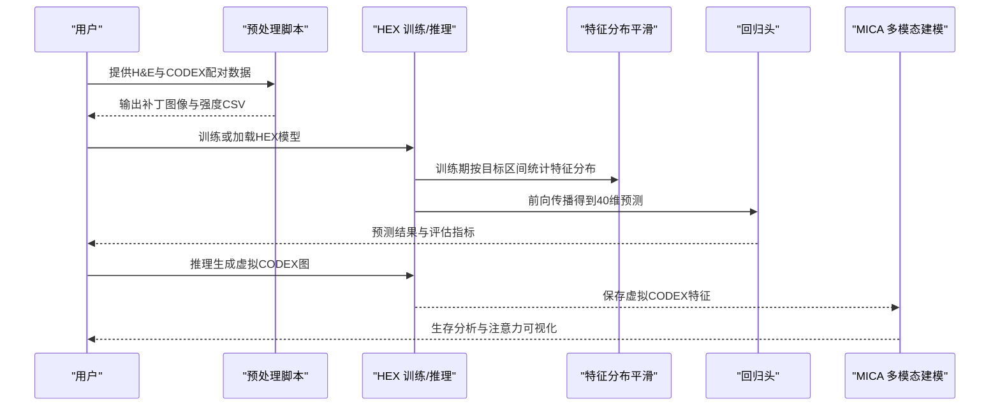
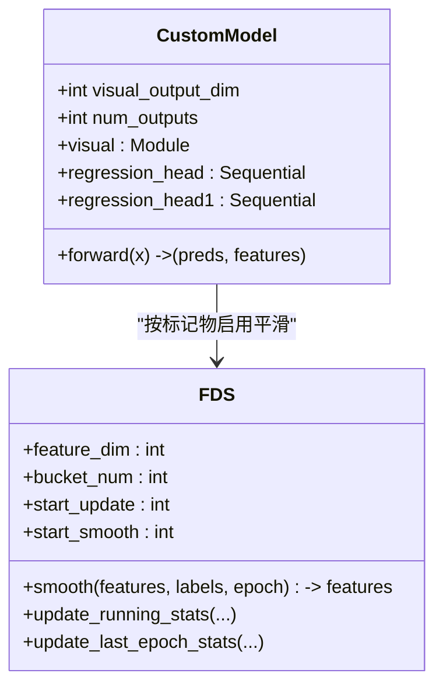
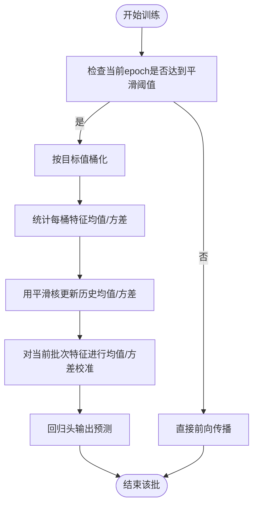
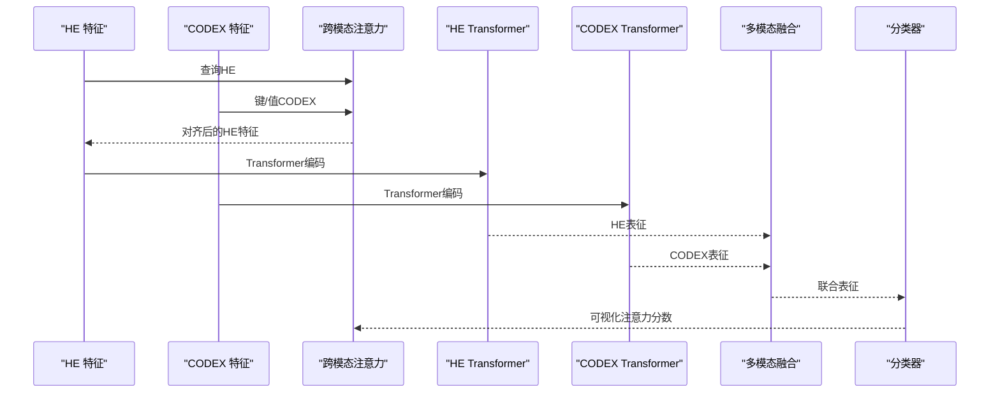
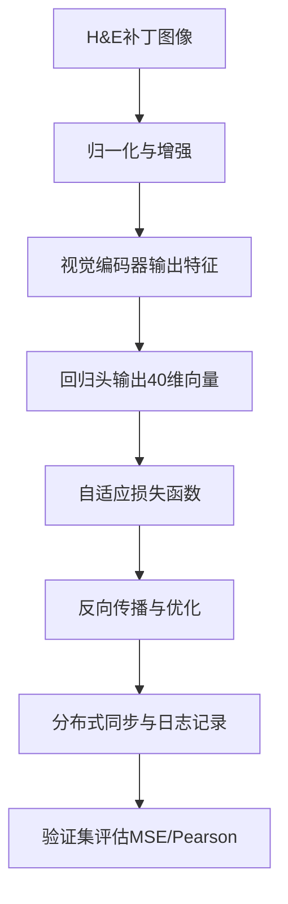
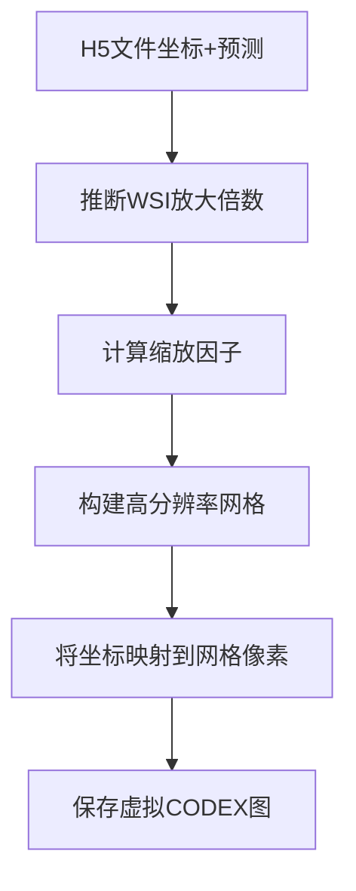
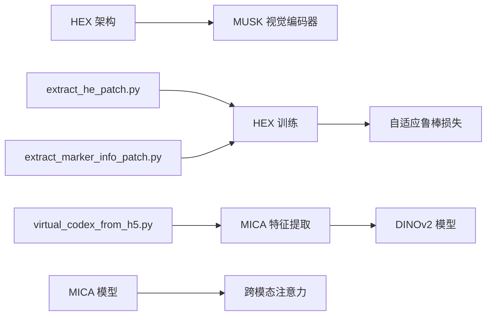

# 技术原理

<cite>
**本文引用的文件**
- [README.md](file://README.md)
- [hex/hex_architecture.py](file://hex/hex_architecture.py)
- [hex/utils.py](file://hex/utils.py)
- [hex/train_dist_codex_lung_marker.py](file://hex/train_dist_codex_lung_marker.py)
- [hex/test_codex_lung_marker.py](file://hex/test_codex_lung_marker.py)
- [hex/virtual_codex_from_h5.py](file://hex/virtual_codex_from_h5.py)
- [mica/models/model_coattn.py](file://mica/models/model_coattn.py)
- [mica/codex_h5_png2fea.py](file://mica/codex_h5_png2fea.py)
- [mica/train_mica.py](file://mica/train_mica.py)
- [extract_he_patch.py](file://extract_he_patch.py)
- [extract_marker_info_patch.py](file://extract_marker_info_patch.py)
</cite>

## 目录
1. [引言](#引言)
2. [项目结构](#项目结构)
3. [核心组件](#核心组件)
4. [架构总览](#架构总览)
5. [详细组件分析](#详细组件分析)
6. [依赖关系分析](#依赖关系分析)
7. [性能考量](#性能考量)
8. [故障排查指南](#故障排查指南)
9. [结论](#结论)
10. [附录](#附录)

## 引言
本技术原理文档面向HEX（H&E to protein expression）项目，系统阐述AI驱动的虚拟空间蛋白质组学技术的核心算法与理论基础，重点覆盖：
- 视觉Transformer架构与MUSK视觉编码器设计
- 特征分布平滑（FDS）技术与多标记物预测机制
- 将H&E图像转换为空间蛋白质组学数据的数学原理与计算流程
- 注意力机制在组织病理学分析中的应用
- 多模态融合（HEX + MICA）的建模思路与训练策略

HEX通过大规模配对数据训练，从H&E图像中学习到可泛化的表型映射，从而生成40种生物标志物的空间表达图谱，并在独立队列中显著提升预后与免疫治疗响应预测性能。

## 项目结构
HEX项目采用模块化分层组织：HEX子项目负责从H&E图像到蛋白质组学的回归预测；MICA子项目负责多模态生存分析，结合HEX生成的虚拟CODEX与WSI特征进行联合建模。整体数据流自上而下分为“预处理—训练—推理—评估”四个阶段。

图表来源
- [hex/train_dist_codex_lung_marker.py:42-400](file://hex/train_dist_codex_lung_marker.py#L42-L400)
- [hex/test_codex_lung_marker.py:75-189](file://hex/test_codex_lung_marker.py#L75-L189)
- [hex/virtual_codex_from_h5.py:1-68](file://hex/virtual_codex_from_h5.py#L1-L68)
- [mica/codex_h5_png2fea.py:1-173](file://mica/codex_h5_png2fea.py#L1-L173)
- [mica/models/model_coattn.py:12-124](file://mica/models/model_coattn.py#L12-L124)

章节来源
- [README.md:1-57](file://README.md#L1-L57)

## 核心组件
- 视觉编码器与回归头：基于MUSK视觉编码器提取图像特征，随后经两段全连接回归头输出40维蛋白质表达向量。
- 特征分布平滑（FDS）：按目标值区间统计特征均值/方差，利用卷积核平滑后的统计量对当前批次特征进行校准，缓解长尾分布与小样本偏差。
- 分布式训练与自适应损失：采用DDP分布式训练，冻结主干参数以稳定预训练权重，仅微调回归头；使用自适应鲁棒损失函数提升对异常值的鲁棒性。
- 注意力与多头融合：在MICA中引入跨模态注意力（Co-Attention），引导HE图像指导CODEX特征的Transformer编码，再进行多模态融合与生存预测。

章节来源
- [hex/hex_architecture.py:9-37](file://hex/hex_architecture.py#L9-L37)
- [hex/utils.py:116-327](file://hex/utils.py#L116-L327)
- [hex/train_dist_codex_lung_marker.py:179-226](file://hex/train_dist_codex_lung_marker.py#L179-L226)
- [mica/models/model_coattn.py:12-124](file://mica/models/model_coattn.py#L12-L124)

## 架构总览
HEX的端到端流程由“图像输入—视觉编码—特征平滑—回归预测”构成；MICA在此基础上引入多模态注意力与生存分析头，形成“HEX虚拟CODEX + WSI特征”的联合建模。

图表来源
- [hex/train_dist_codex_lung_marker.py:245-396](file://hex/train_dist_codex_lung_marker.py#L245-L396)
- [hex/test_codex_lung_marker.py:75-189](file://hex/test_codex_lung_marker.py#L75-L189)
- [mica/models/model_coattn.py:70-124](file://mica/models/model_coattn.py#L70-L124)

## 详细组件分析

### 视觉Transformer与MUSK编码器
- 编码器配置：使用MUSK大模型（patch16，输入尺寸384），加载预训练权重并冻结主干参数，仅微调回归头。
- 前向过程：关闭头部与归一化输出，返回中间特征表示，进入两段ReLU+Dropout的回归头，最终线性层输出40维蛋白质表达。
- 设计优势：MUSK具备强表型表征能力，适配H&E图像的组织形态学特征；通过冻结主干降低过拟合并加速收敛。

图表来源
- [hex/hex_architecture.py:9-37](file://hex/hex_architecture.py#L9-L37)
- [hex/utils.py:116-327](file://hex/utils.py#L116-L327)

章节来源
- [hex/hex_architecture.py:9-37](file://hex/hex_architecture.py#L9-L37)
- [hex/utils.py:32-81](file://hex/utils.py#L32-L81)

### 特征分布平滑（FDS）与多标记物预测
- 统计桶化：将连续目标值映射到固定数量的桶，按桶统计特征均值与方差，使用指数移动平均更新运行统计。
- 平滑核：支持高斯、三角、拉普拉斯核，卷积平滑历史均值/方差，缓解边界与稀疏区偏差。
- 训练期启用：在指定epoch之后，对每个标记物独立进行特征校准，避免早期过拟合；推理期关闭平滑。
- 多标记物策略：可选择对全部或部分标记物启用平滑，逐标记物独立更新与校准。

图表来源
- [hex/utils.py:116-327](file://hex/utils.py#L116-L327)
- [hex/train_dist_codex_lung_marker.py:245-318](file://hex/train_dist_codex_lung_marker.py#L245-L318)

章节来源
- [hex/utils.py:116-327](file://hex/utils.py#L116-L327)
- [hex/train_dist_codex_lung_marker.py:245-318](file://hex/train_dist_codex_lung_marker.py#L245-L318)

### 注意力机制在组织病理学中的应用
- 跨模态注意力（Co-Attention）：将HE图像引导的CODEX特征作为查询，引导HE特征作为键/值，实现双向语义对齐。
- Transformer编码：分别对HE与CODEX特征进行Transformer编码，结合注意力池化或全局平均池化聚合。
- 融合策略：支持拼接与双线性融合两种方式，最后经分类器输出生存风险或类别概率。
- 可解释性：提供注意力分数，便于定位与解读关键区域。

图表来源
- [mica/models/model_coattn.py:70-124](file://mica/models/model_coattn.py#L70-L124)

章节来源
- [mica/models/model_coattn.py:12-124](file://mica/models/model_coattn.py#L12-L124)

### 数据流与数学原理
- 输入预处理：H&E图像补丁经归一化（ImageNet Inception均值/方差）与随机增强后送入网络。
- 数学目标：对每个补丁输出40维蛋白质表达向量，损失采用自适应鲁棒损失函数，兼顾稳定性与精度。
- 分布式训练：DDP并行，梯度同步与学习率指数衰减；验证时收集全进程预测与标签，计算整体MSE与Pearson相关系数。
- 推理流程：加载权重，对补丁图像进行半精度推理，保存每补丁的预测与标签，计算各标记物的Pearson相关系数并排序。

图表来源
- [hex/train_dist_codex_lung_marker.py:145-226](file://hex/train_dist_codex_lung_marker.py#L145-L226)
- [hex/test_codex_lung_marker.py:110-172](file://hex/test_codex_lung_marker.py#L110-L172)

章节来源
- [hex/train_dist_codex_lung_marker.py:145-226](file://hex/train_dist_codex_lung_marker.py#L145-L226)
- [hex/test_codex_lung_marker.py:110-172](file://hex/test_codex_lung_marker.py#L110-L172)

### 从H5生成虚拟CODEX图
- 输入：HEX对WSI坐标点的预测结果（H5文件），包含坐标与对应40通道的蛋白质表达向量。
- 流程：根据WSI的放大倍数推断缩放因子，将坐标映射到目标分辨率网格，填充每个像素位置的表达向量。
- 输出：每个WSI对应的二维虚拟CODEX图（高度×宽度×40通道），用于后续MICA的特征提取。

图表来源
- [hex/virtual_codex_from_h5.py:10-68](file://hex/virtual_codex_from_h5.py#L10-L68)

章节来源
- [hex/virtual_codex_from_h5.py:10-68](file://hex/virtual_codex_from_h5.py#L10-L68)

## 依赖关系分析
- HEX依赖MUSK视觉编码器与timm创建模型接口，使用Robust Loss进行回归训练。
- MICA依赖DINOv2提取CODEX通道特征，构建跨模态注意力与多模态融合模块。
- 预处理脚本依赖openslide与palom读取WSI与OME数据，生成补丁与强度统计。

图表来源
- [hex/hex_architecture.py:1-7](file://hex/hex_architecture.py#L1-L7)
- [hex/train_dist_codex_lung_marker.py:216-226](file://hex/train_dist_codex_lung_marker.py#L216-L226)
- [mica/codex_h5_png2fea.py:127-131](file://mica/codex_h5_png2fea.py#L127-L131)
- [mica/models/model_coattn.py:12-124](file://mica/models/model_coattn.py#L12-L124)
- [extract_he_patch.py:1-78](file://extract_he_patch.py#L1-L78)
- [extract_marker_info_patch.py:1-74](file://extract_marker_info_patch.py#L1-L74)
- [hex/virtual_codex_from_h5.py:1-68](file://hex/virtual_codex_from_h5.py#L1-L68)

章节来源
- [hex/hex_architecture.py:1-7](file://hex/hex_architecture.py#L1-L7)
- [mica/codex_h5_png2fea.py:127-131](file://mica/codex_h5_png2fea.py#L127-L131)
- [mica/models/model_coattn.py:12-124](file://mica/models/model_coattn.py#L12-L124)

## 性能考量
- 计算效率：使用混合精度（autocast）与GradScaler减少显存占用；DDP并行与分布式采样提升吞吐。
- 稳健性：自适应鲁棒损失对异常值不敏感；FDS平滑缓解长尾与小样本偏差。
- 可扩展性：模块化设计（HEX/MICA分离）、分布式训练与多进程预处理，便于扩展至更大规模数据集。
- 可解释性：注意力可视化与特征分布统计，辅助生物学解读。

## 故障排查指南
- 分布式初始化失败：确认NCCL环境变量与GPU可见性，检查MASTER_PORT与LOCAL_RANK设置。
- 数据加载错误：检查CSV路径、图像路径与列名一致性；确保补丁目录存在且命名规范。
- 冻结参数问题：确认仅微调回归头参数，主干参数需requires_grad=False。
- 验证指标异常：检查Pearson相关系数计算是否包含NaN，必要时过滤无效样本。
- 预处理缺失：确认已执行H&E补丁提取、CODEX强度统计与虚拟CODEX生成。

章节来源
- [hex/train_dist_codex_lung_marker.py:28-39](file://hex/train_dist_codex_lung_marker.py#L28-L39)
- [hex/test_codex_lung_marker.py:75-106](file://hex/test_codex_lung_marker.py#L75-L106)
- [mica/train_mica.py:45-76](file://mica/train_mica.py#L45-L76)

## 结论
HEX通过MUSK视觉编码器与FDS特征分布平滑，实现了从H&E图像到空间蛋白质组学的高精度回归预测；MICA进一步将HEX生成的虚拟CODEX与WSI特征进行多模态融合与生存分析，形成可解释、可推广的临床辅助工具。该框架在lung癌队列中显著提升了预后与免疫治疗响应预测性能，为精准医学提供了低成本、可扩展的解决方案。

## 附录
- 关键术语
  - MUSK：多尺度视觉Transformer，用于组织形态学特征提取
  - FDS：特征分布平滑，按目标值区间统计并校准特征分布
  - Co-Attention：跨模态注意力，引导不同模态间的语义对齐
  - DINOv2：自监督视觉Transformer，用于特征提取
  - WSI：全切片数字成像，包含组织的高分辨率图像
  - CODEX：空间蛋白质组学平台，提供多通道蛋白表达图谱
  - H&E：常规组织染色，常用于组织形态学诊断