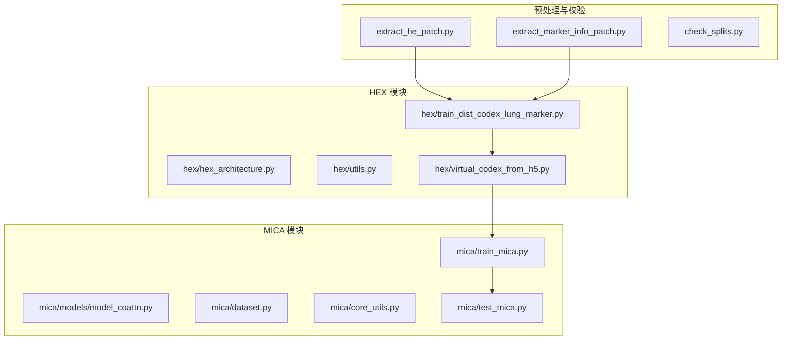
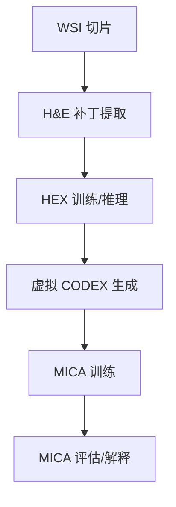
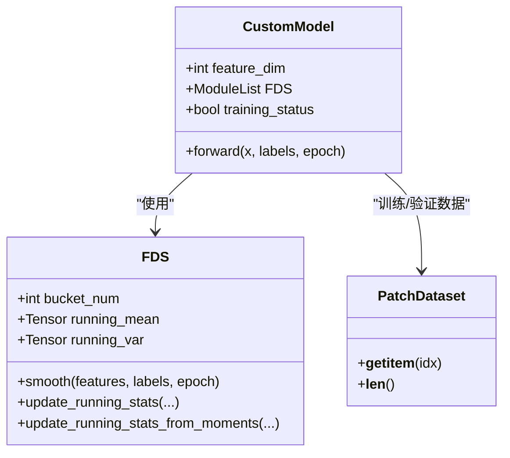
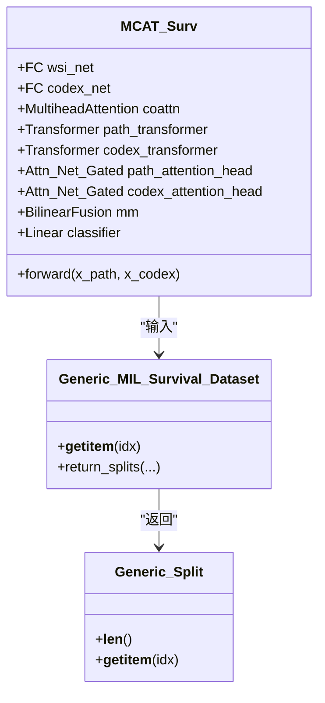
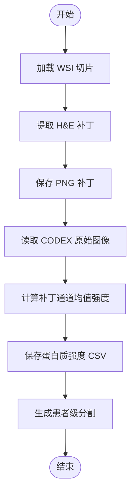
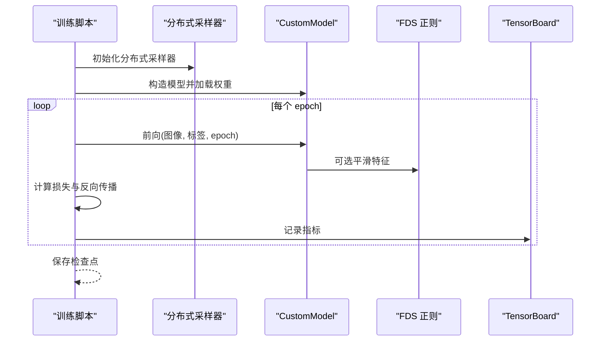
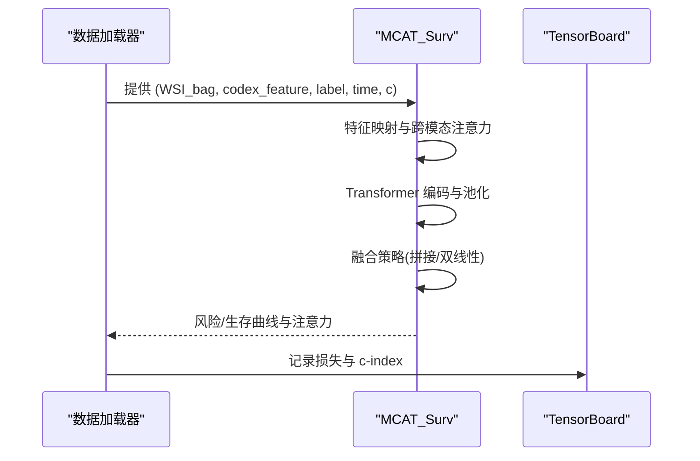
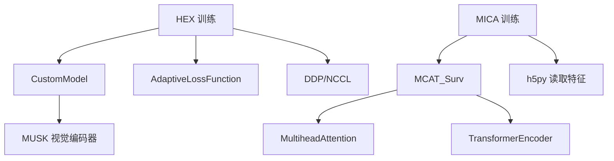

# 系统架构

<cite>
**本文档引用的文件**
- [README.md](file://README.md)
- [main.py](file://main.py)
- [hex/hex_architecture.py](file://hex/hex_architecture.py)
- [hex/utils.py](file://hex/utils.py)
- [hex/train_dist_codex_lung_marker.py](file://hex/train_dist_codex_lung_marker.py)
- [hex/virtual_codex_from_h5.py](file://hex/virtual_codex_from_h5.py)
- [mica/models/model_coattn.py](file://mica/models/model_coattn.py)
- [mica/dataset.py](file://mica/dataset.py)
- [mica/core_utils.py](file://mica/core_utils.py)
- [mica/train_mica.py](file://mica/train_mica.py)
- [mica/test_mica.py](file://mica/test_mica.py)
- [extract_he_patch.py](file://extract_he_patch.py)
- [extract_marker_info_patch.py](file://extract_marker_info_patch.py)
- [check_splits.py](file://check_splits.py)
</cite>

## 目录
1. [简介](#简介)
2. [项目结构](#项目结构)
3. [核心组件](#核心组件)
4. [架构总览](#架构总览)
5. [详细组件分析](#详细组件分析)
6. [依赖关系分析](#依赖关系分析)
7. [性能考量](#性能考量)
8. [故障排查指南](#故障排查指南)
9. [结论](#结论)
10. [附录](#附录)

## 简介
本项目面向“从组织学图像生成虚拟空间蛋白组”的任务，构建了两阶段的多模态学习系统：
- HEX 模块：基于视觉编码器与回归头，从 H&E 图像预测 40 个生物标志物表达强度，支持分布式训练与特征平滑（FDS）正则化。
- MICA 模块：基于多模态注意力（Co-Attention）与 Transformer 的多实例学习（MIL），融合 H&E 特征与由 HEX 生成的虚拟 CODEX 特征，进行生存分析建模。

系统通过预处理脚本完成数据准备，再以 HEX 预测虚拟 CODEX，随后在 MICA 中进行多模态建模与评估。

## 项目结构
项目采用按功能域划分的目录结构，HEX 与 MICA 各自包含独立的数据集、模型、训练与测试脚本，并辅以预处理工具与分割校验脚本。

图表来源
- [hex/train_dist_codex_lung_marker.py:1-400](file://hex/train_dist_codex_lung_marker.py#L1-L400)
- [hex/virtual_codex_from_h5.py:1-68](file://hex/virtual_codex_from_h5.py#L1-L68)
- [mica/train_mica.py:1-238](file://mica/train_mica.py#L1-L238)
- [mica/test_mica.py:1-324](file://mica/test_mica.py#L1-L324)

章节来源
- [README.md:1-57](file://README.md#L1-L57)
- [main.py:1-7](file://main.py#L1-L7)

## 核心组件
- HEX 视觉回归模型：基于视觉编码器提取 H&E 图像特征，经回归头输出 40 个生物标志物的表达预测。
- 分布式训练框架：使用 NCCL 初始化进程组，结合 DDP 进行多 GPU 训练，支持自动混合精度与梯度累积。
- 特征平滑正则（FDS）：按标签区间统计特征均值与方差，对特征分布进行平滑，提升回归稳定性。
- MICA 多模态模型：H&E 与虚拟 CODEX 特征分别经 FC 映射与多头注意力引导的 Transformer 编码，再进行融合与分类/生存建模。
- 数据加载与分割：支持 CLAM 风格的患者级分割，提供严格校验脚本确保训练/验证不重叠且覆盖完整。

章节来源
- [hex/hex_architecture.py:1-37](file://hex/hex_architecture.py#L1-L37)
- [hex/utils.py:32-81](file://hex/utils.py#L32-L81)
- [hex/train_dist_codex_lung_marker.py:28-396](file://hex/train_dist_codex_lung_marker.py#L28-L396)
- [mica/models/model_coattn.py:12-124](file://mica/models/model_coattn.py#L12-L124)
- [mica/dataset.py:17-250](file://mica/dataset.py#L17-L250)
- [check_splits.py:72-148](file://check_splits.py#L72-L148)

## 架构总览
系统分为三层：
- 数据层：WSI 切片、H&E 图像补丁、CODEX 蛋白强度信息、患者级分割。
- 模型层：HEX（视觉回归）、MICA（多模态 MIL）。
- 应用层：训练、评估、可视化（可选）。

图表来源
- [extract_he_patch.py:1-78](file://extract_he_patch.py#L1-L78)
- [hex/train_dist_codex_lung_marker.py:1-400](file://hex/train_dist_codex_lung_marker.py#L1-L400)
- [hex/virtual_codex_from_h5.py:1-68](file://hex/virtual_codex_from_h5.py#L1-L68)
- [mica/train_mica.py:1-238](file://mica/train_mica.py#L1-L238)
- [mica/test_mica.py:1-324](file://mica/test_mica.py#L1-L324)

## 详细组件分析

### HEX 模块
- 模型结构
  - 视觉编码器：基于 MUSK 大模型，禁用头部与归一化，输出中间特征。
  - 回归头：两段全连接+ReLU+Dropout，最后线性层输出 40 维生物标志物预测。
- 训练流程
  - 分布式初始化与设备设置，构造训练/验证数据集与采样器。
  - 使用 AdaptiveLossFunction 进行鲁棒回归，AMP 半精度训练，DDP 同步梯度。
  - FDS 在特定 epoch 启动，按标签区间统计特征分布并进行平滑。
  - 每轮评估收集全局预测与标签，计算 MSE 与 Pearson R 并记录 TensorBoard。
- 关键接口
  - PatchDataset：读取补丁图像与对应 CSV 标签，返回张量与路径。
  - FDS：按桶统计运行均值/方差，提供平滑函数。

图表来源
- [hex/hex_architecture.py:9-37](file://hex/hex_architecture.py#L9-L37)
- [hex/utils.py:32-81](file://hex/utils.py#L32-L81)
- [hex/utils.py:116-326](file://hex/utils.py#L116-L326)
- [hex/utils.py:82-97](file://hex/utils.py#L82-L97)

章节来源
- [hex/hex_architecture.py:1-37](file://hex/hex_architecture.py#L1-L37)
- [hex/utils.py:32-81](file://hex/utils.py#L32-L81)
- [hex/utils.py:116-326](file://hex/utils.py#L116-L326)
- [hex/utils.py:82-97](file://hex/utils.py#L82-L97)
- [hex/train_dist_codex_lung_marker.py:28-396](file://hex/train_dist_codex_lung_marker.py#L28-L396)

### MICA 模块
- 模型结构（MCAT_Surv）
  - H&E 与 CODEX 分别经 FC 映射，再通过多头注意力进行跨模态引导。
  - Transformer 编码后采用全局平均池化或注意力池化，融合策略支持拼接或双线性融合。
  - 分类器输出风险/生存曲线，支持注意力权重输出用于解释。
- 数据加载
  - 支持 CLAM 风格的患者级分割，保证训练/验证不共享同一患者。
  - 从 h5 文件读取虚拟 CODEX 特征，与 WSI bag 特征配对。
- 训练与评估
  - 使用 NLL 生存损失，支持梯度累积与早停（可配置）。
  - 评估时计算 c-index，并可保存注意力权重用于解释。

图表来源
- [mica/models/model_coattn.py:12-124](file://mica/models/model_coattn.py#L12-L124)
- [mica/dataset.py:193-250](file://mica/dataset.py#L193-L250)
- [mica/dataset.py:230-250](file://mica/dataset.py#L230-L250)

章节来源
- [mica/models/model_coattn.py:12-124](file://mica/models/model_coattn.py#L12-L124)
- [mica/dataset.py:17-250](file://mica/dataset.py#L17-L250)
- [mica/train_mica.py:1-238](file://mica/train_mica.py#L1-L238)
- [mica/test_mica.py:1-324](file://mica/test_mica.py#L1-L324)

### 数据流与处理流程

#### 预处理流程
- H&E 补丁提取：根据坐标文件批量提取固定尺寸补丁，保存为 PNG。
- 蛋白强度提取：读取 CODEX 原始图像，计算每个补丁通道均值强度，输出 CSV。
- 分割生成：生成患者级训练/验证集合，确保不重叠并覆盖完整。

图表来源
- [extract_he_patch.py:9-78](file://extract_he_patch.py#L9-L78)
- [extract_marker_info_patch.py:21-74](file://extract_marker_info_patch.py#L21-L74)
- [check_splits.py:72-148](file://check_splits.py#L72-L148)

章节来源
- [extract_he_patch.py:1-78](file://extract_he_patch.py#L1-L78)
- [extract_marker_info_patch.py:1-74](file://extract_marker_info_patch.py#L1-L74)
- [check_splits.py:1-159](file://check_splits.py#L1-L159)

#### 推理与训练流程（HEX）
- 训练：分布式初始化，构造数据集与采样器，AMP 训练，DDP 同步，FDS 平滑，评估指标记录。
- 推理：加载训练好的模型权重，对 H&E 补丁进行前向推理，输出生物标志物预测。

图表来源
- [hex/train_dist_codex_lung_marker.py:28-396](file://hex/train_dist_codex_lung_marker.py#L28-L396)
- [hex/utils.py:32-81](file://hex/utils.py#L32-L81)
- [hex/utils.py:116-326](file://hex/utils.py#L116-L326)

章节来源
- [hex/train_dist_codex_lung_marker.py:1-400](file://hex/train_dist_codex_lung_marker.py#L1-L400)
- [hex/utils.py:32-81](file://hex/utils.py#L32-L81)

#### 多模态融合与生存建模（MICA）
- 输入：H&E bag 特征与虚拟 CODEX 特征。
- 流程：特征映射→跨模态注意力→Transformer 编码→池化→融合→分类/生存建模。
- 输出：c-index、风险评分、注意力权重（可选）。

图表来源
- [mica/models/model_coattn.py:70-124](file://mica/models/model_coattn.py#L70-L124)
- [mica/dataset.py:230-250](file://mica/dataset.py#L230-L250)
- [mica/core_utils.py:85-193](file://mica/core_utils.py#L85-L193)

章节来源
- [mica/models/model_coattn.py:12-124](file://mica/models/model_coattn.py#L12-L124)
- [mica/dataset.py:193-250](file://mica/dataset.py#L193-L250)
- [mica/core_utils.py:15-82](file://mica/core_utils.py#L15-L82)

## 依赖关系分析
- HEX 依赖
  - 视觉编码器（MUSK）与 timm 创建模型。
  - robust_loss_pytorch 自适应损失函数。
  - 分布式训练依赖 torch.distributed 与 NCCL。
- MICA 依赖
  - 多头注意力与 Transformer 编码器。
  - 生存分析指标（c-index）与损失函数。
  - 数据加载依赖 h5py 读取虚拟 CODEX 特征。

图表来源
- [hex/train_dist_codex_lung_marker.py:215-226](file://hex/train_dist_codex_lung_marker.py#L215-L226)
- [hex/hex_architecture.py:12-15](file://hex/hex_architecture.py#L12-L15)
- [mica/models/model_coattn.py:459-615](file://mica/models/model_coattn.py#L459-L615)
- [mica/models/model_coattn.py:37-47](file://mica/models/model_coattn.py#L37-L47)

章节来源
- [hex/train_dist_codex_lung_marker.py:1-400](file://hex/train_dist_codex_lung_marker.py#L1-L400)
- [mica/models/model_coattn.py:1-714](file://mica/models/model_coattn.py#L1-L714)

## 性能考量
- 分布式训练
  - 使用 DDP 与 NCCL，按世界大小归约梯度与指标，减少单卡瓶颈。
  - AMP 半精度训练降低显存占用，加速收敛。
- 数据加载
  - 使用 DistributedSampler 实现样本分发，避免重复与偏移。
  - 多进程读取与并行处理（如补丁提取）提升吞吐。
- 模型优化
  - FDS 对特征分布进行平滑，缓解长尾与异常值影响。
  - 可冻结部分参数，仅微调回归头，加速收敛。
- 注意力与池化
  - 可选择注意力池化或全局平均池化，平衡解释性与性能。

[本节为通用性能讨论，无需具体文件来源]

## 故障排查指南
- 分割错误
  - 使用校验脚本检查训练/验证是否重叠、是否覆盖全部患者。
- 分布式初始化失败
  - 确认 MASTER_PORT 设置、GPU 数量与 NCCL 环境变量。
- 内存不足
  - 减小 batch size 或启用 AMP；检查 DistributedSampler 是否正确设置。
- 数据格式问题
  - 确认 H&E PNG 与 CSV、虚拟 CODEX h5 文件路径一致，坐标与尺寸匹配。

章节来源
- [check_splits.py:72-148](file://check_splits.py#L72-L148)
- [hex/train_dist_codex_lung_marker.py:28-39](file://hex/train_dist_codex_lung_marker.py#L28-L39)
- [mica/dataset.py:230-250](file://mica/dataset.py#L230-L250)

## 结论
本系统通过 HEX 与 MICA 的协同，实现了从 H&E 图像到虚拟 CODEX 的生成与多模态生存建模，具备良好的可扩展性与可维护性。HEX 的分布式训练与 FDS 正则提升了回归稳定性，MICA 的多头注意力与融合策略增强了跨模态建模能力。建议在实际部署中进一步完善数据管线监控与自动化校验，以保障大规模数据处理的可靠性。

[本节为总结性内容，无需具体文件来源]

## 附录
- 快速开始
  - 安装依赖后，先执行预处理脚本生成 H&E 补丁与蛋白质强度 CSV，再生成患者级分割。
  - 使用分布式命令启动 HEX 训练，随后使用虚拟 CODEX 特征启动 MICA 训练与评估。
- 参考命令
  - HEX 训练：torchrun --nnodes=1 --nproc-per-node=8 ./hex/train_dist_codex_lung_marker.py
  - MICA 训练：python mica/train_mica.py --mode coattn --base_path your_path ...
  - MICA 评估：python mica/test_mica.py ...

章节来源
- [README.md:26-44](file://README.md#L26-L44)
- [hex/train_dist_codex_lung_marker.py:32-34](file://hex/train_dist_codex_lung_marker.py#L32-L34)
- [mica/train_mica.py:91-136](file://mica/train_mica.py#L91-L136)
- [mica/test_mica.py:175-229](file://mica/test_mica.py#L175-L229)