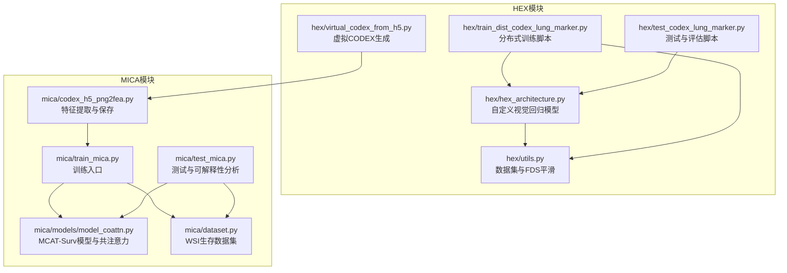
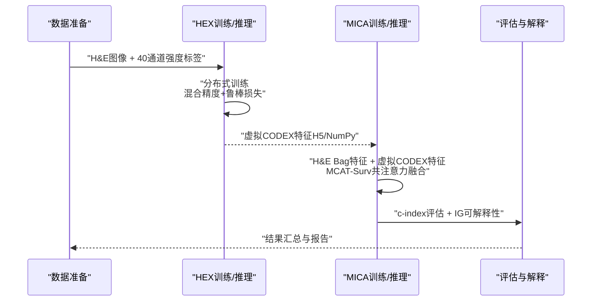
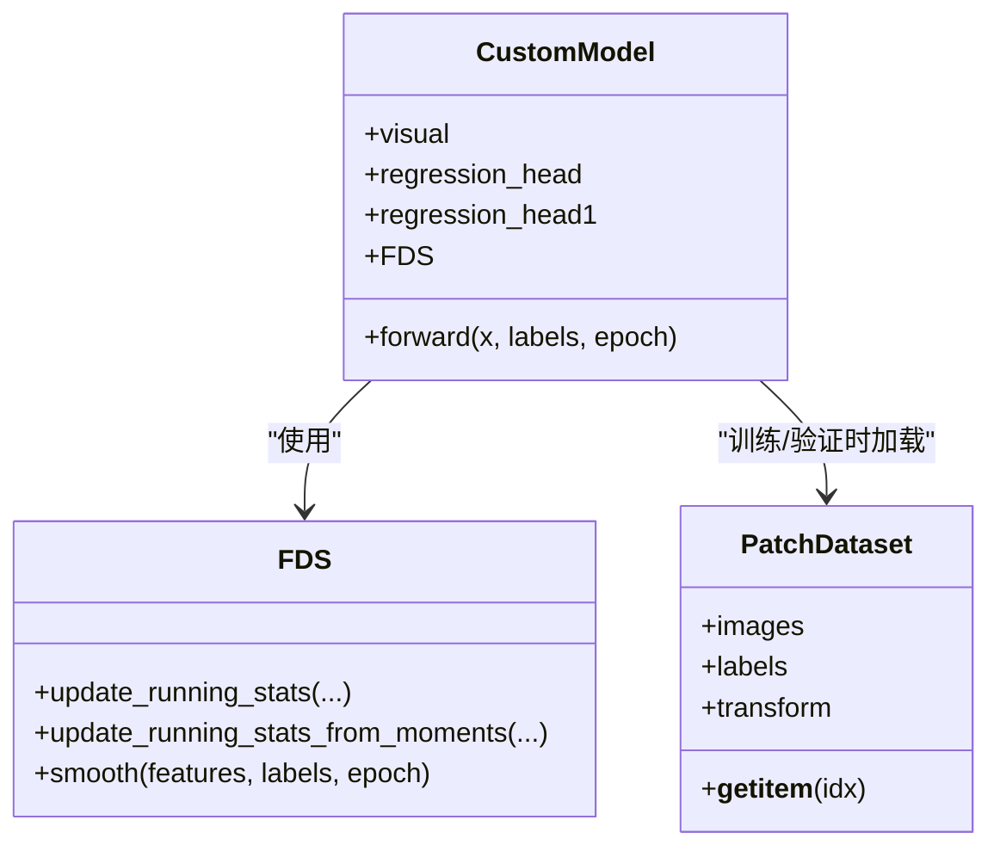
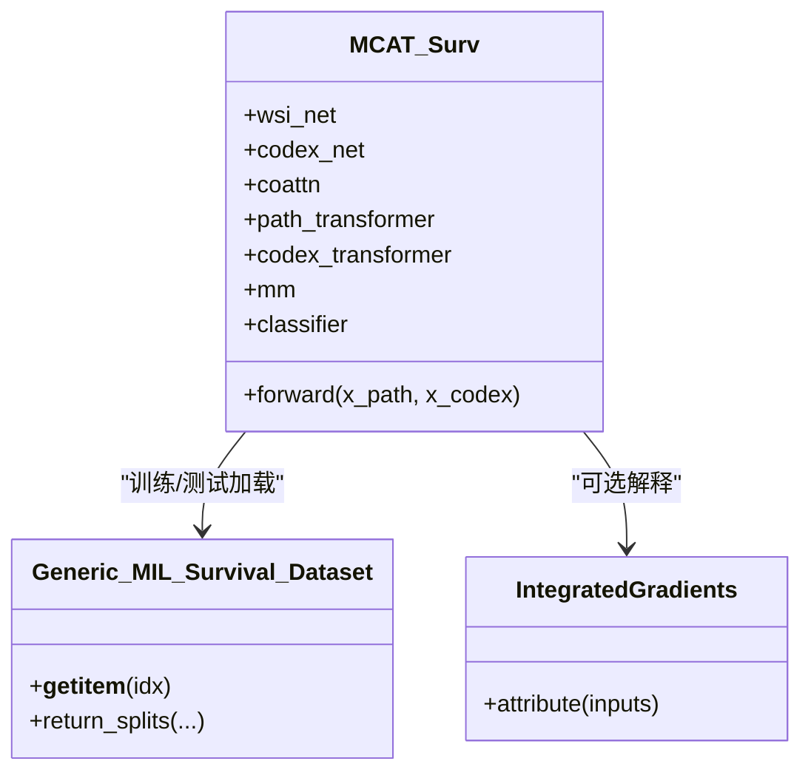
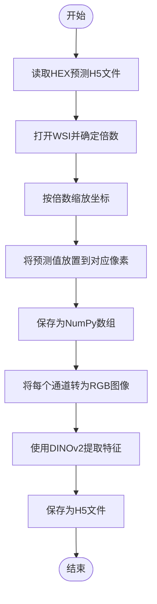
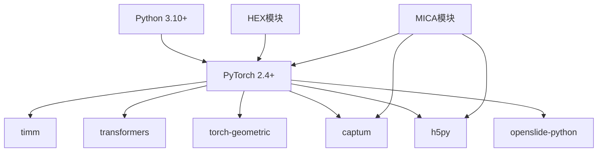

# 项目概述

<cite>
**本文档引用的文件**
- [README.md](file://README.md)
- [pyproject.toml](file://pyproject.toml)
- [main.py](file://main.py)
- [hex/hex_architecture.py](file://hex/hex_architecture.py)
- [hex/utils.py](file://hex/utils.py)
- [hex/train_dist_codex_lung_marker.py](file://hex/train_dist_codex_lung_marker.py)
- [hex/test_codex_lung_marker.py](file://hex/test_codex_lung_marker.py)
- [hex/virtual_codex_from_h5.py](file://hex/virtual_codex_from_h5.py)
- [mica/models/model_coattn.py](file://mica/models/model_coattn.py)
- [mica/dataset.py](file://mica/dataset.py)
- [mica/train_mica.py](file://mica/train_mica.py)
- [mica/test_mica.py](file://mica/test_mica.py)
- [mica/codex_h5_png2fea.py](file://mica/codex_h5_png2fea.py)
</cite>

## 目录
1. [简介](#简介)
2. [项目结构](#项目结构)
3. [核心组件](#核心组件)
4. [架构总览](#架构总览)
5. [详细组件分析](#详细组件分析)
6. [依赖关系分析](#依赖关系分析)
7. [性能考量](#性能考量)
8. [故障排除指南](#故障排除指南)
9. [结论](#结论)
10. [附录](#附录)

## 简介
HEX是一个AI驱动的空间蛋白质组学平台，旨在从标准的H&E染色组织切片中预测40种免疫组织化学（IHC）标记物的空间表达谱。该项目的核心价值在于：
- 降低空间蛋白质组学成本：通过AI从常规H&E图像生成虚拟CODEX图像，避免昂贵的多重免疫荧光或质谱检测
- 提升可解释性：结合注意力机制和集成梯度，提供可视化的生物标志物表达模式
- 多模态融合：整合H&E形态学信息与AI推导的蛋白质表达，增强预后预测和免疫治疗反应评估
- 规模化应用：支持大规模数据集训练与验证，具备良好的扩展性

该平台在肺癌等癌症研究中已证明能显著提升预后预测准确性和免疫治疗响应预测效果，并揭示具有治疗意义的肿瘤-免疫微环境空间组织特征。

## 项目结构
项目采用模块化设计，分为两个主要模块：
- HEX模块：负责从H&E图像到蛋白质表达的回归预测，训练和测试流程完整
- MICA模块：基于多实例学习（MIL）框架，融合H&E与虚拟CODEX特征进行生存分析

图表来源
- [hex/hex_architecture.py:9-37](file://hex/hex_architecture.py#L9-L37)
- [hex/train_dist_codex_lung_marker.py:160-170](file://hex/train_dist_codex_lung_marker.py#L160-L170)
- [hex/test_codex_lung_marker.py:62-74](file://hex/test_codex_lung_marker.py#L62-L74)
- [hex/utils.py:32-81](file://hex/utils.py#L32-L81)
- [hex/virtual_codex_from_h5.py:37-68](file://hex/virtual_codex_from_h5.py#L37-L68)
- [mica/models/model_coattn.py:12-124](file://mica/models/model_coattn.py#L12-L124)
- [mica/dataset.py:193-227](file://mica/dataset.py#L193-L227)
- [mica/train_mica.py:28-88](file://mica/train_mica.py#L28-L88)
- [mica/test_mica.py:79-173](file://mica/test_mica.py#L79-L173)
- [mica/codex_h5_png2fea.py:42-163](file://mica/codex_h5_png2fea.py#L42-L163)

章节来源
- [README.md:1-57](file://README.md#L1-L57)
- [pyproject.toml:1-48](file://pyproject.toml#L1-L48)

## 核心组件
- 自定义视觉回归模型（CustomModel）
  - 基于MUSK视觉编码器，输出128维特征向量
  - 两层回归头：先降维至128，再映射到40个IHC标记物的表达值
  - 支持FDS特征分布平滑，提升小样本稳定性
- 数据集与采样（PatchDataset）
  - 加载H&E图像与对应40通道强度标签
  - 支持分布式采样与混合精度训练
- 训练与评估（HEX）
  - 分布式数据并行（DDP），混合精度与梯度累积
  - 使用鲁棒损失函数，记录每个标记物的MSE与Pearson相关系数
- 可解释性（MICA）
  - MCAT-Surv模型，H&E与虚拟CODEX的双向注意力融合
  - 集成梯度（Integrated Gradients）可视化空间重要区域

章节来源
- [hex/hex_architecture.py:9-37](file://hex/hex_architecture.py#L9-L37)
- [hex/utils.py:82-98](file://hex/utils.py#L82-L98)
- [hex/train_dist_codex_lung_marker.py:160-170](file://hex/train_dist_codex_lung_marker.py#L160-L170)
- [mica/models/model_coattn.py:12-124](file://mica/models/model_coattn.py#L12-L124)
- [mica/test_mica.py:54-77](file://mica/test_mica.py#L54-L77)

## 架构总览
HEX的整体工作流由三个阶段组成：
1) 数据准备：使用Palom配准H&E与CODEX，提取每张切片的IHC强度；构建患者级分割
2) HEX训练与推理：训练自定义视觉回归模型，预测40个IHC标记物表达
3) MICA多模态融合：将HEX预测的虚拟CODEX转换为深度特征，与H&E Bag特征融合进行生存分析

图表来源
- [README.md:26-44](file://README.md#L26-L44)
- [hex/train_dist_codex_lung_marker.py:42-89](file://hex/train_dist_codex_lung_marker.py#L42-L89)
- [hex/test_codex_lung_marker.py:75-107](file://hex/test_codex_lung_marker.py#L75-L107)
- [mica/codex_h5_png2fea.py:42-61](file://mica/codex_h5_png2fea.py#L42-L61)
- [mica/models/model_coattn.py:70-124](file://mica/models/model_coattn.py#L70-L124)
- [mica/test_mica.py:123-157](file://mica/test_mica.py#L123-L157)

## 详细组件分析

### HEX模块：从H&E到蛋白质表达的回归预测
- 模型架构
  - 视觉编码器：基于MUSK大模型，输出128维特征
  - 回归头：两层全连接网络，最终输出40维表达向量
  - 特征分布平滑（FDS）：按表达强度分桶统计，对特征进行校准平滑
- 训练策略
  - 分布式数据并行（DDP），混合精度训练
  - 鲁棒自适应损失函数，减少异常值影响
  - 记录每个标记物的MSE与Pearson相关系数，支持早停与检查点保存
- 推理与评估
  - 批量推理，保存每张切片的预测与真实值
  - 计算整体与逐标记物的Pearson相关系数，输出统计摘要

图表来源
- [hex/hex_architecture.py:9-37](file://hex/hex_architecture.py#L9-L37)
- [hex/utils.py:32-81](file://hex/utils.py#L32-L81)
- [hex/utils.py:116-327](file://hex/utils.py#L116-L327)

章节来源
- [hex/hex_architecture.py:9-37](file://hex/hex_architecture.py#L9-L37)
- [hex/utils.py:32-81](file://hex/utils.py#L32-L81)
- [hex/train_dist_codex_lung_marker.py:160-170](file://hex/train_dist_codex_lung_marker.py#L160-L170)
- [hex/test_codex_lung_marker.py:75-107](file://hex/test_codex_lung_marker.py#L75-L107)

### MICA模块：多模态生存分析与可解释性
- 模型设计（MCAT-Surv）
  - H&E与虚拟CODEX分别经FC映射后，通过双向注意力（共注意力）交互
  - Transformer编码器对Bag级别特征进行序列建模
  - 全局池化（GAP或注意力）后进行分类/生存风险预测
  - 支持拼接或双线性融合策略
- 数据集与加载
  - 以滑行为单位（slide-level）构建生存数据集
  - 读取H&E Bag特征与虚拟CODEX特征（H5格式）
- 训练与测试
  - 5折交叉验证，记录每个fold的c-index
  - 测试阶段可选计算集成梯度，可视化关注区域

图表来源
- [mica/models/model_coattn.py:12-124](file://mica/models/model_coattn.py#L12-L124)
- [mica/dataset.py:193-227](file://mica/dataset.py#L193-L227)
- [mica/test_mica.py:54-77](file://mica/test_mica.py#L54-L77)

章节来源
- [mica/models/model_coattn.py:12-124](file://mica/models/model_coattn.py#L12-L124)
- [mica/dataset.py:193-227](file://mica/dataset.py#L193-L227)
- [mica/train_mica.py:28-88](file://mica/train_mica.py#L28-L88)
- [mica/test_mica.py:123-157](file://mica/test_mica.py#L123-L157)

### 数据处理与特征工程
- 虚拟CODEX生成
  - 将HEX对每个patch的预测结果重采样到WSI坐标系，生成二维表达图
  - 保存为NumPy数组，便于后续批处理
- 特征提取
  - 将每个通道转换为RGB图像，使用DINOv2提取深度特征
  - 保存为H5文件，供MICA训练使用
- WSI特征Bag化
  - 依据CLAM风格，将WSI切分为Bag并提取特征，形成统一的数据格式

图表来源
- [hex/virtual_codex_from_h5.py:37-68](file://hex/virtual_codex_from_h5.py#L37-L68)
- [mica/codex_h5_png2fea.py:42-61](file://mica/codex_h5_png2fea.py#L42-L61)
- [mica/codex_h5_png2fea.py:127-163](file://mica/codex_h5_png2fea.py#L127-L163)

章节来源
- [hex/virtual_codex_from_h5.py:37-68](file://hex/virtual_codex_from_h5.py#L37-L68)
- [mica/codex_h5_png2fea.py:42-61](file://mica/codex_h5_png2fea.py#L42-L61)
- [mica/codex_h5_png2fea.py:127-163](file://mica/codex_h5_png2fea.py#L127-L163)

## 依赖关系分析
- 运行时依赖
  - Python 3.10+，PyTorch 2.4+，CUDA 11.8 + cuDNN 9.1
  - 关键第三方库：timm、transformers、torch-geometric、captum、h5py、openslide-python等
- 模块间耦合
  - HEX与MICA通过中间产物（虚拟CODEX特征）耦合，解耦良好
  - MICA内部通过H5文件与数据集类解耦，便于扩展不同数据源

图表来源
- [pyproject.toml:7-41](file://pyproject.toml#L7-L41)

章节来源
- [pyproject.toml:1-48](file://pyproject.toml#L1-L48)

## 性能考量
- 训练效率
  - 使用DDP与混合精度，显著缩短收敛时间
  - 梯度累积与分布式采样提升吞吐量
- 推理速度
  - 半精度推理与批处理，适合大规模切片评估
- 稳健性
  - FDS特征分布平滑减少过拟合，尤其在小样本场景
  - 鲁棒损失函数降低异常值对回归的影响
- 可扩展性
  - 模块化设计便于替换编码器或融合策略
  - H5特征存储利于分布式训练与缓存

## 故障排除指南
- 分布式训练初始化失败
  - 检查NCCL后端与端口配置，确保所有进程可见
  - 确认LOCAL_RANK/RANK/WORLD_SIZE环境变量正确设置
- 数据路径错误
  - 确认H&E图像目录、CSV文件与分割文件路径一致
  - 检查虚拟CODEX生成脚本中的输入输出路径
- 内存不足
  - 减少batch size或启用梯度累积
  - 使用更小的图像尺寸或关闭不必要的数据增强
- 特征维度不匹配
  - 确保虚拟CODEX通道数与模型期望一致（40通道）
  - 检查DINOv2特征维度是否与模型配置匹配

章节来源
- [hex/train_dist_codex_lung_marker.py:28-39](file://hex/train_dist_codex_lung_marker.py#L28-L39)
- [hex/virtual_codex_from_h5.py:30-35](file://hex/virtual_codex_from_h5.py#L30-L35)
- [mica/codex_h5_png2fea.py:102-125](file://mica/codex_h5_png2fea.py#L102-L125)

## 结论
HEX项目通过AI从H&E图像中重建蛋白质表达，实现了低成本、高通量的空间蛋白质组学。其创新点包括：
- 可解释性AI：注意力可视化与集成梯度解释，帮助识别关键生物标志物表达模式
- 多模态数据融合：将形态学与分子特征结合，显著提升预后与免疫治疗响应预测
- 大规模数据分析能力：分布式训练与高效特征工程，支撑多中心、多队列研究

该平台为精准医学提供了强大的工具，既适合初学者快速上手，也为有经验的开发者提供了清晰的扩展接口与优化方向。

## 附录
- 生物学意义与临床应用
  - 揭示肿瘤-免疫微环境的空间组织，指导免疫治疗决策
  - 识别预后相关标志物组合，辅助个体化治疗方案制定
- 学术贡献
  - 在多个独立队列中验证模型泛化能力
  - 提供开源工具链，推动空间蛋白质组学标准化