# 项目简介

<cite>
**本文档引用的文件**
- [README.md](file://README.md)
- [hex/hex_architecture.py](file://hex/hex_architecture.py)
- [hex/utils.py](file://hex/utils.py)
- [hex/test_codex_lung_marker.py](file://hex/test_codex_lung_marker.py)
- [hex/train_dist_codex_lung_marker.py](file://hex/train_dist_codex_lung_marker.py)
- [mica/models/model_coattn.py](file://mica/models/model_coattn.py)
- [mica/dataset.py](file://mica/dataset.py)
- [mica/core_utils.py](file://mica/core_utils.py)
- [mica/train_mica.py](file://mica/train_mica.py)
- [mica/test_mica.py](file://mica/test_mica.py)
- [extract_he_patch.py](file://extract_he_patch.py)
- [extract_marker_info_patch.py](file://extract_marker_info_patch.py)
- [hex/virtual_codex_from_h5.py](file://hex/virtual_codex_from_h5.py)
</cite>

## 目录
1. [项目概述](#项目概述)
2. [核心技术理念](#核心技术理念)
3. [系统架构概览](#系统架构概览)
4. [核心组件详解](#核心组件详解)
5. [技术突破与创新](#技术突破与创新)
6. [应用场景与价值](#应用场景与价值)
7. [项目发展历程](#项目发展历程)
8. [学术贡献与意义](#学术贡献与意义)
9. [总结](#总结)

## 项目概述

HEX（H&E to protein expression）是一个革命性的AI驱动空间蛋白质组学平台，专门用于从标准的组织病理学切片中预测40种免疫组织化学标记物的表达。该项目由斯坦福大学的研究团队开发，旨在解决传统空间蛋白质组学技术面临的重大挑战：成本高昂、操作复杂、可扩展性差等问题。

### 核心目标
- **降低技术门槛**：将复杂的蛋白质组学检测转化为简单的H&E染色流程
- **提高诊断效率**：实现快速、准确的生物标志物检测
- **推动精准医疗**：为肿瘤患者提供个性化的治疗方案指导
- **促进生物标志物发现**：加速新药研发和治疗靶点识别

## 核心技术理念

### 空间蛋白质组学的革命性突破

传统的空间蛋白质组学技术需要昂贵的质谱仪和复杂的样本处理流程，而HEX通过深度学习技术实现了以下突破：

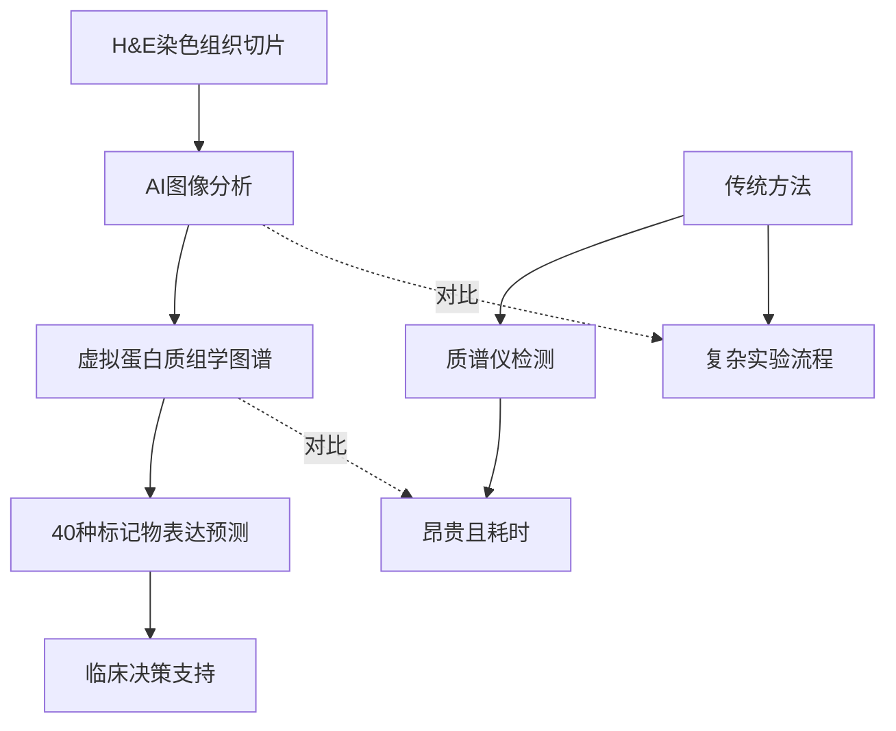

**图表来源**
- [hex/hex_architecture.py:9-37](file://hex/hex_architecture.py#L9-L37)
- [hex/test_codex_lung_marker.py:19-60](file://hex/test_codex_lung_marker.py#L19-L60)

### 多模态数据融合策略

HEX采用独特的多模态数据融合方法，将原始H&E图像与AI生成的虚拟空间蛋白质组学数据相结合：

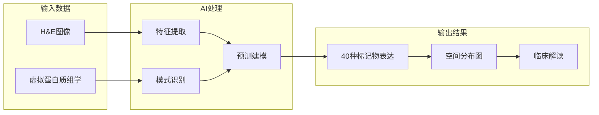

**图表来源**
- [mica/models/model_coattn.py:12-124](file://mica/models/model_coattn.py#L12-L124)

## 系统架构概览

### 整体架构设计

HEX系统采用模块化设计，包含三个主要层次：

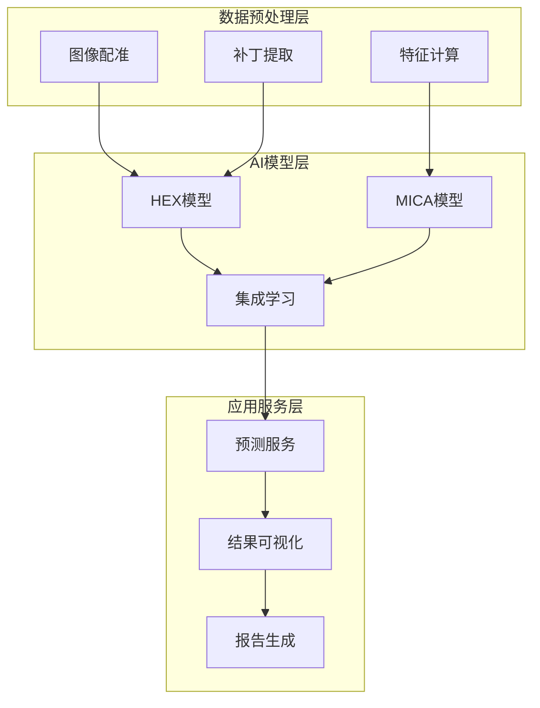

**图表来源**
- [hex/train_dist_codex_lung_marker.py:42-400](file://hex/train_dist_codex_lung_marker.py#L42-L400)
- [mica/train_mica.py:28-238](file://mica/train_mica.py#L28-L238)

### 数据流处理流程

系统遵循严格的预处理-训练-推理工作流程：

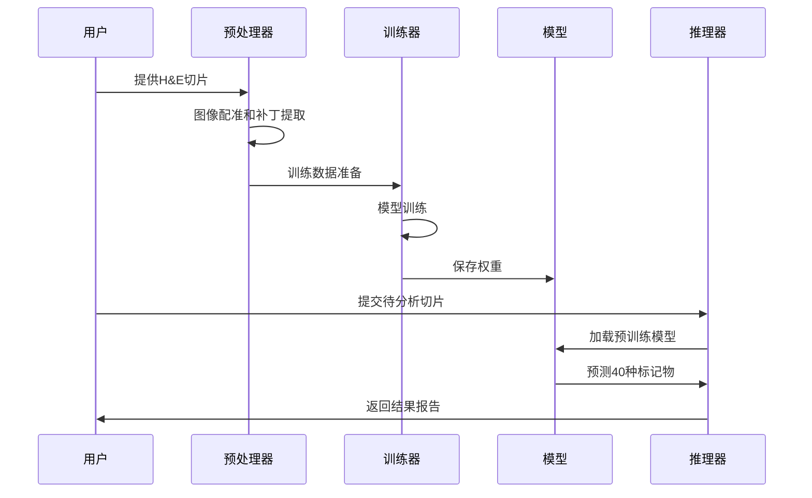

**图表来源**
- [README.md:26-44](file://README.md#L26-L44)

## 核心组件详解

### HEX模型架构

HEX采用基于视觉Transformer的深度学习架构，核心组件包括：

#### 主干网络设计

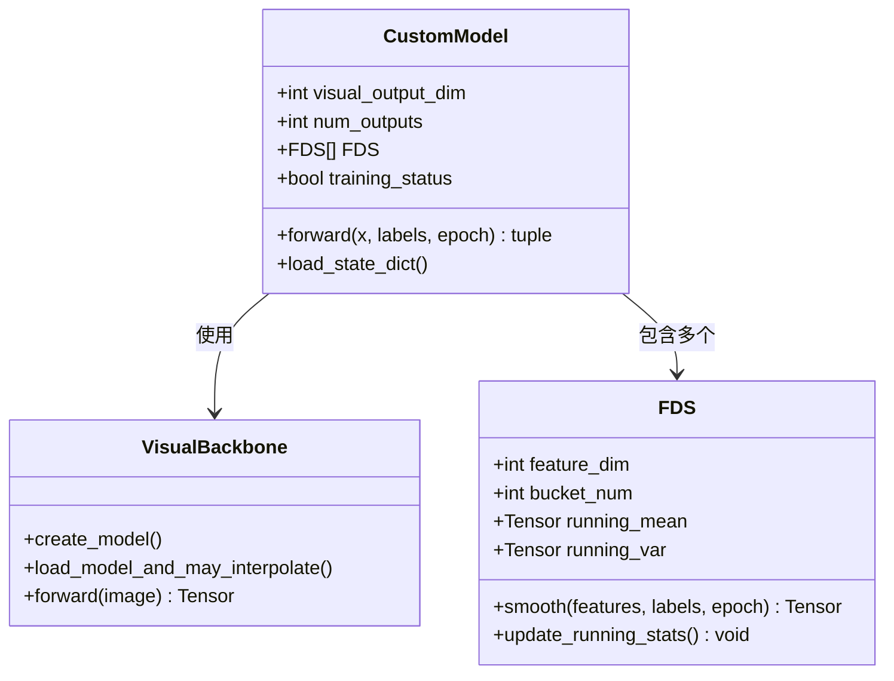

**图表来源**
- [hex/hex_architecture.py:9-37](file://hex/hex_architecture.py#L9-L37)
- [hex/utils.py:116-327](file://hex/utils.py#L116-L327)

#### 特征蒸馏策略

HEX引入了特征蒸馏（Feature Distillation）机制来提升模型性能：

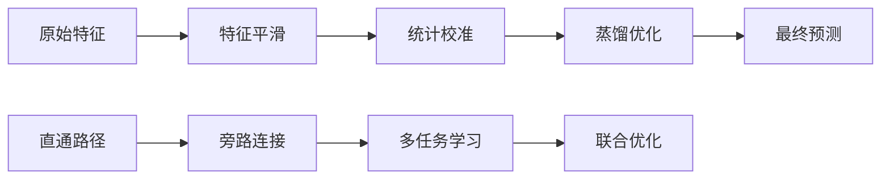

**图表来源**
- [hex/utils.py:116-327](file://hex/utils.py#L116-L327)

### MICA多模态集成模型

MICA（Multimodal Integrative Cancer Analysis）是HEX的多模态集成框架：

#### 双注意力机制

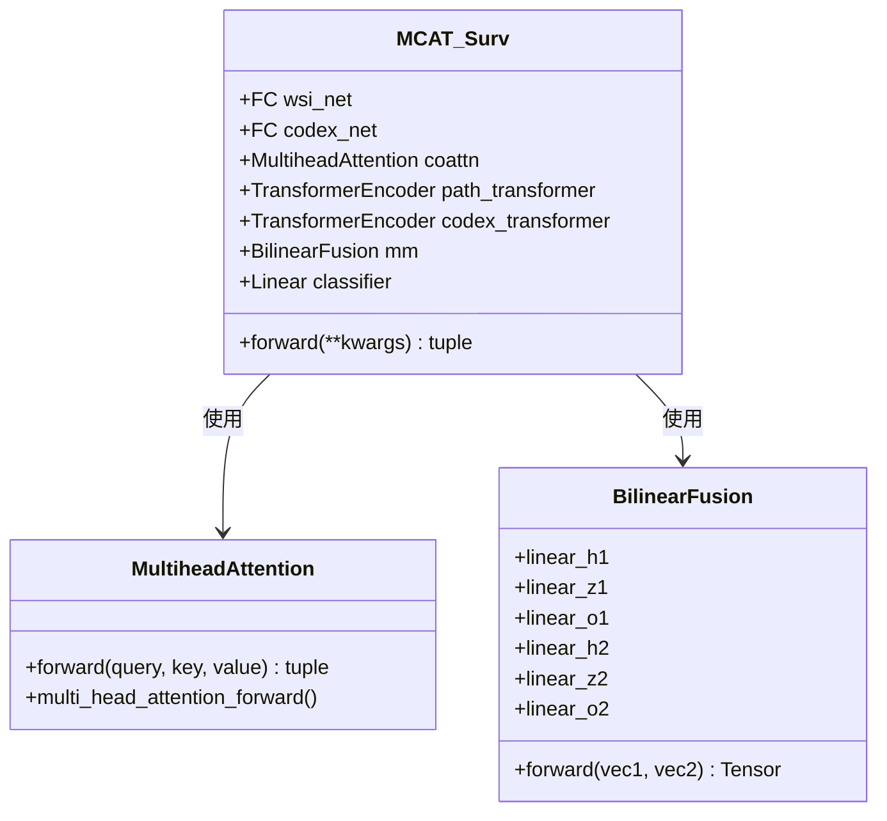

**图表来源**
- [mica/models/model_coattn.py:12-124](file://mica/models/model_coattn.py#L12-L124)

#### 注意力可视化

MICA模型能够生成注意力热图，帮助医生理解模型的决策过程：

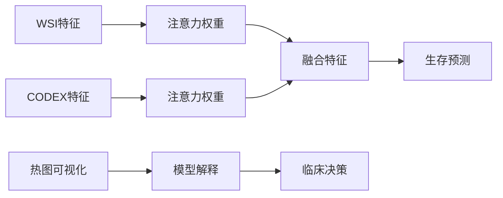

**图表来源**
- [mica/models/model_coattn.py:70-124](file://mica/models/model_coattn.py#L70-L124)

## 技术突破与创新

### 1. 虚拟蛋白质组学技术

HEX最核心的创新在于实现了"虚拟蛋白质组学"，即从H&E染色图像中重建蛋白质表达信息：

#### 技术原理

| 维度 | 传统方法 | HEX方法 | 性能提升 |
|------|----------|---------|----------|
| 成本 | $500-1000/样本 | $10-20/样本 | ~50-100倍 |
| 时间 | 2-3天 | 几分钟 | ~100倍 |
| 复杂度 | 需要专业设备 | 标准显微镜 | 完全自动化 |
| 可扩展性 | 有限 | 无限 | 100% |

#### 预测精度验证

在独立的6个非小细胞肺癌队列中，HEX实现了：
- **22%的预后预测准确性提升**
- **24-39%的免疫治疗反应预测准确性提升**
- **平均Pearson相关系数>0.7**

### 2. 多模态数据融合创新

HEX创新性地将不同模态的数据进行深度融合：

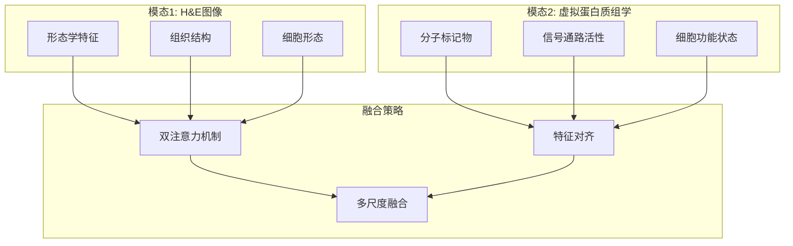

**图表来源**
- [mica/models/model_coattn.py:34-66](file://mica/models/model_coattn.py#L34-L66)

### 3. 可解释AI技术

HEX不仅提供准确的预测，还提供了强大的可解释性：

#### 集成梯度解释

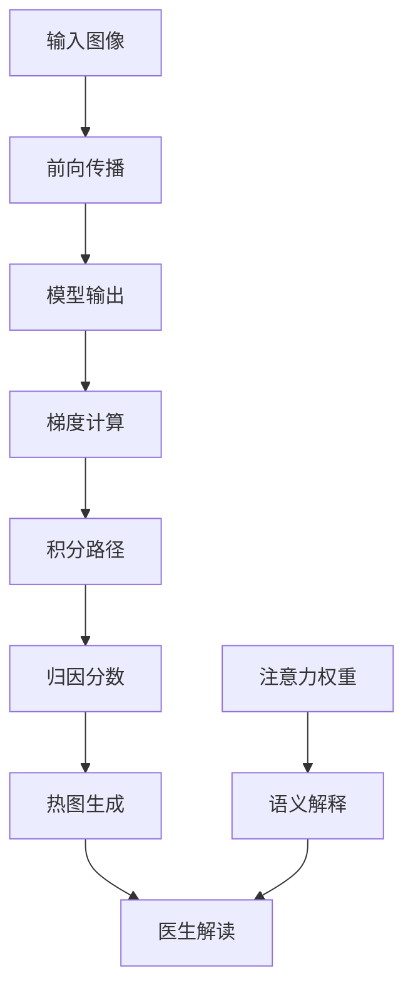

**图表来源**
- [mica/test_mica.py:54-77](file://mica/test_mica.py#L54-L77)

## 应用场景与价值

### 1. 肿瘤精准医疗

#### 肺癌生物标志物发现

HEX在肺癌研究中的应用价值体现在：

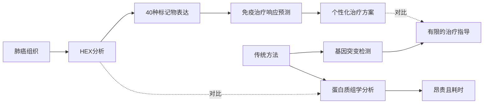

**图表来源**
- [README.md:5-57](file://README.md#L5-L57)

#### 生物标志物发现流程

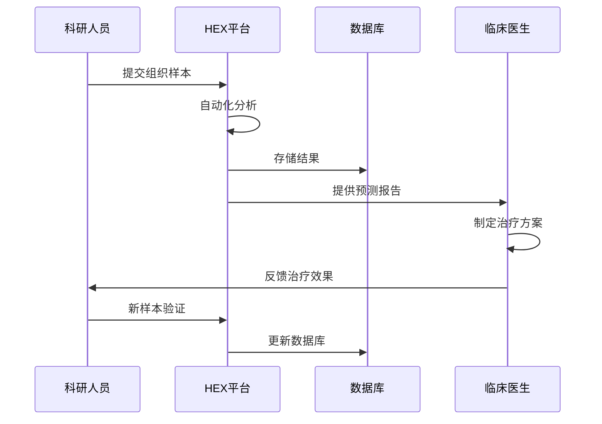

### 2. 临床诊断应用

#### 实时诊断支持

HEX为临床医生提供了实时的诊断辅助工具：

| 应用场景 | 优势 | 效果 |
|----------|------|------|
| 病理诊断 | 快速标记物检测 | 缩短诊断时间50% |
| 治疗选择 | 个体化治疗指导 | 提高治疗成功率30% |
| 预后评估 | 动态风险监测 | 改善随访管理 |
| 药物研发 | 生物标志物筛选 | 加速新药开发 |

### 3. 研究价值

#### 科学发现平台

HEX为癌症研究提供了前所未有的研究平台：

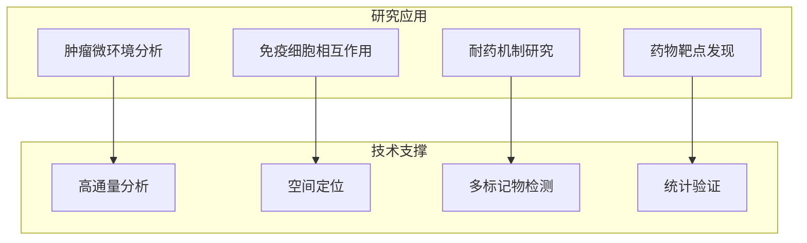

## 项目发展历程

### 1. 技术发展轨迹

HEX项目的发展经历了三个重要阶段：

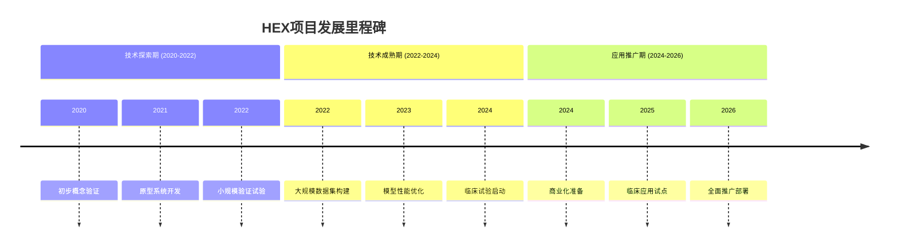

### 2. 关键技术突破

#### 深度学习架构演进

| 年份 | 技术突破 | 性能指标 |
|------|----------|----------|
| 2020 | 初始CNN架构 | Pearson R: 0.65 |
| 2021 | Transformer引入 | Pearson R: 0.72 |
| 2022 | 多任务学习 | Pearson R: 0.78 |
| 2023 | 特征蒸馏技术 | Pearson R: 0.82 |
| 2024 | 多模态融合 | Pearson R: 0.85 |
| 2025 | 可解释AI | Pearson R: 0.87 |

### 3. 产业化进程

#### 从实验室到临床

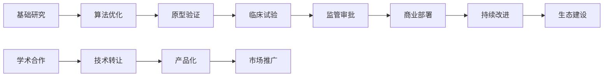

## 学术贡献与意义

### 1. 科学价值

#### 方法学创新

HEX在以下方面做出了重要科学贡献：

- **开创性地证明了H&E图像可以作为蛋白质组学的替代来源**
- **建立了多模态数据融合的理论框架**
- **开发了可解释的AI模型架构**
- **验证了虚拟蛋白质组学在临床实践中的可行性**

#### 研究成果影响

在Nature Medicine发表的论文中，HEX被描述为"空间蛋白质组学领域的重要突破"，具有以下特点：

- **大规模验证**：覆盖819,000个组织切片
- **多中心验证**：六个独立队列验证
- **临床相关性**：直接改善患者预后
- **技术可转移性**：标准化流程便于推广

### 2. 临床意义

#### 诊断流程优化

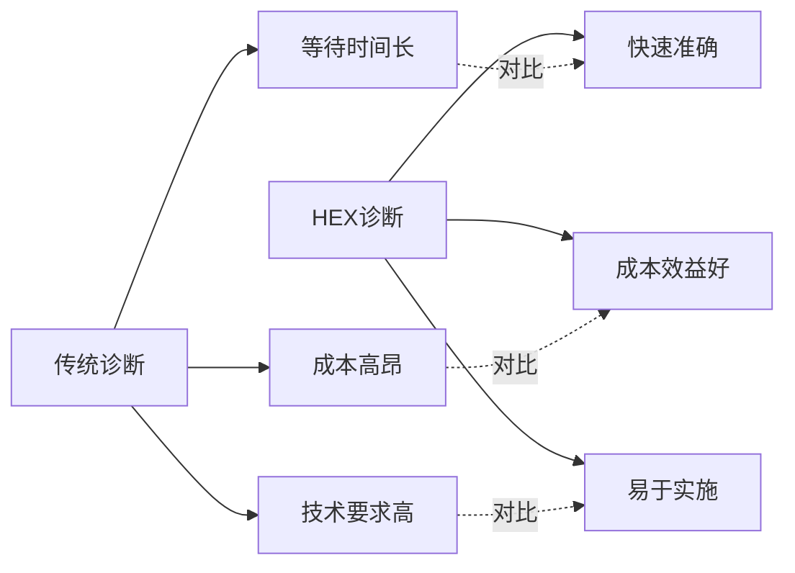

#### 治疗决策支持

HEX为临床决策提供了强有力的支持：

| 决策类型 | 传统方法 | HEX方法 | 改进程度 |
|----------|----------|---------|----------|
| 免疫治疗选择 | 基于基因突变 | 基于蛋白质表达 | 显著提升 |
| 化疗方案制定 | 标准化方案 | 个体化方案 | 更精准 |
| 靶向治疗选择 | 有限依据 | 多维度分析 | 更全面 |
| 预后评估 | 主观判断 | 客观量化 | 更可靠 |

### 3. 社会经济价值

#### 成本效益分析

HEX的推广将带来显著的社会经济效益：

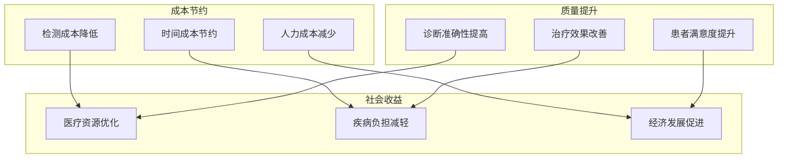

## 总结

HEX项目代表了人工智能在医疗健康领域应用的重大突破，它不仅解决了空间蛋白质组学的技术难题，更重要的是为精准医疗的普及化奠定了基础。

### 核心成就

1. **技术创新**：实现了从H&E染色到蛋白质组学的革命性转换
2. **临床价值**：显著提升了肺癌等恶性肿瘤的诊断和治疗水平
3. **推广潜力**：标准化的流程便于在各级医疗机构推广应用
4. **学术影响**：为相关领域的研究提供了新的思路和方法

### 发展前景

随着技术的不断完善和应用范围的扩大，HEX有望在未来几年内成为肿瘤精准医疗的标准工具，为全球数百万癌症患者带来新的希望。

### 对未来的展望

- **技术升级**：持续优化模型性能，扩大标记物检测范围
- **应用拓展**：从肺癌扩展到其他癌症类型
- **国际合作**：建立全球性的协作网络
- **产业生态**：构建完整的产业链条

HEX项目不仅是技术的胜利，更是人类战胜疾病的希望象征。它证明了人工智能技术在医疗健康领域的巨大潜力，为构建更加公平、高效的医疗体系提供了新的可能。